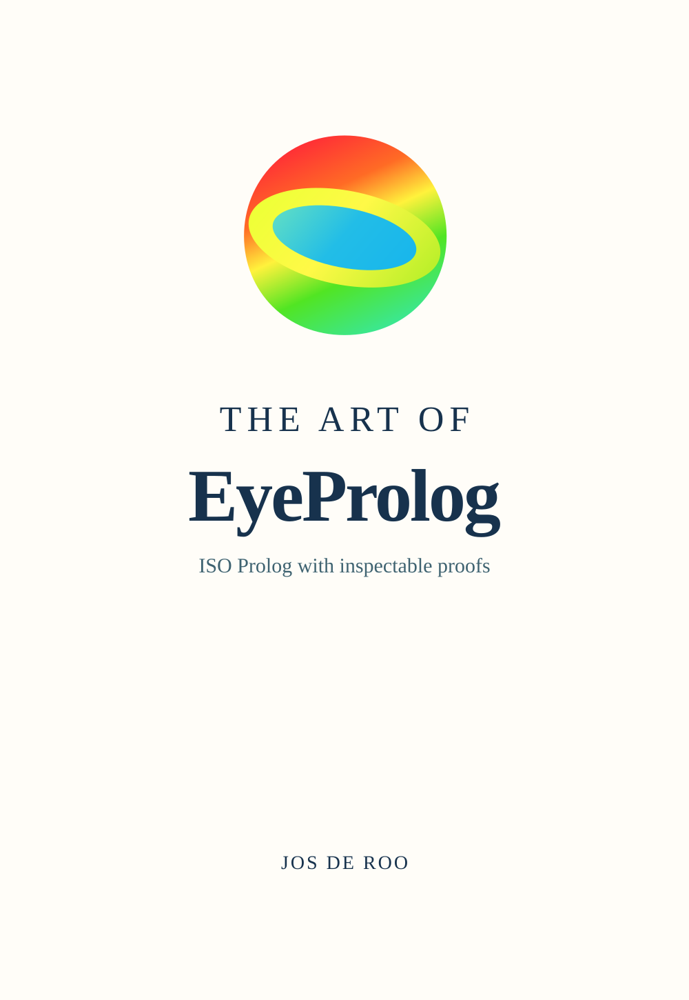

# EyeProlog.ts

EyeProlog.ts is a TypeScript port of the amazing original [EyeProlog](https://github.com/eyereasoner/eyeprolog) engine created by Jos De Roo. All credit for the original architecture, design, and ISO Prolog compliance goes to the original authors.

The primary purpose of this port is to bring EyeProlog into modern TypeScript projects with **extreme correctness**. We aim to provide an unyielding level of precision—ensuring strict ISO/IEC 13211 compliance, exact choice-point cut semantics, sound CLP(Z) integer constraint solving, and robust standard term ordering—so that developers can ergonomically embed this powerful inference engine and Definite Clause Grammar (DCG) capabilities directly into their TypeScript stacks.

EyeProlog.ts turns portable ISO Prolog programs into answers and inspectable proofs within a TypeScript runtime. Note: the public surface is typed, but the internal term/engine model currently uses gradual typing (many `any` annotations) carried over from the port; see the audit notes in `CONTRIBUTING`/issue tracker before relying on compile-time type safety for embedded callers.

<p>
  <a href="https://eyereasoner.github.io/eyeprolog/the-art-of-eyeprolog">
    
  </a><br>
  <strong>Click the cover to read <em>The Art of EyeProlog</em> (the original comprehensive manual).</strong>
</p>

**[Playground](https://eyereasoner.github.io/eyeprolog/playground)** | **[Why EyeProlog?](https://eyereasoner.github.io/eyeprolog/why-eyeprolog)** — Discover the original purpose and design.

The book is the reference for the language, command line, API,
examples, proofs, conformance, and implementation boundaries for both `eyeprolog` and `eyeprolog.ts`.

## Quick start

First verify that `node --version` reports Node.js 18 or newer. Upgrade an older runtime through a Node version manager or the [official Node.js download](https://nodejs.org/en/download).

The package can be launched without a global installation:

```sh
npx --yes eyeprolog.ts
?- use_module(library(lists)).
   true.
?- member(X, [prolog, logic]).
   X = prolog
;  X = logic.
?- halt.
```

For a persistent `eyeprolog` command without administrator access, install it into a user-owned prefix:

```sh
npm install --global --prefix "$HOME/.local" eyeprolog.ts
export PATH="$HOME/.local/bin:$PATH"
eyeprolog
```

Do not use `sudo npm install`; npm's [EACCES guidance](https://docs.npmjs.com/resolving-eacces-permissions-errors-when-installing-packages-globally/) recommends a user-owned prefix.

For a non-interactive run:

```sh
printf 'human(socrates).\nmortal(X) :- human(X).\n' |
  npx --yes eyeprolog.ts --proof --goal 'mortal(socrates)' -
```

Programs may declare their default queries with `%% goal:` comments.

Portable unit tests can be embedded as quads—a query followed by its expected top-level answer—and run with `eyeprolog --quads program.pl`:

```prolog
member_test ?- member(X, [prolog, logic]).
   X = prolog
;  X = logic.
```

## Strict ISO/IEC 13211-1 core

For portability and conformance work, run the Part 1 core with Technical Corrigenda 1–3 in strict mode:

```sh
eyeprolog --iso-strict
eyeprolog --iso-strict --goal 'p(X)' program.pl
```

The equivalent TypeScript option is `isoStrict: true`. Strict mode rejects language extensions, Part 2 module directives, and Part 3 grammar-rule expansion/`phrase/2-3`; it also removes the `occurs_check` flag and disables automatic tabling. Normal mode supports modules, DCGs, quads, libraries, proofs, and other documented extensions natively.

## ISO modules and definite clause grammars

EyeProlog.ts natively implements ISO/IEC 13211-2 modules and the grammar rules and `phrase/2-3` predicates of ISO/IEC TS 13211-3:2025. For example:

```prolog
sentence --> [hello], noun.
noun --> [world] | [prolog].

%% goal: phrase(sentence, Words)
```

**EyeProlog.ts features special ongoing ergonomic improvements for `dcg.ts` to allow easy embedding of these grammars natively in TypeScript.**

## Development

```sh
git clone https://github.com/lambdaft/eyeprolog.ts.git
cd eyeprolog.ts
npm install
npm test
```

EyeProlog.ts (like the original EyeProlog) is released under the [MIT License](LICENSE.md).
