<p align="center">
  
</p>

This book is licensed under [Creative Commons Attribution 4.0
International](https://creativecommons.org/licenses/by/4.0/). You may copy,
share, and adapt it for any purpose, including commercially; please give
appropriate credit, link to the licence, and indicate changes.

---

EyeProlog turns facts and rules into answers and inspectable proofs. This book is an
original introduction to the habits of logic programming: describe a world,
state the relationships that hold in it, and let unification and search connect
the two.

This book is also the reference for the EyeProlog implementation. EyeProlog is a
standards-based reasoning system: programs use the documented and tested ISO
Prolog profile.
Chapters 38–40 define the supported ISO Prolog profile, predicate surface, libraries, and execution interface. Chapter 39 describes every supported built-in and library predicate, with compact contracts for all **533 distinct predicate indicators** in the normal EyeProlog surface; Chapter 40 documents command-line execution. The explanatory chapters give the reasoning and operational context needed to use those details correctly.

Its subject is not syntax alone. A logic program has two inseparable aspects:
the relation described by its clauses and the procedure induced when goals are
selected and clauses are tried. The first tells us what answers are justified;
the second tells us whether and how the machine will find them. Learning to
program with EyeProlog means learning to move comfortably between these views.

EyeProlog implements a broad ISO Prolog profile with facts, clauses, terms, lists,
control, arithmetic, dynamic predicates, operators, streams, and standard
built-ins. Explicit
tabling, explicit integrity checks, and proof output are implementation
capabilities around that standards-based foundation. EyeProlog does not
claim formal certification against every ISO processor edge case.

Standards are crucial because knowledge and rules often outlive the software
that first processes them. Using ISO Prolog keeps programs teachable,
inspectable, and portable across processors. EyeProlog aims to provide a compact
implementation of that standard with explanations and practical host
integration, not another proprietary rule language.

This places EyeProlog in a tradition that joins automated deduction, database
querying, and programming. Jacques Herbrand's doctoral work made ground terms
and ground instances central to proof theory; Robinson's later resolution
principle turned unification and refutation into a general proof procedure;
early Prolog showed that Horn clauses could also be executable programs;
deductive databases emphasized finite relations and fixed points. EyeProlog
borrows from all three traditions without pretending that they are identical.
Its clauses are logical statements, its query execution is an ordered
computation, and its proof terms make the connection between the two available
for inspection.

That history explains a recurring theme of the book. Logic programming is not
the claim that control disappears. It is the discipline of stating the
relation clearly enough that control can be studied and improved separately.
Robert Kowalski's phrase “algorithm = logic + control” names this separation;
EyeProlog's focused surface makes it unusually easy to see in running examples.

Complete EyeProlog code displays from the book are also available as files under
[`examples/book/`](https://github.com/eyereasoner/eyeprolog/tree/main/examples/book/), grouped by chapter. From a source checkout
with Node.js 18 or newer, run the CLI directly:

```sh
node bin/eyeprolog.js examples/socrates.pl
```

The EyeProlog command should print:

```text
type(socrates, mortal).
holds_result(test, true).
```

Then ask for the derivations:

```sh
node bin/eyeprolog.js --proof examples/socrates.pl
```

To use the published package, first verify that `node --version` reports Node.js
18 or newer. Upgrade an older runtime through a Node version manager or the
[official Node.js download](https://nodejs.org/en/download). A current Linux
distribution can still expose an older Node.js package.

The package can be launched without a global installation:

```sh
npx --yes eyeprolog
```

For a persistent command without administrator access, install into a
user-owned prefix:

```sh
npm install --global --prefix "$HOME/.local" eyeprolog
export PATH="$HOME/.local/bin:$PATH"
```

Persist the `PATH` export in the appropriate shell startup file. Do not use
`sudo npm install`; npm's
[EACCES guidance](https://docs.npmjs.com/resolving-eacces-permissions-errors-when-installing-packages-globally/)
recommends a Node version manager or a user-owned npm prefix.

Readers who do not want to install anything can begin in the
[browser playground](https://eyereasoner.github.io/eyeprolog/playground). Paste
the source of `examples/socrates.pl` into the editor and run it. The playground
and local CLI accept the same in-memory Prolog source and resolve the same
standard modules. A program imports relations such as `append/3` and `member/2`
with `use_module(library(lists))`. The page starts `src/playground-worker.js` as
a dedicated ES-module worker for each run. Serve a
local checkout over HTTP(S), rather than opening the page as a `file:` URL.
Filesystem predicates and `include/1` are Node-only; URL and embedding examples
require their documented host environment.

The best way to read is beside a running interpreter. Before each run, predict
the answer; after it, change one fact or query and explain the difference.

### Reading conventions

Code displays serve three different purposes:

- an `eyeprolog` block is Prolog source accepted by EyeProlog; complete blocks also appear under
  `examples/book/`, although a short block may rely on facts introduced in the
  surrounding chapter;
- a `text` block shows output, a trace, a data shape, or pseudocode and is not
  necessarily accepted as EyeProlog input;
- a `sh` or `js` block is a host command or embedding example.

Top-level programs under [`examples/`](https://github.com/eyereasoner/eyeprolog/tree/main/examples/) are the complete runnable
cases. Their exact outputs live under `examples/output/`; selected proof
outputs live under `examples/proof/`. Use `examples/book/` to copy a particular
display and the top-level corpus for end-to-end experiments.

### The promise of this book

This book treats logic programming as a craft, not a collection of clever
tricks. By the end, a reader should be able to:

1. state a domain as relations whose ground instances have an unambiguous
   meaning;
2. read every clause both as a logical sentence and as a computation;
3. design finite searches, justify termination, and recognize when a calling
   mode is unsafe;
4. construct programs from examples and invariants, then improve their control
   without quietly changing their meaning;
5. test conclusions, detect inconsistent inputs explicitly, and inspect proofs
   as evidence; and
6. connect a Prolog rule set to JavaScript without hiding the host boundary.

That is the stake in the ground: a focused implementation of standard Prolog
is enough to teach the large ideas when semantics, execution, and evidence
remain visible together. The implementation is therefore part of the
argument: the examples are executable programs, the reference chapters
describe the running system, and proof terms remain available for
inspection.

### A working discipline

Approach each example through the same six moves:

1. **Sentence.** Say what one ground instance means.
2. **Question.** Choose the bindings with which the relation will be called.
3. **Prediction.** Write the expected answers before running the program.
4. **Search.** Trace the first choice, the bindings it adds, and the next goal.
5. **Evidence.** Inspect a proof and distinguish it from the failed search
   branches that were explored.
6. **Revision.** Change one fact, query, goal order, or representation and
   explain what should remain invariant.

This rhythm deliberately joins declarative reading, operational reading, and
program construction. Readers new to logic programming can follow Parts I–III
in order. Experienced Prolog programmers can begin with Chapters 3, 13, and
17 to see how EyeProlog combines ordinary depth-first Prolog with explicit
tabling, Eyelet forward rules, and inspectable proofs.
Chapter 41 gives further routes through the material.

### When a run surprises you

Do not change several clauses at once. Use this recovery loop:

1. reduce the issue to the smallest ground question whose answer you dispute;
2. confirm that every predicate in that question has one clear sentence;
3. write the bindings available before each body goal from left to right;
4. run with `--proof` if an unexpected answer succeeds;
5. run with `--stats` or hand-trace the first branch if an expected answer is
   missing or slow;
6. preserve the discovery as a test before repairing the program.

No output can mean a legitimate absence, suppression of a queried source fact,
an unready built-in, or an unfinished search. Chapter 1 introduces source-fact
suppression, Chapters 7 and 11 distinguish failure from printed output, and
Chapter 32 develops the full debugging method.

### Choose a route

The book supports several paths; reading every chapter in order is not a test
of seriousness.

| Reader | Suggested route | What to postpone |
| --- | --- | --- |
| New to programming | Chapters 1–10, 11–12, 18–20, then Laboratories 1–4 | The formal parts of Chapter 3, embedding, and Parts V–VI |
| Programmer new to logic | Parts I–II, Chapters 11–13 and 17–25, then Part VII | Detailed history and mathematical foundations on the first pass |
| Experienced Prolog programmer | Chapters 3, 7, 11–13, 16–17, and 31–33 | Introductory syntax and list material |
| Knowledge engineer | Chapters 7, 11–16, 25, 31–33, then Laboratories 9–12 | Symbolic mathematics unless it serves the domain |
| Mathematics reader | Chapters 1–5, 19, and 26–30 | Embedding until an application needs it |
| Instructor or study group | Parts I–III, one route through Part V or VI, then selected laboratories | Reference chapters until reference work begins |

On a first pass, treat sections marked **Deeper foundations** as optional. They
make the semantics precise but are not prerequisites for writing and running
the next program.

### The construction order

The sequence follows the teaching architecture associated with *The Art of
Prolog*: begin with the meaning of a relation, make the relation executable,
study the control it induces, and then return to the same ideas at a larger
scale through transformation, search, interpreters, and applications. Each
part therefore ends by asking the reader to construct, test, or improve a
program rather than merely recognize syntax. Reference material follows
practice, laboratories turn the methods into work, and checkpoint notes close
the loop with retrieval and diagnosis.

Balance here does not mean that every chapter has the same length or the same
number of pictures. A language catalog should be searchable; a construction
chapter should be argumentative; a laboratory should leave an artifact. The
recurring balance is instead between four readings of a program:

| Reading | Question carried through the book | Typical evidence |
| --- | --- | --- |
| Meaning | What does each ground relation claim? | a domain sentence and examples |
| Computation | How are answers actually found? | a trace, finite bound, or termination measure |
| Construction | Why is the program shaped this way? | a worked refinement and rejected alternative |
| Judgment | What has been established, and what remains assumed? | tests, proofs, counterexamples, and a trust boundary |

Diagrams follow the same rule. Scenes introduce an intuition; structural
diagrams expose a term, proof, or dependency; process diagrams guide a piece
of work; maps help navigate reference and review. A diagram earns its place by
making a relationship visible that prose alone would make easy to miss.

## Contents

Chapters are numbered continuously across eleven parts, from Chapter 1 to Chapter 45.

### Part I — Relations

Chapters 1–5

- [1. A program is a little theory](#1-a-program-is-a-little-theory)
- [2. Terms, variables, and substitution](#2-terms-variables-and-substitution)
- [3. Rules and their two readings](#3-rules-and-their-two-readings)
- [4. Recursion: describing reachability](#4-recursion-describing-reachability)
- [5. Lists as relations](#5-lists-as-relations)

### Part II — Search

Chapters 6–10

- [6. Arithmetic and finite generation](#6-arithmetic-and-finite-generation)
- [7. Failure, negation, and quantification](#7-failure-negation-and-quantification)
- [8. Collecting and choosing answers](#8-collecting-and-choosing-answers)
- [9. Structured data, text, and contexts](#9-structured-data-text-and-contexts)
- [10. From puzzles to models](#10-from-puzzles-to-models)

### Part III — Trustworthy reasoning

Chapters 11–16

- [11. Queries, answers, and proofs](#11-queries-answers-and-proofs)
- [12. Integrity checks as ordinary predicates](#12-integrity-checks-as-ordinary-predicates)
- [13. Termination, tabling, and performance](#13-termination-tabling-and-performance)
- [14. Knowledge engineering](#14-knowledge-engineering)
- [15. Explicit data boundaries](#15-explicit-data-boundaries)
- [16. Embedding EyeProlog](#16-embedding-eyeprolog)

### Part IV — The craft of logic programming

Chapters 17–20

- [17. Logic and control](#17-logic-and-control)
- [18. Constructing a program](#18-constructing-a-program)
- [19. Correctness and termination](#19-correctness-and-termination)
- [20. Improving a program](#20-improving-a-program)

### Part V — Advanced relational design

Chapters 21–25

- [21. Reading the computation](#21-reading-the-computation)
- [22. Trees, languages, and symbolic evaluation](#22-trees-languages-and-symbolic-evaluation)
- [23. Transforming programs](#23-transforming-programs)
- [24. Designing finite search](#24-designing-finite-search)
- [25. Case study: an auditable decision service](#25-case-study-an-auditable-decision-service)

### Part VI — Mathematics made executable

Chapters 26–30

- [26. A proof can be a computation](#26-a-proof-can-be-a-computation)
- [27. Recursion is induction in motion](#27-recursion-is-induction-in-motion)
- [28. Algebra, symmetry, and representation](#28-algebra-symmetry-and-representation)
- [29. Search as experimental mathematics](#29-search-as-experimental-mathematics)
- [30. What mathematics promises](#30-what-mathematics-promises)

### Part VII — The reasoning laboratory

Chapters 31–33

- [31. Testing a theory](#31-testing-a-theory)
- [32. Debugging by meaning, search, and proof](#32-debugging-by-meaning-search-and-proof)
- [33. A pattern catalog for reasoning](#33-a-pattern-catalog-for-reasoning)

### Part VIII — Standard Prolog in practice

Chapters 34–37

- [34. Control, exceptions, and grouped solutions](#34-control-exceptions-and-grouped-solutions)
- [35. Reflective terms and atomic conversion](#35-reflective-terms-and-atomic-conversion)
- [36. Dynamic predicates, directives, and operators](#36-dynamic-predicates-directives-and-operators)
- [37. Streams and term I/O](#37-streams-and-term-io)

### Part IX — Reference as practice

Chapters 38–43

- [38. Language and ISO profile](#38-language-and-iso-profile)
- [39. Predicate reference](#39-predicate-reference)
- [40. Running EyeProlog: command line and corpus](#40-running-eyeprolog-command-line-and-corpus)
- [41. Study paths, review, and further examples](#41-study-paths-review-and-further-examples)
- [42. Standards, limits, and implementation boundaries](#42-standards-limits-and-implementation-boundaries)
- [43. Glossary and notes for continued study](#43-glossary-and-notes-for-continued-study)

### Part X — Laboratories

Chapter 44

- [44. Twelve laboratories](#44-twelve-laboratories)

### Part XI — Review

Chapter 45

- [45. Checkpoint notes and selected answers](#45-checkpoint-notes-and-selected-answers)

---

# Part I — Relations

<figure>
  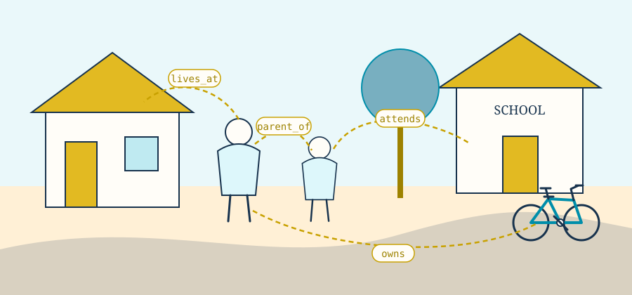
  <figcaption>One ordinary scene contains many relations: who lives where, who is a parent, who attends school, and who owns the bicycle.</figcaption>
</figure>

We begin with connection rather than calculation. Facts place points in a
relational world; variables draw threads between them; rules make one pattern
follow from another.

## 1. A program is a little theory

Logic programming begins with a change of emphasis. Instead of listing the
steps that calculate an answer, write sentences that are true in the problem
domain.

```eyeprolog
parent(ada, byron).
parent(byron, clara).
parent(clara, diego).
```

Each line is a **fact**. `parent/2` is a relation: the name is `parent` and the
arity is two. Arity matters. `parent/2` and `parent/3` are different predicates.

A host-supplied **query** selects the relation whose ground answers EyeProlog
prints:

```eyeprolog
child(Child, Parent) :- parent(Parent, Child).
```

```sh
eyeprolog --goal 'child(X, Y)' program.pl
```

The answers are:

```text
child(byron, ada).
child(clara, byron).
child(diego, clara).
```

EyeProlog distinguishes solutions found by the solver from answers printed by the
CLI. A query such as `eyeprolog --goal 'parent(X, Y)' program.pl` can find the three source facts
internally, but the normal CLI output suppresses answers that merely repeat
source facts. Derived `child/2` answers are printed. Chapter 11 explains this
output policy; it does not change what calls inside rules can prove.

The program did not copy values through named slots. It found substitutions
for `Child` and `Parent` that made the rule body true, then applied those same
substitutions to the head.

Before writing a relation, ask:

1. What does one ground fact mean as a sentence?
2. Which arguments are normally known when it is called?
3. Is the relation finite in that calling pattern?

For `parent(Parent, Child)`, a ground fact reads naturally from left to right.
Calling it with a parent enumerates children; calling it with a child enumerates
parents; calling it open enumerates the finite database. A good relation has a
clear sentence and useful modes.

Facts are data, not commands. Clause order can affect search order, but a fact
does not mean “do this now.”

### Learning to see relations

The shift from functions to relations takes practice. A function is normally
introduced with a direction: put an input in one side and receive an output
from the other. A relation begins with a set of tuples. Direction enters only
when somebody asks a question.

Take `parent/2`. The program does not store a procedure named “find children.”
It stores pairs for which the relation holds. From that single relation, one
may ask for a child's parents, a parent's children, whether two named people
stand in the relation, or every known pair. The source text stays fixed while
the binding pattern changes.

This is why the wording of a predicate matters. Before adding a rule, read a
ground instance aloud:

> `parent(ada, byron)` means that Ada is a parent of Byron.

Now replace one name at a time with a question:

> For which `Child` is Ada a parent?
>
> Who is a `Parent` of Byron?
>
> Which `Parent`–`Child` pairs are known?

If those questions feel like natural uses of one statement, the relation is
probably well shaped. If each reading requires a different interpretation of
an argument, split the concept before the ambiguity spreads into later rules.

**Exercise.** Add `grandparent/2` using two calls to `parent/2`. Query all
grandparents, then only the grandparents of `diego`.

**Checkpoint.** Before continuing, make sure you can (1) read
`parent(ada, byron)` as a sentence, (2) explain what the two variables in
`eyeprolog --goal 'child(X, Y)' program.pl` ask for, and (3) predict which output changes after adding
`parent(diego, elena).`

## 2. Terms, variables, and substitution

Prolog programs accepted by EyeProlog are built from terms:

- atom constants: `ada`, `accepted`, `'atom with spaces'`;
- double-quoted character lists: `"sensor too hot"` (the default shorthand for
  `[s,e,n,s,o,r,' ',t,o,o,' ',h,o,t]`);
- numbers: `42`, `-7`, `3.14159`, `1.2e3`;
- variables: `X`, `Person`, `_temporary`;
- compound terms: `point(3, 4)`, `reading(temp, 91)`;
- lists: `[]`, `[red, green, blue]`, `[Head | Tail]`.

In normal mode, double-quoted character/code lists also support Trealla's
right-splice notation. With `double_quotes(chars)`, `"ab"||Tail` is shorthand
for `[a,b|Tail]`; with `double_quotes(codes)`, it denotes `[97,98|Tail]`. The
splice is not available when `double_quotes(atom)` is active, and
`--iso-strict` rejects it as an implementation-specific syntax extension.

Normal-mode integer constants may use one underscore between adjacent digits,
as in `1_000` or `0xCA_FE`. Layout, including comments and newlines, may follow
the underscore before the next digit. Separators do not apply to floating-point
fractions or exponents, and `--iso-strict` rejects them.

Plain atom constants begin with a lowercase ASCII letter. Variables begin with
an uppercase letter or underscore. The bare `_` is anonymous and every
occurrence is fresh. `_Name` is a named variable; repeated occurrences refer to
the same variable within its clause. Variables are local to a clause.

### Unification

Unification asks whether two terms can be made identical by binding variables.

```text
reading(Sensor, 91)
reading(temp, Value)
```

They unify with `Sensor = temp` and `Value = 91`. Structure must agree
recursively. `point(X, X)` unifies with `point(2, 2)` but not `point(2, 3)`.
Functor and arity must agree.

<figure>
  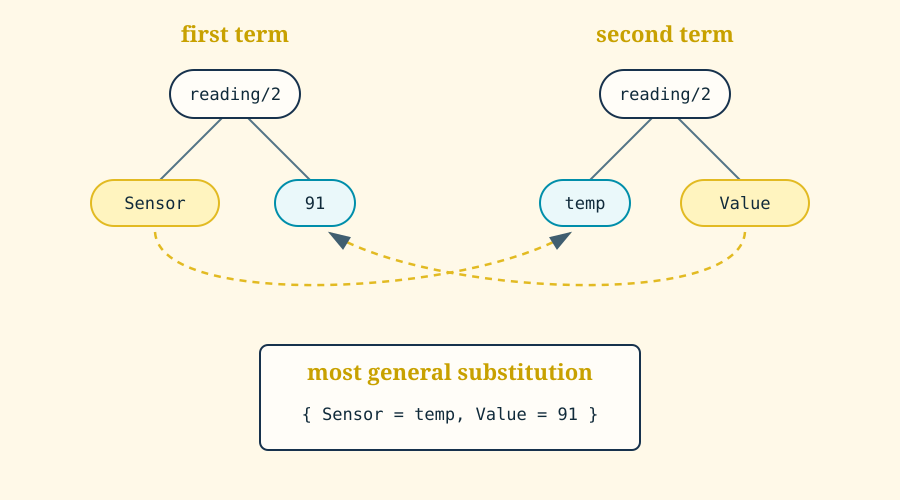
  <figcaption>Unification walks corresponding branches of two term trees and records the bindings needed to make them identical.</figcaption>
</figure>

The picture is worth lingering over. Unification does not assign values in a
one-way parameter list. It aligns two structures. A variable on either side
may receive a binding; a nested pair of compounds causes the same comparison
to continue recursively. The result shown is the most general substitution:
it commits to exactly what structural agreement requires and nothing more.

EyeProlog exposes unification as `=/2`:

```eyeprolog
same_shape(Pair) :- (Pair = pair(X, X)).
```

```sh
eyeprolog --goal 'same_shape(pair(red, red))' program.pl
eyeprolog --goal 'same_shape(pair(red, blue))' program.pl
```

Only the first query succeeds. `\=/2` succeeds when two resolved terms are not
structurally equal.

Compound terms retain domain structure:

```eyeprolog

:- use_module(library(lists)).

measurement(battery_1, sample(17, volts(28.4), amps(12.1))).
route(a, d, path([a, b, d], cost(9))).
```

As a fact head, `measurement(...)` is an atomic formula. Nested terms are data.
The same surface form serves both roles; context decides which.

`ready` is an atom constant and `"ready"` is, by default, a proper list of
one-character atoms. Keep symbolic vocabulary as atoms and use character lists
when text must be inspected relationally. Quoted atoms remain atoms:

```eyeprolog
label(sensor_1, "Cabin temperature").
web_name(sensor_1, '<https://example.org/sensor/1>').
```

**Exercise.** Write `diagonal/1`, which succeeds for `point(X, X)`. Then write
`same_ends/1` for a three-element list whose first and last values agree.

**Checkpoint.** Without running EyeProlog, decide whether each pair unifies:
`point(X, X)` with `point(red, red)`, `point(X, X)` with
`point(red, blue)`, and `[Head | Tail]` with `[a, b, c]`. Then run a small
`=/2` query to check each prediction.

## 3. Rules and their two readings

The executable-clause idea emerged from work on automated theorem proving.
Robinson's resolution principle supplied a general proof rule, while the
development of Prolog specialized proof search around clauses that could be
read as procedures. EyeProlog begins further downstream: it offers a compact
definite-clause language rather than a general first-order theorem prover. The
restriction buys a direct correspondence between a rule body and the
subquestions used to establish its head.

A rule has a head and a comma-separated body:

```eyeprolog

:- use_module(library(lists)).

eligible(Person) :-
  age(Person, Years),
  (Years >= 18),
  registered(Person).
```

Read it declaratively: a person is eligible if the person has an age of at
least 18 and is registered. Read it operationally: to solve the head, solve the
body goals in their written dependency order, carrying bindings into later
goals. EyeProlog normally selects from left to right. As a safe optimization, it
may run a ready deterministic built-in filter early; such a filter cannot add
alternative answers and already has the inputs its registered mode requires.

Both readings matter. The declarative reading checks the model. The operational
reading helps make search finite and selective. Put a generator before a
built-in that needs its input.

<figure>
  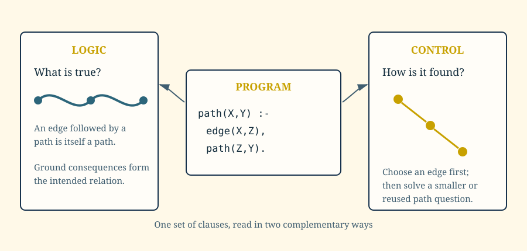
  <figcaption>A clause is both a sentence in a theory and a recipe for reducing a question to subquestions.</figcaption>
</figure>

The two readings are not rivals. The logical reading prevents an efficient
program from quietly answering the wrong question. The operational reading
prevents a beautiful specification from wandering forever without producing
an answer. Much of the craft in this book consists of keeping one reading
steady while improving the other.

```eyeprolog

:- use_module(library(lists)).

adult(Person) :-
  age(Person, Years),
  (Years >= 18).
```

Multiple clauses express alternatives:

```eyeprolog
can_enter(Person) :- staff(Person).
can_enter(Person) :- visitor(Person), escorted(Person).
```

Helper predicates reveal the model and improve explanations:

```eyeprolog
high_score(Case) :-
  score(Case, Score),
  threshold(Threshold),
  (Score >= Threshold).

status(Case, accepted) :- high_score(Case).
reason(Case, "score meets threshold") :- high_score(Case).
```

### Deeper foundations: Herbrand's move

This section through “Meaning is not the search strategy” supplies the formal
model behind the earlier examples. On a first practical reading, it is safe to
continue at Chapter 4 and return here after writing a recursive relation.

The terminology in the next section honors a remarkably early source. Jacques
Herbrand developed the relevant ideas in his 1930 doctoral thesis,
*Recherches sur la théorie de la démonstration* (“Investigations in proof
theory”). His fundamental theorem connected first-order derivability with
propositional reasoning over suitably chosen ground instances. In broad terms,
quantified proof obligations could be studied through formulas obtained by
substituting constructed terms for variables.

That move supplied more than names. It made syntax usable as a mathematical
universe: constants and function symbols generate ground terms, and atomic
formulas over those terms provide a concrete space in which proofs can be
analyzed. This viewpoint became foundational for automated theorem proving.
Unification can be understood as finding substitutions that bring symbolic
formulas together, while later proof procedures can search among clause
instances without first assigning terms to an unrelated external domain.

The historical distinctions matter. Herbrand did not invent Robinson's 1965
resolution calculus, nor did his thesis state the later least-model semantics
of logic programs in its modern form. Rather, his proof theory laid essential
groundwork. Resolution supplied a powerful subsequent inference mechanism, and
van Emden and Kowalski later gave definite logic programs their fixed-point and
least-Herbrand-model account. EyeProlog sits downstream of this sequence:

```text
Herbrand: ground terms and instances as a proof-theoretic foundation
  -> Robinson: resolution and unification as a proof procedure
  -> logic programming: executable clauses and least-model semantics
  -> EyeProlog: a focused Prolog implementation with inspectable derivations
```

Herbrand completed this work while still in his early twenties and died in
1931. The scale of its later influence—in proof theory, automated deduction,
and logic programming—is one reason the word *Herbrand* recurs throughout this
book rather than appearing only as historical attribution.

### The Herbrand world

The declarative reading needs a precise answer to a deceptively simple
question: what can a term denote? EyeProlog uses **Herbrand semantics**. Its
universe contains exactly the ground terms that can be constructed from the
program's atom constants, numbers, list constructors, and compound
functors. There are no unnamed elements hiding behind the notation. A ground
term denotes itself.

This separates the **Herbrand universe**, whose members are terms such as
`pat`, `3`, `[red, blue]`, and `ticket(alice)`, from the **Herbrand base**,
whose members are ground atomic formulas such as `person(pat)` and
`owns(alice, ticket(17))`. A term is not true or false merely by existing:
`pat` is a possible argument, whereas `person(pat)` is a proposition that an
interpretation may make true.

<figure>
  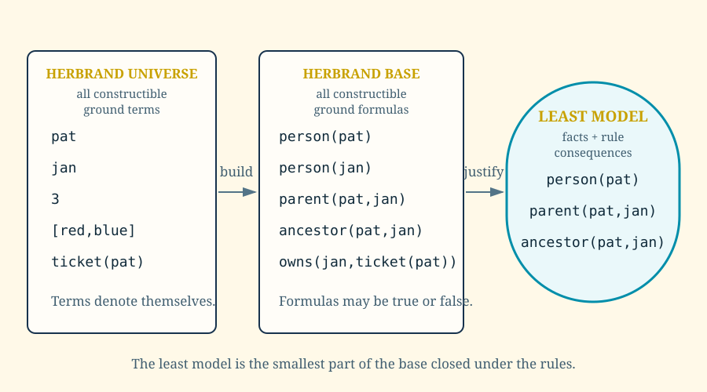
  <figcaption>Terms provide the vocabulary; atomic formulas provide the possible claims; facts and rules select the least model.</figcaption>
</figure>

This three-level distinction answers several recurring questions. A newly
constructed term does not automatically assert anything. A formula that can be
written is not automatically true. And the model is not an arbitrary
collection of convenient formulas: it is the smallest collection forced by
the program. Keeping those levels separate makes symbolic data safe to inspect
without confusing mention with assertion.

A **Herbrand interpretation** is a set of ground atomic formulas regarded as
true. A source fact contributes one such formula:

```eyeprolog
parent(pat, jan).
```

A rule stands for all of its ground instances. Thus:

```eyeprolog
ancestor(X, Z) :- parent(X, Y), ancestor(Y, Z).
```

says that for every substitution of `X`, `Y`, and `Z` by Herbrand terms, truth
of both body formulas entails truth of the head formula. Variables in rules
are implicitly universally quantified.

The declarative meaning of a pure Prolog program is its **least Herbrand
model**: the smallest interpretation containing every fact and closed under
every rule. One mathematical way to obtain it is the immediate-consequence
operation. Begin with the facts; add each ground rule head whose ground body is
already true; repeat until reaching the least fixed point. This construction
defines meaning. It does not prescribe that the implementation enumerate the
model from the bottom up.

### Why terms denote themselves

Herbrand semantics is a particular form of ordinary model theory, chosen
because logic programs inspect and construct symbolic terms. Consider:

```eyeprolog
different(alice, bob) :- (alice \= bob).
different(ticket(alice), ticket(bob)) :-
  (ticket(alice) \= ticket(bob)).
```

In an unrestricted first-order interpretation, `alice` and `bob` could denote
the same object unless a unique-name axiom forbids it. Even if they denote
different objects, the interpretation of `ticket` need not be injective.
Additional axioms would be required to show that `ticket(alice)` and
`ticket(bob)` differ.

In the Herbrand universe those terms differ by construction. Different atom
constants are different terms; compound terms are free constructors and are
identical only when functor, arity, and corresponding arguments are identical.
Lists follow the same rule through `[]` and the internal `./2` constructor.
Unification, read-back, witness construction, and proof explanations therefore
share one predictable notion of identity.

This is a property of the representation, not a claim that two names can never
refer to one real-world entity. If `robert` and `bob` name the same person, say
so with `same_as(robert, bob)` or normalize them to one canonical term. The
Herbrand layer keeps names unambiguous; domain rules express equivalence.

The runnable
[`examples/herbrand-semantics.pl`](https://github.com/eyereasoner/eyeprolog/blob/main/examples/herbrand-semantics.pl) example and
its normal and proof outputs make this distinction concrete.

### Quantification and visible witnesses

Variables range over Herbrand terms, not external records, pointers, or
host-language objects. Variables in a selected goal are existential in the
logic-programming sense: EyeProlog searches for substitutions that make the goal
follow from the program.

EyeProlog has no blank nodes or existential variables in rule heads. When a rule
needs to name a consequent object, construct an explicit witness:

```eyeprolog
has_parent(Child, parent_of(Child)) :-
  person(Child).

registration(Student, Course, registration_of(Student, Course)) :-
  takes(Student, Course).
```

The same inputs construct the same witness term; different inputs construct
different terms. The witness is printable, queryable, and visible in a proof,
rather than being an anonymous object created behind the program's back.

### Equality, unification, and the occurs check

Equality in the pure Herbrand reading is syntactic identity after substitution.
Operationally, unification discovers a substitution that makes terms
identical. EyeProlog performs an occurs check whenever unification would bind a
variable. It therefore uses finite-tree unification and rejects a binding when
the variable occurs anywhere in the proposed value. For example, the body of this
clause fails rather than constructing a cyclic term:

```eyeprolog
cyclic_unification :- X = wrapper(X).
```

The goal has to be written inside a clause of its own: ISO 7.4.3 forbids a
Prolog text from supplying clauses for a built-in predicate, so a bare
`(X = wrapper(X)).` in a program file is a clause for `(=)/2` and is rejected
with *permission_error(modify, static_procedure, (=)/2)*.

ISO classifies unifications whose outcome depends on an occurs check as
subject-to-occurs-check (STO). EyeProlog's default remains the sound finite-tree
behavior above. For diagnosis, EyeProlog additionally provides the
implementation-specific flag `occurs_check`; setting it to `error` turns a
normal unification that would otherwise fail because of the occurs check into
a representation error:

```eyeprolog
:- set_prolog_flag(occurs_check, error).

sto_example :- X = wrapper(X).
% error(representation_error(term), [])
```

The ISO error mechanism wraps an error term together with an
implementation-defined context term. For this implementation-specific STO
diagnostic EyeProlog uses `representation_error(term)` and currently uses the
empty list `[]` as that context. This reports that the cyclic result of a
succeeding STO unification cannot be represented by EyeProlog's finite-tree
term model, without exposing a non-standard `occurs_check/2` error term.

The supported values are `true` (the default finite-tree behavior) and `error`
(STO detection). EyeProlog deliberately does not provide `occurs_check=false`,
because its term model does not construct cyclic terms. The ISO predicate
`unify_with_occurs_check/2` is independent of the diagnostic flag: it continues
to perform finite-tree unification and fails on `unify_with_occurs_check(X,
wrapper(X))` even when `occurs_check` is `error`.

### Meaning is not the search strategy

EyeProlog's evaluator is goal-directed. It resolves selected goals against facts,
rules, and built-ins using ordered conjunction, clause selection, indexing,
tabling, and deterministic host operations. Written order defines the normal
dataflow; a mode-ready deterministic built-in may be selected early as a pure
filter. For the pure Horn-clause fragment, the answers it finds are intended to
belong to the least Herbrand model. The evaluator is not, however, a complete
bottom-up enumerator. Infinite generation or nonterminating recursion can
prevent it from reaching a true answer.

Built-ins extend the pure core. Relational built-ins such as `=/2`,
`append/3`, and `member/2` are readily understood over Herbrand terms.
Arithmetic, date handling, regular expressions, aggregation, `once/1`, and
negation have additional operational definitions. They still consume and
produce Prolog terms: `X is 2 + 3` binds `X` to the Herbrand number term `5`,
not to an invisible host value.

`\+ Goal` succeeds when the current finite search finds no solution for
`Goal`; it does not insert a negative formula into the Herbrand model.
User-defined negative dependencies should be stratified. In a stratified
program, positive dependencies may remain in the same or a lower layer, while
every negative dependency points strictly downward:

```eyeprolog
closed(X) :- blocked(X).
open(X) :- candidate(X), \+ closed(X).
```

A cycle containing a negative edge is not stratified:

```eyeprolog
p(X) :- q(X).
q(X) :- \+ p(X).
```

The CLI reports such portability problems with `--warnings`. JavaScript
embedders can inspect `stratifiedNegation`, `negationStratificationErrors`,
`negationDependencies`, and per-group `negationStratum`; request eager analysis
with `analyzeNegation`, reject it with `strictNegation`, or call
`program.assertStratifiedNegation()`.

**Checkpoint.** Read one rule twice: first as a sentence about all its ground
instances, then as a left-to-right sequence of subquestions. Identify which
body goal first binds each variable. If you took the practical route, defer
Herbrand bases and interpretations without guilt; recursion is next.

## 4. Recursion: describing reachability

Recursive rules define an unbounded family of finite proofs. An ancestor is a
parent, or a parent of an ancestor:

```eyeprolog
:- table ancestor/2.

ancestor(X, Y) :- parent(X, Y).
ancestor(X, Z) :- parent(X, Y), ancestor(Y, Z).
```

```sh
eyeprolog --goal 'ancestor(X, Y)' program.pl
```

The first clause is the base case. The second reduces an ancestor question to a
subquestion one edge farther through the graph. To design recursion, draw one
proof, find the repeated subquestion, and ensure some path reaches a base case.

### Constructing the recursive argument

A recursive program should expose the same argument that would justify its
result on paper. For `ancestor/2`, that argument has four parts:

| Design obligation | `ancestor/2` answer |
| --- | --- |
| Smallest supported case | one known `parent/2` edge |
| Repeated question | whether the intermediate parent is an ancestor |
| Progress | advance from `X` to the next vertex `Y` |
| Finite reason | a finite graph gives finitely many endpoint pairs to table |

The progress column is deliberately not “the term gets smaller.” Structural
recursion over a list usually consumes a tail; graph recursion moves through a
finite relation; arithmetic recursion may decrease a number. State the actual
well-founded argument for the intended mode instead of borrowing the language
of a different recursion pattern.

Clause order then expresses a control preference. Trying the direct edge first
finds short proofs early, but it does not change which ancestor pairs the two
clauses mean. Reversing the recursive clause's body is different: it asks an
open recursive question before selecting an edge and may destroy the useful
mode. Meaning and control must be reviewed separately.

Real graphs contain cycles. Naive depth-first recursion can revisit a call
forever. EyeProlog therefore supports explicit tabling with `:- table p/n.`.
A table records answers for a declared recursive call, iterates cyclic calls to
a fixed point, and reuses results. Predicates without a `table` declaration keep
ordinary depth-first Prolog control; the program, not a heuristic, chooses when
tabling is part of the operational contract.

<figure>
  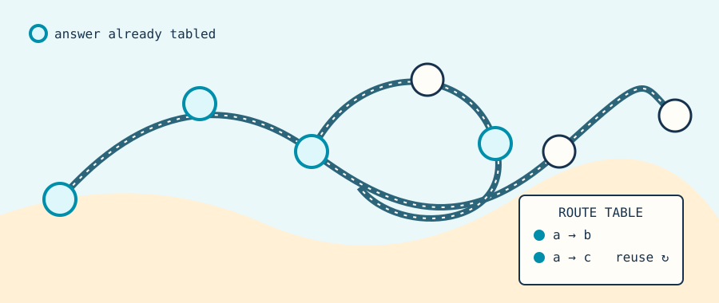
  <figcaption>Recursive route questions may return to the same station. A table acts like a route ledger: new destinations are recorded and recurring questions reuse them.</figcaption>
</figure>

Tabling does not make every open relation finite. A rule that constructs
ever-larger terms can still produce infinitely many distinct calls or answers.
Keep the selected query and its generators finite.

A relation can construct a witness:

```eyeprolog

:- use_module(library(lists)).

path(X, Y, [X, Y]) :- edge(X, Y).
path(X, Z, [X | Rest]) :-
  edge(X, Y),
  path(Y, Z, Rest).
```

On cyclic graphs, track visited vertices and use ISO negation as
`\+ member(Next, Visited)` to obtain finite simple paths rather than arbitrary walks.

Notice that `ancestor/2` and `path/3` make different promises. Endpoint
reachability has at most one logical pair for each pair of vertices, whereas
path construction may have many witnesses for the same endpoints. Table the
finite relation you need; bound or simplify the richer witness relation. This
distinction reappears in grammars, planning, proof search, and program analysis.

**Checkpoint.** In the three-edge family from Chapter 1, predict the direct and
indirect `ancestor/2` answers. Point to the base clause and recursive clause,
then say what becomes smaller or moves closer to a known fact in one successful
derivation.

## 5. Lists as relations

`[a, b, c]` abbreviates nested cons cells. `[Head | Tail]` exposes one cell;
`[]` is empty.

<figure>
  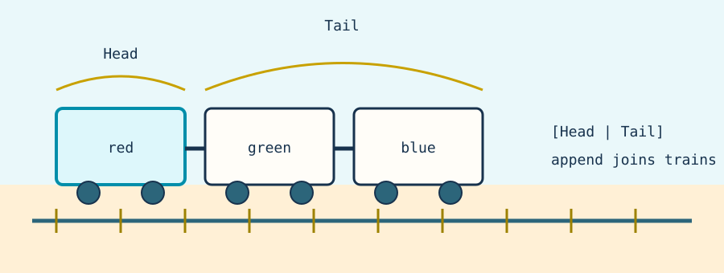
  <figcaption>A list resembles a train: expose the first carriage as the head, pass the remaining train as the tail, or join two trains with an append relation.</figcaption>
</figure>

```eyeprolog
first([Head | _], Head).

contains_item(X, [X | _]).
contains_item(X, [_ | Rest]) :- contains_item(X, Rest).

joins([], Ys, Ys).
joins([X | Xs], Ys, [X | Zs]) :- joins(Xs, Ys, Zs).
```

Different modes give `joins/3` different uses. It can construct a concatenated
list, enumerate every prefix/suffix split, or find a missing part. This is the
practical meaning of a relational definition.

Some algorithms carry explicit state through an accumulator:

```eyeprolog
reverse_acc(List, Reversed) :- reverse_go(List, [], Reversed).
reverse_go([], Acc, Acc).
reverse_go([X | Xs], Acc, Reversed) :-
  reverse_go(Xs, [X | Acc], Reversed).
```

No mutation occurs; every call receives a new term. EyeProlog also includes
`member/2`, `append/3`, `select/3`, `nth0/3`, `reverse/2`, `length/2`,
ISO `sort/2`, slicing helpers, and numeric summaries. Improper lists such as
`[a | Tail]` are valid terms, but operations requiring a proper finite list
fail unless the tail is `[]`.

**Checkpoint.** Trace `joins([a], [b, c], Whole)` by hand. Then reverse the
question: bind `Whole` to `[a, b, c]` and predict all prefix/suffix splits.
Finally explain why `[a | Tail]` is not yet known to be a proper finite list.

## Part I summary

Part I established the relational eye:

- a program is a theory of ground sentences, not a sequence of assignments;
- variables acquire meaning through consistent substitution;
- unification connects a question to facts and rule heads by structure;
- every rule has both a declarative and an operational reading;
- recursion describes an unbounded family of finite proofs;
- lists are inductive terms whose relations can support several modes.

You should now be able to read a program aloud, predict a unifier, write base
and recursive clauses, and explain why a list relation may construct as well
as inspect its arguments. Carry forward one habit: begin with a meaningful
ground instance, then ask which variables may safely replace which parts.

### Historical note: clauses become a programming medium

The ingredients of Part I were assembled across several traditions.
First-order logic supplied variables, substitution, and quantified formulas.
Herbrand made ground terms and ground instances central to proof theory.
Robinson's 1965 resolution principle gave automated deduction a uniform,
machine-oriented inference rule whose practical force depended on unification.

Prolog emerged when these ideas met a natural-language project in Marseille in
the early 1970s. Colmerauer and Roussel stress that the project did not begin
as an abstract attempt to invent a programming language: the need to analyze
French drove the development of executable clauses and their control. Lists
then became more than containers. They naturally represented sentences,
syntax, proof states, and sequences of goals. The familiar two-clause list
program condenses a much older mathematical pattern—definition by constructors
and structural induction—into executable form.

---

# Part II — Search

<figure>
  
  <figcaption>A route is found by exploring alternatives, recognizing dead ends and cycles, and carrying a productive choice toward the destination.</figcaption>
</figure>

A theory may justify many conclusions, but an evaluator must still find them.
This Part studies the finite domains, constraints, failure, and choice that
turn a field of possibilities into a productive computation.

## 6. Arithmetic and finite generation

Arithmetic uses the standard `is/2` predicate, conventionally written with
infix operator syntax:

<figure>
  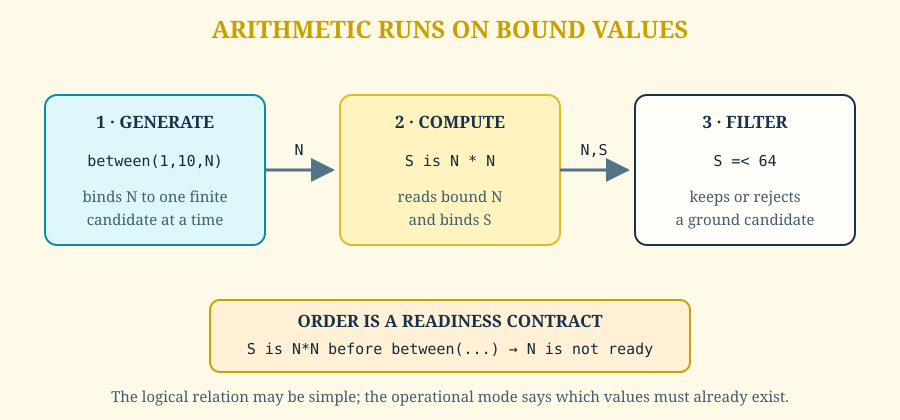
  <figcaption>Arithmetic goals consume bindings rather than inventing them: generate a finite candidate, compute from ready inputs, then filter the ground result.</figcaption>
</figure>

```eyeprolog

:- use_module(library(lists)).

next(X, Y) :- (Y is X + 1).
area_rectangle(W, H, Area) :- (Area is W * H).

hypotenuse(A, B, C) :-
  (A2 is A * A),
  (B2 is B * B),
  (C2 is A2 + B2),
  (C is sqrt(C2)).
```

Inputs must be bound to suitable numbers before a numeric function runs.
Comparisons filter generated solutions:

```eyeprolog
safe_reading(Sensor, Value) :-
  reading(Sensor, Value),
  (Value >= 0),
  (Value =< 80).
```

`between(Low, High, Value)` enumerates an inclusive integer range or checks an
already-bound value:

```eyeprolog
:- use_module(library(lists)).

square(N, Square) :-
  between(1, 10, N),
  (Square is N * N).
```

Finite generators turn loops into searches. Recurrences need intended modes:

```eyeprolog
factorial(0, 1).
factorial(N, F) :-
  (N > 0),
  (Previous is N - 1),
  factorial(Previous, PF),
  (F is N * PF).
```

The intended call direction belongs in the predicate's tests and surrounding
documentation; it does not require executable metadata.

**Checkpoint.** For every arithmetic goal above, mark which arguments must be
numbers before the goal can run. Explain why `between/3` is a generator in
`square/2` but merely a check when its third argument is already bound.

## 7. Failure, negation, and quantification

A goal fails when no clause or built-in proves it under current bindings.
Failure prunes that branch and search tries another choice.

Failure is an operational event, not automatically a statement about the
world. Turning failure into `\+ Goal` is justified only relative to the
program and the current bindings. This is the **closed-world move** familiar
from databases: for some bounded relation, what cannot be derived is treated
as absent. It differs from the open-world stance common on the Web, where a
missing claim may simply be unknown. Neither stance is universally right; the
modeler must say which knowledge boundary is complete.

`\+ Goal` succeeds when `Goal` has no solution:

```eyeprolog
allowed(User) :-
  user(User),
  \+ blocked(User).
```

This means “blocked cannot be proved from this program,” not classical
negation. Bind variables before negating. Putting `\+ blocked(User)` before
`user(User)` asks whether there is no blocked user at all, not whether this
particular user is unblocked.

<figure>
  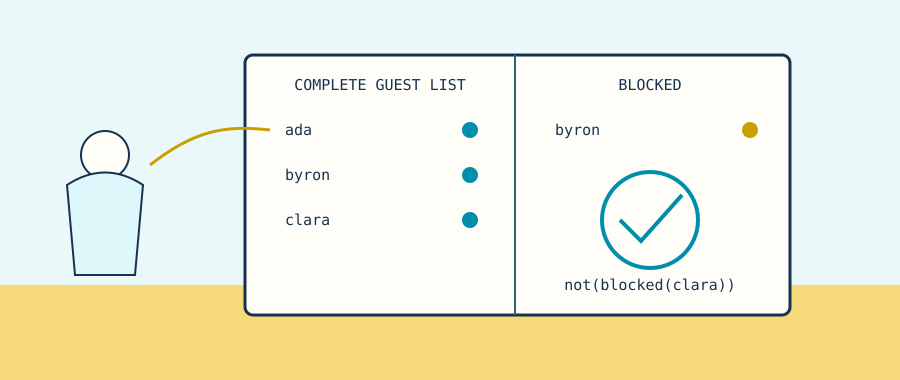
  <figcaption>Absence becomes informative only inside a declared complete boundary: Clara is allowed because the event registry is complete and she is not on its blocked list.</figcaption>
</figure>

For ordinary `\+/1`, negative dependencies should normally be stratified:
compute a lower relation, then negate it from a higher layer. Use `--warnings`
to report negative recursion:

```sh
eyeprolog --warnings program.pl
```

Some finite rule systems intentionally contain recursion through negation. In
normal mode, EyeProlog provides explicit `tnot/1` for that case. When the
reachable component is finite, function-free, and range-restricted Datalog,
cycles through `tnot/1` are evaluated with the well-founded semantics (WFS)
rather than ordinary negation-as-failure. WFS has three truth states: true,
false, and undefined. A negative cycle may therefore leave the query
undefined instead of forcing an arbitrary true/false choice.

```eyeprolog
move(a, b).
move(b, a).
win(X) :- move(X, Y), tnot(win(Y)).
```

Here neither `win(a)` nor `win(b)` is unconditionally established; both belong
to the undefined part of the well-founded model. EyeProlog retains that
undefined state internally, but it does not treat an undefined atom as a
successful query answer, nor does it continue evaluating the rest of a
conjunction as though that atom had succeeded.
Use `wfs_truth/2` when the truth state itself is data:

```text
?- wfs_truth(win(a), Truth).
   Truth = undefined.
```

The inspected goal must be ground. The predicate reports `true`, `false`, or
`undefined`; reporting `undefined` is a successful result of `wfs_truth/2`, not
a successful execution of the inspected goal.
Direct calls to `tnot/1` must be ground. In WFS rules, variables occurring in
the head or a negated literal must be range-restricted by positive body
literals. Ordinary `\+/1` is unchanged, and strict ISO mode does not provide
`tnot/1`.

Universal checking needs no extension predicate: define the counterexample and
negate it.

```eyeprolog
all_tests_pass(Suite) :-
  \+ failing_test(Suite).

failing_test(Suite) :-
  test_in(Suite, Test),
  \+ passed(Test).
```

Use negation where the knowledge boundary is closed: a complete roster,
configuration, or finite result set. In open-world data, model explicit states
such as `confirmed_absent` instead of deriving absence from silence.

**Checkpoint.** Compare `user(User), \+ blocked(User)` with
`\+ blocked(User), user(User)`. State the question each ordering asks and the
completeness assumption needed before calling either result “allowed.”

## 8. Collecting and choosing answers

Finite aggregation asks about a solution set:

```eyeprolog
:- use_module(library(aggregate)).
:- use_module(library(lists)).
:- use_module(library(iso_ext)).

findall(Template, Goal, List).
countall(Goal, Count).
sumall(Value, Goal, Sum).
```

```eyeprolog
:- use_module(library(aggregate)).
:- use_module(library(lists)).

outgoing_costs(Node, Costs) :-
  findall(Cost, edge(Node, _, Cost), Costs).

total_outgoing(Node, Total) :-
  sumall(Cost, edge(Node, _, Cost), Total).
```

`findall/3` returns `[]` for no answers; counts and sums return zero.

Choose a collector from the question, not from convenience:

| Question | Result shape | Empty search |
| --- | --- | --- |
| Which witnesses were found? | `findall/3` returns a list | `[]` |
| How many derivations succeeded? | `countall/2` returns an integer | `0` |
| What is their numeric total? | `sumall/3` returns a number | `0` |
| Which candidate has the least or greatest key? | `aggregate_min/5` or `aggregate_max/5` returns one candidate | failure |

Counting solutions is not necessarily counting distinct domain objects: two
proofs may resolve the visible value in the same way. When identity matters,
collect the identifying template and deliberately canonicalize it with ISO
`sort/2`; when derivation multiplicity matters, retain the duplicates. Making
that decision explicit prevents a database-style summary from silently
changing the question.

<figure>
  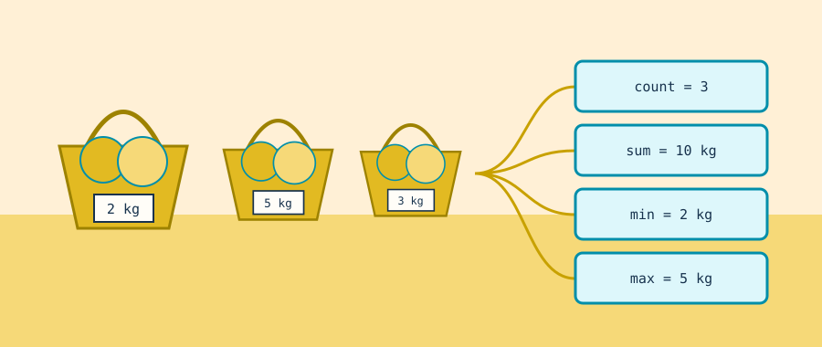
  <figcaption>Aggregation temporarily treats a finite family of solutions as a collection: the same baskets can be counted, summed, or compared.</figcaption>
</figure>

Optimization can retain only a best solution:

```eyeprolog
:- use_module(library(aggregate)).
:- use_module(library(lists)).

best_route(From, To, Route, Cost) :-
  aggregate_min(
    [CandidateCost, CandidateRoute],
    CandidateRoute,
    route(From, To, CandidateRoute, CandidateCost),
    [Cost, Route],
    Route
  ).
```

The key `[Cost, Route]` supplies deterministic tie-breaking through term order.
`aggregate_min/5` and `aggregate_max/5` fail when their goal has no answers.
An aggregate opens a smaller query scope inside the surrounding proof, and its
inner search must be finite.

Keep candidate generation separate from choice. A relation such as
`route/4` should explain which routes exist and how their costs arise;
`best_route/4` states a policy over that finite relation. This separation lets
the same candidates be inspected, counted, tested, or optimized without
burying their meaning in a single committed search. It also makes an empty
candidate set visible: “there is no route” is different from inventing a
sentinel route with an artificial cost.

**Checkpoint.** For an empty route relation, predict the behavior of
`findall/3`, `countall/2`, `sumall/3`, and `aggregate_min/5`. Then identify the
finite generator that bounds each aggregate in a program of your own.

## 9. Structured data, text, and contexts

Term predicates decompose or construct general terms:

<figure>
  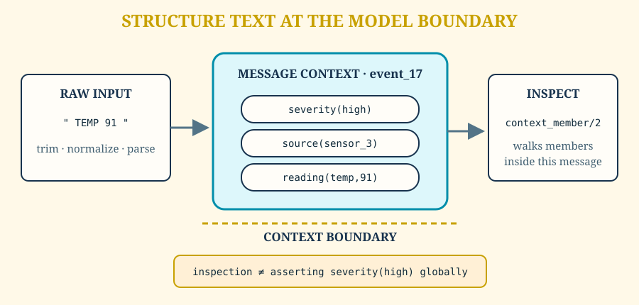
  <figcaption>Normalize text into explicit structure at the boundary; inspecting a member inside one context does not turn it into an ambient fact.</figcaption>
</figure>

```eyeprolog
functor(Term, Name, Arity).
arg(Index, Term, Value).
(Term =.. [Name | Arguments]).
```

`arg/3` uses one-based indexes. Prefer direct pattern matching when the shape
is known; use inspection for generic transformations.

Text is best normalized at the model boundary. The `library(strings)` module
uses ISO-friendly atoms or proper lists of one-character atoms for its text
arguments; newly produced text is an atom:

```eyeprolog
:- use_module(library(strings)).
:- use_module(library(lists)).

normalized(Input, Words) :-
  trim(Input, Trimmed),
  lowercase(Trimmed, Lower),
  split(Lower, ' ', Words).
```

Conversions include `number_string/2`, `atom_string/2`, and `term_string/2`.
Pattern operations include `contains/2`, `matches/2`, and named-capture
`matches/3`. Turn text into structured terms early and keep central rules
relational. Double-quoted source notation follows the ISO `double_quotes` flag;
it does not create a separate Prolog string type.

Parenthesized comma terms can serve as context data:

```eyeprolog

:- use_module(library(lists)).

message(event_17, (severity(high), source(sensor_3), reading(temp, 91))).

context_member((Left, _right), Member) :- context_member(Left, Member).
context_member((_left, Right), Member) :- context_member(Right, Member).
context_member(Member, Member) :- Member \= (_left, _right).

hot_event(Id) :-
  message(Id, Context),
  context_member(Context, severity(high)),
  context_member(Context, reading(temp, Value)),
  (Value > 80).
```

`context_member/2` is an ordinary program relation: it walks a comma-context
from left to right. When the member's shape is not known in advance, decompose
it with `(Member =.. [Name | Arguments])`. Context members remain quoted data;
inspecting them does not assert them as ambient facts.

**Checkpoint.** Distinguish the atomic formula `message(...)` from the nested
data term `(severity(high), source(sensor_3), reading(temp, 91))`. Explain why
`context_member/2` can inspect the latter without asserting `severity(high)`
globally.

## 10. From puzzles to models

A robust finite search has three layers: generate candidates, constrain them,
and present a concise answer.

```eyeprolog
color(red).
color(green).
color(blue).

coloring(A, B, C) :-
  color(A),
  color(B),
  (A \= B),
  color(C),
  (B \= C),
  (A \= C).

answer(colors(A, B, C)) :- coloring(A, B, C).
```

```sh
eyeprolog --goal 'answer(X)' program.pl
```

Place cheap, selective constraints as soon as their inputs are bound. For
state-transition problems, represent state and moves explicitly:

```eyeprolog

:- use_module(library(lists)).

plan(State, State, _, []).
plan(State, Goal, Seen, [Move | Moves]) :-
  transition(State, Move, Next),
  \+ member(Next, Seen),
  plan(Next, Goal, [Next | Seen], Moves).
```

The visited list makes a finite state space explicit. EyeProlog is strongest when
the result is a logical consequence with a compact witness: a path, matching,
classification, schedule, proof, or bounded model. Mutable arrays and large
numerical kernels generally belong in a host, with EyeProlog as the decision layer.

For the coloring program, the six printed answers are the permutations of
`red`, `green`, and `blue`:

```text
answer(colors(red, green, blue)).
answer(colors(red, blue, green)).
answer(colors(green, red, blue)).
answer(colors(green, blue, red)).
answer(colors(blue, red, green)).
answer(colors(blue, green, red)).
```

**Checkpoint.** Label the generator, each constraint, and the final witness in
the coloring program. Before changing it, predict how many answers remain if
`A \= C` is removed; then run the program and account for every additional
answer.

## Part II summary

Part II turned relations into finite computations:

- arithmetic relations need their operational inputs bound;
- generators state where finite candidates come from;
- failure prunes a branch, while `\+/1` makes finite failure a closed-world
  test;
- recursion through negation is handled by `tnot/1` and the well-founded
  semantics, whose undefined truth state is retained rather than forced;
- aggregates turn a finite solution space into a list, count, sum, or optimum;
- structured terms and contexts belong at explicit modeling boundaries;
- puzzles become programs by separating generation, constraint, and witness.

You should now be able to justify a query's finiteness, order goals by binding
dependency, distinguish negation as failure from classical negation, and
explain why optimization is search plus an ordering.

### Historical note: control, databases, and finite failure

Early Prolog made a decisive engineering choice: clauses would be tried in an
order and subgoals would normally be selected left to right. That choice made
logic executable, but also made control visible. A logically symmetric
conjunction could behave asymmetrically when one order supplied a value and
another asked arithmetic to run too soon.

The meeting of logic programming and database research in the 1970s sharpened
questions about finite relations, closed-world reasoning, and query
evaluation. Keith Clark's 1978 account did not identify failure with
unrestricted logical negation; it related negation as failure to a completed
database reading. Later work on stratification disciplined negative
dependencies. Aggregation continued the database lineage: a set of solutions
could itself become data, provided the nested search was finite.

These distinctions explain EyeProlog's conservative treatment. Negation and
aggregation are powerful because they expose a bounded subcomputation. Their
safety comes not from punctuation but from a mathematical argument about scope
and termination.

---

# Part III — Trustworthy reasoning

<figure>
  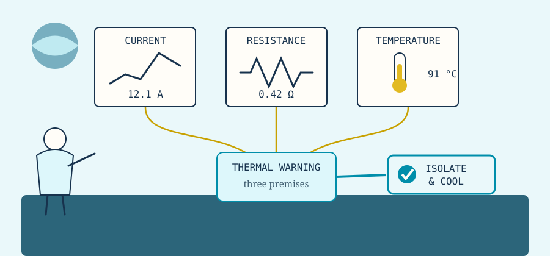
  <figcaption>Current, resistance, and temperature readings remain visible as independent premises for a thermal warning and safety action.</figcaption>
</figure>

An answer becomes useful when its grounds remain visible. Here reasoning is
treated as an accountable structure: queries define the question, proofs retain
support, integrity checks expose invalid states, and knowledge boundaries stay explicit.

## 11. Queries, answers, and proofs

EyeProlog goals are supplied by the host, for example
`eyeprolog --goal 'child(X, Y)' program.pl`. EyeProlog prints ground answers, removes
duplicates, and suppresses answers that merely repeat source facts. Answers
are not inserted back into the running program.

An answer and a derivation serve different audiences. An answer records *what*
the theory supports; a derivation records *how this run supported it*. In
mathematics that distinction resembles theorem versus proof. In data systems
it resembles result versus provenance. The proof is not a substitute for
valid source data or sound domain rules, but it makes both reviewable: a user
can trace a decision to clauses, facts, bindings, and built-in operations
instead of trusting an opaque status code.

Use `--proof` or `-p` to add a machine-readable `why/2` fact after every answer:

```sh
eyeprolog --proof examples/socrates.pl
```

```eyeprolog

:- use_module(library(lists)).

why(
  type(socrates, mortal),
  proof(
    goal(type(socrates, mortal)),
    by(rule("socrates.pl", clause(4))),
    bindings([binding("X", socrates)]),
    uses([
      proof(
        goal(type(socrates, man)),
        by(fact("socrates.pl", clause(3)))
      )
    ])
  )
).
```

Proof output is valid EyeProlog input and can be kept as a proof certificate:

```sh
eyeprolog --proof examples/socrates.pl > socrates.why.pl
eyeprolog --verify-proof socrates.why.pl examples/socrates.pl
```

The second command checks the supplied `why/2` derivation against the program;
it does not search again for a proof. A changed source clause, child goal, source
location, or recorded substitution makes the certificate fail verification.
Certificate input is parsed as Prolog data rather than loaded as a program, so
its terms cannot trigger directives while being checked.

A normal answer is one resolved ground term followed by a period. Strings,
quoted atoms, lists, and compounds are rendered in supported source syntax so
the output can be read back. Enabling `--proof`, `--warnings`, or `--stats`
must not change which answers are found.

The second argument of `why/2` is a proof term of the general shape
`proof(goal(G), by(Method), bindings(Bindings), uses(Proofs))`. User clauses
are identified as `fact(Filename, clause(N))` or
`rule(Filename, clause(N))`, with one-based source clause numbers. Built-ins
are identified as `builtin(Name, Arity)`. By default, bundled Prolog-library
predicates appear as `library(Name, Arity)` trusted boundaries. Use
`--proof-detail expanded` to replace those boundaries with the library source
clauses and any trusted built-ins they call. Explanation data is outside the
logical semantics of the input program: it describes the derivation but does
not participate in finding it.

Verification checks source steps structurally: the named clause must exist, its
head must unify with the certified goal, its body must correspond to the child
proofs, and recorded clause-variable bindings must agree with that derivation.
Built-ins and abstract library nodes are deliberately trusted boundaries. This
separates proof discovery from proof checking without pretending that host
operations can be justified by Prolog source that does not exist.

A second program can query `why/2`. Read a proof as an argument. If it contains
irrelevant detours, improve the helpers. If a key premise is hidden inside an
opaque value, model it as a fact. Designing for a good explanation often
produces a better theory.

**Checkpoint.** Run `examples/socrates.pl` once normally and once with
`--proof`. Confirm that the ground answers are unchanged. In one proof,
identify the queried goal, the rule that derived it, the source fact used, and
the binding carried between them.

## 12. Integrity checks as ordinary predicates

Integrity conditions are ordinary relations that describe invalid input states:

```eyeprolog
invalid_probability(Disease, Probability) :-
  probability(Disease, Probability),
  (Probability > 1).
```

A host that requires validated input queries the integrity relation explicitly
before it asks for domain decisions. This keeps the policy visible: the host may
reject the input, report every defect, or continue in a diagnostic mode.

`false/0` keeps its ISO meaning: it is a built-in goal that always fails. It is
a protected static procedure, so `false.` and clauses of the form
`false :- Body.` are rejected with
`permission_error(modify, static_procedure)` rather than acquiring special
pre-query behavior.

<figure>
  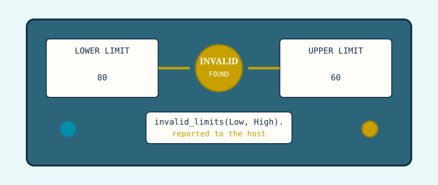
  <figcaption>An integrity relation reports the invalid state; the host decides whether that state blocks later decisions.</figcaption>
</figure>

```eyeprolog
invalid_assignment(Person, Role, Other) :-
  assigned(Person, Role),
  incompatible_roles(Role, Other),
  assigned(Person, Other).
```

The logical reading is that the program can derive witnesses for an inadmissible
combination. The operational response is outside the relation itself and remains
an explicit host decision.

### Designing an integrity relation

Start with a sentence that must never be accepted, then translate its witnesses
into positive, finite goals. “No person has two incompatible roles” becomes the
relation above. A useful integrity check is:

- **domain-specific:** it names an impossible or inadmissible state;
- **finite:** its intended validation query can be checked completely;
- **diagnostic:** its arguments identify the offending records; and
- **explicit:** callers can choose whether to reject, report, or inspect defects.

Four outcomes that can look like “failure” at a shell prompt have different
meanings:

| Outcome | Interpretation | Appropriate response |
| --- | --- | --- |
| query has no answer | this theory did not derive the selected goal | inspect data, rules, and closed-world assumptions |
| integrity query has an answer | the supplied input contains a forbidden combination | repair, reject, or report the input |
| resource ceiling is reached | the computation exceeded an operational budget | bound or redesign the search |
| parser or type error | the program or call violates the language contract | correct the source or interface |

Do not treat every undesirable business result as invalid input. A declined
application, unavailable route, or negative test may be a perfectly valid
answer of the theory. Reserve integrity relations for states whose witnesses
must be handled before trusted downstream decisions.

To see the explicit validation path, run:

```sh
eyeprolog examples/integrity-check.pl
```

It prints the invalid-state witness and the resulting diagnostic status. Nothing
runs implicitly before the supplied goals.

**Checkpoint.** Explain the difference between an ordinary query with no answer
and an integrity query that returns a defect. Write one invalid-state relation
and one ordinary negative result that should remain query failure.

## 13. Termination, tabling, and performance

Declarative clarity and operational care reinforce each other. Bind selective
arguments early, keep generators finite, and make decreasing structure visible.

<figure>
  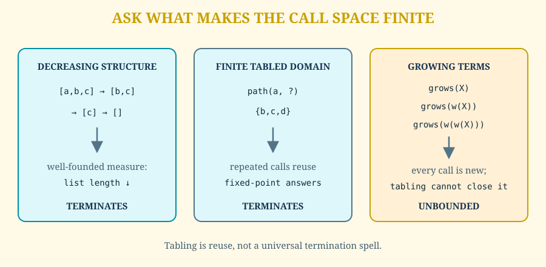
  <figcaption>Termination needs a specific argument: a decreasing measure or a finite tabled call-and-answer space; ever-growing terms satisfy neither.</figcaption>
</figure>

Naive depth-first search can revisit the same recursive question indefinitely.
Tabling changes the unit of work: a call pattern becomes a shared subproblem,
its answers are remembered, and consumers reuse answers rather than expanding
the same call again. This idea connects logic programming to memoization and
dynamic programming, but tabling also has a semantic role: over a finite
positive recursive domain, repeated rounds can compute the least fixed point.
It is therefore especially natural for reachability, grammars, dependency
analysis, and other recursive relations with overlapping subproblems.

Ordinary goals, including recursive ones, use indexed depth-first resolution. Tabling is opt-in: declare a predicate with `:- table p/n.` when its
recursive calls should share answers and cyclic calls should iterate toward a
fixed point. For sufficiently large finite, function-free Datalog dependency
cones rooted at an explicitly tabled predicate, EyeProlog may share one
most-general relation table across call variants. This turns an open closure
such as `tc(X, Y)` into one finite relation computation rather than many
overlapping bound subcomputations; bound consumers can then use indexes over the
stored answers. The declaration is the language-level choice; how a declared
table is represented and indexed remains an engine optimization.

Recursive components with negative dependencies are not positive least-fixed-
point problems. When such a component uses explicit `tnot/1` and satisfies the
finite, range-restricted, function-free Datalog restrictions, EyeProlog instead
computes the alternating fixed point of the well-founded semantics. Existing
`\+/1` code remains ordinary negation-as-failure.

### Deeper implementation: how clause indexing stays semantic

This section explains why an optimization does not change clause meaning.
Readers focused on modeling may skip to the statistics command and return when
performance or implementation portability becomes relevant.

Every predicate group keeps compact indexes for scalar values in each argument
position. Index keys include the scalar type, so `7`, `'7'`, and `"7"` remain
distinct even though their printed payload is the same. A clause whose indexed
head argument is a variable or structured term
stays in a fallback set, and the selected candidates are merged back into
source order before unification. An index narrows where to look; it never
decides whether a clause matches.

For groups of at least ten clauses, a call with several bound scalar arguments
may cause a wider combined index to be built on demand. The admission policy
rejects indexes with too many variable fallbacks or too little expected
speedup, and requires a combined index to improve substantially over the best
single-argument index. These choices are performance details: removing every
index should change running time, not answers or clause order.

Authors choose query modes, finite domains, visited-state representations,
negation strata, and witness size. They normally do not choose the engine's
search strategy.

Inspect counters without changing answer output:

```sh
eyeprolog --stats examples/observability-log-correlation.pl
```

The reported counters include completed goal lists, calls to the goal solver
and single-goal solver, unification attempts, maximum depth and goal-list size,
deterministic built-in successes and failures, and table fixed-point rounds.
WFS execution additionally reports `wfs_fixpoint_rounds` and
`wfs_undefined_answers`. The latter counts undefined atoms encountered while
resolving query goals; it is an execution statistic, not a declaration
that those atoms are true. All statistics describe work performed, not logical
truth. Compare counters only across equivalent queries and the same
implementation version.

Common sources of nontermination are recursive calls made before constraints,
ever-growing terms, infinite open mathematical queries, negative cycles, and
path enumeration without a visited set. Repair the model by strengthening the
query, adding a finite domain, tracking states, or exposing a decreasing
argument.

**Checkpoint.** Classify three recursive calls: one justified by a decreasing
list, one by finitely many tabled graph answers, and one that constructs terms
without bound. State why the first two may terminate and why tabling does not
repair the third.

### Eyelet forward rules and Prolog execution

EyeProlog normal mode also accepts `:+` at priority 1200 as an `xfx` operator.
A source term

```text
Conclusion :+ Premise.
```

is a forward rule. When a loaded program contains such rules and no explicit
top-level goal overrides them, the engine loads `library(eyelet)` and invokes its
Prolog closure driver. The driver inspects `:+/2` clauses structurally, prepares
state predicates for updates, repeatedly solves premises against the current
program, asserts novel conjuncts from successful conclusions, and continues until
no new conclusion is added. Query-only programs take a single-pass fast path
because they cannot grow the closure. This is the execution path used when Eyelet
sources are run directly by EyeProlog.

Two conclusions have control meaning. `true :+ Goal` is a query and prints each
distinct successful instance of `Goal`. `false :+ Goal` is an integrity fuse:
on success EyeProlog prints `fuse(Goal)` and returns halt status 2. Variables
that occur only in an ordinary derived conclusion are existential and become
`sk_0`, `sk_1`, and so on; a derived conclusion that is itself a `:+` rule keeps
its variables universal. The driver uses an explicit changed marker to repeat
only productive rounds. `stable(Level)` raises the requested closure level and
succeeds once that level has been reached. `becomes(From, To)` performs linear
state replacement and prepares existing user predicates for mutation, so an
EyeProlog source does not need a separate `dynamic/1` declaration merely to use
that state with `becomes/2`.

The `:+` reasoning algorithm is therefore Prolog code in `src/lib/eyelet.pl`, not
a second JavaScript implementation. The remaining JavaScript references have
non-semantic roles: the parser declares the normal-profile operator, program
analysis scans forward-rule premises for dependency/autoload planning, execution
bootstraps the private `eyelet:eyelet_run/3` entry point, and two private library
adapters bridge database mutability and answer/fuse events to the host. Those
adapters are not part of the strict ISO registry or the public `library(eyelet)`
export surface.

The JavaScript convenience `run()` function selects this forward mode when no
explicit `goal` or `goals` option is supplied. Advanced embedders can inspect a
parsed program with `hasForwardRules(program)` and invoke
`executeForwardRules(program, solver, callbacks)` directly. Strict ISO mode
removes the `:+` operator and does not execute this extension.

Resource bounds are never logical answers. Normal execution has no implicit
depth limit. If an embedder explicitly supplies `maxDepth` and the search
exceeds it, EyeProlog raises `resource_error(depth_limit)` instead of silently
turning that branch into failure. Tabling is never selected implicitly: ordinary
recursive predicates retain standard depth-first Prolog control, and only a
source-level `:- table p/n.` declaration opts a predicate into fixed-point tabled
execution.

## 14. Knowledge engineering

A maintainable theory separates:

- source facts: measurements, records, and asserted relationships;
- helpers: normalization, classifications, and reachability;
- decisions: `status/2`, `action/2`, `risk/2`, and `reason/2`;
- integrity relations: predicates that return diagnostic invalid-state witnesses;
- outputs: focused host-supplied goals.

<figure>
  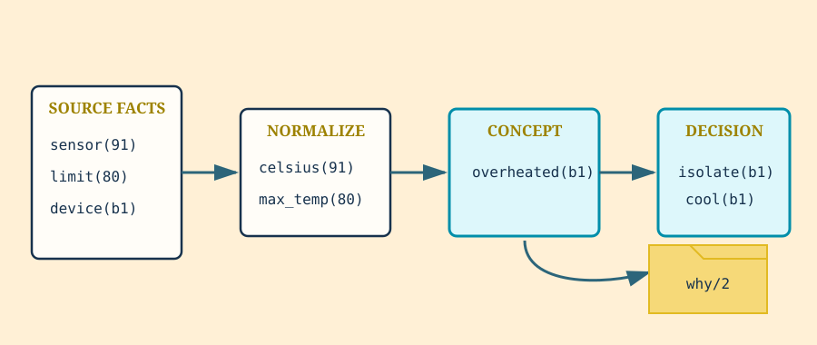
  <figcaption>A maintainable theory moves in visible layers from observations to decisions, while the proof preserves the route back to evidence.</figcaption>
</figure>

Prefer positive domain concepts. Use negation only across a closed boundary.
Represent confidence, alternative worlds, and provenance explicitly rather
than hiding them in rule order.

An evidence-backed diagnosis can separate physics from policy:

```eyeprolog
heating(Battery, Watts) :-
  current(Battery, Amps),
  resistance(Battery, Ohms),
  (I2 is Amps * Amps),
  (Watts is I2 * Ohms).

thermal_warning(Battery) :-
  heating(Battery, Watts),
  heating_limit(Limit),
  (Watts > Limit),
  temperature(Battery, Celsius),
  temperature_limit(TLimit),
  (Celsius > TLimit).

action(Battery, isolate_and_cool) :- thermal_warning(Battery).
```

Physics, limits, redundant sensing, and policy become distinct proof steps. See
`examples/spacecraft-battery-diagnosis.pl` for a complete case.

Test theories with successful derivations, expected failures, boundary values,
duplicate paths, contradictory inputs, and proof premises. The repository's
conformance cases, example goldens, and proof goldens demonstrate these levels.

**Checkpoint.** Draw four columns for the battery example: source, physical
concept, decision, and integrity. Place each predicate in a column, then list
the measurements and policy thresholds that a proof cannot authenticate by
itself.

## 15. Explicit data boundaries

EyeProlog deliberately keeps external integration outside the reasoning core.
An embedder validates input, converts it to ordinary Prolog terms and clauses,
and then asks the solver a focused goal. This keeps parsing a business format,
authenticating a source, and deriving a conclusion as three separate jobs.

A boundary should make four decisions visible:

- which external values are accepted;
- how they map to finite Prolog terms;
- which predicates the imported clauses may define; and
- which resource limits apply to the resulting query.

### A boundary in four steps

Suppose a host receives one JSON temperature record. The host, not the logic
program, owns the JSON syntax and the decision to trust that record. A narrow
adapter can validate the record, map its values into a deliberately small
Prolog vocabulary, construct the theory, and ask one bounded question:

```js
import { run } from 'eyeprolog';

const inputText = '{"sensor":"sensor_1","celsius":91}';
const allowedSensors = new Set(['sensor_1', 'sensor_2']);

function reasoningSource(record) {
  if (!record || typeof record !== 'object') throw new TypeError('record');
  if (!allowedSensors.has(record.sensor)) throw new TypeError('sensor');
  if (!Number.isFinite(record.celsius)) throw new TypeError('celsius');
  if (record.celsius < -100 || record.celsius > 200) {
    throw new RangeError('celsius');
  }

  return `
reading(${record.sensor}, ${record.celsius}).
thermal_alert(Sensor) :-
  reading(Sensor, Celsius),
  (Celsius >= 80).
`;
}

const record = JSON.parse(inputText);
const result = run(reasoningSource(record), {
  goal: `thermal_alert(${record.sensor})`,
  proof: true,
  maxDepth: 10_000,
  maxInferences: 100_000,
  maxMemoryBytes: 256 * 1024 * 1024,
  solutionLimit: 10
});

console.log(result.stdout);
```

The allow-list makes interpolation safe here: the external sensor identifier
can become only one of two known Prolog atoms, and the temperature must be a
finite number in an accepted range. General text must be encoded with a
well-tested term constructor or serializer rather than inserted into source.
The generated program defines only `reading/2` and the fixed domain rule; the
host supplies the goal and ceilings explicitly.

This small example exposes four different claims:

| Stage | Claim and owner |
| --- | --- |
| Parse | the bytes are valid JSON — host parser |
| Validate | the record has an accepted sensor and temperature — adapter |
| Convert | the accepted values denote these exact Prolog terms — adapter |
| Derive | the supplied reading satisfies `thermal_alert/1` — EyeProlog proof |

The proof procedure can explain how supplied clauses support an answer. It
cannot prove that a file, database, sensor, or remote service was trustworthy.
That responsibility stays with the host application.

**Checkpoint.** Choose one external record used by an application. State what
the host validates, the Prolog term it constructs, the goal it asks, and the
resource limit that prevents an untrusted input from consuming unbounded work.

## 16. Embedding EyeProlog

The JavaScript API exposes a convenience runner and lower-level types:

```js
import { run, Program, Solver, parseGoalText } from 'eyeprolog';

const result = run(`
answer(ok) :- ok = ok.
`, { goal: 'answer(X)' });
console.log(result.stdout);
console.log(result.stats);
```

The first `console.log` prints `answer(ok).` followed by a newline. The second
prints numeric work counters; those counters describe this run rather than an
additional logical answer.

`run/2` accepts source text or an already parsed `Program`. Its options include
`proof` (with `why` and `explain` as aliases), `proofDetail` (`abstract` or
`expanded`), `maxDepth`, `maxInferences`, `maxMemoryBytes`, `solutionLimit`, a
custom `registry`, and `strictNegation` or `analyzeNegation`. It returns
`stdout`, the solver's numeric `stats`, and a nullable `haltCode`; it does not
write to the process streams.

For applications that exchange proofs independently of answer output, the same
module exposes `proofCertificate(program, goal, options)`,
`proofCertificatesFromText(text, program)`, and
`verifyProof(program, certificate, options)`:

```js
import {
  Program, parseGoalText,
  proofCertificate, proofCertificatesFromText, verifyProof
} from 'eyeprolog';

const program = Program.parse(`
p(a).
q(X) :- p(X).
`, { sourceMetadata: true });

const made = proofCertificate(program, parseGoalText('q(a)'));
console.log(verifyProof(program, made).ok); // true

const received = proofCertificatesFromText(made.text, program)[0];
console.log(verifyProof(program, received).ok); // true
```

`proofCertificate` returns both the ordinary `why/2` text and a JSON-serializable
certificate object. `verifyProof` walks the supplied certificate rather than
asking the solver to find another proof; its `trusted` array lists every builtin
or abstract-library boundary that was assumed while checking it. Passing
`proofDetail: 'expanded'` exposes bundled Prolog-library clauses in the
certificate and therefore reduces library-level trust boundaries to the
built-ins those clauses ultimately use.

When `run` receives an already parsed `Program`, bundled-library imports
needed only by its host-supplied goals are added to that Program before solving,
just as they are while source text is parsed. The autoload index covers every
exported predicate in the bundled `src/lib/` modules. Pass `autoload: false`
when the Program must retain only explicitly imported predicates.

For applications that inspect or prepare a theory before running it, use
`Program` directly:

```js
const source = `
edge(a, b).
edge(b, c).
path(X, Y) :- edge(X, Y).
path(X, Z) :- edge(X, Y), path(Y, Z).
`;

const program = Program.parse(source, { analyzeNegation: true });
const goal = parseGoalText('path(a, X)');
const path = program.findGroup('path', 2);

console.log(goal);
console.log(program.stratifiedNegation);
console.log(path?.recursive, path?.tabled, path?.tableInputPositions);

const solver = new Solver(program, {
  maxDepth: 50_000,
  maxInferences: 1_000_000,
  maxMemoryBytes: 256 * 1024 * 1024,
  solutionLimit: 100_000
});
```

The limits are safety ceilings, not logical declarations. Reaching the depth,
inference, or solution ceiling may truncate search; it does not prove that no
further answer exists. Reaching `maxMemoryBytes` instead raises
`resource_error(memory)`, because continuing until the JavaScript engine's hard
heap limit would let the host abort before Prolog could report an exception. At
the `Solver` API boundary, `solutionLimit` is opt-in: if it is omitted, ordinary
solving and child searches that inherit the solver limit do not stop after a
fixed number of solutions. This matters for re-executable goals such as
`repeat/0` and for library relations such as `call_nth/2`; an implementation
safety threshold must not turn a still re-executable search into logical
failure. Embedders that need a finite answer budget should pass `solutionLimit`
explicitly.

Variable term order is deliberately scoped rather than stored as a permanent
property of a variable. ISO 13211-1 section 7.2.1 leaves the order of two
distinct variables implementation dependent and requires constancy only while
a sorted list is being created. EyeProlog therefore chooses a local variable
ranking for an ordinary term comparison, while `sort/2`, `keysort/2`, and the
sorting step of `setof/3` share one ranking for the duration of that single
sorted-list operation. No process-global variable registry or creation ordinal
is retained or exposed through later comparisons.

EyeProlog periodically checks detectable JavaScript heap use and keeps a quarter
of the applicable host heap ceiling in reserve so the solver can unwind and report
`resource_error(memory)` before a fatal host out-of-memory abort. When Node is
started with `--max-old-space-size`, the guard compares that old-generation
ceiling with V8's non-young heap spaces; short-lived new-generation allocations
therefore do not cause a false resource error. Embedders may
replace that automatically derived soft ceiling with `maxMemoryBytes`; setting
it to `Infinity` disables the proactive check. Environments that do not expose
heap use cannot provide the proactive check. Host capacity failures that V8
reports as `Map maximum size exceeded` or `Set maximum size exceeded` are also
normalized at the solver boundary instead of leaking a JavaScript `RangeError`.
ISO 13211-1 leaves the resource atom implementation dependent. EyeProlog uses
`memory` for a finite host allocation/capacity ceiling and reserves the
`finite_memory` spelling for the distinct convention where no finite amount of
memory could complete the computation. After a recoverable memory error, the
solver keeps a bounded recovery window while the failed search unwinds so the
host can collect released query terms. The same solver can then run later
queries; this recovery does not resume the query that exhausted its limit.

The iterative solver keeps active-call frames only where they are semantically
needed for cut scope or recursive variant guards. Bundled-library helpers whose
callable dependency region is cut-free and which need no recursive variant
guard therefore do not copy a growing active-call sequence at every step.
Under the normal EyeProlog registry, the bundled Prologue `length/2` also has a
scoped iterative execution path: named lists are counted or constructed without
recursive interpreter frames, and an anonymous list is not materialized because
its binding cannot be observed. A newly constructed fixed-length suffix starts
as a lazy compact skeleton and expands one ordinary `./2` cell at a time when
unification, another list predicate, or answer readback inspects it. This is a
storage optimization, not a distinct Prolog term or list semantics. Embedders
that inspect the JavaScript term model can recognize this representation with
`CompactListTerm`, `isCompactList`, and `compactListLength`, or construct one
with `compactVariableList`. For open-ended `length(List, N)` generation, each generated spine is known not
to contain the caller's dereferenced tail variable. The bundled path passes that
proof through the normal unifier, sharing the same proven-nonoccurrence mechanism
as first-use clause variables instead of maintaining a predicate-specific raw
binding shortcut. It still reserves recovery headroom proportional to the
retained spine, so a finite heap limit is raised inside the `length/2` search as
a catchable `resource_error(memory)` rather than allowing an outer solver frame
to encounter the limit first.

The same proven-nonoccurrence mechanism has a conservative source-level form for freshly renamed
clauses. A singleton variable in the clause head, or a variable that has not
appeared in the head or any earlier body goal and occurs exactly once in a
direct `=/2` goal, cannot already be a subterm of the value it is about to
receive. EyeProlog marks only that binding as locally fresh and skips its occurs
traversal. A repeated variable such as the `X` in `X = f(X)`, a variable already
seen earlier in the clause, and `unify_with_occurs_check/2` all keep the normal
finite-tree check. The solver also treats such a first-use equality as a
source-order barrier for its deterministic-goal scheduling, so the freshness
proof cannot be invalidated by moving a later goal ahead of it. This recovers
much of the classic WAM-family "local variable" optimization for DCG tail
variables without introducing a WAM local/global stack distinction into the
JavaScript term model.

For grammar execution, `phrase/2` passes its fixed final remainder `[]` directly
into the expanded grammar. Besides matching the two-argument contract, this
avoids repeatedly trying an empty production against a temporary output
variable. `phrase/3` still uses a private final-output variable and delays its
last unification, preserving the existing steadfast treatment of its explicit
third argument. The ordinary `length/2` clauses remain the authoritative module
definition and are used unchanged by the ISO-only registry and whenever delays
or finite-domain constraints require their normal wake-up points.

### Implementation boundary

The source layout mirrors the language boundary while keeping the JavaScript
runtime flat under `src/`. `src/iso.js` remains the stable ISO facade and
built-in registry; arithmetic evaluation lives in `src/iso-arithmetic.js`, and
processor control/error classes live in `src/errors.js`. `src/dcg.js`
implements the shared Part 3-oriented grammar-rule and dynamic-body expansion
without depending back on the ISO registry. This keeps the low-level syntax and
error layers acyclic while preserving the existing `src/iso.js` exports.

`src/cleanup.js` is an execution-layer sibling of the solver. It installs
lifecycle-aware closing of protected builtin iterators from the supported API
and CLI entry paths and registers `call_cleanup/2` and
`setup_call_cleanup/3` for the normal EyeProlog profile. The standard-library
layer does not import the solver back through this module, preserving the
acyclic source graph.

Program preparation follows the same pattern. `src/program.js` remains the
`Program` facade and source/module loader. Static recursion, Datalog, WFS, and
negation-stratification analysis is isolated in `src/program-analysis.js`,
while compact-clause representation and conservative candidate indexes live in
`src/program-indexing.js`. The solver consumes those same indexes directly;
large execution fast paths deliberately remain in `src/solver.js` rather than
being split through extra strategy objects or callbacks. Architectural cleanup
is required to preserve benchmark performance as well as semantics.

Focused files under `src/lib/` contain the portable extensions, with
`src/lib/lists.pl` supplying common list relations. They are ordinary Prolog modules using EyeProlog's documented module compatibility
surface, organized like Trealla's `library/` and registered for
`library(Name)` by `src/standard-library.js` in Node and the browser. The
browser entry point `src/playground-worker.js` uses that same program and
module-loading path in a dedicated worker. `src/ARCHITECTURE.md` records the
layering and dependency rules, and the architecture regression rejects
JavaScript import cycles.

Normal CLI, JavaScript, `Solver`, proof replay, and the browser playground use
the same module loader. A library is added to a `Program` only when its source
uses `use_module/1` or `use_module/2`; exported predicates are imported into the
calling module and private predicates remain module-local. Advanced embedders
and conformance tests can select `getStrictIsoRegistry()` together with
`isoStrict: true` for the Part 1 + Corrigenda strict surface. All paths share
the parser, term representation, solver, streams, and proof machinery.

### Extending the built-in registry

An embedder can start from the default EyeProlog registry and add a host relation. A
handler is a generator over environments. It should clone before binding and
yield only environments in which its result unifies:

```js
import {
  atom,
  createEyePrologRegistry,
  run,
  unify
} from 'eyeprolog';

const registry = createEyePrologRegistry();

registry.add(
  'host_status',
  2,
  function* ({ goal, env }) {
    const next = env.clone();
    if (
      unify(goal.args[0], atom('service'), next) &&
      unify(goal.args[1], atom('ready'), next)
    ) {
      yield next;
    }
  },
  { deterministic: true }
);

const result = run(`
answer(X) :- host_status(service, X).
`, { registry, goal: 'answer(X)' });
```

Only mark a built-in deterministic when it can produce at most one environment
for a call. An unmarked suspended iterator is conservatively an untried
continuation: the solver never resumes it merely to discover whether a later
answer will succeed. An iterator that knows its remaining search positions may
provide `hasPendingAlternatives()`, updated before each yield, to remove its
resume frame exactly when no position remains. This method reports pending
search, not the existence of a future successful answer. A mode-sensitive
extension can additionally provide `ready`,
`fallbackWhenNotReady`, and `shouldUse` metadata. This metadata affects
dispatch and safe early filtering, so it belongs to the extension's contract.

The ISO `false/0` built-in always fails, and source clauses that attempt to
define it raise `permission_error(modify, static_procedure)`. Programs expose stratification diagnostics through
`stratifiedNegation`, `negationStratificationErrors`, and
`assertStratifiedNegation()`.

Treat remote source as executable logic. Although EyeProlog has no arbitrary host
call primitive, search can consume CPU and memory. Embedders should impose
appropriate depth, solution, input-size, and time limits.

Those ceilings are operational safeguards. If one is reached, report an
incomplete computation rather than turning truncation into a negative domain
conclusion.

## Part III summary

Part III moved from obtaining answers to trusting them:

- a query selects a question; a proof records one successful justification;
- an explicit integrity query identifies input that a host may reject;
- explicit `table` declarations compute fixed points for selected positive recursion;
- explicit `tnot/1` gives eligible finite Datalog components well-founded,
  three-valued negation without changing ordinary `\+/1`;
- indexing and ready filters improve control without changing intended meaning;
- knowledge engineering separates sources, concepts, decisions, and reasons;
- explicit host boundaries divide input validation from logical derivation;
- embedding keeps host authority outside the proof procedure.

You should now be able to distinguish proof trees from search trees, state what
an integrity query establishes, explain the finite-answer argument behind tabling, and name
which trust duties remain outside the solver.

### Historical note: from answers to accountable inference

The least-model semantics developed by van Emden and Kowalski in 1976 connected
definite programs to a mathematical fixed point: repeatedly add supported
ground consequences until nothing new appears. Tabled logic programming later
turned fixed-point ideas into a goal-directed technique that shares recursive
calls and accumulates answers. EyeProlog's explicit positive tabling is smaller
than the general systems in that literature, but inherits their central
insight: remembering a recursive question can change termination without
changing what the relation says. For finite Datalog with recursion through
explicit `tnot/1`, EyeProlog also uses the alternating-fixed-point account of
the well-founded semantics so a negative cycle may remain undefined instead of
being collapsed into ordinary negation-as-failure.

In parallel, deductive databases asked where facts come from and how derived
claims retain provenance. EyeProlog adopts the expectation that conclusions
should be inspectable while implementing a focused ISO Prolog profile.

The historical lesson is architectural. A proof procedure can attest that a
conclusion follows from supplied clauses. It cannot authenticate a database,
calibrate a sensor, or authorize a request. Systems became more trustworthy
when those boundaries became named rather than implicit.

---

# Part IV — The craft of logic programming

<figure>
  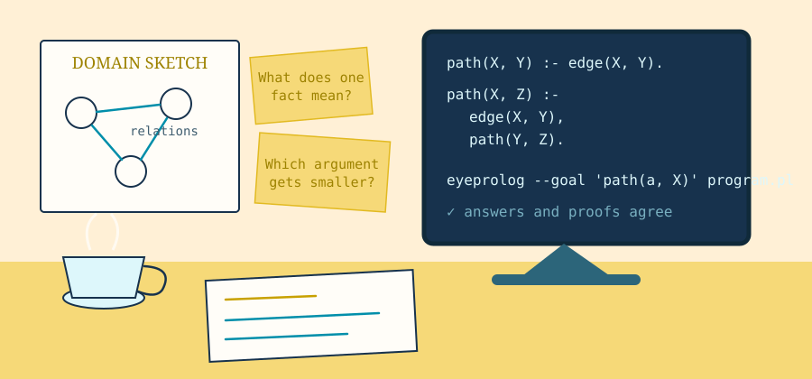
  <figcaption>Craft moves repeatedly between the real domain, the relations on paper, executable clauses, answers, and proofs.</figcaption>
</figure>

This Part turns from implementation features to habits of construction. A good
program rarely arrives whole; it is discovered through examples, corrected by
invariants, and refined without losing sight of the relation it is meant to express.

## 17. Logic and control

The central pleasure—and central difficulty—of logic programming is that a
short definition plays two roles. Consider:

```eyeprolog

:- use_module(library(lists)).

path(X, Y) :- edge(X, Y).
path(X, Z) :- edge(X, Y), path(Y, Z).
```

As logic, the clauses say that every edge is a path and that an edge followed
by a path is a path. As control, they tell the solver to try a direct edge
first, then choose an outgoing edge and continue from its endpoint.

This distinction is one of logic programming's oldest and most durable design
ideas. The logical component describes admissible answers; the control
component determines which consequences are explored, in what order, and with
what resource cost. A change in indexing, goal order, or tabling policy should
ideally preserve the first while improving the second. In practice, modeful
built-ins and incomplete searches mean that programmers must reason about both.

It is useful to write the relation first as a sentence:

> `path(X, Y)` holds when there is a finite sequence of edges from `X` to `Y`.

That sentence is independent of clause order. It is the specification against
which examples and counterexamples can be judged. Only then ask procedural
questions: which argument will normally be known, which goal generates a
finite set, and which recursive call is smaller or already tabled?

### The same relation, a different computation

Conjunction is logically commutative, but its textual order guides search.
These two rules have the same intended ground consequences:

```eyeprolog

:- use_module(library(lists)).

adult(Person) :- person(Person), age(Person, Age), (Age >= 18).

adult(Person) :- (Age >= 18), age(Person, Age), person(Person).
```

The first is executable in the natural open mode because `person/1` and
`age/2` bind values before `>=/2` inspects them. The second asks a comparison
to operate on unbound variables and fails. Logical equivalence therefore does
not imply equivalent behavior for a goal-directed interpreter with modeful
built-ins.

Clause order also gives a search order. Put simple and common proofs where
they can be found cheaply, provided doing so does not starve a necessary base
case. A recursive clause that calls itself before consuming input is a warning:

```eyeprolog

:- use_module(library(lists)).

% Poor control: recursion starts before one list cell is exposed.
bad_member(X, List) :- bad_member(X, Rest), (List = [_ | Rest]).
```

The usual definition exposes the decreasing structure first:

```eyeprolog
item(X, [X | _]).
item(X, [_ | Rest]) :- item(X, Rest).
```

### Modes are part of the design

A predicate has one logical meaning but may support several useful calling
patterns. `append(Prefix, Suffix, Whole)` can:

- construct `Whole` when the first two arguments are known;
- remove a known prefix;
- enumerate every split of a known finite list.

It is not a useful generator when all three arguments are free: there are
infinitely many lists. Before accepting a predicate design, make a small mode
table:

| Call | Intended use | Finite? |
| --- | --- | --- |
| `append(+,+,-)` | concatenate | yes |
| `append(-,-,+)` | enumerate splits | yes |
| `append(-,-,-)` | generate all triples | no |

The `+` and `-` marks are documentation, not supported Prolog syntax.

A mode is a promise about calls, not a replacement for the relation's meaning.
When a rule calls a helper outside its promised mode, the program may remain
logically plausible while becoming operationally useless.

### Search trees and proof trees

A proof tree contains only the successful choices supporting one answer. A
search tree also contains failed alternatives and repeated attempts. Proof
output shows the former; performance counters give clues about the latter.
Confusing the two leads to a common surprise: a tiny proof may have required a
large search.

<figure>
  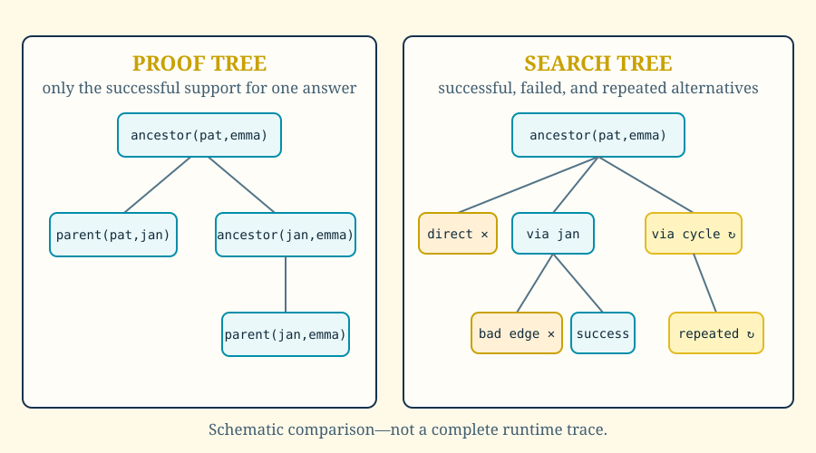
  <figcaption>The proof explains why an answer holds; the search tree explains the work needed to discover that proof.</figcaption>
</figure>

The distinction also explains why explanations are not performance profiles.
Removing a failed branch can make a program dramatically faster without
changing the final `why/2` term. Conversely, introducing a well-named helper
may make a proof longer on paper while making it far clearer to a reader.

When a program is slow, sketch the first few levels of its search tree. Mark:

1. the selected leftmost goal;
2. the clauses or built-ins that can solve it;
3. bindings produced by each choice;
4. the next selected goal;
5. branches that repeat a previous call.

This exercise often reveals that the model is sound but a generator is too
broad, a constraint is too late, or a witness carries needless alternatives.

**Checkpoint.** Take one clause and write two notes beside it: its ground
meaning and its intended mode. Reorder two body goals, predict whether the
answer set, termination, first answer, or proof shape changes, and only then
run the variant.

## 18. Constructing a program

A good logic program is rarely discovered by typing clauses from top to
bottom. It is constructed by moving between examples, relations, and
invariants.

<figure>
  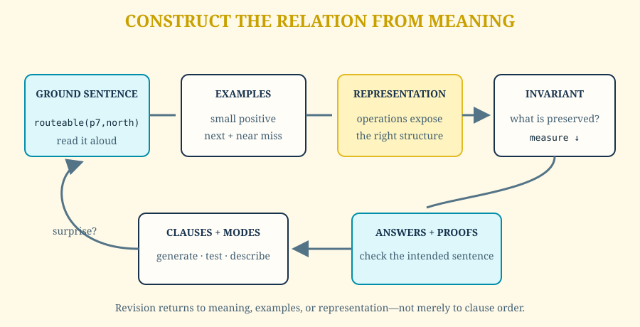
  <figcaption>Construction begins with meaning and examples, chooses a representation that exposes an invariant, and lets surprising answers send the design back to the right layer.</figcaption>
</figure>

### Begin with ground sentences

Suppose packages must be routed through compatible hubs. Start with sentences
that contain no variables:

```eyeprolog

:- use_module(library(lists)).

routeable(parcel_7, hub_north).
```

Decide exactly what that sentence claims. Does it mean the parcel can enter
the hub, can leave it, or can complete an entire route through it? Ambiguity in
a ground sentence becomes ambiguity in every rule built on it.

Now name the evidence:

```eyeprolog

:- use_module(library(lists)).

routeable(Parcel, Hub) :-
  destination_zone(Parcel, Zone),
  serves(Hub, Zone),
  package_class(Parcel, Class),
  accepts(Hub, Class).
```

The variables express the joins already present in the English explanation.
No variable should appear merely because “a value might be needed later.”
Every repeated variable asserts identity; every distinct variable permits
difference.

### Invent examples before recursion

For a recursive relation, write the smallest positive example, the next larger
positive example, and a near miss. For list prefixes:

```text
prefix([], [a,b])          true
prefix([a], [a,b])         true
prefix([b], [a,b])         false
```

The empty example suggests the base clause. Comparing the second example with
a smaller one suggests removing a matching head from both lists:

```eyeprolog
prefix([], _).
prefix([X | Xs], [X | Ys]) :- prefix(Xs, Ys).
```

This is a general construction method: find a measure that becomes smaller,
preserve the invariant while reducing it, and state directly the case where
no reduction is needed.

### Separate generate, test, and describe

Finite combinatorial programs become easier to read when their jobs are
separate:

```eyeprolog
candidate_pair(A, B) :-
  person(A),
  person(B).

compatible_pair(A, B) :-
  candidate_pair(A, B),
  (A \= B),
  \+ conflict(A, B).

answer(pair(A, B)) :- compatible_pair(A, B).
```

`candidate_pair/2` states the domain. `compatible_pair/2` states the
constraints. `answer/1` controls presentation. The split is not bureaucratic:
it makes the closed domain visible, gives negation bound arguments, and makes
proofs say whether a step generated or rejected a choice.

For performance, tests may be interleaved as soon as their inputs are ready:

```eyeprolog
compatible_pair(A, B) :-
  person(A),
  person(B),
  (A \= B),
  \+ conflict(A, B).
```

The conceptual separation remains even when the final clause is compact.

### Choose representations by the operations they support

The same domain can be represented in many ways. A graph may be edge facts, a
list of edge terms, or a context. Ask which questions dominate:

- Separate `edge/2` facts suit indexed relational lookup and proof provenance.
- A list suits passing a private, changing graph through a recursive helper.
- A compound state term suits transitions that replace several components.
- A comma context suits inspecting a small record whose fields are themselves
  structured assertions.

Do not encode structure into strings and then recover it throughout the
theory. Parse once at the boundary. A term such as
`address(City, PostalCode)` can be unified, inspected, and explained; a string
containing the same data needs repeated procedural parsing.

### Grow a theory through layers

Large rule sets benefit from a dependency direction:

```text
source facts → normalized facts → domain concepts → decisions → answers
```

Negation should normally point in the same direction, from a higher layer to a
complete lower layer. Cycles among positive domain concepts may be tabled;
cycles through negation usually signal that the concepts have not been given
a stable meaning.

At every layer, add one representative query. Do not wait for the final
decision predicate to discover that normalization silently failed. Small
queries are the logic-programming counterpart of inspecting intermediate
values, but they retain the declarative vocabulary of the model.

**Checkpoint.** Before writing rules for a small domain of your own, record
three positive ground examples, one near miss, the intended query mode, and a
candidate finite generator. If the ground sentences are ambiguous, revise the
predicate names before introducing variables.

## 19. Correctness and termination

Testing examples is necessary, but a reusable relation deserves a stronger
argument. Two questions should be asked separately:

<figure>
  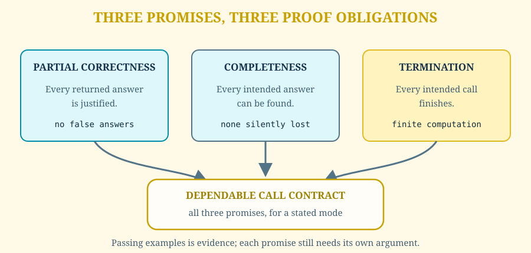
  <figcaption>Partial correctness, completeness, and termination are independent promises; a dependable intended call needs all three.</figcaption>
</figure>

1. **Partial correctness:** if the program returns an answer, is it justified?
2. **Completeness:** for the intended finite calls, can it find every answer
   required by the specification?

For `prefix/2`, partial correctness follows from the clauses by induction. The base clause
returns only the empty prefix. The recursive clause adds the same head to a
smaller valid prefix, so the result remains a prefix. Completeness follows in
the opposite direction: every nonempty prefix shares its first element with
the whole list, and removing that element yields a smaller prefix problem
covered by the recursive clause.

This informal induction is often enough. State the property, justify each base
clause, assume recursive calls satisfy it, and show that each recursive clause
preserves it.

### Termination needs its own argument

A correct relation may still fail to return. For ordinary structural recursion,
identify a well-founded measure:

- length of the remaining list;
- a nonnegative integer that decreases;
- number of unvisited states in a finite graph;
- size of a syntax tree.

The measure must decrease before the recursive call in the intended mode. For
factorial, `N` decreases while remaining a nonnegative integer:

```eyeprolog
factorial(0, 1).
factorial(N, F) :-
  (N > 0),
  (Previous is N - 1),
  factorial(Previous, PF),
  (F is N * PF).
```

Reordering the subtraction after the recursive call preserves a mathematical
equation but destroys the termination argument.

Tabling changes the argument for graph recursion. A cyclic `path/2` call can
terminate when the program has only finitely many distinct tabled calls and
answers. The measure is then not necessarily smaller at each edge; finiteness
comes from exhausting a finite answer space. Tabling cannot rescue a rule that
constructs `s(s(s(...)))` without bound.

### Negation and aggregation require bounded subsearch

`\+ Goal` and aggregates ask the engine to settle a nested search. Their
meaning is usable only when that search can finish. Before
writing:

```eyeprolog
\+ disqualified(Person)
```

check that `Person` is bound and that `disqualified/1` has a finite search for
that value. Before collecting routes, decide whether only simple routes, only
routes below a cost, or some other finite family is intended.

### Integrity is not merely failure

Ordinary failure says that one attempted proof did not work. An explicit
integrity relation can instead return the evidence for an invalid state:

```eyeprolog
invalid_limits(Name, Low, High) :-
  lower_limit(Name, Low),
  upper_limit(Name, High),
  (Low > High).
```

This distinction matters operationally and socially. A failed eligibility
query may be a legitimate negative result. A successful `invalid_limits/3`
query identifies contradictory limits; the host can then stop decisions until
the input is repaired.

**Checkpoint.** For one recursive relation, state three claims separately:
partial correctness, completeness in one intended mode, and termination in
that mode. Give the invariant supporting the first two and the decreasing
measure or finite table supporting the third.

## 20. Improving a program

Program improvement begins with observation, not cleverness. Preserve a set of
representative answers and proofs, collect solver statistics, and change one
structural choice at a time.

### Strengthen calls before adding machinery

The most effective improvement is often a better question. Prefer
`route(brussels, Destination)` to a completely open enumeration if the
application already knows its origin. Put selective, indexed relations early
enough to bind arguments for later work. Avoid constructing a large witness
when the caller needs only existence.

Compare:

```eyeprolog
connected(X, Y) :- path_with_nodes(X, Y, _).
```

with a direct reachability relation that tables pairs. The first may enumerate
many distinct paths to establish one fact; the second records the fact itself.
Keep the witness-producing relation for callers that truly need a path.

### Introduce helpers that express invariants

Inlining every condition creates wide clauses with repeated work. A helper can
name a stable concept:

```eyeprolog
within_thermal_limits(Battery) :-
  temperature(Battery, T),
  temperature_limit(Max),
  (T =< Max).
```

The gain is not just reuse. Proofs now contain a domain statement, and later
changes to the limit policy have one home. Choose helpers that add vocabulary;
avoid names such as `step2/3` that merely expose an implementation sequence.

### Move invariant work outward

If a recursive call repeatedly computes a value that does not change, compute
it once and pass the result:

```eyeprolog
search(Request, Answer) :-
  normalized_request(Request, Normalized),
  search_normalized(Normalized, initial_state, Answer).
```

This resembles loop-invariant code motion in procedural programming, but the
relational formulation is explicit: the helper's arguments show exactly which
values vary from step to step.

### Preserve meaning while changing control

Reordering goals, adding a helper, or specializing a predicate should preserve
the intended ground answers. Verify that with:

- ordinary positive examples;
- cases expected to fail;
- duplicate derivations;
- boundary numeric values;
- cyclic data;
- proof premises, not only printed conclusions.

An optimization that changes which proof is found first may affect `once/1`,
tie-breaking aggregates, and explanation shape even when the answer set is
unchanged. Treat those observable choices as part of the calling contract
whenever users depend on them.

### Know when to stop

Not every relation should be made maximally general. A three-mode predicate can
be harder to terminate, explain, and index than two simple predicates with
clear contracts. Generalize when a real second use appears. The art lies in
keeping the logical idea visible while giving it enough control to run well.

**Checkpoint.** Save representative answers, one proof, and solver statistics
for a program. Make exactly one control change, rerun all three views, and
classify every difference as intended, harmless but observable, or a
regression.

## Part IV summary

Part IV treated logic programming as a discipline of construction:

- write the relation's sentence before choosing its control;
- record intended modes and finite uses;
- begin with ground examples and invent recursion from one proof;
- choose representations by the operations and invariants they expose;
- argue correctness, completeness, and termination separately;
- improve programs by strengthening calls and naming invariants;
- preserve answers while reviewing observable proof or ordering changes.

You should now be able to construct a theory from examples, state a termination
measure, refactor a helper without losing meaning, and recognize when greater
relational generality has no practical use.

### Historical note: logic plus control

Kowalski's 1979 formulation “algorithm = logic + control” gave a durable name
to the dual reading developed here. The logic component specifies knowledge;
control determines how it is used. The slogan did not claim that control was
unimportant. It argued that control can often be improved while meaning stays
steady, and that programs become easier to reason about when the two are
distinguished.

The craft tradition of Prolog grew around this tension. Goal ordering,
accumulators, generate-and-test, and representation change were never merely
interpreter tricks. At their best they were transformations justified by
invariants and modes. Sterling and Shapiro made construction and improvement
central to *The Art of Prolog*, showing that declarative clarity and
procedural competence mature together.

EyeProlog keeps ISO cut, but Chapter 34 disciplines it: it commits only within
the clause that contains it, never across a disjunction branch or a
meta-call's own boundary, and it is presented as a last resort next to
`once/1` and if-then-else. That discipline changes the techniques but not the
problem: authors must still turn a true relation into a productive computation
and say what was preserved.

# Part V — Advanced relational design

<figure>
  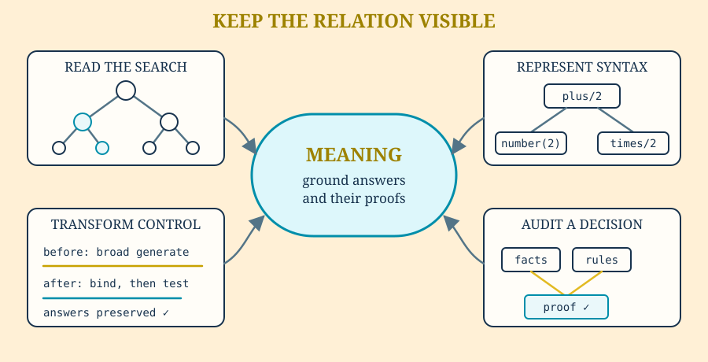
  <figcaption>Advanced design keeps meaning at the center while search is inspected, syntax is represented, control is transformed, and decisions remain auditable.</figcaption>
</figure>

The earlier parts introduced the supported Prolog profile and the habits needed to use it
safely. This part stays longer with whole computations. It asks how to inspect
a search tree, represent languages and evaluators as relations, transform a
correct program without losing its meaning, and organize a decision system
whose conclusions remain auditable.

EyeProlog supplies the Part 1 control, dynamic-database, operator, and I/O
facilities together with its normal-profile module forms `module/2`,
`use_module/1`, `use_module/2`, `meta_predicate/1`, and `Module:Goal`. The
requirements clarified by the 2013 ISO/IEC 13211-2 module amendment are covered
by a dedicated release-gated suite, including public imports through
`ensure_loaded/1` and caller-module qualification of `:` meta-arguments. The
unchanged remainder of Part 2 is still treated as a compatibility surface, not
as a claim of complete ISO/IEC 13211-2:2000 conformance. Definite-clause grammar notation is
also part of the normal profile, though the running examples have avoided it so far;
Chapter 22 introduces it explicitly rather than assuming it. The examples still prefer
explicit domain relations, state, and syntax trees where that makes assumptions easier to
inspect.

## 21. Reading the computation

A query is not solved in one leap. It is reduced to goals, each goal is matched
against candidate clauses, and each successful match contributes bindings and
new subgoals. The computation has two kinds of branching:

- an **and** step, because every goal in a rule body must succeed;
- an **or** step, because any matching clause may establish a goal.

This and–or structure is the operational counterpart of the program's logical
structure. A conjunction asks for several supporting claims; multiple clauses
offer alternative justifications.

```eyeprolog
parent(ada, byron).
parent(byron, clara).
parent(clara, diego).

ancestor(X, Y) :- parent(X, Y).
ancestor(X, Z) :- parent(X, Y), ancestor(Y, Z).
```

```sh
eyeprolog --goal 'ancestor(ada, Who)' program.pl
```

For `ancestor(ada, Who)`, the first clause asks
`parent(ada, Who)` and produces `Who = byron`. The second clause asks two
questions in sequence. `parent(ada, Y)` first binds `Y = byron`; the remaining
call is therefore `ancestor(byron, Who)`. That call repeats the choice between
a direct-parent proof and a longer proof.

The three answers occupy increasing depths of one proof family:

```text
ancestor(ada, byron)
  parent(ada, byron)

ancestor(ada, clara)
  parent(ada, byron)
  ancestor(byron, clara)
    parent(byron, clara)

ancestor(ada, diego)
  parent(ada, byron)
  ancestor(byron, diego)
    parent(byron, clara)
    ancestor(clara, diego)
      parent(clara, diego)
```

Drawing even a partial tree exposes errors that are hard to see in source
alone: a variable that should have been shared, a recursive call that did not
consume input, or a generator placed after the test that needs its output.

<figure>
  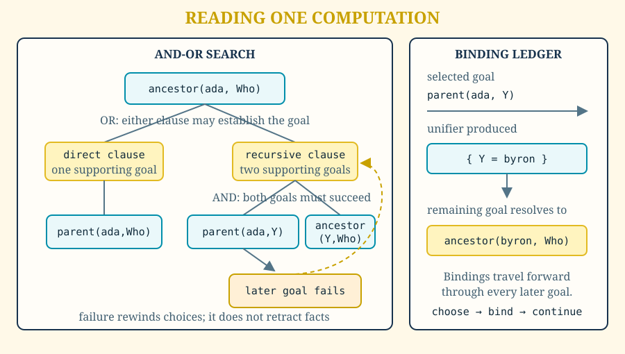
  <figcaption>Search alternates between choices and conjunctions; substitutions flow forward, while failure returns to the latest unfinished choice.</figcaption>
</figure>

### Substitutions accumulate

A substitution is a set of bindings carried through the remaining goals.
Bindings are not local return values. If the first goal binds a variable, every
later occurrence of that variable sees the same term:

```eyeprolog
grandparent(X, Z) :-
  parent(X, Y),
  parent(Y, Z).
```

Solving `grandparent(ada, Z)` begins with `parent(ada, Y)`. Once that goal
binds `Y` to `byron`, the second goal is the selective
`parent(byron, Z)`.

Repeated variables impose equality through unification:

```eyeprolog

:- use_module(library(lists)).

loop_edge(Node) :- edge(Node, Node).
```

This does not find an arbitrary edge and compare its endpoints later. The
shared variable makes equal endpoints part of the pattern being matched.

### Failure rewinds choices, not facts

Suppose a later goal fails:

```eyeprolog

:- use_module(library(lists)).

eligible(Person) :-
  applicant(Person),
  age(Person, Age),
  (Age >= 18),
  verified(Person).
```

Failure of `verified(Person)` rejects the current combination of bindings.
Search may return to another `age/2` fact or another applicant clause. It does
not retract source facts or erase answers already printed. Backtracking is
better understood as exploring alternatives than as undoing the world.

### Variants, cycles, and tables

Recursive graph search can encounter the same logical subquestion through
different paths. Calls that differ only in variable names are **variants**:
`path(a, X)` and `path(a, Y)` pose the same pattern. Positive recursive groups
can table such patterns, share their answers, and stop a cycle from expanding
the same question forever.

The table does not prove termination for every recursive program. If each call
constructs a larger pattern, then the calls are not variants:

```eyeprolog
grows(X) :- grows(wrapper(X)).
```

`grows(A)`, `grows(wrapper(A))`, and
`grows(wrapper(wrapper(A)))` are distinct calls. Remembering them does not
make their number finite.

### A practical tracing discipline

When a query surprises you, write down:

1. the selected goal;
2. its current resolved arguments;
3. the candidate clause;
4. the unifier produced by the head;
5. the new body goals;
6. the point to which failure would return.

Compare that hand trace with `--proof` for a successful answer and `--stats`
for the amount of search. Proofs explain one successful derivation; statistics
summarize work across successful and failed branches. Neither is a complete
trace, but together they usually locate the modeling issue.

**Exercises.**

1. Draw the and–or tree for `ancestor(byron, Who)`.
2. Add a second parent of `clara` and identify where the tree branches.
3. Write a cyclic `edge/2` graph and compare reachability answers with the
   table rounds reported by `--stats`.
4. Construct a recursive rule whose call grows a list on every step. Explain
   why variant tabling does not make its call space finite.

**Checkpoint.** Hand-trace one successful answer and one failed branch using
the six-item tracing discipline. Compare the successful trace with `--proof`
and the total work with `--stats`; state one fact that each view omits.

## 22. Trees, languages, and symbolic evaluation

Compound terms are finite trees. A functor labels an internal node and its
arguments are the children. Lists are one familiar tree encoding, but syntax,
plans, types, circuits, formulas, and organizational structures can all be
represented directly.

```eyeprolog
tree(
  oak,
  tree(birch, empty, empty),
  tree(pine, empty, empty)
).
```

A structural relation follows the representation:

```eyeprolog

:- use_module(library(lists)).

tree_member(X, tree(X, _, _)).
tree_member(X, tree(_, Left, _)) :- tree_member(X, Left).
tree_member(X, tree(_, _, Right)) :- tree_member(X, Right).
```

The clauses say where a member may occur. They also define a search order:
root, then left subtree, then right subtree. If only membership matters, that
order is an implementation choice. If a caller uses `once/1`, it becomes
observable.

<figure>
  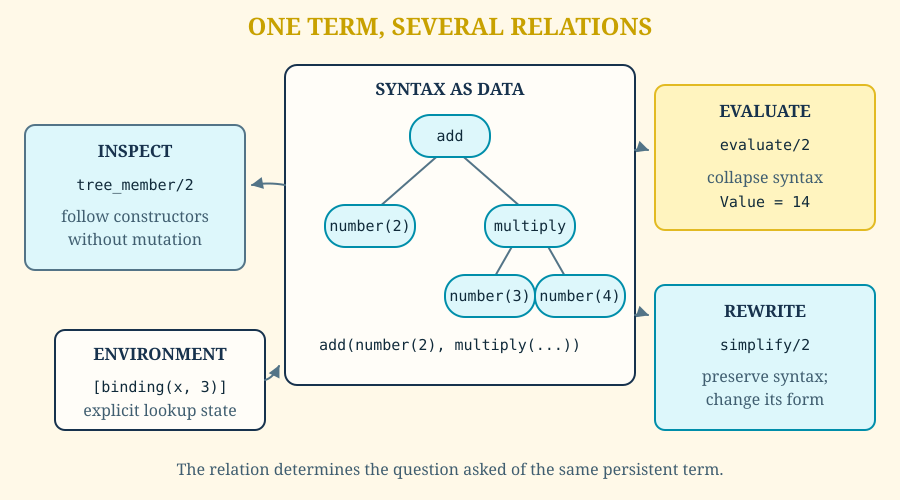
  <figcaption>A compound term remains persistent data; different relations inspect, evaluate, or rewrite it according to the question being asked.</figcaption>
</figure>

### Transforming a tree

```eyeprolog
mirror(empty, empty).
mirror(
  tree(Value, Left, Right),
  tree(Value, MirroredRight, MirroredLeft)
) :-
  mirror(Left, MirroredLeft),
  mirror(Right, MirroredRight).
```

Read forward, `mirror/2` constructs a mirror. With both trees ground, it
verifies the relationship. In some partially bound modes it can fill missing
structure. The rule does not mutate a tree; it relates two persistent terms.

The representation exposes an invariant: mirroring preserves every node value
and exchanges left and right at every level. It also suggests a structural
induction. The empty tree is its own mirror; if both recursive calls are
correct, the constructed parent is correct.

### A standard definite clause grammar

ISO/IEC TS 13211-3 definite clause grammar rules describe a sequence while the
processor supplies the pair of difference-list arguments used for execution:

```eyeprolog
sentence --> noun_phrase, verb_phrase.

noun_phrase --> [the], noun.
noun_phrase --> [a], noun.

noun --> [robot].
noun --> [scientist].

verb_phrase --> verb, noun_phrase.

verb --> [helps].
verb --> [observes].

complete_sentence(Words) :- phrase(sentence, Words).
```

```sh
eyeprolog --goal 'complete_sentence([the, robot, helps, a, scientist])' program.pl
```

The expansion of `sentence//0` is an ordinary `sentence/2` relation: its first
extra argument is the sequence before parsing and its second is the suffix.
Composition shares the suffix from `noun_phrase//0` with the input to
`verb_phrase//0`. `phrase/2` requires complete consumption; `phrase/3` exposes
the remaining sequence.

The same relation can be a bounded generator when vocabulary and output length
are constrained by surrounding relations. An unconstrained
`complete_sentence(Words)` call can generate sentences of unbounded length if
the grammar is recursive. A grammar is also a search program, so its intended
modes need the same termination analysis as other recursive relations.

### Interpreting an expression

Syntax trees separate the expression from the act of evaluating it:

```eyeprolog
evaluate(number(N), N).

evaluate(add(Left, Right), Value) :-
  evaluate(Left, L),
  evaluate(Right, R),
  (Value is L + R).

evaluate(multiply(Left, Right), Value) :-
  evaluate(Left, L),
  evaluate(Right, R),
  (Value is L * R).
```

```sh
eyeprolog --goal 'evaluate(
    add(number(2), multiply(number(3), number(4))),
    Value
  )' program.pl
```

The value is `14`. More importantly, the proof follows the syntax tree: two
literal evaluations support one multiplication and one addition.

An extension can add variables and an explicit environment:

```eyeprolog

:- use_module(library(lists)).

lookup(Name, [binding(Name, Value) | _], Value).
lookup(Name, [_ | Rest], Value) :- lookup(Name, Rest, Value).

evaluate(variable(Name), Environment, Value) :-
  lookup(Name, Environment, Value).
```

Passing the environment as data avoids hidden global state. Shadowing is
determined by list order and should be documented as part of `lookup/3`.

### Rewriting symbolic expressions

Evaluation collapses syntax to a value. Rewriting preserves syntax while
replacing one form with an equivalent or preferred form:

```eyeprolog
simplify(add(number(0), X), X).
simplify(add(X, number(0)), X).
simplify(multiply(number(1), X), X).
simplify(multiply(X, number(1)), X).

simplify(add(A, B), add(SA, SB)) :-
  simplify(A, SA),
  simplify(B, SB).
```

Overlapping rules can produce several answers. That may be desirable when
exploring equivalent forms, but a normalizer needs a strategy and termination
measure. A rule that expands `X` to `add(X, number(0))` reverses the first
simplification and permits unbounded rewriting.

**Exercises.**

1. Define `tree_size/2` and `tree_height/2`.
2. Extend the grammar with adjectives while preserving the input/suffix
   contract.
3. Add subtraction to the evaluator and state which arguments must be ground.
4. Define constant folding for `add(number(A), number(B))`.
5. Explain why individually sensible rewrite rules may fail to terminate when
   repeatedly combined.

**Checkpoint.** For one compound term, label the object-language syntax, the
EyeProlog relation that inspects it, and the environment or state used to interpret
it. Then identify a rewrite pair that would create a cycle if both directions
were enabled.

## 23. Transforming programs

Program transformation changes clauses while attempting to preserve an
intended relation. The useful question is not merely “does the new version
run?” but “for which calls does it preserve answers, termination, answer
order, and explanations?”

Four transformations recur in logic programs:

- **unfolding** replaces a call by the bodies of its defining clauses;
- **folding** names a repeated conjunction with a helper relation;
- **specialization** fixes known arguments and removes irrelevant choices;
- **accumulation** carries a partial result through recursion.

Each can improve control or reveal structure. Each can also change modes,
duplicate work, or alter proof shape.

<figure>
  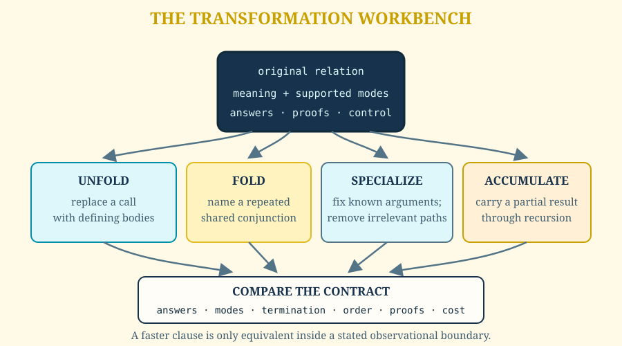
  <figcaption>Transformation is a controlled experiment: change the clauses, then compare meaning, supported modes, termination, proof shape, and cost.</figcaption>
</figure>

### Unfolding and folding

Start with:

```eyeprolog

:- use_module(library(lists)).

adult(Person) :-
  recorded_age(Person, Age),
  adult_age(Age).

adult_age(Age) :- (Age >= 18).
```

Unfolding `adult_age/1` gives:

```eyeprolog

:- use_module(library(lists)).

adult(Person) :-
  recorded_age(Person, Age),
  (Age >= 18).
```

For this deterministic helper, the ground answers are unchanged. The shorter
proof loses the named concept `adult_age/1`, however. That loss may be
undesirable in an auditable policy even if execution becomes slightly cheaper.
If a helper has several clauses, unfolding produces one caller clause for each
alternative. If it is recursive, unrestricted unfolding may never finish.

Folding moves in the other direction. Suppose decisions repeat:

```eyeprolog

:- use_module(library(lists)).

can_board(Person) :-
  registered(Person),
  identity_checked(Person),
  \+ suspended(Person),
  has_ticket(Person).

can_enter_lounge(Person) :-
  registered(Person),
  identity_checked(Person),
  \+ suspended(Person),
  lounge_pass(Person).
```

Name the shared concept:

```eyeprolog

:- use_module(library(lists)).

traveler_in_good_standing(Person) :-
  registered(Person),
  identity_checked(Person),
  \+ suspended(Person).

can_board(Person) :-
  traveler_in_good_standing(Person),
  has_ticket(Person).

can_enter_lounge(Person) :-
  traveler_in_good_standing(Person),
  lounge_pass(Person).
```

The helper is valuable because it has a stable meaning, not merely because
three lines became one. It creates one place to state and test the closed-world
assumption behind `\+ suspended(Person)`.

### Specializing a relation

A general transport database may use:

```eyeprolog
connection(Mode, From, To, Cost).
```

An application that only plans rail journeys can define:

```eyeprolog
rail_connection(From, To, Cost) :-
  connection(rail, From, To, Cost).
```

This wrapper establishes a stronger contract and gives indexing a bound first
argument. Deeper specialization can precompute invariant classifications or
remove irrelevant branches. Keep the general relation as the specification
against which specialized answers are compared.

### Accumulators and modes

A direct list sum performs work after recursion:

```eyeprolog
sum_numbers([], 0).
sum_numbers([X | Xs], Sum) :-
  sum_numbers(Xs, Rest),
  (Sum is X + Rest).
```

An accumulator makes the partial sum explicit:

```eyeprolog
sum_numbers_acc(List, Sum) :- sum_from(List, 0, Sum).

sum_from([], Accumulator, Accumulator).
sum_from([X | Xs], Accumulator, Sum) :-
  (Next is Accumulator + X),
  sum_from(Xs, Next, Sum).
```

For a ground numeric list, both versions return the same sum. They do not have
identical relational behavior in every mode. The accumulator version requires
each intermediate addition to be ready on the way down. State the intended
mode instead of claiming unconditional equivalence.

### A transformation checklist

Before replacing one definition with another, record:

1. the intended ground relation;
2. supported binding patterns;
3. a termination measure for each supported pattern;
4. whether duplicates and answer order matter;
5. whether callers inspect proof structure;
6. representative positive, negative, and boundary queries.

Then compare both versions. `--stats` can show fewer calls or unifications, but
performance evidence comes after semantic evidence. A faster program that
silently drops a mode is a different program. Predicate and inference counts are
also not reliable substitutes for elapsed time: one expensive host call can cost
more than thousands of cheap Prolog calls. Repository-level performance work
therefore uses `npm run benchmark`, which measures median wall-clock parse+execute
time over representative workloads and rejects any run whose answer checksum no
longer matches the committed result.

**Exercises.**

1. Unfold a two-clause helper and count the resulting caller clauses.
2. Fold repeated validation conditions in two rules of your own.
3. Specialize a generic graph relation for one edge type.
4. Compare direct and accumulator-based length relations in several modes.
5. Find a transformation that preserves answers but changes the first proof
   selected by `once/1`.

**Checkpoint.** Choose one original and transformed relation. Compare their
answer sets in both directions over a finite domain, then separately compare
termination, answer order, duplicates, proof shape, and solver statistics.

## 24. Designing finite search

Nondeterminism is not randomness. A nondeterministic relation defines several
legitimate continuations, and search systematically explores them. The design
problem is to make useful alternatives complete while keeping their number
finite and their order productive.

<figure>
  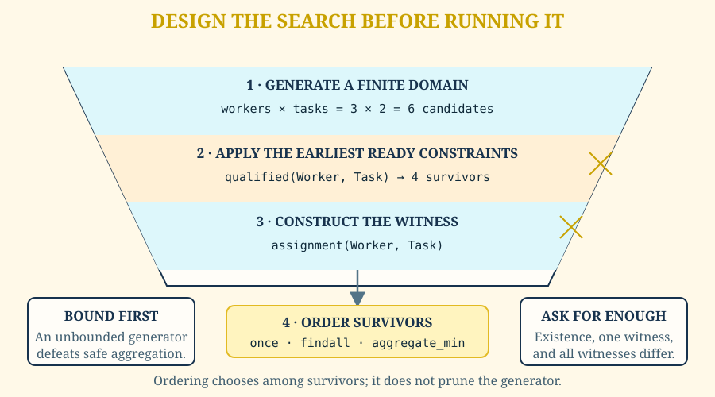
  <figcaption>Finite search is designed from the top down: bound generation, prune with ready constraints, preserve the witness, then order only the survivors.</figcaption>
</figure>

### Generate, constrain, describe

A clear search program often has three layers:

1. generate a candidate from a finite domain;
2. constrain the candidate;
3. describe or score the surviving witness.

```eyeprolog
worker(ada).
worker(byron).
worker(clara).

task(inspect).
task(repair).

qualified(ada, inspect).
qualified(byron, repair).
qualified(clara, inspect).
qualified(clara, repair).

assignment(Worker, Task) :-
  worker(Worker),
  task(Task),
  qualified(Worker, Task).
```

```sh
eyeprolog --goal 'assignment(Worker, Task)' program.pl
```

`worker/1` and `task/1` make the search space explicit. `qualified/2` is both a
constraint and a selective relation. If the application knows the task,
calling `assignment(Worker, repair)` avoids generating irrelevant task values.

### Search over states

A state-space problem needs a state term, a finite move relation, a goal test,
a policy for repeated states, and a witness representation. A simple graph
path carries visited nodes:

```eyeprolog

:- use_module(library(lists)).

simple_path(From, To, Path) :-
  walk(From, To, [From], Reversed),
  reverse(Reversed, Path).

walk(To, To, Visited, Visited).
walk(From, To, Visited, Path) :-
  edge(From, Next),
  \+ member(Next, Visited),
  walk(Next, To, [Next | Visited], Path).
```

The visited list makes the witness finite on a finite graph. It also changes
the question from arbitrary walks to simple paths. That is a modeling choice,
not merely an optimization. A caller asking for repeated stops needs another
bound, such as maximum steps or cost.

### Existence, one witness, and all witnesses

These questions have very different costs:

```eyeprolog

:- use_module(library(lists)).

reachable(From, To).
once(simple_path(From, To, Path)).
findall(Path, simple_path(From, To, Path), Paths).
```

Reachability needs only a pair and is a good candidate for tabling. One path
may stop after the first witness. All simple paths may be exponentially
numerous even though the graph is finite. Choose the weakest result that meets
the caller's need.

### Optimization is search plus an order

An optimal answer requires a finite candidate relation and a comparison key:

```eyeprolog
:- use_module(library(aggregate)).
:- use_module(library(lists)).

best_plan(Request, Plan, Cost) :-
  aggregate_min(
    [CandidateCost, CandidatePlan],
    CandidatePlan,
    candidate_plan(Request, CandidatePlan, CandidateCost),
    [Cost, Plan],
    Plan
  ).
```

The structured key makes ties deterministic. It does not reduce the candidate
space: `aggregate_min/5` must settle the nested search before knowing the
minimum. For a large problem, strengthen `candidate_plan/3` or use a
domain-specific dynamic program instead of assuming aggregation performs
branch-and-bound.

### Fairness and depth-first search

Depth-first clause search can become trapped in an infinite branch before
reaching a later finite proof. Base cases should be reachable before recursive
expansion, and recursive steps should consume a finite resource or enter a
finite table. When neither is possible, the query is outside the practical
contract of the relation.

Multiple clauses normally mean that any or all may yield legitimate answers.
`once/1` turns the first success into a don't-care choice: later alternatives
are intentionally discarded. Use it only when selection order is an accepted
part of the specification.

**Exercises.**

1. Add skills and time slots to the assignment example.
2. Modify `simple_path/3` to return accumulated cost.
3. Compare reachability, one path, and all paths on a diamond-shaped graph.
4. Give a finite candidate relation for which `aggregate_min/5` still performs
   an impractically large search.
5. Construct a recursive first clause that starves a valid later base clause,
   then repair its control.

**Checkpoint.** Write down the size of a candidate space before running its
search. Name the generator, the earliest ready constraint, the witness, and
the ordering used for optimization. If the size cannot be bounded, the design
is not yet ready for aggregation.

## 25. Case study: an auditable decision service

This case study develops a small access decision from prose to an executable,
explainable theory. The purpose is the sequence of design decisions that turns
informal requirements into maintainable relations.

<figure>
  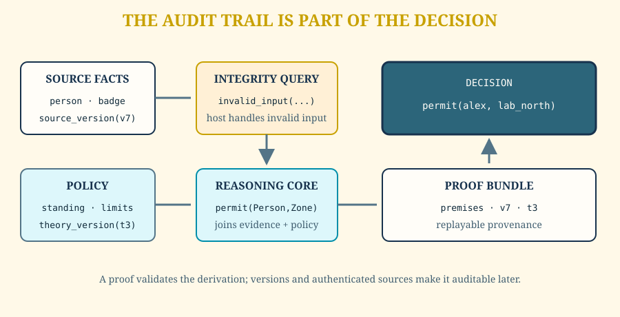
  <figcaption>An auditable service keeps source and theory versions attached to the premises, blocks invalid input at an integrity gate, and returns the decision with replayable provenance.</figcaption>
</figure>

### Requirements and questions

A research facility says:

- a person may enter a zone when their badge is active;
- the badge must grant the zone's required clearance;
- required training must be current;
- an explicit suspension blocks entry;
- contradictory badge records invalidate the decision service;
- every permit should carry a reason traceable to source facts.

Before coding, identify ambiguities. Is the badge registry complete? Is missing
training evidence a denial or unknown? Can a person have several active badges?
Which clock determines “current”? A rule engine cannot remove these choices;
it can only make the chosen answers precise.

### Source and concept layers

Represent observations without embedding decisions:

```eyeprolog

:- use_module(library(lists)).

person(ada).
badge(b17, ada).
badge_status(b17, active).
badge_clearance(b17, laboratory).
zone_requires(clean_room, laboratory).
training_valid(ada, clean_room).
```

The badge identifier remains explicit. Collapsing it into
`active_badge(ada)` would hide the record used as evidence and make conflicting
records harder to detect.

Build vocabulary that reads like the policy:

```eyeprolog

:- use_module(library(lists)).

active_badge(Person, Badge) :-
  badge(Badge, Person),
  badge_status(Badge, active).

cleared_for(Badge, Zone) :-
  badge_clearance(Badge, Clearance),
  zone_requires(Zone, Clearance).

prepared_for(Person, Zone) :-
  training_valid(Person, Zone).
```

Each helper has one responsibility. A proof of `cleared_for/2` names both the
badge clearance and zone requirement rather than burying their join in a wide
decision clause.

### Closed-world choice

If the suspension list is authoritative and complete, absence can be used:

```eyeprolog
in_good_standing(Person) :-
  person(Person),
  \+ suspended(Person).
```

If it is incomplete, this rule is unsound as policy. Replace it with a positive
source claim such as `standing(Person, good)`. The difference is an agreement
about the knowledge boundary, not a matter of syntax.

### Decision, reasons, and proof

```eyeprolog

:- use_module(library(lists)).

permit(Person, Zone) :-
  active_badge(Person, Badge),
  cleared_for(Badge, Zone),
  prepared_for(Person, Zone),
  in_good_standing(Person).

reason(Person, Zone, badge_and_training_verified) :-
  permit(Person, Zone).
```

```sh
eyeprolog --goal 'permit(Person, Zone)' program.pl
eyeprolog --goal 'reason(Person, Zone, Reason)' program.pl
```

`reason/3` supplies a stable user-facing summary. With `--proof`, the same
answer carries its detailed derivation. These are complementary: the reason is
domain vocabulary, while the proof records actual clauses and bindings.

### Integrity before decisions

Contradictory badge states are exposed by an explicit validation relation:

```eyeprolog
incompatible_status(active, revoked).
incompatible_status(revoked, active).

invalid_badge_status(Badge, Status, Other) :-
  badge_status(Badge, Status),
  incompatible_status(Status, Other),
  badge_status(Badge, Other).
```

This result does not say that one permit failed. It identifies input that is
unfit for a trusted decision. The host can query `invalid_badge_status/3` before
permit goals, alongside checks for a badge assigned to two people or a zone
with incompatible clearance definitions.

### Tests are policy examples

A useful test set includes an ordinary permit, missing training, suspension,
insufficient clearance, duplicate derivations, contradictory status, and a
proof showing the exact badge and training facts.

Boundary examples reveal requirements. If a person has two valid badges,
should there be one permit with two derivations or two permit terms containing
the badge? `permit(Person, Zone)` chooses one ground decision with potentially
several proofs. If badge identity belongs in the answer, define
`permit(Person, Zone, Badge)`.

### Embedding and audit

Authenticate source systems in the host, convert records to EyeProlog facts, run
the theory, and store the answer with its proof and input version. The solver
can explain logical support; it cannot attest that a badge database was current
or a training provider trustworthy.

```text
authenticated source snapshot
  -> normalized EyeProlog facts
  -> checked theory
  -> permit and reason
  -> proof referencing clauses and facts
```

When policy changes, preserve old inputs, theory versions, and proofs so a past
decision can be reconstructed under the rules that actually governed it.

**Exercises.**

1. Add time-bounded training using explicit dates and `difference/3`.
2. Model `denial/3` without assuming every failed permit has the same reason.
3. Add a two-person escort rule and identify duplicate-proof cases.
4. Write an integrity relation for badges assigned to multiple people.
5. Define the validation the host must perform before supplying badge facts.
6. Run the case with `--proof` and decide which helpers improve the explanation.

**Checkpoint.** Reconstruct one permit decision from a preserved source
snapshot, theory version, answer, and proof. Mark which step authenticates the
source, which checks integrity, which derives the decision, and which merely
stores evidence for later audit.

## Part V summary

Part V followed whole computations rather than isolated features:

- and–or trees expose conjunction, alternatives, failure, and repeated calls;
- explicit syntax trees support grammars, evaluators, and symbolic rewriting;
- unfolding, folding, specialization, and accumulators transform control under
  stated invariants;
- finite search needs a declared space, pruning argument, witness, and fairness
  expectation;
- an auditable service layers sources, concepts, integrity, decisions, reasons,
  embedding, and proof retention.

You should now be able to trace substitutions through several goals, represent
an object language without confusing it with the surrounding Prolog syntax, justify a bounded
program transformation, and design a reconstructable decision theory.

### Historical note: interpreters, transformation, and the art tradition

Logic programming became a laboratory for symbolic programming because its
principal data—terms, clauses, substitutions, and proof trees—could be
represented with the same structures used for ordinary domains.
Meta-interpreters made resolution itself a program topic; grammar rules made
language recognition relational; partial evaluation showed how a general
relation could be specialized when part of its input was known.

Futamura's work in the 1970s gave partial evaluation a striking interpretation:
specializing an interpreter with respect to a source program can produce a
compiled form. Logic-program transformation developed related practices of
unfolding, folding, and specialization. The inheritance for EyeProlog is not a
promise that every classic transformation is built in. It is the demand that a
transformation name its invariant and preserve a stated answer contract.

*The Art of Prolog* joined computation, construction, nondeterminism, grammars,
interpreters, transformation, and applications into a sustained account of
craft. Part V pays tribute to that breadth through EyeProlog's explicit subset:
syntax is data, state is an argument, and audit evidence remains visible.

---

# Part VI — Mathematics made executable

<figure>
  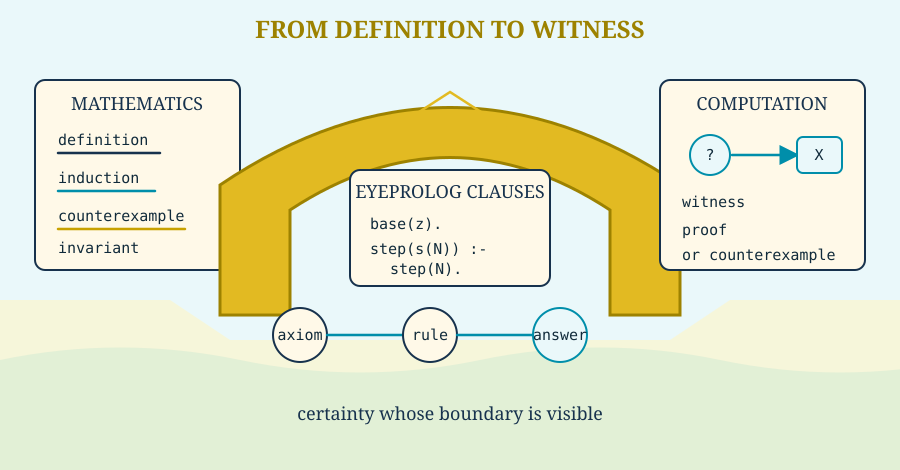
  <figcaption>Formal clauses form a bridge: definitions and invariants become computations that return witnesses, counterexamples, and inspectable proofs.</figcaption>
</figure>

This Part is a route, not a prerequisite for the reasoning laboratory. For a
short practical path, read Chapters 26, 27, and 29, then continue at Chapter
31. Read Chapters 28 and 30 as well when representation, formal scope, and the
limits of computation are central to your purpose.

Mathematics appears throughout this book as subject matter: arithmetic,
combinatorics, graphs, geometry, algebra, statistics, and physical models. But
its deeper presence is structural. A logic program is possible because parts
of mathematical reasoning can be represented as finite symbols, transformed
by explicit rules, and checked step by step.

In that qualified sense, the history of logic programming belongs inside the
history of mathematics. It inherits the mathematician's old practices of
definition, proof, construction, abstraction, and counterexample. It also
inherits the twentieth century's harder questions. What counts as a formal
proof? What is an effective procedure? Which truths follow from a finite set
of axioms? Which questions cannot be decided by any uniform mechanical method?

EyeProlog inherits a small, practical fragment of that tradition. It is not a
foundation for all mathematics, a computer algebra system, or an interactive
theorem prover. Its definite clauses cover only a disciplined fragment of logic.
Precisely because the fragment is small, however, one can see the ancient
mathematical acts inside the running machine:

| Mathematical act | EyeProlog form | Operational consequence |
| --- | --- | --- |
| Define a class | facts and clauses | enumerate its instances |
| Introduce an unknown | a variable | seek a substitution |
| Use a lemma | call a helper relation | open a subgoal |
| Split into cases | multiple clauses | create alternatives |
| Perform induction | base and recursive clauses | reduce to smaller calls |
| Construct a witness | bind an output term | return evidence, not only truth |
| Refute a universal guess | search for a counterexample | one answer is enough |
| Check consistency | an explicit integrity query | reject or report invalid input |
| Explain a conclusion | a proof term | expose the successful derivation |

The table is a correspondence, not an identity. A mathematical proof and an
EyeProlog execution answer different questions unless the encoding between them is
itself justified. This Part develops both the power and the limit of the
correspondence.

## 26. A proof can be a computation

For most of mathematical history, an algorithm and a proof could live close
together without being regarded as the same kind of object. Euclid's
algorithm computes a greatest common divisor, while Euclid's propositions
justify why the procedure works. A geometrical construction produces an
object, while an argument establishes that it has the required properties.
The distinction remains useful, but modern logic revealed increasingly exact
connections among a proposition, its proof, and the construction carried by
that proof.

<figure>
  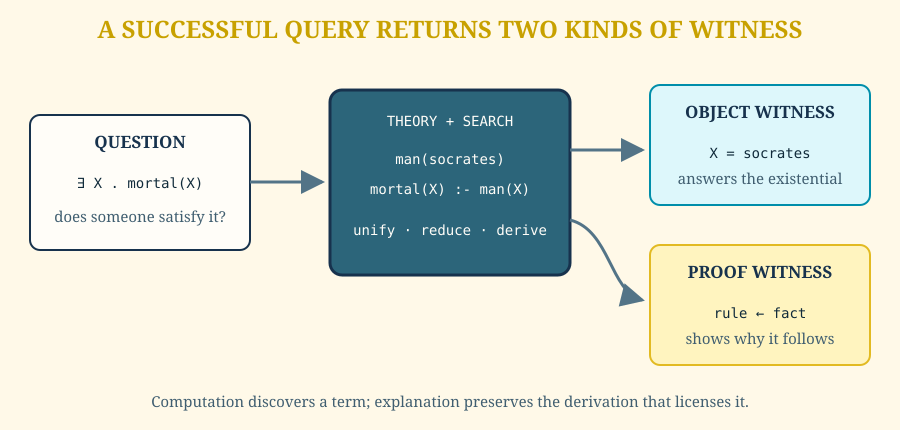
  <figcaption>A successful existential query returns an object that satisfies the claim and a derivation that explains why the theory licenses that object.</figcaption>
</figure>

Logic programming enters through one particular connection. A definite clause

```eyeprolog
mortal(X) :- human(X).
```

is at once an implication-like statement and an instruction for reducing the
question `mortal(socrates)` to the subquestion `human(socrates)`. A successful
derivation does not merely return `true`; it records a sequence of justified
reductions and the substitutions that made them fit.

### From axioms to effective procedure

The route was neither straight nor inevitable. A compact historical spine is:

1. **Axiomatization.** Nineteenth- and early-twentieth-century mathematics
   sharpened the demand that assumptions and inference rules be stated
   explicitly. Hilbert's program made formal proof and consistency central
   mathematical subjects.
2. **Limits of formal systems.** Gödel showed that sufficiently expressive,
   effectively axiomatized consistent systems cannot capture every
   arithmetical truth within themselves. Formalization acquired proven limits,
   not merely engineering difficulties.
3. **Effective calculability.** Church and Turing gave exact, extensionally
   equivalent accounts of effective computation and established that some
   decision problems have no general algorithm.
4. **Ground instances.** Herbrand connected quantified first-order statements
   to finite combinations of ground instances. The terms used to instantiate
   variables became central proof objects.
5. **Machine-oriented inference.** Robinson's resolution principle combined
   clauses and unification into a small general proof mechanism.
6. **Logic as a programming language.** Prolog specialized these ideas into an
   executable discipline, and the least-model and fixed-point semantics of
   van Emden and Kowalski explained how definite programs denote their ground
   consequences.

Each step narrowed one ambiguity while uncovering another. Formal syntax made
proofs mechanically inspectable, but Gödel marked the boundary of formal
completeness. Models of computation made “algorithm” exact, but Church and
Turing marked the boundary of decidability. Resolution made inference uniform,
but a proof procedure still needed control: selection order, clause order,
termination discipline, and eventually tabling.

Logic programming is therefore not the historical triumph of machinery over
mathematics. It is one result of mathematics becoming reflective about its own
methods.

### Answers are existential witnesses

Consider a relation for a Pythagorean triple:

```eyeprolog
:- use_module(library(between), [between/3]).
:- use_module(library(lists)).

triple(A, B, C) :-
  between(1, 20, A),
  between(A, 20, B),
  between(B, 20, C),
  (AA is A * A),
  (BB is B * B),
  (Sum is AA + BB),
  (Sum is C * C).
```

```sh
eyeprolog --goal 'triple(A, B, C)' program.pl
```

The open query asks an existential question over a finite domain: find values
for which the equation holds. Each printed ground answer is a witness. The
substitution is not an incidental side effect; it is the computational content
of the existential claim.

A verifier and a generator are logically close but operationally different.
If `A`, `B`, and `C` are already known, the arithmetic goals check a candidate.
If they are unknown, the bounded `between/3` calls create candidates first.
The equation alone does not tell a mode-sensitive evaluator where numbers
should come from.

This is an important distinction between mathematical existence and
executable witness production. A classical proof may establish that something
exists without furnishing an efficient construction. An EyeProlog query produces
a witness only when its clauses and control actually reach one.

### Proof objects and proof checking

The normal answer

```eyeprolog

:- use_module(library(lists)).

triple(3, 4, 5).
```

states the result. Proof output adds the successful chain of facts, rule uses,
built-ins, and bindings. That evidence supports three different activities:

- **rechecking:** verify that every step follows from the supplied theory and
  built-in contract;
- **auditing:** identify which premises were actually used;
- **explanation:** translate a derivation into domain reasons a person can
  inspect.

These activities must not be conflated. A derivation can be mechanically valid
but pedagogically obscure. It can be clear but depend on an untrustworthy
source fact. It can be valid in the implemented arithmetic but fail to express
the intended physical quantity. Proof output makes scrutiny possible; it does
not perform all scrutiny on the reader's behalf.

### The least model as mathematical closure

For a definite program, begin with its ground facts. Repeatedly add every
ground rule head whose ground body is already satisfied. The least fixed point
of this operation is the least Herbrand model.

For

```eyeprolog

:- use_module(library(lists)).

edge(a, b).
edge(b, c).

path(X, Y) :- edge(X, Y).
path(X, Z) :- edge(X, Y), path(Y, Z).
```

the closure first contains the two edges, then the corresponding direct paths,
then `path(a, c)`. No unsupported path is added. Bottom-up closure and
goal-directed proof search approach the same declarative meaning from opposite
directions: one asks what follows globally, the other asks what is needed for
this goal.

Explicit tabling makes the connection visible. A table for a declared recursive
component grows monotonically with newly discovered answers until no rule adds
another. The implementation is performing a local, demand-driven fixed-point
calculation.

There is an important lifetime distinction between a table that is needed to
finish one fixed point and a cache of tables retained for possible later reuse.
DCG nonterminals are ordinary predicates after expansion, so they are depth-first
unless their expanded predicate indicator is explicitly tabled. Untabled
list-tail DCGs such as `... --> [_], ...` therefore run directly with standard
Prolog control. For an explicitly tabled grammar invoked through `phrase/2-3`,
EyeProlog instead uses a separate invocation-keyed table scope rather than
retaining tables for unrelated input sequences — a declared table remains a
conscious source-level choice.

**Exercises.**

1. Run the triple program with one, two, and three arguments bound. Compare the
   logical question, answer set, and search size.
2. Add a primitive-triple test by rejecting triples whose three values share a
   divisor. State exactly which finite generators make the negation safe.
3. Inspect `examples/fundamental-theorem-arithmetic.pl`. Separate the witness
   it constructs from the property it verifies.
4. Draw the fixed-point stages for a four-edge graph containing one cycle.
5. Find a proof whose machine form is correct but whose helper names make it a
   poor human explanation.

**Checkpoint.** For one printed mathematical answer, state the existential
claim witnessed by its bindings, the finite domain that made search effective,
and the separate argument—if any—that justifies a universal theorem.

## 27. Recursion is induction in motion

Recursion and mathematical induction are not identical, but they are natural
partners. Induction justifies a statement for every object generated by a
finite construction. Recursion defines a result by following that same
construction toward smaller objects.

For natural numbers represented as `z`, `s(z)`, `s(s(z))`, and so on:

```eyeprolog
natural(z).
natural(s(N)) :- natural(N).

plus(z, Y, Y).
plus(s(X), Y, s(Z)) :- plus(X, Y, Z).
```

The clauses for `plus/3` say:

- adding zero to `Y` produces `Y`;
- adding the successor of `X` to `Y` produces the successor of the result of
  adding `X` to `Y`.

Operationally, the first argument decreases by one constructor until it reaches
`z`. Mathematically, the clauses mirror a recursive definition. To prove a
property of `plus/3` for all Peano naturals, induction on that first argument is
the obvious proof shape.

<figure>
  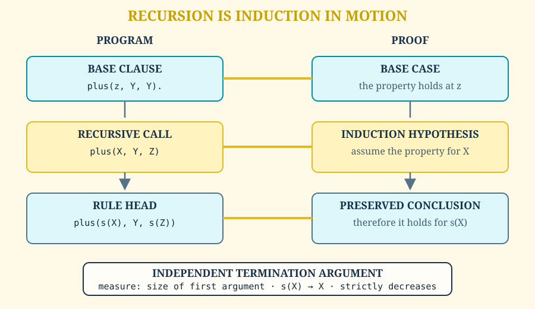
  <figcaption>Recursion and induction can share a structural skeleton, but termination still requires its own well-founded decreasing measure.</figcaption>
</figure>

### Three obligations, not one

A recursive mathematical program invites three separate arguments:

1. **Partial correctness:** if the relation returns an answer, does the answer
   satisfy the intended specification?
2. **Completeness for the intended mode:** if an answer satisfies the
   specification, will this program find it?
3. **Termination:** will search finish for calls in the intended mode?

They are logically independent. A program can terminate and return the wrong
answer. It can return only correct answers while missing some. It can describe
the correct relation and still diverge before producing it.

For `plus(+,+,-)`, a termination measure is the number of `s/1` constructors in
the first argument. Every recursive call strictly decreases that natural
number. The measure is well-founded: there is no infinite descending sequence
of natural numbers.

That last sentence is the mathematical heart of a termination proof.
“It seems to get smaller” is not enough. Name a set with no infinite descent,
give a measure into that set, and show strict decrease on every recursive
branch.

### Structural induction and data design

Lists carry their induction principle in their syntax:

- base object: `[]`;
- constructor: `[Head | Tail]`.

A relation following that structure is easy to reason about:

```eyeprolog

:- use_module(library(lists)).

list_length([], 0).
list_length([_ | Tail], N) :-
  list_length(Tail, M),
  (N is M + 1).
```

To prove that `list_length(List, N)` returns the number of cells in a finite
proper list, prove the empty case, then assume the claim for `Tail` and prove
it for `[Head | Tail]`. The recursive program and inductive proof share a
skeleton because both respect the same constructors.

Representation can either expose or obscure this skeleton. A syntax tree built
from `number/1`, `plus/2`, and `times/2` supports structural recursion directly.
A flat token string requires parsing before the same argument becomes visible.
Good representations do not merely save code; they make invariants and proof
principles available.

### Accumulators and strengthened invariants

An accumulator often improves control but makes the induction hypothesis more
subtle:

```eyeprolog
reverse_acc(List, Reversed) :-
  reverse_go(List, [], Reversed).

reverse_go([], Acc, Acc).
reverse_go([X | Xs], Acc, Reversed) :-
  reverse_go(Xs, [X | Acc], Reversed).
```

The useful invariant is not merely “`Reversed` is the reverse of `Xs`.” It is:

> `reverse_go(Xs, Acc, Reversed)` holds when `Reversed` is the reverse of
> `Xs` placed before `Acc`.

Strengthening the statement makes the recursive step provable. This is a
classic mathematical move: a theorem that is too weak to support induction is
generalized until the induction hypothesis contains what the next step needs.
Program transformation and proof discovery meet at the invariant.

### Tabling changes the termination argument

Ordinary structural recursion terminates by decreasing a term. Graph
reachability on a cyclic finite graph has no such simple decrease: following
an edge can return to an earlier vertex. Tabling supplies a different
well-founded argument.

If the graph has finitely many vertices, then there are finitely many possible
ground `path/2` answers. A table only grows; each productive iteration adds a
previously unseen answer; therefore only finitely many productive iterations
are possible. Termination follows from finiteness of the answer space rather
than structural descent of each call.

The proof also states its boundary. If rules construct terms of unbounded
depth, the set of possible calls or answers may be infinite, and tabling no
longer supplies a finite bound.

**Exercises.**

1. State partial correctness, completeness, and termination claims for
   `plus(+,+,-)` separately.
2. Define multiplication over Peano naturals and give its decreasing measure.
3. Prove the strengthened `reverse_go/3` invariant on paper.
4. Compare the termination arguments for list membership and cyclic graph
   reachability.
5. Study `examples/peano-calculus.pl` and identify where the data constructors
   determine the available induction.

**Checkpoint.** Align one recursive program with an inductive argument: base
clause with base case, recursive call with induction hypothesis, and rule head
with the preserved conclusion. Then give the independent termination measure.

## 28. Algebra, symmetry, and representation

Algebra studies operations by the laws they satisfy rather than by the material
of the objects being operated on. Logic programming has a similar appetite
for structure. Unification ignores the private identity of a variable name and
asks whether two terms have a common instance. A relational program often
works over lists, trees, graphs, substitutions, or group elements because the
clauses depend only on their constructors and laws.

### Unification is structural equation solving

The goal

```eyeprolog
(pair(X, f(Y)) = pair(g(a), f(b))).
```

decomposes into structural equations. The outer functors and arities agree,
so corresponding arguments must agree; the resulting substitution is
`X = g(a)` and `Y = b`.

This resembles algebraic equation solving, but unification is more specific.
It operates in the free term algebra: different constructors are distinct,
and two constructed terms agree only when their outer symbols and corresponding
arguments agree. It does not know, unless clauses or built-ins say so, that
`X is 2 + 3` and `X is 3 + 2` express a commutative operation.

The distinction prevents a common conceptual error:

- **syntactic equality** comes from identical term structure or unification;
- **domain equality** may require mathematical laws, normalization, or a
  decision procedure.

For polynomials, matrices, groups, or sets, choosing a canonical representation
can turn some domain equalities into syntactic equalities. But the
normalization algorithm then carries a proof obligation: equivalent objects
must normalize alike, and normalization must not identify inequivalent ones.

### Symmetry reduces search

Suppose a triangle is represented by three side lengths. Searching all
permutations repeats the same geometric object six times. Ordering the sides
removes the symmetry:

```eyeprolog
:- use_module(library(between), [between/3]).
:- use_module(library(lists)).

triangle(A, B, C) :-
  between(1, 20, A),
  between(A, 20, B),
  between(B, 20, C),
  (Sum is A + B),
  (Sum > C).
```

The constraints `A =< B =< C` select one representative from each permutation
class. This is more than a performance trick. It is a quotient-like move:
identify descriptions related by a symmetry, then search canonical
representatives.

Mathematics repeatedly advances by finding the right equivalence relation.
Fractions are identified when cross-products agree; graphs may be identified
up to renaming; group presentations may denote isomorphic structures; logical
formulas may be identified up to variable renaming. Logic programs must decide
which distinctions belong to the problem and which are artifacts of notation.

### Relations reveal inverse problems

A function privileges one direction. An equation or relation contains several:

```eyeprolog

:- use_module(library(lists)).

rectangle(W, H, Area) :- (Area is W * H).
```

When `W` and `H` are already bound, this relation may verify an area or calculate
it from width and height. With a finite generator it can also search for
factorizations:

```eyeprolog
:- use_module(library(between), [between/3]).
:- use_module(library(lists)).

integer_rectangle(Area, W, H) :-
  between(1, Area, W),
  between(W, Area, H),
  (Area is W * H).
```

```sh
eyeprolog --goal 'integer_rectangle(24, W, H)' program.pl
```

The relational view makes inverse questions conceptually ordinary, even when
the implementation still needs an explicit finite direction. Mathematics has
long moved between direct and inverse problems: multiply versus factor,
evaluate versus interpolate, evolve a system versus infer its initial state.
A relational vocabulary lets both questions share a specification where their
common structure genuinely permits it.

### Composition, homomorphism, and reusable laws

Well-designed relations compose because variables carry outputs from one
statement into another. Mathematical structure tells us what composition
should preserve.

If a mapping is claimed to preserve an operation, write the preservation law
as a testable relation. For a symbolic mapping `image/2` and operation
`combine/3`:

```eyeprolog

:- use_module(library(lists)).

preserves_combine(X, Y) :-
  combine(X, Y, XY),
  image(X, IX),
  image(Y, IY),
  image(XY, IXY),
  combine(IX, IY, CombinedImages),
  (IXY = CombinedImages).
```

Over a finite carrier, define a relation for a violating pair and use ISO
`\+/1` to ask whether that counterexample relation has any answer. Over an
infinite carrier, finite testing is evidence, not proof. The algebraic law must
instead follow from definitions or a stronger proof system.

The examples `d3-group.pl`, `matrix-noncommutativity.pl`,
`group-inverse-uniqueness.pl`, and
`composition-of-injective-functions-is-injective.pl` show different roles:
computing a finite operation table, finding a counterexample to commutativity,
proving uniqueness from axioms, and composing preserved properties.

### Representation is a mathematical commitment

Representing a rational number as `fraction(N, D)` raises immediate questions:
may `D` be zero, must signs be normalized, and are `fraction(1, 2)` and
`fraction(2, 4)` identical or merely equivalent? These are not serialization
details. They determine the equality relation, the search space, and the
meaning of every later proof.

Before selecting a representation, state:

1. its valid inhabitants;
2. its equivalence relation;
3. whether it has a canonical form;
4. the operations that must be efficient;
5. the induction or decomposition principle it exposes.

That checklist joins abstract algebra, data modeling, and program design.

**Exercises.**

1. Modify the triangle generator to enumerate only primitive Pythagorean
   triples and explain every removed symmetry.
2. Give two representations of an undirected edge. Compare their equality and
   indexing behavior.
3. Design a normalized rational representation and write integrity relations for
   invalid denominators and noncanonical zero.
4. Use `examples/d3-group.pl` to test identity, inverses, and associativity.
   Which checks are exhaustive, and why?
5. Find a matrix counterexample showing that multiplication is not
   commutative. Explain why one witness refutes a universal law.

**Checkpoint.** Pick a domain value with two possible representations. State
whether EyeProlog regards them as structurally equal, whether the domain regards
them as equivalent, and which normalization or explicit relation connects the
two notions.

## 29. Search as experimental mathematics

Mathematicians do not prove only by moving forward from axioms. They calculate
small cases, draw figures, search for patterns, try extreme examples, and hunt
for counterexamples. Computation greatly enlarges this experimental practice.
Logic programming contributes a particularly transparent form: generate a
finite mathematical world, state the property relationally, and ask for
witnesses or failures.

<figure>
  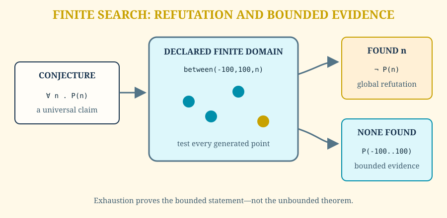
  <figcaption>Finite search is asymmetric: one valid counterexample defeats a universal claim, while finding none establishes only the explicitly bounded statement.</figcaption>
</figure>

### Examples suggest; proofs compel

The first values of a sequence can suggest a recurrence. Exhaustive search up
to a bound can destroy a false conjecture. Neither establishes a universal
theorem over an unbounded domain.

This boundary can be written directly:

```eyeprolog
:- use_module(library(between), [between/3]).
:- use_module(library(lists)).

counterexample_to_odd_square(N) :-
  between(1, 100, N),
  (1 is N mod 2),
  (Square is N * N),
  (Remainder is Square mod 2),
  (Remainder \= 1).
```

```sh
eyeprolog --goal 'counterexample_to_odd_square(N)' program.pl
```

No answer means only that no counterexample was found in the generated range
under the implemented arithmetic. The theorem that every odd integer has an
odd square needs an algebraic argument valid for an arbitrary integer:
`(2k+1)^2 = 2(2k^2+2k)+1`.

By contrast, if the claim concerns exactly the integers from 1 through 10,000,
the finite exhaustive search can be a proof—provided the generator is complete,
the predicate expresses the property correctly, and the arithmetic
implementation is trusted.

### One counterexample has asymmetric power

A universal statement falls to one valid counterexample. This makes finite
search especially valuable for criticism. Testing associativity over random
inputs offers evidence; finding one triple where associativity fails settles
the negative question.

```eyeprolog
noncommuting_pair(A, B) :-
  matrix(A),
  matrix(B),
  matrix_multiply(A, B, AB),
  matrix_multiply(B, A, BA),
  (AB \= BA).
```

The example need not explain every failure of commutativity. Its existence is
enough to refute the universal claim. This asymmetry between confirmation and
refutation is one reason constraint solving, model finding, and property-based
testing are so productive.

### Finite model exploration

A finite structure consists of a finite carrier and interpretations of its
operations and relations. EyeProlog can enumerate candidates, apply axioms as
filters, and return models or countermodels. The method is mathematically
serious because the scope is explicit.

For a carrier of three named elements, a binary operation table has nine
entries. Searching all possible tables is finite but large. Algebraic laws can
prune partial or complete candidates:

- closure restricts every output to the carrier;
- an identity fixes an entire row and column;
- commutativity identifies mirrored entries;
- associativity checks triples;
- inverse requirements constrain remaining cells.

The order of these constraints is operational mathematics. A strong law
applied early may collapse the search space; the same law applied after full
generation merely rejects enormous numbers of candidates.

### Combinatorics is the anatomy of search

Search complexity is often a counting problem before it is a programming
problem. If a choice has `n` alternatives at each of `k` positions, naive
generation contains `n^k` leaves. If order does not matter, permutations may
be redundant. If partial choices already violate a constraint, pruning saves
an entire subtree.

This is why combinatorial examples are not toys. `clpz-n-queens.pl` exposes
the classic eight-queens search through finite-domain constraints. Together with `send-more-money.pl`,
`integer-partitions.pl`, `stirling-bell-numbers.pl`,
and `weighted-interval-scheduling.pl`, they show different geometries of
choice: permutations, digit assignments, recursive decompositions, set
partitions, and ordered optimization.

For each search program, ask a mathematical question before a performance
question:

> What objects are being counted, and when do two execution branches denote
> the same mathematical object?

Only after answering that should one add indexing, reorder goals, or introduce
an accumulator. Otherwise the program may optimize accidental multiplicity.

### Numerical models and epistemic humility

The scientific examples combine logical rules with floating-point
calculations. `beam-deflection.pl`, `orbital-transfer-design.pl`,
`competitive-enzyme-kinetics.pl`, and `least-squares-regression.pl` encode
mathematical models of physical or statistical relationships.

A correct derivation inside such a model establishes a conditional:

> given these measurements, equations, units, approximations, and thresholds,
> this conclusion follows under the implementation's numeric semantics.

It does not establish that the sensor was calibrated, the model applies in
this regime, omitted variables are negligible, or a floating-point result is
an exact real number. The proof boundary should name these conditions rather
than conceal them.

**Exercises.**

1. Turn a familiar universal conjecture into a bounded counterexample search.
   State what a failure to find an answer does and does not prove.
2. Estimate the naive search space of `send-more-money.pl`, then identify each
   constraint that removes branches.
3. Use `examples/stirling-bell-numbers.pl` to connect a recurrence with the
   combinatorial objects it counts.
4. Design a finite carrier and search for a noncommutative operation with an
   identity.
5. Choose one scientific example and list every premise outside pure logic:
   measurements, units, empirical law, approximation, and numeric behavior.

**Checkpoint.** Label a computation as one of: witness construction,
counterexample, exhaustive finite-model check, bounded evidence, or numerical
model evaluation. Write one sentence stating exactly what its success proves
and what its failure leaves open.

## 30. What mathematics promises

Mathematics earns unusual trust because it makes its conditions inspectable.
Once definitions, axioms, and inference rules are fixed, a valid proof does
not negotiate with status, rhetoric, fashion, or desire. The conclusion either
follows by the accepted rules or it does not.

That is perhaps the precise sense in which mathematics does not cheat us. It
does not promise that our premises describe the world. It promises that we can
ask whether the conclusion follows from them.

### Conditional certainty

Every theorem is conditional, even when the conditions have become culturally
invisible:

```text
axioms + definitions + inference rules
  -> theorem
```

Every trustworthy EyeProlog conclusion has the same broad shape:

```text
source facts + clauses + built-in semantics + execution assumptions
  -> ground answer + proof
```

The arrows are where rigor lives. A proof disciplines the transition from
premises to conclusion. It cannot authenticate the premises merely by using
them.

This yields four layers of trust:

1. **Source trust:** are facts authentic, current, complete enough, and
   represented with the correct units and identity?
2. **Model trust:** do the predicates and rules express the intended domain?
3. **Engine trust:** do parsing, unification, built-ins, tabling, and proof
   generation implement the stated standards profile?
4. **Derivation trust:** does this answer have a valid proof from this exact
   theory?

Explicit integrity relations expose contradictions and invalid states inside the supplied
theory. Conformance tests address the implementation. Proof output addresses
the derivation. Provenance, signatures, calibration, peer review, and domain
validation address other layers. No single mechanism replaces the rest.

### The dignity of a counterexample

Mathematics corrects itself through definitions and counterexamples. A false
conjecture is not rescued by the beauty of its statement. One legitimate
counterexample has standing against a thousand confirming cases.

Logic programming should preserve this culture. Write negative tests before
the theory becomes emotionally expensive. Search boundary cases. Ask for
forbidden states. Turn domain invariants into queryable integrity relations. Keep the failed model that
forced a redesign.

A knowledge system becomes trustworthy not when it never changes, but when it
can say:

- what it assumed;
- what followed;
- which evidence was used;
- which counterexample broke the former rule;
- when the theory changed; and
- which past conclusions belonged to which version.

This is mathematical honesty translated into engineering practice.

### The limits are part of the truth

Gödel, Church, and Turing did not diminish mathematics by proving limits.
They made informal hopes precise enough to refute. There is no complete
effective method that settles every sufficiently expressive mathematical
question. No amount of faster hardware turns an undecidable general problem
into a decidable one.

EyeProlog has smaller, immediate limits:

- some relations have infinitely many answers;
- depth-first search may pursue an unproductive branch;
- mode-sensitive built-ins are not omnidirectional equations;
- negation as failure is not classical negation;
- floating-point arithmetic is not exact real arithmetic;
- tabling terminates only when the relevant call and answer spaces stabilize;
- proof output explains successful derivations, not every failed search path;
- the language cannot prove arbitrary metatheorems about its own programs.

Naming these limits is not an apology. A trustworthy formal tool states the
edge of its guarantee.

### Mathematics as a style of care

The deepest lesson is methodological. Mathematics asks us to separate:

- a name from its definition;
- an example from a proof;
- existence from construction;
- a theorem from its converse;
- syntax from semantics;
- equality from resemblance;
- local evidence from a universal claim;
- correctness from termination;
- the model from the world.

Those separations are exactly what good logic programming requires. A predicate
must have a sentence. A recursive clause must have an invariant and a
termination argument. A finite search must declare its domain. An aggregate
must have a bounded subsearch. A decision must retain its premises. A proof
must remain attached to the theory version that licensed it.

The result is not certainty about everything. It is something more useful:
certainty whose boundary is visible.

### A final program-reading ritual

Before trusting an EyeProlog conclusion, ask:

1. What does the ground answer say in the domain?
2. Which facts and rules support it?
3. Which facts came from outside the theory?
4. Which built-ins contribute extra semantics?
5. Was the search domain finite, and why?
6. Could goal or clause order hide an answer?
7. Does negation mean absence of proof or an explicit opposite?
8. What invariant justifies each recursive relation?
9. What counterexample would overturn the model?
10. Can the result be reconstructed under the same source and theory version?

That ritual captures the discipline. State a small theory. Ask a precise question. Let the machine search. Inspect the witness. Challenge the premises. Preserve the proof.

**Exercises.**

1. Take one policy example and classify every dependency under the four layers
   of trust.
2. Write a conclusion that is logically valid from false premises. Explain why
   proof checking alone cannot repair it.
3. Add version and provenance facts to a scientific example and make them
   visible in its explanation.
4. Find one claim in your own program for which tests provide evidence but not
   proof. State the missing universal argument.
5. Write a one-page “trust contract” for an embedded EyeProlog service: accepted
   sources, model scope, numeric assumptions, resource bounds, proof retention,
   and known limits.

**Checkpoint.** Take one strong conclusion and prefix it with every condition
on which it depends: source authenticity, model scope, built-in semantics,
finite search, theory version, and derivation validity. If the qualified claim
still matters, the model has earned its confidence honestly.

## Part VI summary

Part VI placed logic programming inside the longer history of mathematics:

- a ground answer can carry the witness of an existential claim;
- definite-program closure connects proof search with least-model semantics;
- recursive definitions and inductive proofs often share a constructor
  skeleton;
- correctness, completeness, and termination are independent obligations;
- unification solves equations in a free term algebra, not every domain;
- symmetry and canonical form remove representational duplicates;
- finite search is experimental mathematics whose scope must be stated;
- formal certainty is conditional on sources, models, engines, and rules.

You should now be able to distinguish computation from proof, bounded evidence
from a universal theorem, syntactic equality from mathematical equivalence, and
valid derivation from trustworthy premises.

### Historical note: mathematics examines its own methods

This arc begins before electronic computing. Hilbert's program made formal
proof and consistency mathematical objects. Gödel established limits for
sufficiently expressive effective axiomatic systems. Church and Turing made
effective calculability precise enough to prove that some general decision
problems have no algorithm. Herbrand and Robinson supplied ideas that became
central to automated first-order deduction.

Logic programming belongs to this history because it operationalizes a
restricted proof discipline. It does not erase the limit results or turn every
existence proof into an efficient witness generator. It gives a small region
where propositions, substitutions, proof steps, and computations can be
inspected together.

The deeper inheritance is a style of honesty. Mathematics advanced by proving
not only more statements but also where methods fail, separating truth,
provability, decidability, and computation. EyeProlog's finite bounds, mode
restrictions, search risks, and trust boundaries belong inside its account for
the same reason: limits are part of the result, not fine print.

---

# Part VII — The reasoning laboratory

<figure>
  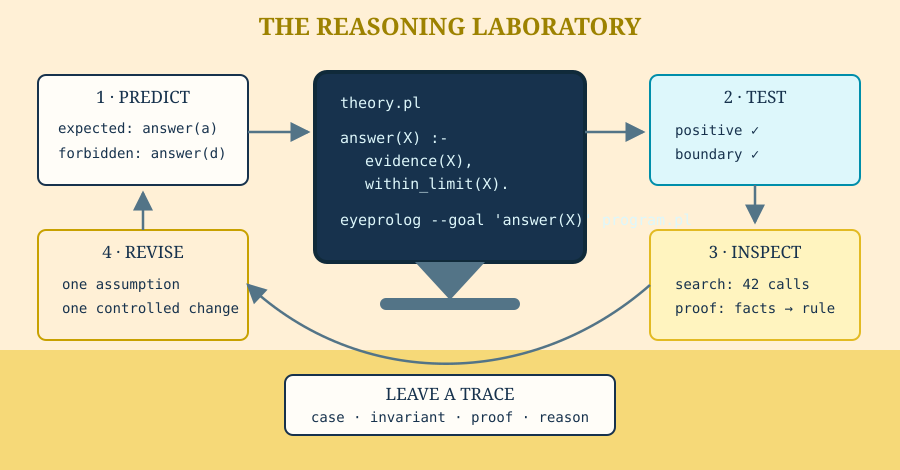
  <figcaption>A theory becomes dependable through a repeated laboratory cycle: predict, test, inspect the search and proof, then revise one assumption at a time.</figcaption>
</figure>

The final craft is experimental without being careless. A logic programmer
works like a mathematician at a blackboard and an engineer at a test bench:
state a claim precisely, derive consequences, seek counterexamples, measure the
computation, and preserve enough evidence for another person to repeat the
work.

The reasoning laboratory turns these ideas into a daily discipline. It adds no new language feature; it shows how to make theories survive change.

## 31. Testing a theory

A conventional unit test often presents an input to a function and compares
one returned value with an expected value. A relational program needs a wider
test vocabulary. One call may have several answers, no answer, duplicate
proofs, or different useful modes. Correctness includes the answer set, the
absence of forbidden answers, the shape of witnesses, and the finiteness of
the intended search.

<figure>
  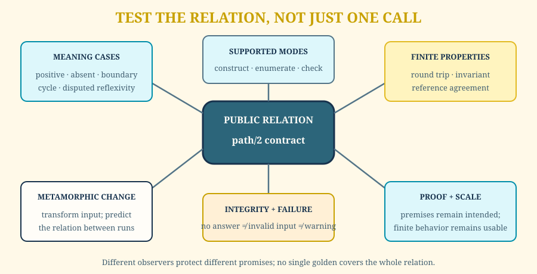
  <figcaption>A relational contract has several observable surfaces; examples, mode tests, bounded properties, metamorphic checks, integrity cases, proofs, and scale checks protect different promises.</figcaption>
</figure>

### Begin with a semantic test table

Before writing test code, make a table in domain language:

| Case | Given | Question | Expected | Why this case matters |
| --- | --- | --- | --- | --- |
| direct | `edge(a,b)` | path from `a` to `b`? | yes | base clause |
| composed | `a→b→c` | path from `a` to `c`? | yes | recursive clause |
| absent | disconnected `d` | path from `a` to `d`? | no | false positive |
| cycle | `c→a` | all destinations from `a`? | finite set | tabling or visited state |
| reflexive | no explicit loop | path from `a` to `a`? | design choice | relation boundary |

The last row is especially valuable. Many bugs are not implementation mistakes
but unresolved meanings. Does a path require at least one edge, or may it be
empty? No test framework can choose the definition for you.

### Positive and negative observers

Queries naturally record positive expectations:

```eyeprolog

:- use_module(library(lists)).

edge(a, b).
edge(b, c).

path(X, Y) :- edge(X, Y).
path(X, Z) :- edge(X, Y), path(Y, Z).
```

```sh
eyeprolog --goal 'path(a, b)' program.pl
eyeprolog --goal 'path(a, c)' program.pl
```

To make an expected absence visible, define a finite observer:

```eyeprolog
unexpected_path :-
  path(a, d).

expected_absence :-
  \+ unexpected_path.
```

```sh
eyeprolog --goal 'expected_absence' program.pl
```

This is a test over a ground, terminating goal. It does not turn negation as
failure into classical negation; it records that this finite theory derives no
such path.

For a reusable package, prefer a dedicated test program that loads or reproduces
the relevant theory and declares only test queries. For a small example, the
golden answer file is an executable specification of the expected answer set.

### Test the relation from more than one mode

Suppose `append/3` is intended both to concatenate and to split:

```sh
eyeprolog --goal 'append([a, b], [c], Whole)' program.pl
eyeprolog --goal 'append(Prefix, Suffix, [a, b])' program.pl
```

The first call should construct one list. The second should enumerate three
splits. Testing only the first mode would miss a regression in relational
generality; testing the completely open mode would request an infinite
relation and prove little beyond the absence of a useful bound.

For every public predicate, record:

1. the principal mode;
2. any secondary supported modes;
3. modes that are meaningful but intentionally unsupported;
4. calls expected to be finite;
5. calls whose answer order is part of the observable contract.

Keep this design close to the clauses in comments or tests, and exercise each
supported call pattern directly.

### Properties over finite domains

Examples test selected points. A finite generated property tests every point
in a declared scope:

```eyeprolog
:- use_module(library(between), [between/3]).
:- use_module(library(lists)).

double(N, D) :- (D is N + N).

double_is_even(N) :-
  double(N, D),
  (0 is D mod 2).

bounded_double_law :-
  \+ bounded_double_counterexample.

bounded_double_counterexample :-
  between(-100, 100, N),
  \+ double_is_even(N).
```

```sh
eyeprolog --goal 'bounded_double_law' program.pl
```

This is exhaustive for the 201 generated integers, not for all integers.
Naming the predicate `bounded_double_law/0` keeps the scope honest.

Useful finite properties include:

- round trips: parse then render, or encode then decode;
- preservation: normalization keeps the represented value;
- idempotence: normalizing twice equals normalizing once;
- symmetry: an undirected adjacency relation works in both directions;
- invariants: every generated plan state is safe;
- agreement: a simple reference relation and an optimized relation return the
  same bounded answer set.

### Metamorphic tests

Sometimes the correct answer is hard to list, but a controlled change has a
predictable effect. These are metamorphic tests.

If an isolated graph vertex is added, existing reachability answers should not
change. If every edge cost is multiplied by a positive constant, the cheapest
route should retain the same vertices. If the order of source facts changes,
the set of logical answers should remain unchanged even if their discovery
order changes.

A metamorphic test states a relation between runs. It is particularly useful
for optimizations because it checks a preserved invariant rather than one
frozen implementation trace.

### Proof regression and answer regression

An answer golden asks, “Did the public conclusions change?” A proof golden
asks, “Did their supporting derivations change?”

Proof changes may be desirable after introducing a clearer helper. They may
also reveal that a decision now depends on an unintended fact. Treat proof
goldens as reviewed evidence, not snapshots updated automatically whenever a
test fails.

Use answer regression broadly. Use proof regression selectively where
provenance, explanation, or policy accountability is part of the product.

### Test failures, integrity results, and warnings

Three outcomes carry different meanings:

- an ordinary query has no answer: the relation did not establish that goal;
- an integrity query succeeds: the supplied input violates a forbidden condition;
- `--warnings` reports unstratified negation: execution may proceed, but the
  program crosses a portability and semantic boundary.

A mature suite covers all three. Include malformed source in parser tests,
inconsistent source in integrity-query tests, and semantically dubious dependency cycles
in warning tests.

### A release-quality test matrix

Before releasing a theory or embedded service, cover:

| Dimension | Minimum evidence |
| --- | --- |
| Meaning | one positive, one absent, and one boundary case per public relation |
| Modes | every documented mode; explicit rejection or warning for unsafe uses |
| Recursion | base case, multi-step case, cycle, and termination argument |
| Search | smallest witness, competing witnesses, ties, and empty domain |
| Negation | ground success, ground failure, and stratification check |
| Aggregation | empty, singleton, duplicates, and deterministic tie handling |
| Integrity | each invalid state is detected and valid input is not misclassified |
| Proof | representative derivation with source premises visible |
| Scale | a case large enough to expose indexing or table behavior |
| Reproducibility | fixed time, source version, stable fixtures, and clean output |

**Exercises.**

1. Build the semantic test table for `ancestor/2`, including a cycle and a
   disputed reflexive case.
2. Write bounded commutativity and associativity tests for a finite operation
   table. Explain why one is cheaper.
3. Create a metamorphic test for a route planner.
4. Choose one proof golden and identify changes that should be accepted versus
   changes that should block a release.
5. Design a test that distinguishes “no answer” from “invalid input theory.”

**Checkpoint.** Assemble a minimum release matrix for one public relation:
positive, absent, boundary, alternate mode, recursive or cyclic, integrity, proof,
and scale cases. State which expected outputs should be exact goldens.

## 32. Debugging by meaning, search, and proof

Debugging a logic program is difficult when every symptom is described as
“the query failed.” Failure can mean the fact is absent, a variable was bound
too early, a built-in ran outside its mode, a negative goal saw an unintended
answer, recursion did not reach its base case, or the original relation was
misstated.

Use four views in a fixed order:

1. **meaning:** what should a ground instance say?
2. **bindings:** what is known before each goal?
3. **search:** which alternatives are explored, repeated, or pruned?
4. **proof:** which successful premises support the observed answer?

<figure>
  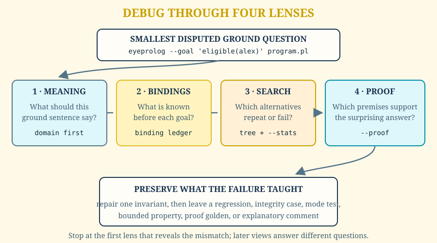
  <figcaption>Each debugging lens answers a different question; begin with meaning, move outward only as needed, and preserve the lesson as an executable check.</figcaption>
</figure>

### Reduce to the smallest disputed ground question

Do not begin with an open query that prints hundreds of answers. Name one
conclusion that is missing or surprising:

```sh
eyeprolog --goal 'eligible(alex)' program.pl
```

Then expand only the clause intended to prove it. Replace broad generators
with the relevant ground facts. A small ground question removes accidental
branching and makes every failed subgoal discussable.

If the ground question is itself ambiguous, stop debugging the implementation.
Rewrite the domain sentence first.

### Follow bindings from left to right

Consider:

```eyeprolog

:- use_module(library(lists)).

eligible(Person) :-
  (Age >= 18),
  age(Person, Age).
```

The intended mathematics is easy to recognize, but `>=/2` sees an unbound
`Age`. Write a binding ledger:

| Before goal | Goal | Bindings produced |
| --- | --- | --- |
| none | `Age >= 18` | none; not ready |
| — | `age(Person,Age)` | never productively reached |

Reordering the goals repairs the operational mode:

```eyeprolog

:- use_module(library(lists)).

eligible(Person) :-
  age(Person, Age),
  (Age >= 18).
```

For a clause with five goals, the ledger is often more revealing than staring
at the source. Record structures as well as scalar bindings: a variable may be
bound to an improper list or a compound term whose inner variables remain
open.

### Use a symptom atlas

**No answers**

- Confirm the queried predicate name and arity.
- Ground one expected answer and locate a clause whose head unifies with it.
- Walk the body with a binding ledger.
- Check readiness of arithmetic, string, list, and term built-ins.
- Inspect whether a negative goal is too early.
- Verify that a base clause is reachable.

**Too many answers**

- State which answer violates the domain sentence.
- Find its proof and identify the first overbroad premise.
- Look for missing joins: the same conceptual entity may use two variables
  where one shared variable was intended.
- Check whether a closed-world assumption was omitted.
- Decide whether duplicate answers or duplicate proofs are the real issue.

**Right answers, wrong order**

- Inspect clause order and generator order.
- Identify `once/1` or aggregate tie-breaking that makes order observable.
- Do not confuse order-sensitive behavior with declarative completeness.

**Nontermination or explosive search**

- Name the intended finite domain.
- Identify the recursive call and its decreasing measure, or the finite tabled
  call/answer space.
- Move selective generators and ready filters earlier.
- Check for terms that grow on every recursive call.
- Run with `--stats` and compare one controlled revision at a time.

**A surprising proof**

- Verify that the answer itself is intended.
- Find the earliest source premise that should not have participated.
- Distinguish a misleading helper name from a semantically wrong clause.
- Check whether two source versions or contexts were accidentally combined.

### Create diagnostic relations

Temporary helpers can expose intermediate concepts:

```eyeprolog

:- use_module(library(lists)).

candidate_debug(Person, Age) :-
  age(Person, Age).

adult_debug(Person, Age) :-
  candidate_debug(Person, Age),
  (Age >= 18).
```

```sh
eyeprolog --goal 'candidate_debug(Person, Age)' program.pl
eyeprolog --goal 'adult_debug(Person, Age)' program.pl
```

Once the fault is understood, either remove the helper or rename it as a
permanent domain concept. Do not leave `debug2/3` archaeology in a theory whose
proofs people must read.

### Compare specification and implementation

For a bounded domain, write a deliberately simple reference relation and
compare it with the optimized one. The reference may be slow; its purpose is
clarity.

```eyeprolog
:- use_module(library(between), [between/3]).
:- use_module(library(lists)).

reference_square(N, S) :-
  between(0, 20, N),
  (S is N * N).

optimized_square(N, S) :-
  between(0, 20, N),
  (S is N * N).

disagreement(N, S) :-
  reference_square(N, S),
  \+ optimized_square(N, S).
```

```sh
eyeprolog --goal 'disagreement(N, S)' program.pl
```

A complete equivalence check needs both directions and must account for
duplicates if proof multiplicity matters. Within a finite domain, differential
testing is a powerful guard during program transformation.

### Read statistics as questions

`--stats` reports work, not meaning. A high solution count may be necessary or
may indicate a generator that should be constrained. Many table hits may show
effective reuse; many distinct table entries may reveal an argument that
prevents calls from sharing table entries. On the Node CLI it also reports current heap use,
non-young/old-generation use, the amount currently compared with the memory
guard, resident-set size, and the soft and hard memory ceilings in bytes. These
memory figures are printed even when execution ends by raising a Prolog error.

`--stats` is an end-of-run summary. For a deliberately non-terminating or very
long computation, call the EyeProlog extension `statistics/0` at the points
where a live snapshot is useful. For example, a long-running loop can include
`statistics` as one of its goals, as in `loop :- work, statistics, loop.`

`statistics/0` writes the current solver counters and memory figures
immediately to the current output stream. `statistics/2` makes an individual
value available to the program, for example
`statistics(memory_guard_used_bytes, Used)`. With an unbound first argument it
enumerates the available statistic keys and values. An atom that is not an
available key raises `domain_error(statistics_key, Key)` rather than silently
failing. These predicates are EyeProlog observability extensions and are not
available under `--iso-strict`.

Compare statistics only between runs with the same query, data, and observable
answer contract. A faster program that silently loses answers is not an
optimization.

### Preserve the failure that taught you

Every repaired defect should leave behind one of:

- a new positive or negative case;
- an integrity regression;
- a documented mode and tests for that call pattern;
- a bounded property;
- a proof golden;
- a comment stating a non-obvious invariant.

Otherwise the repository remembers the repair but forgets the reason.

**Exercises.**

1. Deliberately misorder a numeric filter and diagnose it with a binding
   ledger.
2. Introduce a missing-variable join into a two-relation rule. Use the proof of
   one false positive to locate it.
3. Create a recursive term-growing rule, then state why tabling cannot make its
   answer space finite.
4. Compare statistics before and after moving an invariant calculation out of
   recursion.
5. Write a bidirectional bounded equivalence check for two list relations.

**Checkpoint.** Preserve one defect as a regression. Record the smallest
disputed ground question, expected answer, first incorrect binding or search
choice, repaired invariant, and test that would fail if the defect returned.

## 33. A pattern catalog for reasoning

A pattern is not a copied code fragment. It is a recurring arrangement of
meaning, representation, and control that solves a named design problem. The
following patterns collect constructions that are especially useful in practice.

<figure>
  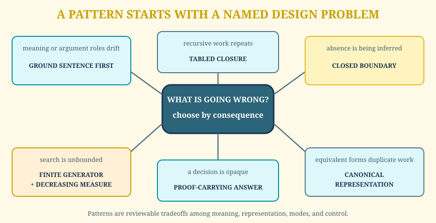
  <figcaption>Choose a pattern by the design problem and its consequence, not by superficial code shape; each pattern coordinates meaning, representation, modes, and control.</figcaption>
</figure>

### Pattern 1: Ground sentence first

**Problem:** a predicate's argument order and meaning drift while rules are
being written.

**Form:** write one representative ground fact and read it aloud before adding
variables.

```eyeprolog

:- use_module(library(lists)).

assigned_badge(alex, badge_17).
```

**Consequence:** argument roles become reviewable; modes and indexes can be
discussed against a stable sentence.

### Pattern 2: Normalize at the boundary

**Problem:** spelling, aliases, units, or source-specific terms leak into every
domain rule.

**Form:** retain source facts, derive one canonical vocabulary, and make core
rules depend only on the normalized layer.

```eyeprolog
:- use_module(library(strings)).
:- use_module(library(lists)).

source_role(person_7, 'Doctor').

canonical_role(Person, clinician) :-
  source_role(Person, Text),
  lowercase(Text, doctor).
```

**Consequence:** adapters change independently from policy; proofs still trace
back to source data.

### Pattern 3: Generate, constrain, describe

**Problem:** a search relation mixes candidate production, pruning, and
explanation until none can be reasoned about separately.

**Form:** generate a finite candidate, apply the cheapest selective constraints
in dependency order, then construct a witness or reason.

```eyeprolog
:- use_module(library(between), [between/3]).
:- use_module(library(lists)).

chosen_pair(pair(X, Y), reason(sum_is_ten)) :-
  between(0, 10, X),
  between(X, 10, Y),
  (10 is X + Y).
```

**Consequence:** the search domain and each pruning step are visible.

### Pattern 4: Carry the witness

**Problem:** a Boolean-like conclusion proves existence but loses the object
needed for explanation or later computation.

**Form:** add a structured output containing the path, assignment, schedule, or
evidence summary.

```eyeprolog

:- use_module(library(lists)).

path(X, Y, [X, Y]) :- edge(X, Y).
path(X, Z, [X | Rest]) :-
  edge(X, Y),
  path(Y, Z, Rest).
```

**Consequence:** answers become constructive; witness size and duplicate paths
become explicit design concerns.

### Pattern 5: Bound absence

**Problem:** the domain needs a negative conclusion, but absence is meaningful
only after a complete finite search.

**Form:** bind the subject and finite scope before `\+/1`; isolate the
closed-world step behind a clearly named predicate.

```eyeprolog
unregistered(Person) :-
  person(Person),
  \+ registered(Person).
```

**Consequence:** the closed-world assumption has one reviewable home. It must
not be mistaken for an explicit fact that the person is not registered.

### Pattern 6: Explicit state transition

**Problem:** planning or interpretation appears to require mutable state.

**Form:** represent the old and new states as terms related by an action.

```eyeprolog
step(state(Room, outside), enter(Room), state(Room, inside)).
```

**Consequence:** histories are ordinary lists, transitions can be queried, and
the state representation exposes invariants.

### Pattern 7: Fixed-point closure

**Problem:** reachability, inheritance, or dataflow revisits the same finite
subquestions.

**Form:** state the positive recursive relation directly and let eligible
components be tabled.

```eyeprolog
depends(X, Y) :- direct_dependency(X, Y).
depends(X, Z) :- direct_dependency(X, Y), depends(Y, Z).
```

**Consequence:** termination rests on a finite call and answer space, not on
pretending the graph is acyclic.

### Pattern 8: Proof façade

**Problem:** low-level helper clauses produce technically correct but
unreadable explanations.

**Form:** introduce stable domain concepts and a small public decision relation
whose premises are meaningful reasons.

```eyeprolog
within_limit(Device) :-
  reading(Device, Value),
  maximum(Max),
  (Value =< Max).

status(Device, safe) :-
  within_limit(Device).
```

**Consequence:** internal calculations remain available, while the successful
proof reads in domain vocabulary.

### Pattern 9: Integrity before inference

**Problem:** contradictory or impossible input would make ordinary conclusions
misleading.

**Form:** encode forbidden combinations as ordinary relations with diagnostic
arguments.

```eyeprolog

:- use_module(library(lists)).

invalid_badge_assignment(Badge, PersonA, PersonB) :-
  assigned_badge(PersonA, Badge),
  assigned_badge(PersonB, Badge),
  (PersonA \= PersonB).
```

**Consequence:** callers can collect every defect, and a host that requires
validated input can query this relation before it requests trusted decisions.
The rejection policy remains explicit rather than being hidden in clause-head
syntax.

### Pattern 10: Version the evidence boundary

**Problem:** an answer can be reproduced only if its facts, rules, and external
semantics are known.

**Form:** retain source snapshot, theory version, adapter version, and relevant
clock or numeric assumptions beside the proof.

```eyeprolog
theory_version("2026-07-24").
source_snapshot("telemetry-0042").
numeric_model(ieee_754_double).
```

**Consequence:** an old decision can be reconstructed under the system that
actually made it rather than silently rerun under today's theory.

### Anti-patterns

**The unbounded open generator.** A relation is queried with every argument
free even though its mathematical extension is infinite.

**The premature test.** A mode-sensitive built-in or negative goal appears
before the goals that bind its inputs.

**The accidental Cartesian product.** Two goals use different variables for
what should be the same entity.

**The opaque mega-clause.** One rule performs normalization, search, policy,
and explanation with no named intermediate concepts.

**The Boolean witness eraser.** A relation returns only `yes` after doing the
work needed to construct a useful path or reason.

**The silent closed world.** Failure to derive a fact is used as its opposite
without documenting finite scope and completeness assumptions.

**The proof-hostile helper.** Names such as `step3/2` or `tmp/4` expose an
implementation sequence instead of a domain idea.

**The optimization by answer loss.** `once/1`, early aggregation, or reordered
search makes a benchmark faster by changing the public answer contract.

**The floating theorem.** A numerical result is described as mathematically
exact without naming units, approximation, or host floating-point behavior.

**The timeless decision.** Sources and rules change, but conclusions retain no
snapshot or theory version.

### Selecting patterns

Patterns compose. A robust decision service often uses:

```text
normalize at the boundary
  -> generate, constrain, describe
  -> carry the witness
  -> proof façade
  -> integrity before inference
  -> version the evidence boundary
```

Do not apply every pattern mechanically. A three-fact teaching example does
not need six architectural layers. Introduce a pattern when its named problem
is present, and keep the smallest theory that makes meaning and control clear.

**Exercises.**

1. Find three patterns and two anti-patterns in an existing large example.
2. Refactor an opaque rule into boundary, concept, and decision layers; compare
   proofs before and after.
3. Add witness carrying to a Boolean reachability relation and analyze the new
   duplicate-answer behavior.
4. Replace a silent closed-world decision with a named bounded-absence helper.
5. Write a versioned evidence envelope for the Chapter 25 decision service.

**Checkpoint.** Select the smallest set of patterns that solves a real problem
in one theory. For every selected pattern, name the pressure that justifies
it; remove any layer that exists only because the catalog made it available.

## Part VII summary

Part VII made theory development repeatable:

- semantic test tables settle meanings before test mechanics;
- positive, absent, boundary, cycle, and scale cases cover different risks;
- bounded properties and metamorphic relations test more than selected points;
- answer and proof goldens protect different contracts;
- binding ledgers diagnose readiness and accidental joins;
- debugging moves from meaning to bindings, search, and proof;
- named patterns connect recurring problems to reusable relational forms;
- every repaired defect should leave a case, invariant, integrity check, or explanation.

You should now be able to design a release-quality test matrix, reduce a
surprising result to one ground question, compare a reference relation with an
optimized relation, and recognize productive patterns and anti-patterns.

### Historical note: executable specifications learn to remember

Logic programs have long stood between specification and implementation. That
made testing both easier and subtler: a ground clause could serve as an
example, yet a relation might have several modes and an answer set rather than
one returned value. Testing practice absorbed ideas from theorem proving,
database validation, software regression, and property-oriented testing.

The repository form of this practice is historically significant in its quiet
way. A theory, exact answer file, proof file, conformance corpus, and version
tag preserve not only a program but expectations about its meaning. Regression
tests make old decisions reviewable; property tests seek counterexamples;
metamorphic tests state what remains invariant across controlled change.

Patterns complete the cycle by naming recurring design knowledge. Sterling and
Shapiro's craft-oriented presentation helped establish that expertise lives in
constructions and transformations, not syntax alone. The reasoning laboratory
extends that attitude into maintenance: prediction, execution, evidence, and
revision form one method, and the failure that taught a lesson becomes
executable memory.

# Part VIII — Standard Prolog in practice

<figure>
  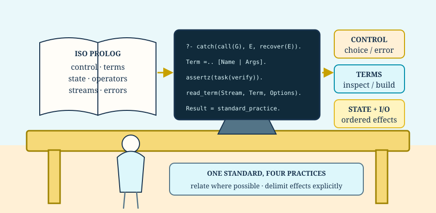
  <figcaption>The broader ISO profile is a practical workbench: relational term operations remain at its center while control, mutable state, and I/O are introduced at explicit boundaries.</figcaption>
</figure>

The supported ISO Prolog profile includes processor-facing facilities that
become important in reusable libraries, language tools, long-running
applications, and file boundaries. Earlier chapters use its relational core;
this part makes control, reflection, state, operators, and streams explicit.
For Part 1 portability work, EyeProlog also provides a strict core mode:
`--iso-strict` on the CLI or `isoStrict: true` in the JavaScript API restricts
the language/runtime surface to ISO/IEC 13211-1:1995 plus Technical Corrigenda
1–3. The processor character set is an implementation-defined choice shared by
normal and strict profiles: EyeProlog uses Unicode scalar values U+0000..U+10FFFF
excluding surrogates, with the scalar value as the collating-sequence integer.
Strict mode restricts implementation-specific language facilities, but it does
not narrow this processor-defined character repertoire. Isolation and error cases live in `test/conformance/cases/iso/`.
The examples here compose those operations into programs worth changing and
rerunning.

These facilities do not all have the same declarative character. Term
inspection and atomic conversion are relations. Cut commits to an operational
choice. Dynamic updates and stream operations change solver-owned state. Use
the pure relation when it expresses the problem; introduce control or effects
at a named boundary.

## 34. Control, exceptions, and grouped solutions

The control predicates accept goals as arguments. `call/1` invokes a callable
term, and `call/2-8` appends arguments to a callable closure. The expanded goal
runs in the current search continuation, so a direct goal and its meta-called
form expose the same remaining alternatives; the meta-call still establishes
its own cut boundary. `once/1` keeps its first solution, and `!/0` commits
within the clause that contains it. If-then-else commits to the first successful
condition:

<figure>
  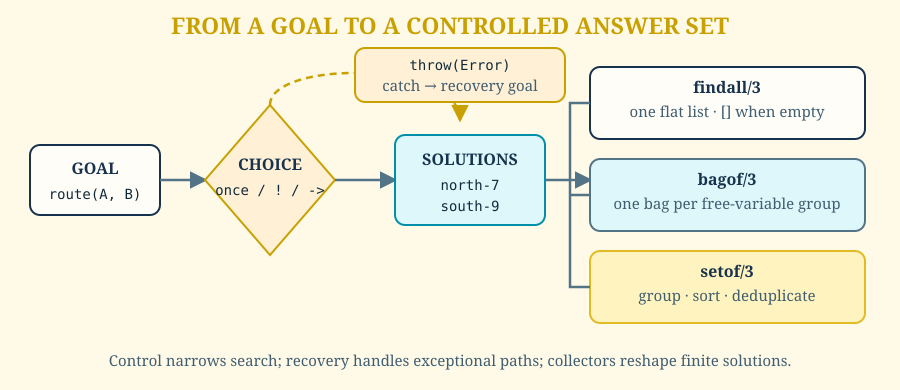
  <figcaption>Control narrows or redirects search; collection then gives a finite solution stream a deliberate list or grouping shape.</figcaption>
</figure>

```eyeprolog
travel_status(From, To, Status) :-
  (route(From, To) -> Status = connected ; Status = disconnected).
```

`once(Goal)` is a local request for one solution. Cut is lower level: it
discards alternatives created since entry into the current predicate call.
The two can produce the same first answer without expressing the same control
boundary. Keep cut close to the choice it documents and test the complete
answer set before and after introducing it. A cut executed inside a predicate
called by one disjunction branch remains local to that predicate: if the branch
later fails, `Left ; Right` must still try `Right`. This also holds when a
cut-bearing validation helper is called from a branch driven by a generator
such as `between/3`: the helper's own cut still stays local to it.

Exceptions separate an exceptional call from ordinary logical failure:

```eyeprolog
require_route(From, To) :-
  (route(From, To) -> true ; throw(no_route(From, To))).

checked_route(From, To, Result) :-
  catch(
    (require_route(From, To), Result = accepted),
    no_route(From, To),
    Result = rejected
  ).
```

The catcher is unified with the thrown term. A matching recovery goal runs in
the environment at the `catch/3` boundary; unrelated exceptions continue
outward. Prefer failure for an expected negative answer, such as a route that
does not exist. Throw when a caller cannot safely interpret the computation,
for example malformed input or an unavailable required resource. ISO
instantiation, type, domain, permission, representation, and evaluation errors
follow this same exception path.

Normal EyeProlog also provides `call_cleanup(Goal, Cleanup)` and
`setup_call_cleanup(Setup, Goal, Cleanup)`. Cleanup is run exactly once when the
protected search completes deterministically, is exhausted, is cut or otherwise
pruned, top-level answer enumeration is abandoned, or an exception unwinds the
search. `setup_call_cleanup/3` runs Setup once and installs Cleanup only after
Setup succeeds. On cut or ordinary pruning Cleanup sees the current Goal
bindings; on exception unwind the Goal bindings have been removed and Cleanup
sees the Setup environment. When a deterministic protected goal runs Cleanup
before yielding, substitutions produced by a successful Cleanup are included in
that answer. Cleanup failure is ignored, and an exception already being
propagated takes precedence over a cleanup exception. Nested cleanups run
inside-out. These two controls are EyeProlog extensions and are absent from
`--iso-strict`.

Collection also makes search boundaries explicit. `findall/3` returns one list
and existentially closes variables that occur only in its goal. `bagof/3`
instead creates a group for each binding of a free variable and fails when
there are no solutions. `setof/3` has the same grouping rule, then sorts and
deduplicates each group. The `^/2` notation marks a goal variable existential:

```eyeprolog

:- use_module(library(lists)).

regional_total(Region, Total) :-
  bagof(Amount, Seller^sale(Region, Seller, Amount), Amounts),
  sum_amounts(Amounts, Total).
```

Here `Region` deliberately remains free and produces one answer per region;
`Seller` is hidden from grouping. This distinction matters whenever a
collection unexpectedly arrives as several answers.

Integer arithmetic has similarly precise choices. `//` truncates the quotient
toward zero, while Corrigendum 2's `div` takes the mathematical floor. With a
positive divisor, `mod` returns a nonnegative modulo while `rem` keeps the
dividend's sign. For `-7` and `3`, `//` is `-2`, `div` is `-3`, and the two
remainders are `2` and `-1`. Bitwise conjunction, disjunction, exclusive-or,
complement, and shifts require integers.

Run the focused examples:

- [`iso-control-and-errors.pl`](https://github.com/eyereasoner/eyeprolog/blob/main/examples/iso-control-and-errors.pl)
  covers `call/1`, `once/1`, cut, if-then-else, and recovery;
- [`iso-grouped-solutions.pl`](https://github.com/eyereasoner/eyeprolog/blob/main/examples/iso-grouped-solutions.pl)
  contrasts the three collectors and inspects a source clause; and
- [`iso-integer-arithmetic.pl`](https://github.com/eyereasoner/eyeprolog/blob/main/examples/iso-integer-arithmetic.pl)
  makes division and bit-operation results visible.

**Checkpoint.** Explain why `bagof(Amount, sale(Region, Seller, Amount), X)`
groups on both `Region` and `Seller`, then write the existential qualification
that groups only on `Region`. Name one expected absence that should fail and
one broken precondition that should throw.

## 35. Reflective terms and atomic conversion

Ordinary pattern matching should remain the first choice when term shape is
known. Reflective predicates are valuable when the shape itself is input:
generic walkers, schema checkers, interpreters, and source transformations.

<figure>
  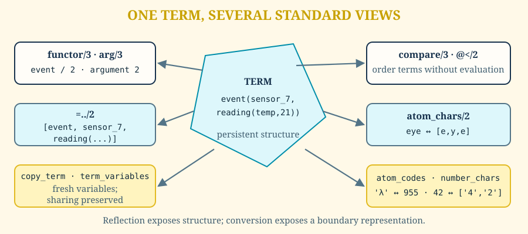
  <figcaption>A term is not mutated by reflection: standard relations expose its structure, ordering, or lexical representation for a particular question.</figcaption>
</figure>

`functor/3` relates a term to its name and arity. `arg/3` selects a one-based
argument. `=../2`—traditionally called *univ*—relates a term to a list whose
head is the functor and whose tail contains the arguments:

```eyeprolog
term_shape(Term, shape(Name, Arity, Arguments)) :-
  functor(Term, Name, Arity),
  (Term =.. [Name | Arguments]).
```

In a construction mode, `functor/3` creates a term with fresh arguments and
`=../2` rebuilds a term from a proper list. Their ISO errors are useful
guardrails: an unknown functor name, negative arity, partial univ list, or
uninstantiated required argument is not silently treated as failure.

`copy_term/2` preserves sharing inside a term while replacing its variables
with fresh ones. `term_variables/2` returns each distinct variable in
first-occurrence order. Identity predicates make the distinction observable:
`==/2` tests whether two resolved terms are identical without binding them;
`\==/2` is its negation. `=/2` still performs unification, while
`unify_with_occurs_check/2` explicitly rejects cyclic bindings.

The standard term-order family—`compare/3`, `@</2`, `@=</2`, `@>/2`, and
`@>=/2`—compares terms without evaluating arithmetic. Do not replace
`3 + 4 < 8` with `3 + 4 @< 8`: the former evaluates numbers and the latter
orders syntax.

Atomic conversion predicates expose reversible representations:

- `atom_concat/3` joins an atom or solves a sufficiently instantiated split;
- `sub_atom/5` relates a source to before, length, after, and fragment;
- `atom_chars/2` and `atom_codes/2` use character atoms or Unicode codes;
- `char_code/2` converts one character; and
- `number_chars/2` and `number_codes/2` parse or render ISO numbers.

These are atom relations, distinct from the EyeProlog library predicates whose
historical names contain `string`. Quoted atoms such as `'λ'` remain atoms;
with the default flag, `"λ"` denotes the character list `['λ']`.

[`iso-reflective-terms.pl`](https://github.com/eyereasoner/eyeprolog/blob/main/examples/iso-reflective-terms.pl)
walks through shape, rebuilding, fresh copying, variables, and order.
[`iso-atomic-conversion.pl`](https://github.com/eyereasoner/eyeprolog/blob/main/examples/iso-atomic-conversion.pl)
demonstrates both conversion directions and every three-character sub-atom of
`eyeprolog`.

**Checkpoint.** Given `pair(X, X)`, predict the variable list before and after
`copy_term/2`. Then explain why `atom_codes/2` belongs at a text boundary
rather than throughout a domain theory.

## 36. Dynamic predicates, directives, and operators

A dynamic predicate is a mutable clause store owned by one solver run. Declare
it before updates:

<figure>
  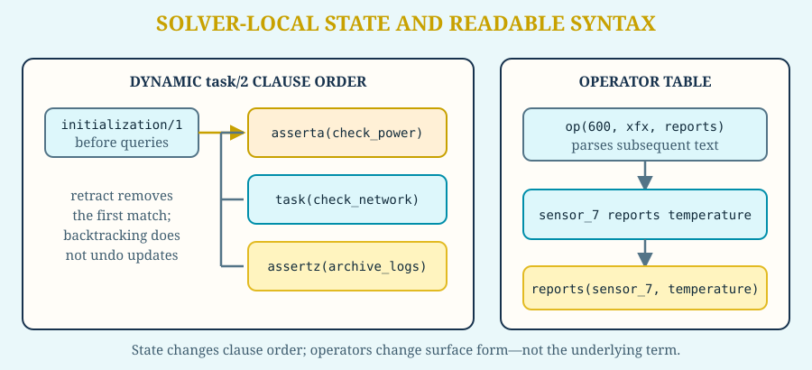
  <figcaption>Dynamic predicates change solver-local clause order; operator declarations change how subsequent source is parsed. Both effects are explicit and ordered.</figcaption>
</figure>

```eyeprolog
:- dynamic(task/2).

prepare_queue :-
  asserta(task(check_power, urgent)),
  assertz(task(check_network, normal)).
```

`asserta/1` inserts at the beginning and `assertz/1` at the end. `retract/1`
removes the first unifying clause and can be retried for later matches.
`abolish/1` removes a dynamic procedure. `clause/2` inspects accessible
clauses, while `current_predicate/1` enumerates or tests predicate indicators.
Static and private built-in procedures are protected by permission errors.

Updates are ordered effects, not pure logical conclusions, and they are not
undone by ordinary backtracking: later goals observe a changed database. Each
update invalidates cached tabled and ground-chain answers, and rule changes
refresh recursion and negation analysis before later goals continue. Keep them
in a narrow lifecycle layer.
The queue example performs setup in `initialization/1`, so query order does not
determine its state:

```eyeprolog
:- initialization(prepare_queue).
```

Initialization runs after preparation and before host queries. `include/1`
expands a source file in place; `ensure_loaded/1` loads the same designation at
most once. `multifile/1` and `discontiguous/1` document permitted clause
layout. Prolog flags and character conversions are also solver-scoped and
should be set deliberately near the boundary that relies on them.

Operators offer readable syntax without adding a new data model:

```eyeprolog
:- op(600, xfx, reports).

sensor_7 reports temperature.
```

The fact is exactly `reports(sensor_7, temperature)`. Priority determines
binding strength, and `fx`, `fy`, `xf`, `yf`, `xfx`, `xfy`, and `yfx`
determine position and associativity. `current_op/3` inspects the table;
`op(0, Specifier, Name)` removes a definition. Because declarations affect
parsing of subsequent text, place them before their first use. ISO argument
syntax also permits an atom that is currently an operator to appear directly
as a functional argument or list element, so forms such as
`current_op(Priority, Specifier, :-)` and `[:-,-]` are valid without quoting
or parenthesizing those operator atoms. A current operator atom may likewise
be the complete content of parentheses or curly brackets: `(+)` denotes the
atom `+`, and `{*}` denotes the curly term `{}(*)`. Term output observes the
same context rules: with `quoted(true)`, an operator atom is not quoted merely
because it occurs as a functional argument, list element, or sole curly-bracket
content. Thus `writeq({*})` emits `{*}`, `writeq([:-,-])` emits `[:-,-]`, and
`writeq(f(;,'|',';;'))` emits `f(;,'|',';;')`; the bar stays quoted because
ISO treats the unquoted `|` token as a list separator rather than an atom.

The ISO initial operator table also
contains `?-` at priority 1200 with specifier `fx`, so
`current_op(1200, fx, ?-)` succeeds. EyeProlog's embedded quad syntax permits
an optional label before the query marker (`Label ?- Query.`); supporting that
syntax additionally exposes `?-` at priority 1200 with specifier `xfx` as an
implementation-specific operator. Consequently
`current_op(Priority, Specifier, ?-)` enumerates both definitions. At top level in the normal EyeProlog profile, the quad marker is recognized
from the parsed `?-/1` or `?-/2` term rather than from one privileged surface
spelling. Thus `Label ?- Query.`, `?-(Label, Query).`, mixed forms such as
`?-((Label), Query).`, quoted-functor notation, and a parenthesized whole
`(?-(Label, Query)).` denote the same quad when followed by indented answer
descriptions. `Label` itself is parsed with the ordinary Prolog term grammar:
there is no quad-specific comma or metadata syntax. The runner requires the
resulting first argument to be ground; if it is not, that quad is reported as
`BAD_ID` and later quads are still processed. In `--iso-strict` mode this quad
interpretation is disabled, and `?-/2` remains ordinary Prolog term syntax.

Run [`iso-dynamic-database.pl`](https://github.com/eyereasoner/eyeprolog/blob/main/examples/iso-dynamic-database.pl)
for an explicitly stateful queue and
[`iso-operators.pl`](https://github.com/eyereasoner/eyeprolog/blob/main/examples/iso-operators.pl)
to see custom notation decomposed back into an ordinary term.

**Checkpoint.** State the final clause order after one `asserta/1` and two
`assertz/1` calls. Then rewrite one custom-operator fact in canonical
functor notation and verify it with `=../2`.

## 37. Streams and term I/O

Streams are handles to ordered input or output. `open/4` adds options to the
basic `open/3`: text or binary type, alias, repositioning, and end-of-file
action. Always close a nonstandard stream, including exceptional paths in
application code.

<figure>
  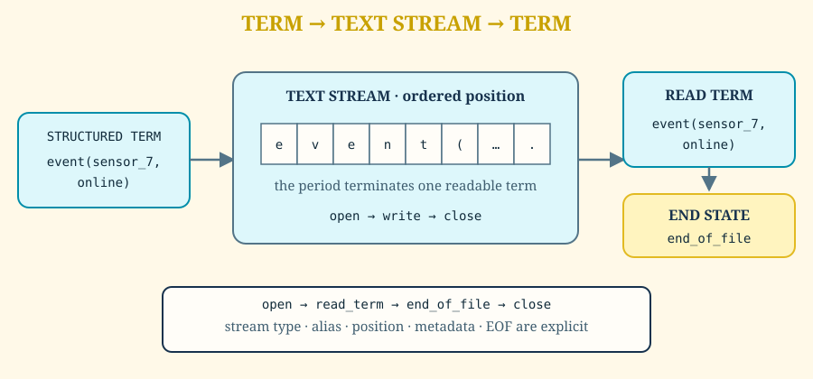
  <figcaption>A term round trip has visible lifecycle obligations: open the right stream type, write readable syntax with a period, read in order, observe end state, and close.</figcaption>
</figure>

```eyeprolog
write_event(Path, Event) :-
  setup_call_cleanup(
    open(Path, write, Stream, [type(text)]),
    ( write_canonical(Stream, Event),
      put_char(Stream, '.'),
      nl(Stream)
    ),
    close(Stream)
  ).
```

In normal mode, `setup_call_cleanup/3` is the preferred lifecycle boundary for
resources such as streams: `close(Stream)` still runs if the protected work
fails, throws, is cut, or its remaining alternatives are abandoned. Strict ISO
mode does not provide this EyeProlog extension.

The period is essential when another Prolog processor will read the result as
a term. `write/1-2` uses readable conventional syntax, `writeq/1-2` quotes
where needed, and `write_canonical/1-2` exposes canonical structure. Dotted
graphic atoms do not need quotes merely because they contain a period:
`writeq(./*)`, `writeq(.*)`, and `writeq(...*)` output `./*`, `.*`, and `...*`
respectively. ISO term output uses only the separator characters needed by the
syntax, so functional arguments, list elements, and operator applications are
emitted compactly when no lexical ambiguity would arise. For example,
`writeq([a,b])` outputs `[a,b]` and `writeq(1+2)` outputs `1+2`; a separator is
still retained where adjacent graphic tokens would otherwise merge, as in
`a+ -b`.
`write_term/2-3` supports `quoted/1`, `ignore_ops/1`, `numbervars/1`, and
`variable_names/1`. Normal mode additionally accepts the EyeProlog extension
`double_quotes(true|false)`: `true` lets eligible character/code lists use the
current `double_quotes` representation. Proper character/code lists can therefore be written
as `"text"`. A proper list whose final segment contains at least two characters/codes
uses that representation for the suffix, so `[A,b,c,d,e,f]` is written as
`[A|"bcdef"]`. A partial list such as `[a,b|Tail]` is written as `"ab"||Tail`.
This representation choice is independent of `ignore_ops/1`: with
`ignore_ops(true)`, operator terms use functional notation while an explicitly
requested character/code list remains double quoted. Thus
`write_term(f("ab",a+b),[quoted(true),ignore_ops(true),double_quotes(true)])`
emits `f("ab",+(a,b))`. Reversing the two options has the same effect. Strict
ISO mode rejects this implementation-specific write option. Normal mode also accepts the
implementation-specific boolean `spacing(true|false)` option: `false` emits
only separators required to avoid lexical ambiguity, while `true` adds
conventional layout around operators. For example,
`write_term(1+1,[spacing(false)])` emits `1+1` and
`write_term(1+1,[spacing(true)])` emits `1 + 1`. The REPL always follows
the minimal-separator rule, so `X=1*1` is displayed as `X = 1*1`, while a
separator is retained in `X = a+ -b` because the adjacent graphic tokens would
otherwise merge. Strict ISO mode rejects both extension options.

Character operations are `get_char`, `peek_char`, `put_char`, `get_code`,
`peek_code`, and `put_code`; byte streams use the corresponding byte
predicates. Peeking does not advance the position. Mixing byte operations with
a text stream, or text operations with a binary stream, raises a permission
error rather than guessing an encoding.

`read/1-2` reads the next term. `read_term/2-3` can also return all variables,
source variable names, and singletons. The metadata contains variables, so a
program normally validates or transforms it before placing it in a ground
query answer. Every read operation creates a fresh variable set: a source name
such as `X` in two separately read terms does not alias either the caller's `X`
or the variable named `X` by the other read. Within one read term, repeated
occurrences and the variables returned through its metadata still share as
written. `stream_property/2` exposes mode, type, alias, position, and
end state. `current_input/1`, `current_output/1`, `set_input/1`, and
`set_output/1` manage defaults shared by nested goals.

End of file is a state transition, not merely a character. With
`eof_action(eof_code)`, term input yields `end_of_file`, character input yields
`end_of_file`, and code or byte input yields `-1`; `at_end_of_stream/1`
tests the position. Repeated input after the end follows the selected
`eof_action`.

[`iso-term-io.pl`](https://github.com/eyereasoner/eyeprolog/blob/main/examples/iso-term-io.pl)
writes a temporary fixture, reads its terms in order, checks variable metadata,
and observes end of stream. The file lives under `/tmp`; running the example
does not modify the checkout.

**Checkpoint.** Write a term round trip and name where quoting, the terminating
period, stream type, and close operation matter. Explain why a stream side
effect belongs outside the central relation that decides what the term means.

## Part VIII summary

The supported ISO facilities make EyeProlog suitable for more than closed rule
files:

- control predicates delimit choices and exception recovery;
- collectors distinguish flat, grouped, and canonicalized answer sets;
- reflective predicates treat term structure as data;
- atomic conversions provide standard lexical boundaries;
- dynamic predicates and directives manage explicit solver-local state;
- operators change notation while preserving ordinary term structure; and
- streams connect terms to ordered text or binary I/O.

Chapters 38–40 state the supported profile, list every registered predicate,
and document the command line; the conformance corpus fixes success, failure,
mode, and error behavior. Use this part for working practice and those chapters
for exact reference.

### Historical note: the practical language becomes portable

By the late 1970s and 1980s, Prolog had spread from its Marseille origins into
several implementation traditions. The Edinburgh and DECsystem-10 lineage in
particular helped establish a practical programming vocabulary around ordered
control, term inspection, dynamic clauses, operators, and streams. These
facilities made Prolog useful far beyond theorem-proving examples, but
differences between systems also made portability a recurring concern.

ISO/IEC 13211-1:1995 gave that accumulated practice a common core. It did not
freeze the language: constraints, modules, tabling, coroutining, and other
facilities continued to develop in implementations and later standardization
work. What the standard supplied was a stable shared account of ordinary Prolog
terms, control, state, errors, and I/O against which extensions could be named.

# Part IX — Reference as practice

Reference is useful only when the route into it is clear. Begin with the task
in hand: Chapter 38 answers what source means, Chapter 39 helps select a
predicate, and Chapter 40 turns a file into observable evidence. Chapters
41–43 then support study design, boundary decisions, and precise vocabulary.
The long catalogs are meant to be entered locally, not memorized linearly.

<figure>
  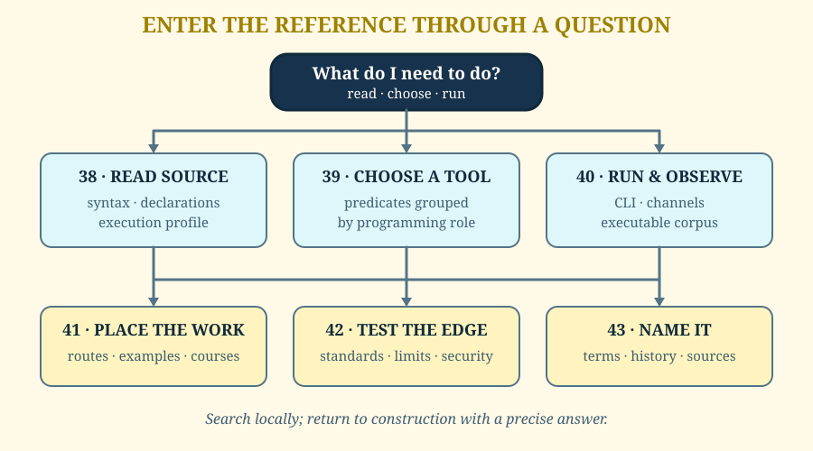
  <figcaption>Enter the reference through a concrete question. The first three chapters answer how to read, choose, and run; the next three help place that answer in a course, a boundary, and a shared vocabulary.</figcaption>
</figure>

## 38. Language and ISO profile

The normative strict-core baseline is ISO/IEC 13211-1:1995, as corrected by
Technical Corrigenda 1:2007, 2:2012, and 3:2017. The post-N289 WG17/STC
working draft is used as defect-discovery input, not as an unpublished fourth
Corrigendum. The 2026-08-23 draft through items #73-#76 is tracked by
`test/conformance/STC-DRAFT-STATUS.md`; where a proposal changes published
semantics, such as #75's conditional power-underflow proposal, strict mode keeps
the licensed baseline until the change is standardized or explicitly adopted as
a compatibility extension. Normal EyeProlog additionally provides a practical
module interface aligned with later WG17 module amendment work and a
definite-clause-grammar profile following ISO/IEC TS 13211-3. The requirements
clarified by the 2013 Part 2 amendment have a dedicated executable coverage
ledger; the unchanged remainder of Part 2 and the Part 3 profile are documented
and tested compatibility surfaces rather than complete clause-by-clause
certifications.

Normal-mode Prolog source accepted by EyeProlog is UTF-8. `%` starts a line
comment and `/* ... */` delimits a block comment. Plain atoms begin with a
lowercase ASCII letter. Variables begin with uppercase or underscore. The bare
`_` is fresh each time. Single quotes delimit quoted atoms; double quotes use
ISO double-quoted-list notation. Integers, decimals, scientific notation,
binary/octal/hexadecimal integers, and character-code constants are accepted.
Normal mode additionally accepts digit-separated integer constants such as
`1_000` and `0xCA_FE`, with optional layout after the underscore, and the
Trealla-compatible `"text"||Tail` right-splice for double-quoted `chars`/`codes`
lists; strict ISO mode accepts neither syntax extension.

The processor character set is shared by normal and `--iso-strict` modes because
Part 1 makes it implementation defined rather than an extension boundary.
EyeProlog's PCS (processor character set) is the Unicode scalar repertoire. Printable ASCII keeps the Part
1 lexical classes; Unicode letters extend alphanumeric name syntax, Unicode
white-space characters are layout, and remaining non-ASCII symbols/punctuation
are extended graphic characters. Character-code and collation values are the
corresponding Unicode scalar integers. Quoting remains available for any atom
spelling that should not depend on an extended lexical class:

```eyeprolog

:- use_module(library(lists)).

city('München').
message("café").
```

Inside a quoted atom, a single quote is doubled: `'don''t'`. EyeProlog follows
the ISO quoted-character grammar rather than accepting arbitrary backslash
escapes. The symbolic control escapes are `\a`, `\b`, `\r`, `\f`, `\t`,
`\n`, and `\v`; the meta characters backslash, single quote, double quote, and
back quote may be escaped after a backslash; and numeric octal or hexadecimal
escapes are terminated by a backslash. For example, `'\7\'` and `'\x7\'`
both denote the alert character. Forms such as `\c`, `\d`, `\e`, `\u`, `\.`
and `\ ` are not ISO quoted-character escapes and are syntax errors.

A literal layout character other than ordinary space is not a quoted
character. In particular, a literal tab or newline inside quotes is a syntax
error. A quoted token can cross a line boundary only through a continuation
escape: a backslash immediately followed by the newline, which contributes no
character to the atom. The NUL character is written readably as `'\0\'`;
digits `8` and `9` are not octal digits, so forms such as `'\8\'` are syntax
errors. `writeq/1` uses octal escapes for other non-symbolic control characters,
for example ESC is written as `'\33\'`. Double-quoted lists use the same
quoted-character rules. Whitespace is insignificant between tokens, and a `%`
comment continues to the end of its line. Doubling the active delimiter is
also accepted inside either quoted form, so `""` inside double-quoted notation
denotes one literal double quote character.

Graphic tokens use the characters `#$&*+-./<=>?@^~\`; `!` and `;` are solo
atoms. A colon is the Part 2 module qualification operator in `Module:Goal`;
normal mode predeclares it, while `--iso-strict` does not include it in the
Part 1 initial operator table. Quote an atom whose name itself contains a colon.
Unquoted angle-bracket IRIs are not syntax.

A `/*` sequence opens a block comment only when it begins a token; inside a
maximal graphic token the slash and star remain atom characters. Graphic tokens
are formed maximally before a period can be recognized as the terminating full
stop. Consequently, interactive input `*.` or `./*.` is not yet a complete term:
the period is part of the graphic atom and the reader waits for a separate
terminating full stop. Thus `./*. .` reads the atom `./*.` and consumes the
second period as the terminator.

In the grammar below, `{ x }` means zero or more repetitions of `x`, `[ x ]`
means that `x` is optional, and parentheses group alternatives. These marks
describe the grammar; they are not characters written in EyeProlog source.

```text
program             ::= { clause }
clause              ::= head "."
                      | head ":-" goal-list "."
head                ::= term
goal-list           ::= term { "," term }
term                ::= variable | atom-constant | double-quoted-list | number
                      | compound | list | curly-term | parenthesized-term
compound            ::= atom-constant "(" term { "," term } ")"
list                ::= "[" "]"
                      | "[" term { "," term } [ "|" term ] "]"
double-quoted-list  ::= '"' { quoted-character } '"'
curly-term          ::= "{}" | "{" term "}"
parenthesized-term  ::= "(" term [ "," term { "," term } ] ")"
variable            ::= "_"
                      | variable-start { name-continue }
atom-constant       ::= plain-atom | quoted-atom | graphic-atom
plain-atom          ::= lowercase-letter { name-continue }
number              ::= [ "-" ] digits [ "." digits ] [ exponent ]
exponent            ::= ( "e" | "E" ) [ "+" | "-" ] digits
variable-start      ::= uppercase-letter | "_"
name-continue       ::= uppercase-letter | lowercase-letter | digit | "_"
```

Zero-arity compounds such as `ready()` are unsupported; use `ready`. Every
clause ends in a period. The grammar above gives the canonical term shapes.
The initial operator table contains the following ISO-style operators, all
lowered to ordinary compound terms:

- prefix: ISO `?-`, `\+`, unary `+`, unary `-`, and `\`;
- control: `,`, `;`, and `->`;
- normal Part 2 module profile: `:` at priority 600 (`xfy`) and
  `meta_predicate` at priority 1150 (`fx`) so the amendment's directive spelling
  such as `:- meta_predicate run(:).` parses directly; these are not predeclared
  by `--iso-strict`;
- quad syntax extension: `?-` is also a priority-1200 `xfx` operator so a
  label may precede a quad query;
- grammar rules: `-->` and the Part 3 alternative `|`;
- unification and comparison: `=`, `\=`, `==`, `\==`, `@<`, `@=<`, `@>`,
  `@>=`, `is`, `=:=`, `=\=`, `<`, `=<`, `>`, and `>=`;
- arithmetic: `+`, `-`, `*`, `/`, `//`, `div`, `mod`, `rem`, `/\`, `\/`,
  `<<`, `>>`, `**`, and `^`.

`op/3` directives and runtime calls define or remove prefix, infix, and postfix
operators using the ISO `fx`, `fy`, `xf`, `yf`, `xfx`, `xfy`, and `yfx`
specifier classes. Variables cannot occur in functor or predicate position.
Parentheses around one term
denote that term; parentheses around two or more comma-separated terms
construct a right-associated `','/2` term. In goal position it is conjunction;
in data position it remains inspectable data.

The pure definite-clause fragment has a Herbrand reading: ground terms denote
themselves, predicates denote sets of ground atomic formulas, variables have
clause scope, and unification is structural. The implementation performs
first-order finite-tree unification with an occurs check. An attempt to bind a
variable to a term containing that same variable fails.

An **atom constant** such as `pat` is a term. An **atomic formula** such as
`parent(pat, jan)` is a proposition that may be a fact, rule head, or goal.
The same surface form, `parent(pat, jan)`, may also be compound data when nested inside
another term; its role comes from context. Predicate identity includes arity,
so `edge/2` and `edge/3` are different predicates.

Execution is goal-directed rather than complete bottom-up saturation. Goals in
a body normally run from left to right; the solver may select a ready
deterministic built-in early as a pure filter. Ordinary user-defined calls,
including recursive calls, use depth-first resolution unless the source
explicitly declares `:- table p/n.`. `\+/1` is negation as failure, not
classical negation; the separate `tnot/1` extension provides well-founded
semantics for eligible finite Datalog components.

EyeProlog supports cut, operator declarations, dynamic database updates, grouped
solutions, exceptions, flags, initialization and inclusion directives, and
standard stream and term I/O. Normal mode additionally provides lifecycle-aware
`call_cleanup/2` and `setup_call_cleanup/3`; these cleanup controls are
EyeProlog extensions and are excluded by `--iso-strict`. Normal mode also
adds the documented module compatibility surface and a Part 3-oriented DCG
profile.

### Module compatibility profile

A module gives predicate identity one more component: module name, predicate
name, and arity. The first directive in a module source names the module and
lists its public predicates:

```text
% colors.pl
:- module(colors, [tone/1]).

tone(blue).
hidden(module_private).
```

Another source can import all exports or select particular indicators. An
unqualified call first uses a predicate local to the calling module and then an
import; a local definition therefore stays distinct from a same-named private
predicate elsewhere.

```text
:- use_module('colors.pl', [tone/1]).

hidden(user_local).
answer(Tone, Hidden) :- tone(Tone), hidden(Hidden).
qualified(ok) :- colors:tone(blue).
```

Imports such as `use_module(library(lists))` and
`use_module(library(strings))` resolve the bundled modules in Node and the
browser. Atom source designations such as
`'colors.pl'` resolve relative to the importing file in Node. `use_module/1`
imports every export; `use_module/2` imports only its indicator list, including
an empty list when only qualified calls are wanted. `Module:Goal` selects a
module explicitly. Repeated module loads are idempotent, while conflicting
imports and requests for predicates that a module does not export are errors.

### Part 3-oriented definite clause grammars

A grammar rule `Head --> Body.` is prepared as an ordinary predicate with two
additional difference-list arguments. Parameterized nonterminals retain their
written arguments, so `token(Type)//1` is implemented by `token/3`.
Nonterminal indicators can be exported and imported through modules:

```text
:- module(vocabulary, [word//1]).

word(noun) --> [robot] | [scientist].
```

The supported grammar constructs include terminal lists, `[]`, sequencing with
comma, alternatives with `;` or `|`, if-then-else, embedded goals `{Goal}`,
`call//1`, `phrase//1`, and `!//0`. Semicontexts provide look-ahead by restoring
terminals to the remaining sequence:

```eyeprolog
look_ahead(X), [X] --> [X].
```

`phrase(+Body,?Sequence)` accepts or generates a complete sequence.
`phrase(+Body,?Sequence,?Rest)` leaves `Rest` unconsumed and is steadfast in
that argument. A variable body raises `instantiation_error`; a non-callable
body raises `type_error(callable)`. EyeProlog elects to perform the optional
terminal-sequence checks of the ISO/IEC TS 13211-3 working draft, 8.18.1.3 g and h.
It consistently reports `type_error(list, Culprit)` for invalid input in both
arities and invalid remainder in `phrase/3`, including improper lists.
Variables, proper lists, and partial lists pass these checks. Validation
precedes grammar execution; an otherwise valid failing grammar does not
suppress the diagnostic. Dedicated regressions enforce this policy separately
from the portable quads, which accept both checking and non-checking outcomes. See
[`ISO-PART3.md`](test/conformance/ISO-PART3.md), which also records that the
2023-08-14 working draft specifies `type_error(terminal_sequence, Culprit)` for
this condition.

#### A bidirectional expression grammar

DCGs become more useful when the grammar produces a structured term rather than
merely accepting a token list. The checked
[`dcg-expression-language.pl`](https://github.com/eyereasoner/eyeprolog/blob/main/examples/dcg-expression-language.pl)
example implements a small arithmetic language in both directions. Its parser
respects precedence and left associativity while constructing an abstract syntax
tree:

```text
expression(AST) -->
  term(First),
  additive_tail(First, AST).

additive_tail(Left, AST) -->
  ['+'], term(Right),
  { Next = add(Left, Right) },
  additive_tail(Next, AST).
additive_tail(AST, AST) --> [].
```

The accumulator removes left recursion without moving parsing into JavaScript.
A second DCG walks the AST in the other direction and emits only the parentheses
needed to preserve its structure. The example therefore exercises parsing,
semantic actions, nonterminal-to-nonterminal state hand-off, generation,
backtracking, `phrase/3` remainder handling, and AST-to-token-to-AST
round-tripping. The checked answers are in
[`examples/output/dcg-expression-language.pl`](https://github.com/eyereasoner/eyeprolog/blob/main/examples/output/dcg-expression-language.pl).

#### Deep sequence hand-off

`library(dcgs)` provides the common `... //0` helper, which describes an
arbitrary number of input elements. It is not part of ISO Part 3, but it is a
useful interoperability and stress-test relation. A compact hand-off test is:

```text
a --> ..., epsilon.
epsilon --> [].
```

Here the remaining sequence is repeatedly passed from `... //0` to another
nonterminal. For a finite compact list, EyeProlog can scan the arbitrary
sequence iteratively instead of consuming one ordinary solver depth level per
list cell. If the continuation is structurally proven to be a zero-width
identity grammar such as `epsilon//0`, the hand-off can be continued without
constructing a fresh general clause-resolution frame at every suffix. The list
spine is still traversed; this is a control/allocation optimization rather than
an O(1) semantic shortcut.

The optimization is deliberately narrow. `phrase(..., Sequence, Rest)` still
enumerates the valid remainders, open or non-compact inputs retain ordinary
relational behavior, and grammars that can consume or constrain the remainder
are not treated as identity continuations. `time/1` can be used in normal mode
to measure such runs; its inference counter records solver-level inferences and
does not count every internal step of an optimized scanner.

Part 3 leaves `\+//1` and standalone `->//2` implementation dependent.
EyeProlog uses non-consuming negation (`\+ Body` tests from the current state)
and threads the state produced by the condition into the then-grammar.

### Directives and protected built-ins

`false/0` is the ISO always-failing built-in. It is protected as a static
procedure, so source clauses headed by `false` are rejected instead of being
interpreted as directives or integrity constraints.

Standard directives include `dynamic/1`, `multifile/1`, `discontiguous/1`,
`op/3`, `char_conversion/2`, `initialization/1`, `include/1`,
`ensure_loaded/1`, `module/2`, `use_module/1`, `use_module/2`,
`meta_predicate/1`, and `set_prolog_flag/2`. Initialization goals run once
after program preparation and before host queries. Included text is expanded
in place; repeated `ensure_loaded/1` designations are loaded once.

Normal output contains only ground query answers, one term and period at a
time. Source facts are not echoed as new conclusions, and duplicate answers
are suppressed. Answers are not asserted back into the running program.
Supported output syntax is designed to be readable as Prolog input accepted by EyeProlog.

#### Explicit tabling and recursion planning

The program loader analyzes predicate dependencies and recursion so the solver
can choose semantics-preserving indexes and fast paths. That analysis does
**not** decide whether a predicate is tabled. Ordinary predicates—including
recursive ones—use indexed, depth-first Prolog resolution unless their source
explicitly declares `:- table p/n.`.

An explicitly tabled positive recursive predicate is coordinated through an
answer table: recurring calls consume answers already found, new answers are
recorded, and evaluation continues toward a fixed point. For eligible large,
finite, function-free Datalog components, EyeProlog may represent that declared
table as one shared most-general relation or an indexed least model. For other
declared tables the engine may infer structurally bound input positions to
improve table reuse. These are implementation choices inside an explicit table
declaration; they never opt an undeclared predicate into tabling.

Ordinary `\+/1` remains ISO-style negation as failure. The separate `tnot/1`
extension explicitly requests well-founded evaluation for eligible finite,
range-restricted Datalog dependencies. `wfs_truth/2` reports the three-valued
state of a ground callable as `true`, `false`, or `undefined`. Strict ISO mode
exposes none of `table`, `tnot/1`, or `wfs_truth/2`.

#### Query execution

The host-supplied goal must be callable and may contain constants or variables.
An unbound goal raises `instantiation_error`; a non-callable goal raises
`type_error(callable)`. A program without a supplied goal prints no normal
answers. The host:

1. parses all inputs into one program;
2. collects source facts and host-supplied goals;
3. runs initialization goals;
4. solves each supplied goal;
5. retains only ground answers;
6. removes answers identical to source facts and suppresses duplicates;
7. prints each answer and, only when requested, its `why/2` explanation.

Goal selection affects host execution rather than the program's logical meaning.
One goal's answers are not asserted for later goals, although explicitly
declared tables may be reused during the solver run. For stable output, queries for
known predicates are grouped by the source order in which their predicate
groups first appear; goals within one group retain their supplied order.
Queries for predicates with no group follow the known groups.

## 39. Predicate reference

EyeProlog's normal predicate surface has two layers: **129 core registry indicators** and **404 distinct non-ISO library or normal-extension indicators**. Because `phrase/2` and `phrase/3` occur in both layers, their union contains **533 distinct predicate indicators**.

Core predicates are available without a library import. Bundled libraries add reusable relations for collections, constraints, graphs, text, time, cryptography, files, and other domains. Interoperability notes identify the subset shared with Trealla and Scryer, and the complete alphabetical reference gives one compact contract for every indicator.

### Notation and conventions

The call patterns below use `+` for an argument that must be sufficiently
instantiated, `-` for a result normally produced by the call, and `?` for an
argument that may be supplied or returned. These are principal operational
modes, not a separate mode system enforced by the parser. A call described as
*semidet* succeeds at most once; a *nondet* call may yield further answers on
backtracking. Unless stated otherwise, checking a result that does not unify
simply fails.

Built-in dispatch is authoritative and built-in procedures cannot be modified
through the dynamic database predicates. Source clauses with the same indicator
do not replace a built-in implementation. `clause/2` and `op/3` are the two
dispatch exceptions: when a program defines a source predicate with that same
indicator, EyeProlog uses the source clauses. `false/0` is stricter still and is
rejected as a source-clause head. Portable programs should avoid every such
collision because other Prolog systems commonly reject it while loading.

### Core registry

EyeProlog's default registry contains the built-ins in its ISO compatibility
profile. Where ISO/IEC 13211-1:1995 defines a predicate, EyeProlog uses its
standard predicate indicator; the registry also includes the later or common
compatibility predicates identified below. Arithmetic is expressed through
`is/2` rather than output arguments on arithmetic predicates. The registry
contains 129 name/arity entries across 100 names.

#### Core registry at a glance

<!-- eyeprolog-core-catalog:start -->
- **Control and exceptions** — `true/0`, `fail/0`, `false/0`, `!/0`, `call/1`, `call/2`, `call/3`, `call/4`, `call/5`, `call/6`, `call/7`, `call/8`, `\+/1`, `once/1`, `repeat/0`, `;/2`, `->/2`, `catch/3`, `throw/1`, `halt/0`, `halt/1`
- **Unification and identity** — `=/2`, `unify_with_occurs_check/2`, `\=/2`, `subsumes_term/2`, `==/2`, `\==/2`
- **Type tests** — `var/1`, `nonvar/1`, `atom/1`, `integer/1`, `float/1`, `number/1`, `atomic/1`, `compound/1`, `callable/1`, `ground/1`, `acyclic_term/1`
- **Term order** — `compare/3`, `@</2`, `@=</2`, `@>/2`, `@>=/2`, `sort/2`, `keysort/2`
- **Term inspection** — `functor/3`, `arg/3`, `=../2`, `copy_term/2`, `term_variables/2`
- **Collection** — `findall/3`, `bagof/3`, `setof/3`
- **Grammar processing** — `phrase/2`, `phrase/3`
- **Database and information** — `clause/2`, `asserta/1`, `assertz/1`, `retract/1`, `retractall/1`, `abolish/1`, `current_predicate/1`
- **Operators, conversion, and flags** — `op/3`, `current_op/3`, `char_conversion/2`, `current_char_conversion/2`, `current_prolog_flag/2`, `set_prolog_flag/2`
- **Atomic terms** — `atom_length/2`, `atom_concat/3`, `sub_atom/5`, `atom_chars/2`, `atom_codes/2`, `char_code/2`, `number_chars/2`, `number_codes/2`
- **Stream control** — `open/3`, `open/4`, `close/1`, `close/2`, `current_input/1`, `current_output/1`, `set_input/1`, `set_output/1`, `flush_output/0`, `flush_output/1`, `stream_property/2`, `set_stream_position/2`, `at_end_of_stream/0`, `at_end_of_stream/1`
- **Character input** — `get_char/1`, `get_char/2`, `peek_char/1`, `peek_char/2`, `get_code/1`, `get_code/2`, `peek_code/1`, `peek_code/2`
- **Character output** — `put_char/1`, `put_char/2`, `put_code/1`, `put_code/2`, `nl/0`, `nl/1`
- **Byte input/output** — `get_byte/1`, `get_byte/2`, `peek_byte/1`, `peek_byte/2`, `put_byte/1`, `put_byte/2`
- **Term input** — `read/1`, `read/2`, `read_term/2`, `read_term/3`
- **Term output** — `write/1`, `write/2`, `writeq/1`, `writeq/2`, `write_canonical/1`, `write_canonical/2`, `write_term/2`, `write_term/3`
- **Arithmetic** — `is/2`, `=:=/2`, `=\=/2`, `</2`, `=</2`, `>/2`, `>=/2`
<!-- eyeprolog-core-catalog:end -->

#### Control, search, and exceptions

- **`true`** — Succeeds once without binding variables.
- **`fail`, `false`** — Always fail. `false/0` is provided as a compatibility alias and is also forbidden as a source-clause head.
- **`!`** — Commits to choices made since entry into the current predicate invocation. It does not erase alternatives belonging to an enclosing caller.
- **`call(+Goal)`** — Calls an atom or compound goal. An unbound argument raises *instantiation_error*; another non-callable term raises *type_error(callable)*.
- **`call(+Closure,?Arg,...)`** — `call/2` through `call/8` append their extra arguments to an atom or compound closure, as specified by Corrigendum 2.
- **`\+(+Goal)`** — Negation as finite failure. It succeeds once when `Goal` has no solution and never exports bindings made while testing `Goal`. Bind variables needed by the test first.
- **`once(+Goal)`** — Returns only the first solution of `Goal`, or fails when there is none.
- **`repeat`** — Produces an unbounded sequence of successes; normally paired with a test, cut, exception, or `halt/0`.
- **`Left ; Right`** — Enumerates `Left`, then `Right`, restoring the incoming environment between branches. A cut inside a called predicate cannot discard the other branch.
- **`If -> Then`** — Commits to the first solution of `If` and runs `Then`; it does not provide an else branch by itself.
- **`(If -> Then ; Else)`** — Runs `Then` from the first solution of `If`, otherwise runs `Else`. Alternatives of `If` are discarded.
- **`catch(+Goal,?Catcher,+Recovery)`** — Runs `Goal`; on a matching thrown ball or `PrologError`, unifies it with `Catcher` and calls `Recovery`. Runtime errors are exposed as *error(Formal,eyeprolog)*.
- **`throw(+Ball)`** — Throws a copied nonvariable term. An unbound ball raises `instantiation_error`.
- **`halt`, `halt(+Status)`** — Stops the processor with status `0` or the supplied integer. The JavaScript API reports the status without terminating its host process.

`;/2` recognizes an `->/2` term on its left and implements the ISO
if-then-else commitment described above. Cuts and committed conditions are
operational controls; use ordinary relations when all alternatives should
remain observable.

#### Definite clause grammar processing

- **`phrase(+Body,?Sequence)`** — Parses or generates `Sequence` with a Part 3 grammar body and requires complete consumption.
- **`phrase(+Body,?Sequence,?Rest)`** — Parses or generates a prefix described by `Body` and unifies `Rest` with the unconsumed terminal sequence. The final unification is delayed so the third argument is steadfast.

Grammar rules are expanded during program preparation and therefore appear to
the solver as ordinary predicates with two extra arguments. Dynamic grammar
bodies passed to `phrase/2-3` use the same expansion rules. This includes
module qualification and the caller module used by embedded or meta-called
nonterminals.

#### Unification, type tests, and term order

- **`?Left = ?Right`** — Unifies two terms and returns the resulting bindings. EyeProlog rejects direct and indirect cyclic bindings.
- **`unify_with_occurs_check(?Left,?Right)`** — Performs occurs-check-safe unification. Because ordinary EyeProlog unification is already cycle-safe, it has the same successful bindings as `=/2`.
- **`?Left \= ?Right`** — Succeeds only when the terms cannot unify at call time. It is a test, not a delayed disequality constraint.
- **`subsumes_term(+General,+Specific)`** — Tests one-sided syntactic unification without binding either argument. Variables in `Specific` remain unchanged.
- **`?Left == ?Right`, `?Left \== ?Right`** — Test term identity or non-identity without binding variables. Two distinct unbound variables are not identical.
- **`var(?Term)`, `nonvar(?Term)`** — Test whether the dereferenced term is or is not an unbound variable.
- **`atom(?Term)`, `integer(?Term)`, `float(?Term)`, `number(?Term)`** — Test the corresponding scalar category. Integer values retain arbitrary precision; finite noninteger numeric values are floats.
- **`atomic(?Term)`, `compound(?Term)`, `callable(?Term)`, `ground(?Term)`, `acyclic_term(?Term)`** — Test for an ISO atomic term, a compound, a callable atom/compound, a term containing no unbound variables, or a finite acyclic term. A default double-quoted value is a list and is therefore compound unless it is empty.
- **`compare(?Order,+Left,+Right)`** — Unifies `Order` with `<`, `=`, or `>` according to standard term order. A supplied order must be one of those atoms.
- **`Left @< Right`, `Left @=< Right`, `Left @> Right`, `Left @>= Right`** — Compare terms without arithmetic evaluation or bindings. These calls are semidet.
- **`sort(+List,?Sorted)`** — Sorts by standard term order and removes identical duplicates.
- **`keysort(+Pairs,?Sorted)`** — Stably sorts `Key-Value` pairs by key without removing duplicates.

For ISO terms, the standard term order is variables, numbers, atoms, then compounds;
compound terms compare by arity, functor, and arguments. Within the numeric
category, floats precede integers; floats compare by finite numeric value and
integers compare exactly. ISO leaves the ordering of two distinct variables
implementation dependent, subject to stability while a sorted list is being
created. EyeProlog assigns a creation ordinal to each logical variable and
carries that ordinal on the variable term itself; repeated occurrences share it
within parsing or clause-freshening scope. It therefore does not keep a
process-global table of every fresh variable name ever created, so long-running
generators can create and discard fresh variables without growing an unrelated
host `Map`. Double-quoted Prolog source
follows the `double_quotes` flag and never creates an extra host-only scalar
category.

#### Term construction and inspection

- **`functor(+Term,?Name,?Arity)`** — Decomposes a term. Scalars have arity zero.
- **`functor(-Term,+Name,+Arity)`** — Constructs a scalar when `Arity` is zero or a compound with fresh arguments otherwise. Arity must be a nonnegative representable integer and a positive-arity name must be an atom.
- **`arg(+Index,+Term,?Argument)`** — Selects the one-based argument of a compound. Index zero or an index beyond the arity fails; a negative index is a domain error.
- **`?Term =.. ?List`** — Converts a term to `[Functor\|Arguments]` or constructs a term from a nonempty proper list. A one-item list constructs its atomic item.
- **`copy_term(+Term,-Copy)`** — Copies the dereferenced term while replacing every distinct unbound variable with a fresh variable and preserving variable sharing.
- **`term_variables(+Term,?Variables)`** — Returns distinct variables in first-occurrence traversal order. A supplied result may be a proper or partial list.

Construction calls raise `instantiation_error` when neither side supplies the
required shape. `=../2` distinguishes an incomplete list
(`instantiation_error`) from an improper list (`type_error(list)`).

#### Solution collection

- **`findall(+Template,+Goal,?Bag)`** — Collects a fresh copy of `Template` for every solution of `Goal`, preserving solution order. It succeeds with `[]` when there are no solutions and treats all free variables existentially.
- **`bagof(+Template,+Goal,?Bag)`** — Groups answers by free variables not present in `Template`. It yields one nonempty bag per witness group and fails when no group exists. Prefix variables with `^` in `Goal` to quantify them existentially.
- **`setof(+Template,+Goal,?Set)`** — Has the grouping behavior of `bagof/3`, then sorts each group by profile term order and removes identical duplicates.

Each collector runs its goal in an isolated inner search while sharing the
current logical program and stream state. Collected terms are copied, so local
variables do not escape accidentally. The bag argument must be a proper or
partial list.

#### Dynamic database and procedure information

- **`clause(+Head,?Body)`** — Enumerates fresh copies of source clauses matching the callable `Head`; facts have body `true`. Only *public* procedures can be inspected: a procedure defined by a Prolog text is static unless a *dynamic/1* directive declares it, and a procedure first created by *assertz/1* or *asserta/1* is dynamic. Access to a static user procedure, or to a built-in, raises *permission_error(access,private_procedure)*. This applies in every execution mode, not only under `--iso-strict`, and matches the *permission_error(modify,static_procedure)* that *assertz/1* and *retract/1* already raise for the same procedures. Normal mode additionally accepts a *public/1* directive and a `default_procedure_access` flag that open static procedures to inspection; see below.
- **`asserta(+Clause)`, `assertz(+Clause)`** — Insert a copied fact or rule at the beginning or end of a predicate declared *dynamic/1*. Static and built-in procedures cannot be modified.
- **`retract(+Clause)`** — Removes matching dynamic clauses one at a time on backtracking. A call sees the logical update view captured when it began. A fact pattern matches facts only.
- **`retractall(+Head)`** — Removes every matching clause from a dynamic procedure, succeeds when none match, and keeps the empty dynamic procedure known.
- **`abolish(+Name/+Arity)`** — Removes a dynamic procedure and its clauses. The indicator must contain an atom and a nonnegative representable integer.
- **`current_predicate(?Name/?Arity)`** — Enumerates predicate groups present in the loaded program, including empty dynamic groups. It does not enumerate registry-only built-ins.

Declare mutable predicates explicitly, including empty ones:

```text
:- dynamic(cache/2).

remember(Key, Value) :- retract(cache(Key, _)), !, assertz(cache(Key, Value)).
remember(Key, Value) :- assertz(cache(Key, Value)).
```

Assertions and retractions invalidate affected reasoning tables. Mutating a
predicate that was not declared dynamic raises a permission error rather than
silently changing a static program.

#### Operators, character conversion, and flags

- **`op(+Priority,+Specifier,+NameOrNames)`** — Defines or removes operators in the current program. Priority is `0..1200`; specifiers are `fx`, `fy`, `xf`, `yf`, `xfx`, `xfy`, or `yfx`; names may be one atom or a proper list. Priority zero removes the definition. `,` and `\|` cannot be modified.
- **`current_op(?Priority,?Specifier,?Name)`** — Enumerates active operator definitions and filters supplied arguments.
- **`char_conversion(+Input,+Output)`** — Installs a one-character conversion. In prepared Prolog text, later **unquoted** characters are converted when `char_conversion=on`; quoted characters are unchanged. The same mapping initializes execution-time term input. Mapping a character to itself removes its custom mapping.
- **`current_char_conversion(?Input,?Output)`** — Enumerates installed nonidentity conversions.
- **`current_prolog_flag(?Flag,?Value)`** — Enumerates flags or retrieves one named flag. An unknown bound flag raises *domain_error(prolog_flag)*.
- **`set_prolog_flag(+Flag,+Value)`** — Changes a supported mutable flag after validating its allowed atom value. Read-only flags raise a permission error.

- **`bounded`** — **Default:** `false`; **Allowed:** `false`; **Mutable:** no.
- **`integer_rounding_function`** — **Default:** `toward_zero`; **Allowed:** `toward_zero`; **Mutable:** no.
- **`char_conversion`** — **Default:** `on`; **Allowed:** `on`, `off`; **Mutable:** yes.
- **`debug`** — **Default:** `off`; **Allowed:** `on`, `off`; **Mutable:** yes.
- **`max_integer`** — **Default:** no current value because `bounded=false`; **Allowed:** not applicable; **Mutable:** no.
- **`min_integer`** — **Default:** no current value because `bounded=false`; **Allowed:** not applicable; **Mutable:** no.
- **`max_arity`** — **Default:** `unbounded`; **Allowed:** `unbounded`; **Mutable:** no.
- **`unknown`** — **Default:** `error`; **Allowed:** `error`, `fail`, `warning`; **Mutable:** yes.
- **`double_quotes`** — **Default:** `chars`; **Allowed:** `chars`, `codes`, `atom`; **Mutable:** yes.
- **`occurs_check`** — **Default:** `true`; **Allowed:** `true`, `error`; **Mutable:** yes.

Because `bounded=false`, `current_prolog_flag(max_integer, _)` and
`current_prolog_flag(min_integer, _)` fail, and EyeProlog does not expose an
`unbounded` sentinel as either flag value. This is a deliberate implementation
choice rather than a requirement: ISO 7.11.1.1 defines the `bounded` flag and
does not govern `current_prolog_flag/2` outcomes, and 7.11.1.2 and 7.11.1.3
give `max_integer` and `min_integer` an implementation-defined default value
unconditionally, making the `bounded` condition a constraint on what the value
*means* rather than on whether the flag exists. A processor with unbounded
integers has no largest integer to report, so EyeProlog declines to invent one.
See `conformance-report.md` for the alternative reading.
Preparation-time `char_conversion/2` mappings affect later unquoted source text
and also initialize the execution-time conversion mapping; setting the
`char_conversion` flag to `off` disables conversion for following source text.
Quoted source characters are not converted.

Both normal EyeProlog and strict ISO core mode use the ISO `unknown=error`
default. Interactive `set_prolog_flag/2` changes are retained when the REPL
consults another file or imports a module instead of being reset by the host
rebuild of the program. Programs that intentionally treat an undefined
predicate as failure must opt in with `set_prolog_flag(unknown, fail)`; bundled
examples and non-ISO corpus cases that depend on that policy do so explicitly.
### Reading static procedures

A procedure defined by a Prolog text is static, so `clause/2` refuses it
(ISO 7.5.2, 7.5.3, 8.8.1.3). Declaring the procedure `dynamic` lifts the
restriction, but it also makes the procedure modifiable, and for a
meta-interpreter it means annotating a program you may not want to edit and
enumerating every predicate you intend to read.

ISO 7.5.3 has a NOTE observing that a `public/1` directive declaring
user-defined procedures to be public would be an extension. Normal EyeProlog
provides it:

```eyeprolog
:- public(elk/1).

elk(X) :- moose(X).

moose(bertha).
```

`clause(elk(bertha), Body)` now succeeds with `Body = moose(bertha)`, while
`moose/1` carries no declaration and stays private. A public procedure is still
*static*: `assertz(elk(clara))` continues to raise
*permission_error(modify,static_procedure)*. The directive grants read access
only.

To open every user-defined procedure at once, set the
`default_procedure_access` flag to `public`:

```eyeprolog
:- set_prolog_flag(default_procedure_access, public).

solve(true) :- !.
solve((A, B)) :- !, solve(A), solve(B).
solve(H) :- clause(H, Body), solve(Body).

elk(X) :- moose(X).
moose(bertha).
grazes(X) :- elk(X).
```

`solve(grazes(W))` yields `W = bertha` without a single declaration on the
interpreted program. The flag changes access, not mutability or existence:
procedures remain static, and built-in procedures remain private, so
`clause(atom(_), _)` still raises *permission_error(access,private_procedure)*.
The supported values are `private` (the default, matching ISO) and `public`.

Both the directive and the flag are extensions, so strict ISO core mode offers
neither: `public/1` is rejected as an implementation-specific directive, and
`current_prolog_flag(default_procedure_access, _)` raises
*domain_error(prolog_flag)*.

The `occurs_check` flag is an EyeProlog diagnostic
extension rather than an ISO-defined core flag: it is absent in strict mode,
while normal mode keeps its `true` default and optional `error` diagnostic for
STO attempts. Operator and flag directives are processed per program rather
than changing global JavaScript state. The `double_quotes` setting affects
subsequent source text, included files, command-line and API goal text, and
terms read by `read_term/*`:

```text
% Default: a list of one-character atoms.
chars("ab").                 % chars([a,b])

:- set_prolog_flag(double_quotes, codes).
codes("ab").                 % codes([97,98])

:- set_prolog_flag(double_quotes, atom).
quoted_atom("ab").           % quoted_atom(ab)
```

#### Atomic-term operations and conversions

- **`atom_length(+Atom,?Length)`** — Counts Unicode code points, not UTF-16 code units. A supplied length must be a nonnegative integer.
- **`atom_concat(?Prefix,?Suffix,?Whole)`** — Concatenates two atoms, removes a supplied prefix or suffix, or enumerates every split when only `Whole` is bound. At least `Whole`, or both parts, must determine the operation.
- **`sub_atom(+Atom,?Before,?Length,?After,?SubAtom)`** — Enumerates substrings and their Unicode-code-point offsets. Supplied counts must be nonnegative integers.
- **`atom_chars(?Atom,?Chars)`, `atom_codes(?Atom,?Codes)`** — Convert between an atom and a proper list of one-character atoms or character codes. Both profiles use EyeProlog's Unicode scalar PCS/codes; surrogates and values above U+10FFFF are rejected. At least one side must be instantiated.
- **`char_code(?Character,?Code)`** — Converts one character atom and its collating/code value. Both profiles accept Unicode scalar codes and reject surrogates/out-of-range values.
- **`number_chars(?Number,?Chars)`, `number_codes(?Number,?Codes)`** — Convert finite numbers to canonical text or parse a proper character/code list using number and negative-number syntax, including radix integers, character-code constants, and leading layout. Normal mode also accepts digit separators in integer input; strict mode retains the ISO syntax. The input is not parsed as a general term: grouping such as `(0)` is a syntax error. At least one side must be instantiated; malformed numeric input raises *syntax_error(number)*.

Conversions accept partial output lists when the atomic input is known, but
constructing an atom or number requires a complete proper list with no unbound
elements. Numeric parsing accepts ISO layout before tokens, including layout between a
minus token and the following numeric token. A single-line `%...` comment may
therefore follow `-` directly because `%` cannot continue a graphic token; an
adjacent bracketed comment in `-/**/1` remains a syntax error under the eager
token-consumer rule. Decimal fractions and decimal exponents are supported;
the apostrophe character code is written with a doubled apostrophe as `0'''`
and has value 39, while a literal space character code is `0' ` and has value
32. Character-code constants consume one Unicode scalar, including a
non-BMP character. Trailing layout, comments, and other material are rejected;
bound integers are converted to their canonical decimal spelling, and
non-finite values are rejected. Finite floats use the shortest decimal spelling
that round-trips to the same host floating-point value, with an explicit
fractional part so the result remains a Prolog float; for example,
`1.0000000000000001` is represented as `1.0`. Equivalent spellings of the same
numeric type compare by value, preserving the standard conversion round trip,
while integer and floating-point terms remain distinct. The numeric conversion
behavior follows the 74 numbered cases in Ulrich Neumerkel's contemporary
`number_chars/2` comparison, including the Corrigendum 2 error-precedence cases;
`number_codes/2` uses the same numeric parser.

#### Streams and unit I/O

Stream arguments accept an alias atom or the opaque handle returned by
`open/3` or `open/4`. Omitting a stream argument selects the current standard
input or output.

- **`open(+Source,+Mode,-Stream)`, `open(+Source,+Mode,-Stream,+Options)`** — Opens an atom path in `read`, `write`, or `append` mode. Options are *type(text or binary)*, *alias(Atom)*, *reposition(true or false)*, and *eof_action(error, eof_code, or reset)*.
- **`close(+Stream)`, `close(+Stream,+Options)`** — Closes a nonstandard stream. The only close option is *force(true or false)*; standard streams remain available.
- **`current_input(?Stream)`, `current_output(?Stream)`** — Return or test the current input or output handle.
- **`set_input(+Stream)`, `set_output(+Stream)`** — Select an existing stream with the required direction.
- **`flush_output`, `flush_output(+Stream)`** — Completes successfully for the current output or validates and flushes the selected output stream. EyeProlog writes synchronously.
- **`stream_property(?Stream,?Property)`** — Enumerates streams and their properties: *mode/1*, *type/1*, *reposition/1*, *eof_action/1*, *position/1*, *input*, *output*, *end_of_stream/1*, and optional *alias/1* and *file_name/1*.
- **`set_stream_position(+Stream,+Position)`** — Repositions a stream opened with *reposition(true)*. `Position` is a nonnegative integer or *position(Integer)* within the stream content.
- **`at_end_of_stream`, `at_end_of_stream(+Stream)`** — Succeeds when the current or selected input position is at or beyond its content.
- **`get_char(?Character)`, `get_char(+Stream,?Character)`** — Reads one text character; end of input is `end_of_file`.
- **`peek_char(?Character)`, `peek_char(+Stream,?Character)`** — Observes the next text character without advancing.
- **`get_code(?Code)`, `get_code(+Stream,?Code)`** — Reads a character code; end of input is `-1`. Both profiles return codes from EyeProlog's Unicode scalar PCS.
- **`peek_code(?Code)`, `peek_code(+Stream,?Code)`** — Observes the next Unicode scalar character code without advancing.
- **`get_byte(?Byte)`, `get_byte(+Stream,?Byte)`** — Reads one unit from a binary stream; end of input is `-1`.
- **`peek_byte(?Byte)`, `peek_byte(+Stream,?Byte)`** — Observes the next binary unit without advancing.
- **`put_char(+Character)`, `put_char(+Stream,+Character)`** — Writes one character atom to a text stream.
- **`put_code(+Code)`, `put_code(+Stream,+Code)`** — Writes one character code to a text stream. Both profiles accept Unicode scalar codes.
- **`put_byte(+Byte)`, `put_byte(+Stream,+Byte)`** — Writes an integer in `0..255` to a binary stream.
- **`nl`, `nl(+Stream)`** — Writes a newline to a text stream.

Text operations on binary streams and byte operations on text streams raise
permission errors. After EOF, `eof_action(error)` rejects another consuming
read, `eof_code` continues returning the EOF value, and `reset` resumes from
the beginning. A peek does not mark the stream as past-end.

#### Term input and output

- **`read(?Term)`, `read(+Stream,?Term)`** — Reads one full-stop-terminated Prolog term from a text stream. Returns `end_of_file` when no term remains.
- **`read_term(?Term,+Options)`, `read_term(+Stream,?Term,+Options)`** — Reads a term and supports *variables(List)*, *variable_names(Pairs)*, and *singletons(Pairs)*. Unknown options raise *domain_error(read_option)*.
- **`write(+Term)`, `write(+Stream,+Term)`** — Writes readable operator notation without quoting atoms merely because quoting would be required for reparsing. Number variables are enabled.
- **`writeq(+Term)`, `writeq(+Stream,+Term)`** — Like `write`, but quotes atoms when required for unambiguous input syntax.
- **`write_canonical(+Term)`, `write_canonical(+Stream,+Term)`** — Writes quoted canonical functor notation while ignoring operators and without interpreting *$VAR/1*.
- **`write_term(+Term,+Options)`, `write_term(+Stream,+Term,+Options)`** — Writes with *quoted(true or false)*, *ignore_ops(true or false)*, *numbervars(true or false)*, and *variable_names([Name=Variable,...])*. Normal mode also supports *double_quotes(true or false)* and *spacing(true or false)*. `double_quotes(true)` remains effective with `ignore_ops(true)`: operator terms are written functionally while eligible character/code lists retain double-quoted notation, independently of option order.

Term input uses the program's current operator table and the same ISO quoted-character
syntax as source text, including backslash-terminated octal and hexadecimal
escapes such as `'\7\'` and `'\x7\'`. This applies equally to `read/1-2` and
`read_term/2-3`. Installed character conversions are applied outside quoted text
when the `char_conversion` flag is `on`. `variable_names/1` and `singletons/1` omit anonymous variables. Output
predicates do not append a period or newline; call `write/1`, then `write('.')`
and `nl/0` when emitting a complete source term manually.

A standalone numeric term read by `read/1-2` or `read_term/2-3` uses the same
bounded numeric scanner and canonical value conversion as `number_chars/2`.
Consequently every numeric character sequence accepted by `number_chars/2` has
the same value when read as a full-stop-terminated term, without requiring EOF
after that term.

#### Arithmetic expressions

- **`is(?Result,+Expression)`** — Evaluates `Expression` once and unifies its numeric value with `Result`. It is evaluation plus unification, not mutable assignment.
- **`Left =:= Right`, `Left =\= Right`** — Evaluate both sides and test numeric equality or inequality. Integer/float representation differences do not by themselves make values unequal.
- **`Left < Right`, `Left =< Right`, `Left > Right`, `Left >= Right`** — Evaluate both sides and perform the indicated numeric comparison.

Every variable in an arithmetic expression must already be bound to a number
or evaluable expression. Integers use arbitrary-precision arithmetic while an
operation remains in the integer domain; operations requiring floating point
convert their operands to finite JavaScript numbers.

- **Literals and constants** — Integer and finite floating-point literals; `pi` and `e` produce floating-point constants.
- **Unary arithmetic** — Unary `+`, unary `-`, and integer bitwise complement `\`.
- **Basic binary arithmetic** — `+`, `-`, and `*` preserve integers when both operands are integers. `/` produces a float and rejects a zero divisor.
- **Exponentiation** — `Base ^ Exponent` remains an integer for nonnegative integer operands. Corrigendum 3 requires a float base for most negative integer exponents; `**` is floating-point exponentiation.
- **Integer division** — `//` and `div` require integers and reject zero divisors. `//` rounds toward zero as reported by `integer_rounding_function`; `div` rounds down.
- **Integer remainder** — `rem` is the truncating remainder; `mod` normalizes the result with the divisor's sign. Both require integers and a nonzero divisor.
- **Bit operations** — Integer `/\`, `\/`, `xor`, `<<`, and `>>`, plus unary `\`.
- **Numeric normalization** — `abs`, `sign`, and `float`. Integer `abs` and `sign` preserve integer results; `float` produces a float.
- **Rounding** — `truncate`, `round`, `ceiling`, and `floor` produce integers.
- **Float decomposition** — `float_integer_part` and `float_fractional_part` require a float and return floats.
- **Min/max and transcendental functions** — `min`, `max`, `sin`, `cos`, `atan`, `asin`, `acos`, `atan2`, `tan`, `exp`, `log`, and `sqrt`; `pi` is the Corrigendum 2 constant.

Arithmetic comparisons evaluate both operands. Standard term-order predicates
(`@<`, `@=<`, `@>`, `@>=`) compare terms without arithmetic evaluation.
EyeProlog's documented profile order distinguishes floats from integers rather
than applying arithmetic equality across representations. Double-quoted text
does not introduce another ISO term-order category: it becomes the list or atom
selected by `double_quotes` before comparison.

#### Errors

ISO built-ins distinguish logical failure from exceptional calls. Insufficient
instantiation raises `instantiation_error`; wrong argument categories raise
`type_error`; invalid values raise `domain_error`; and arithmetic faults raise
`evaluation_error`. JavaScript embedders receive these as `PrologError`
instances whose message contains the corresponding Prolog error term.

- ***instantiation_error*** — A required callable, stream, number, list, option value, or construction input is still unbound.
- ***type_error(Expected,Culprit)*** — A bound value has the wrong term category, such as a noninteger index or non-callable goal.
- ***domain_error(Domain,Culprit)*** — The type is correct but the value is outside the supported domain, such as a bad stream option or operator priority.
- ***representation_error(Flag)*** — A value cannot be represented by the profile, such as an invalid Unicode scalar code.
- ***evaluation_error(zero_divisor)*** — Integer or floating-point division was attempted with a zero divisor.
- ***evaluation_error(undefined)*** — Floating-point evaluation produced a non-finite or undefined result.
- ***permission_error(Operation,Permission,Culprit)*** — A static procedure was modified, a stream was used in the wrong mode, or a protected resource was accessed.
- ***existence_error(Object,Culprit)*** — A stream, source sink, or required procedure does not exist.
- ***syntax_error(number)*, *syntax_error(read_term)*** — Lexical number conversion or streamed term parsing failed.

`catch/3` converts a `PrologError` into a catchable
`error(Formal,eyeprolog)` term. `throw/1` copies its ball before unwinding: bound
parts are preserved, repeated variables remain shared within the copied ball,
and unbound variables are fresh with respect to the protected goal and catcher.
Catchable error terms follow the same variable-freshening rule. The interactive
top level uses the same ISO error envelope for uncaught processor errors, so an
ordinary runtime error is displayed as `error(Formal,eyeprolog)` rather than
dropping the implementation-defined second argument. Variables that occur in an
uncaught ISO error are rendered with fresh answer names such as `_A` rather than
reusing query-variable spellings such as `X` or `Xx`; this keeps the displayed
error consistent with the copied exception term. An unmatched ball or error
continues outward.

Streams belong to one solver run and are shared by nested calls, exceptions,
and solution collectors. `user_input` and `user_output` are always present.
`open/4` supports `type/1`, `alias/1`, `reposition/1`, and `eof_action/1`;
`read_term/3` supports `variables/1`, `variable_names/1`, and `singletons/1`.
The JavaScript `ioOptions.input` and `ioOptions.write` hooks connect standard
streams to an embedder. File-backed streams use synchronous lifecycle semantics
so side effects occur in Prolog execution order.

### Normal-mode extensions

The normal profile also supplies a small number of runtime controls that are not
members of the isolated ISO registry. They are kept separate here so the core
boundary remains visible.

#### Cleanup controls

`call_cleanup/2` and `setup_call_cleanup/3` are normal EyeProlog runtime extensions rather than members of the isolated ISO builtin registry. They protect a goal across deterministic completion, exhaustion, cut, top-level abandonment, and exception unwinding, running Cleanup exactly once. `setup_call_cleanup/3` runs Setup once and installs Cleanup only after Setup succeeds. A successful Cleanup run before a deterministic answer contributes its substitutions to that answer. Nested cleanups run inside-out, and strict ISO mode does not provide either predicate.

### Bundled libraries

EyeProlog exposes **404 distinct non-ISO library and normal-extension predicate
indicators** in addition to the 129 indicators in its isolated ISO profile.
**282 are defined entirely as ordinary Prolog clauses** in focused modules under
`src/lib/`; **122 use host support** for control, attributed variables,
constraints, character conversion, filesystem/OS access, timing, cryptography,
or observability. The ISO and library catalogs therefore cover **533 distinct predicate indicators**. A normal-runtime predicate that is intentionally
re-exported by a compatibility module is counted once in this library surface:
for example `call_cleanup/2` and `setup_call_cleanup/3` are exported by
`library(iso_ext)`, while `time/1` and `statistics/2` are available from
`library(time)`. `statistics/0`, `tnot/1`, and `wfs_truth/2` remain
normal-runtime extensions outside the library catalog. These additions are
absent from the strict ISO registry.

The sources are `src/lib/aggregate.pl`, `src/lib/arithmetic.pl`,
`src/lib/assoc.pl`, `src/lib/atts.pl`, `src/lib/between.pl`,
`src/lib/charsio.pl`, `src/lib/clpb.pl`, `src/lib/clpz.pl`,
`src/lib/comparison.pl`, `src/lib/crypto.pl`, `src/lib/dates.pl`, `src/lib/dcgs.pl`,
`src/lib/debug.pl`, `src/lib/dif.pl`, `src/lib/error.pl`,
`src/lib/eyelet.pl`, `src/lib/files.pl`, `src/lib/format.pl`, `src/lib/http.pl`,
`src/lib/freeze.pl`, `src/lib/gensym.pl`, `src/lib/iso_ext.pl`, `src/lib/json.pl`,
`src/lib/lambda.pl`, `src/lib/lists.pl`, `src/lib/ordsets.pl`,
`src/lib/os.pl`, `src/lib/pairs.pl`, `src/lib/pio.pl`, `src/lib/primes.pl`,
`src/lib/prologue.pl`, `src/lib/random.pl`, `src/lib/reif.pl`, `src/lib/si.pl`,
`src/lib/sockets.pl`, `src/lib/strings.pl`, `src/lib/tabling.pl`, `src/lib/terms.pl`,
`src/lib/time.pl`, `src/lib/ugraphs.pl`, `src/lib/uuid.pl`, and
`src/lib/when.pl`. Each declares a same-named module
with `module/2`; there is no catch-all `library(eyeprolog)`. A program imports
only the modules it needs, and
`use_module/2` can select an even smaller indicator list. The Prologue
module exposes p.p.1 through p.p.11 of the
[working-draft Prologue](https://www.complang.tuwien.ac.at/ulrich/iso-prolog/prologue),
as a compatibility facade over the canonical `lists`, `between`, `iso_ext`,
and `freeze` modules. `src/standard-library.js` registers the module sources and explicit module-owned host adapters. For example, attributed-variable support lives in
`src/atts-host.js`, while cryptographic primitives live in `src/crypto-host.js`. Whenever `src/lib/foo.pl` needs a private runtime primitive, that
primitive is registered from `src/foo-host.js`; pure Prolog libraries deliberately
have no host file. This keeps character I/O, filesystem access, crypto, timing,
attributed-variable support, and other runtime bridges with the module that owns
their public semantics instead of in a compatibility grab bag. Private runtime adapters remain owned by the module whose public semantics they support; no shared compatibility grab bag participates in library execution. Explicit `use_module/1-2` loads remain supported; outside strict ISO mode, the bundled-library autoloader may also load the canonical owner of any exported `src/lib/` predicate.
The core registry remains available through `createDefaultRegistry()` and
`getDefaultRegistry()` for low-level embedding. The stricter Part 1 +
Corrigenda registry is exposed as `createStrictIsoRegistry()` and
`getStrictIsoRegistry()` and is paired with `isoStrict: true` when a complete
strict-language boundary is required. Module-local predicate identity keeps
private helpers and same-named predicates in different modules separate.

#### Module catalog

<!-- eyeprolog-library-catalog:start -->

- **`library(aggregate)`** — Aggregation, including Trealla-compatible aggregate templates  
  **Exports:** `sumall/3`, `aggregate_min/5`, `aggregate_max/5`, `aggregate_all/3`, `aggregate/3`
- **`library(arithmetic)`** — Scryer-compatible arithmetic helpers and rational-form conversion  
  **Exports:** `expmod/4`, `lcm/3`, `lsb/2`, `msb/2`, `number_to_rational/2`, `number_to_rational/3`, `popcount/2`, `rational_numerator_denominator/3`
- **`library(assoc)`** — AVL association trees; reused from the shared portable source  
  **Exports:** `empty_assoc/1`, `assoc_to_keys/2`, `assoc_to_list/2`, `assoc_to_values/2`, `del_assoc/4`, `del_max_assoc/4`, `del_min_assoc/4`, `gen_assoc/3`, `get_assoc/3`, `get_assoc/5`, `is_assoc/1`, `list_to_assoc/2`, `map_assoc/2`, `map_assoc/3`, `max_assoc/3`, `min_assoc/3`, `ord_list_to_assoc/2`, `put_assoc/4`
- **`library(atts)`** — Attributed variables  
  **Exports:** `put_atts/2`, `get_atts/2`, `put_attr/3`, `get_attr/3`, `del_attr/2`, `term_attributed_variables/2`, `call_residue_vars/2`
- **`library(between)`** — Integer generation  
  **Exports:** `between/3`, `gen_int/1`, `gen_nat/1`, `numlist/2`, `numlist/3`, `repeat/1`
- **`library(charsio)`** — Character classification, UTF-8, chars/term conversion, and Base64  
  **Exports:** `char_type/2`, `chars_base64/3`, `chars_utf8bytes/2`, `get_line_to_chars/3`, `get_n_chars/3`, `get_single_char/1`, `read_from_chars/2`, `read_term_from_chars/3`, `write_term_to_chars/3`
- **`library(clpb)`** — Boolean constraints and BDD reasoning; upstream Prolog source with small state adapters  
  **Exports:** `labeling/1`, `random_labeling/2`, `sat/1`, `sat_count/2`, `taut/2`, `weighted_maximum/3`
- **`library(clpz)`** — Constraint logic programming over integers; the final three indicators support reified compatibility libraries  
  **Exports:** `#>/2`, `#</2`, `#>=/2`, `#=</2`, `#=/2`, `#\=/2`, `#\/1`, `#<==>/2`, `#==>/2`, `#<==/2`, `#\//2`, `#\/2`, `#/\/2`, `in/2`, `ins/2`, `all_different/1`, `all_distinct/1`, `nvalue/2`, `sum/3`, `scalar_product/4`, `tuples_in/2`, `labeling/2`, `label/1`, `indomain/1`, `lex_chain/1`, `serialized/2`, `global_cardinality/2`, `global_cardinality/3`, `circuit/1`, `cumulative/1`, `cumulative/2`, `disjoint2/1`, `element/3`, `automaton/3`, `automaton/8`, `zcompare/3`, `chain/2`, `fd_var/1`, `fd_inf/2`, `fd_sup/2`, `fd_size/2`, `fd_dom/2`, `clpz_t/2`, `#=/3`, `#</3`
- **`library(comparison)`** — Generic comparison  
  **Exports:** `lt/2`, `gt/2`, `le/2`, `ge/2`
- **`library(crypto)`** — Scryer-compatible hashing, KDFs, authenticated encryption, Ed25519, X25519, and secp256k1 helpers  
  **Exports:** `crypto_curve_generator/2`, `crypto_curve_order/2`, `crypto_curve_scalar_mult/4`, `crypto_data_decrypt/6`, `crypto_data_encrypt/6`, `crypto_data_hash/3`, `crypto_data_hkdf/4`, `crypto_n_random_bytes/2`, `crypto_name_curve/2`, `crypto_password_hash/2`, `crypto_password_hash/3`, `curve25519_generator/1`, `curve25519_scalar_mult/3`, `ed25519_keypair_public_key/2`, `ed25519_new_keypair/1`, `ed25519_seed_keypair/2`, `ed25519_sign/4`, `ed25519_verify/4`, `hex_bytes/2`
- **`library(dates)`** — ISO duration differences  
  **Exports:** `difference/3`
- **`library(dcgs)`** — Full Scryer DCG export surface; nonterminals are shown at their expanded arities  
  **Exports:** `-->/2`, `.../2`, `phrase/2`, `phrase/3`, `phrase/4`, `phrase/5`, `seq/3`, `seqq/3`
- **`library(debug)`** — Declarative debug operators plus compatibility re-exports of the canonical `iso_ext` blackboard  
  **Exports:** `*/1`, `$/1`, `$-/1`, `debug/1`, `debug/3`, `nodebug/1`, `bb_get/2`, `bb_put/2`, `bb_b_put/2`
- **`library(dif)`** — Common module facade over native delayed disequality  
  **Exports:** `dif/2`
- **`library(error)`** — Error checking and construction  
  **Exports:** `must_be/2`, `can_be/2`, `instantiation_error/0`, `instantiation_error/1`, `domain_error/2`, `domain_error/3`, `type_error/2`, `type_error/3`, `representation_error/1`, `resource_error/1`, `resource_error/2`, `call_with_error_context/2`
- **`library(eyelet)`** — Eyelet forward-reasoning driver and state helpers; the `:+` operator is exported by the module and its fixed point is implemented in Prolog  
  **Exports:** `stable/1`, `becomes/2`
- **`library(files)`** — Full Scryer filesystem surface backed by the Node host where filesystem access is required  
  **Exports:** `delete_directory/1`, `delete_file/1`, `directory_exists/1`, `directory_files/2`, `file_access_time/2`, `file_copy/2`, `file_creation_time/2`, `file_exists/1`, `file_modification_time/2`, `file_size/2`, `make_directory/1`, `make_directory_path/1`, `path_canonical/2`, `path_segments/2`, `rename_file/2`, `working_directory/2`
- **`library(format)`** — Formatted DCG text and output; `format_/4` and `portray_clause_/3` are the expanded nonterminals  
  **Exports:** `format_/4`, `format/2`, `format/3`, `listing/1`, `portray_clause_/3`, `portray_clause/1`, `portray_clause/2`
- **`library(http)`** — Merged Scryer/Trealla HTTP(S) client helpers plus Trealla request/server predicates; Node-backed client I/O
  **Exports:** `http_open/3`, `http_get/3`, `http_post/4`, `http_patch/4`, `http_put/4`, `http_delete/3`, `http_server/2`, `http_request/5`
- **`library(freeze)`** — Delayed goals and residual suspension inspection  
  **Exports:** `freeze/2`, `frozen/2`
- **`library(gensym)`** — Process-local generated atoms  
  **Exports:** `gensym/2`, `reset_gensym/1`
- **`library(iso_ext)`** — Scryer ISO extensions plus EyeProlog compatibility helpers  
  **Exports:** `bb_b_put/2`, `bb_get/2`, `bb_put/2`, `call_cleanup/2`, `call_nth/2`, `call_residue_vars/2`, `call_with_inference_limit/3`, `cfor/3`, `copy_term/3`, `copy_term_nat/2`, `countall/2`, `findall/4`, `forall/2`, `partial_string/1`, `partial_string/3`, `partial_string_tail/2`, `setup_call_cleanup/3`, `succ/2`, `time/1`, `variant/2`
- **`library(json)`** — Shared Scryer/Trealla bidirectional JSON DCG
  **Exports:** `json_chars/3`
- **`library(lambda)`** — Higher-order lambda notation  
  **Exports:** `^/3`, `^/4`, `^/5`, `^/6`, `^/7`, `^/8`, `^/9`, `^/10`, `\/1`, `\/2`, `\/3`, `\/4`, `\/5`, `\/6`, `\/7`, `\/8`, `+\/2`, `+\/3`, `+\/4`, `+\/5`, `+\/6`, `+\/7`, `+\/8`, `+\/9`
- **`library(lists)`** — List relations and shared matrix/permutation helpers; `tasklist/*` is a sequential compatibility fallback  
  **Exports:** `member/2`, `memberchk/2`, `select/3`, `selectchk/3`, `subtract/3`, `union/3`, `intersection/3`, `is_set/1`, `append/2`, `append/3`, `last/2`, `same_length/2`, `nth0/3`, `nth0/4`, `nth1/3`, `nth1/4`, `reverse/2`, `length/2`, `include/3`, `exclude/3`, `maplist/2`, `maplist/3`, `maplist/4`, `maplist/5`, `maplist/6`, `maplist/7`, `maplist/8`, `maplist/9`, `tasklist/2`, `tasklist/3`, `tasklist/4`, `tasklist/5`, `tasklist/6`, `tasklist/7`, `tasklist/8`, `foldl/4`, `foldl/5`, `foldl/6`, `sum_list/2`, `min_list/2`, `max_list/2`, `list_to_set/2`, `list_max/2`, `list_min/2`, `permutation/2`, `transpose/2`, `set_nth0/4`, `take/3`, `drop/3`, `slice/4`
- **`library(ordsets)`** — Ordered-set relations; reused upstream source  
  **Exports:** `is_ordset/1`, `list_to_ord_set/2`, `ord_add_element/3`, `ord_del_element/3`, `ord_disjoint/2`, `ord_empty/1`, `ord_intersect/2`, `ord_intersect/3`, `ord_intersection/2`, `ord_intersection/3`, `ord_intersection/4`, `ord_memberchk/2`, `ord_selectchk/3`, `ord_seteq/2`, `ord_subset/2`, `ord_subtract/3`, `ord_symdiff/3`, `ord_union/2`, `ord_union/3`, `ord_union/4`
- **`library(os)`** — Environment, shell, PID, and command-line access backed by the Node host  
  **Exports:** `argv/1`, `getenv/2`, `pid/1`, `raw_argv/1`, `setenv/2`, `shell/1`, `shell/2`, `unsetenv/1`
- **`library(pairs)`** — Key-value pair support  
  **Exports:** `pairs_keys_values/3`, `pairs_keys/2`, `pairs_values/2`, `group_pairs_by_key/2`, `map_list_to_pairs/3`
- **`library(pio)`** — Scryer-compatible eager DCG file/stream I/O with character-list and atom paths  
  **Exports:** `phrase_from_file/2`, `phrase_from_file/3`, `phrase_from_stream/2`, `phrase_to_file/2`, `phrase_to_file/3`, `phrase_to_stream/2`
- **`library(primes)`** — Prime factor support  
  **Exports:** `smallest_divisor_from/3`
- **`library(prologue)`** — Legacy facade over canonical focused modules  
  **Exports:** `member/2`, `append/3`, `length/2`, `between/3`, `select/3`, `succ/2`, `maplist/2`, `maplist/3`, `maplist/4`, `maplist/5`, `maplist/6`, `maplist/7`, `maplist/8`, `nth0/3`, `nth0/4`, `nth1/3`, `nth1/4`, `call_nth/2`, `freeze/2`, `foldl/4`, `foldl/5`, `foldl/6`, `countall/2`
- **`library(random)`** — Trealla-compatible probability helpers plus the common mutable-seed interface and EyeProlog's pure state-threaded generator  
  **Exports:** `maybe/0`, `maybe/1`, `maybe/2`, `random/1`, `random/3`, `random_integer/3`, `set_random/1`
- **`library(reif)`** — Reified conditions and list filtering; reused upstream source  
  **Exports:** `,/3`, `;/3`, `=/3`, `cond_t/3`, `dif/3`, `if_/3`, `memberd_t/3`, `tfilter/3`, `tmember/2`, `tmember_t/3`, `tpartition/4`
- **`library(si)`** — Sufficient-instantiation checks used by CLP(Z)  
  **Exports:** `atom_si/1`, `integer_si/1`, `atomic_si/1`, `list_si/1`, `character_si/1`, `term_si/1`, `chars_si/1`, `compare_si/3`, `dif_si/2`, `not_si/1`, `when_si/2`
- **`library(sockets)`** — Scryer-compatible TCP clients and servers represented as bidirectional streams  
  **Exports:** `socket_client_open/3`, `socket_server_open/2`, `socket_server_accept/4`, `socket_server_close/1`, `current_hostname/1`
- **`library(strings)`** — Text relations  
  **Exports:** `matches/3`, `split/3`, `replace/4`, `lowercase/2`, `uppercase/2`, `trim/2`, `number_string/2`, `atom_string/2`, `term_string/2`, `string_concat/3`, `contains/2`, `matches/2`, `join/3`, `substring/4`
- **`library(tabling)`** — Common helpers for explicitly declared tabling, including targeted invalidation  
  **Exports:** `abolish_all_tables/0`, `abolish_table/1`, `start_tabling/2`
- **`library(terms)`** — Term operations used by bundled libraries  
  **Exports:** `numbervars/3`, `copy_term_nat/2`
- **`library(time)`** — Clock timestamps, sleep limits, timing/statistics, and the expanded `format_time//2` nonterminal  
  **Exports:** `current_time/1`, `format_time/4`, `max_sleep_time/1`, `sleep/1`, `statistics/2`, `time/1`
- **`library(ugraphs)`** — Directed graph relations; reused upstream source  
  **Exports:** `add_edges/3`, `add_vertices/3`, `complement/2`, `compose/3`, `connect_ugraph/3`, `del_edges/3`, `del_vertices/3`, `edges/2`, `neighbors/3`, `neighbours/3`, `reachable/3`, `top_sort/2`, `top_sort/3`, `transitive_closure/2`, `transpose_ugraph/2`, `ugraph_union/3`, `vertices/2`, `vertices_edges_to_ugraph/3`
- **`library(uuid)`** — Common UUID byte/string conversion and generation plus pure state threading  
  **Exports:** `uuid/3`, `uuid_string/2`, `uuidv4/1`, `uuidv4_string/1`
- **`library(when)`** — Shared delayed-condition interface over attributed variables  
  **Exports:** `when/2`

<!-- eyeprolog-library-catalog:end -->

#### Using bundled libraries

On the command line, a program can state its library dependencies explicitly:

```sh
printf '%s\n' ':- use_module(library(lists)).' 'answer(X) :- member(X, [ready]).' > program.pl
eyeprolog --goal 'answer(X)' program.pl
eyeprolog -p program.pl        # add proof output
```

JavaScript uses the same normal EyeProlog library registry by default:

```js
import { run } from 'eyeprolog';

const source = `
:- use_module(library(lists)).
answer(Whole) :- append([red, green], [blue], Whole).
`;

const result = run(source, { goal: 'answer(X)' });
console.log(result.stdout);
```

### Library relations by programming role

The mode notation used in the role summaries below is descriptive:

- `+` means the argument must already have the required input shape;
- `-` means the predicate produces that argument;
- `?` means a bound value can be checked or an unbound value generated.

Most EyeProlog library predicates are projections or filters. When an input is
unbound, malformed, outside its domain, or incompatible with the requested
output, they normally **fail** rather than raising the ISO errors described in
the errors section above. They do not invent open-ended domains. Bind arithmetic
operands, source text, proper lists, indexes, dates, and aggregate generators
before calling the corresponding predicate.

#### Portable numeric, comparison, and date relations

- **`lt(+A,+B)`, `le(+A,+B)`, `gt(+A,+B)`, `ge(+A,+B)`** — Compare integers exactly, finite numeric text numerically, `PnYnMnD` duration text component-wise, and other lexical values by string order. These differ from ISO arithmetic comparison and standard term order.
- **`random(-Value)`** — Stateful Park-Miller step using the library seed set by `set_random/1`; implemented through a private native fast path while retaining the same sequence and numeric conversion as `random/3`.
- **`random(+Seed0,-Value,-Seed)`** — Portable Park-Miller generator with explicit state. `Value` is in `[0,1)`; pass the returned integer `Seed` to the next call. The same initial integer seed always reproduces the same sequence.
- **`difference(+End,+Start,-Duration)`** — Portable Prolog. Computes a nonnegative calendar difference between ISO date atoms/character lists and returns atom `'PnYnMnD'`. Invalid dates or an end before the start fail.

```eyeprolog
:- use_module(library(dates)).
:- use_module(library(between), [between/3]).
:- use_module(library(random)).
:- use_module(library(lists)).

answer(square, S) :- (S is 12 * 12).
answer(day_count, N) :- between(3, 5, N).
answer(age, D) :- difference('2026-07-28', '2020-05-20', D).
answer(random_pair, [A,B]) :- random(42, A, S), random(S, B, _).
```

```sh
eyeprolog --goal 'answer(Kind, Value)' program.pl
```

The library deliberately does not register named arithmetic wrappers such as
`add/3`, `mul/3`, `abs/2`, or `sqrt/2`, because ISO arithmetic already
expresses them: for example, `R is A + B`, `R is abs(A)`, and
`R is sqrt(A)`. The same applies to subtraction, multiplication, division,
modulo, powers, sine, cosine, exponential, logarithm, and the ISO rounding
functions.

The bundled library layer defines `between/3` in `library(between)` and
`smallest_divisor_from/3` in `library(primes)` as ordinary Prolog clauses.
Choose the smaller or
larger of two arithmetic values directly with ISO control, for example
`(A =< B -> Min = A ; Min = B)` or `(A >= B -> Max = A ; Max = B)`.

#### List relations

These relations are the actual Prolog implementations in
`src/lib/lists.pl`. Every list-consuming relation below expects a
proper list unless explicitly stated otherwise. Indexes and counts are
zero-based, nonnegative safe integers.

- **`append(+Prefix,+Suffix,-Whole)`** — Appends a proper prefix to any suffix, including an improper tail.
- **`append(-Prefix,-Suffix,+Whole)`** — Enumerates every split of a proper `Whole`, from empty prefix to empty suffix.
- **`member(?Item,+List)`** — Produces one answer per matching position, so duplicates remain observable.
- **`select(?Item,+List,-Rest)`** — Removes one occurrence at a time and preserves the order of all other elements. Duplicate occurrences may produce duplicate answers.
- **`\+ member(+Item,+List)`** — Succeeds only when `Item` does not unify with any member. Use it after binding the item and list.
- **`nth0(?Index,+List,?Item)`** — Checks a bound zero-based index or enumerates indexes and their items.
- **`nth1(?Index,+List,?Item)`** — Checks a bound one-based index or enumerates one-based indexes and items.
- **`maplist(+Closure,+List1,?List2)`** — Applies a two-argument closure pairwise through ISO `call/3`; partially applied compound closures are supported.
- **`[Head|Tail] = List`** — Decomposes a nonempty list directly with ISO unification; no library wrapper is needed.
- **`set_nth0(+Index,+List,+Item,-NewList)`** — Replaces one existing position without mutating the input list.
- **`last(+List,?Last)`** — Returns the final element of a nonempty proper list.
- **`take(+Count,+List,-Prefix)`, `drop(+Count,+List,-Suffix)`** — Select the first `Count` elements or remove them. Counts beyond the list length fail.
- **`slice(+Start,+Count,+List,-Slice)`** — Selects exactly `Count` elements beginning at `Start`; an out-of-range slice fails.
- **`reverse(+List,-Reversed)`** — Reverses a proper list.
- **`length(?List,?Length)`** — Reports or checks the length of a proper list, or generates a list skeleton when `Length` is a bound nonnegative integer.
- **`sum_list(+List,-Sum)`** — Sums numeric elements with ISO `is/2`. The empty sum is `0`; invalid arithmetic raises the corresponding ISO error.
- **`min_list(+List,-Min)`, `max_list(+List,-Max)`** — Select by EyeProlog term order, not numeric coercion. Empty lists fail.
- **`list_to_set(+List,-Set)`** — Removes later structural duplicates while preserving first-occurrence order.

```eyeprolog

:- use_module(library(lists)).

answer(split, pair(Prefix, Suffix)) :-
  append(Prefix, Suffix, [a, b]).

answer(second, Item) :-
  nth0(1, [a, b, c], Item).
```

```sh
eyeprolog --goal 'answer(Kind, Value)' program.pl
```

#### Portable text, lexical values, and pattern matching

The portable text API uses **ISO atoms or proper lists of one-character atoms**.
A generated text result defaults to an atom. Double-quoted source text uses the
ISO representation selected by `double_quotes`; with the default `chars`, it is
already a proper character list accepted by this API. The 56-predicate portable
library itself has no STRING or JavaScript dependency.

- **`string_concat(?Left,?Right,?Text)`** — Concatenates or splits atom/character-list text. At least two arguments must determine the operation; generated text is an atom.
- **`contains(+Text,+Needle)`** — Tests literal containment.
- **`matches(+Text,+Pattern)`** — Tests `|`-separated literal alternatives.
- **`matches(+Text,+Pattern,-Context)`** — Portable named-capture matcher. Supports literals, `^`/`$`, named groups `(?<name>...)`, optional named groups, `\w+`, `[A-Za-z]+`, `[0-9]+`, and literal group bodies. Captures are atoms in comma-context data such as `(year('2026'), month('07'))`.
- **`split(+Text,+Separator,-Parts)`** — Literal split into a proper list of atoms.
- **`join(+Parts,+Separator,-Text)`** — Joins atom/number/character-list lexical values. The empty list produces the empty atom `''`.
- **`substring(+Text,+Start,+Count,-Part)`** — Extracts characters using zero-based nonnegative integer indexes.
- **`replace(+Text,+Search,+Replacement,-Result)`** — Replaces every literal occurrence. An empty search leaves the text unchanged.
- **`lowercase(+Text,-Lower)`, `uppercase(+Text,-Upper)`** — Portable ASCII case mapping. Non-ASCII characters are preserved unchanged rather than delegated to host Unicode case conversion.
- **`trim(+Text,-Trimmed)`** — Removes the ISO-portable ASCII whitespace set at both ends.
- **`number_string(?Number,?Text)`** — Historical predicate name retained for compatibility; converts a number to atom/character-list text or parses such text.
- **`atom_string(?Atom,?Text)`** — Historical predicate name retained for compatibility; relates an atom to atom/character-list text.
- **`term_string(+Term,-Text)`** — Renders a nonvariable term into atom/character-list text using the portable library serializer. It does not parse text back into a term.

The named-capture matcher deliberately implements a small, auditable Prolog
subset rather than JavaScript regular-expression semantics. Use a host predicate
when an application genuinely requires a full host regex engine.

```eyeprolog
:- use_module(library(strings)).
:- use_module(library(lists)).

answer(words, Words) :-
  trim('  Logic Made Visible  ', Clean),
  lowercase(Clean, Lower),
  split(Lower, ' ', Words).

answer(captures, Context) :-
  matches('Ada Lovelace',
          '^(?<first>[A-Za-z]+) (?<last>[A-Za-z]+)$',
          Context).
```

```sh
eyeprolog --goal 'answer(Kind, Value)' program.pl
```

#### Portable aggregation and bounded control

These Prolog relations follow the documented collection, arithmetic,
term-order, and scoping contracts. The caller is responsible for making that
search finite. Bind outer variables before the nested goal when they are
intended to restrict its domain.

- **`countall(+Goal,-Count)`** — Counts all solutions, including solutions that produce the same visible template. The empty count is `0`.
- **`sumall(+Template,+Goal,-Sum)`** — Sums the numeric value of `Template` in every solution. The empty sum is `0`; invalid arithmetic raises the corresponding ISO error.
- **`aggregate_min(+KeyTemplate,+ValueTemplate,+Goal,-BestKey,-BestValue)`** — Retains the solution with the smallest resolved key under standard term order.
- **`aggregate_max(+KeyTemplate,+ValueTemplate,+Goal,-BestKey,-BestValue)`** — Retains the solution with the largest resolved key. Both best-value predicates fail on an empty solution set and retain the first solution on an equal key.

ISO `findall/3` is present in both registries. The EyeProlog library aggregates follow
the same scoping principle: variables created inside the nested search do not
leak except through the declared templates and outputs.

There is no `not/1` alias; use ISO `\+/1`. `forall/2` is available from
`library(iso_ext)`, and `once/1` is supplied directly by the ISO registry.

```eyeprolog
:- use_module(library(aggregate)).
:- use_module(library(lists)).
:- use_module(library(iso_ext)).

cost(a, 8).
cost(b, 3).
cost(c, 3).

answer(count, N) :- countall(cost(_, _), N).
answer(best(Name), Cost) :-
  aggregate_min(CandidateCost, CandidateName,
                cost(CandidateName, CandidateCost),
                Cost, Name).
```

```sh
eyeprolog --goal 'answer(Kind, Value)' program.pl
```

#### Contexts with ordinary terms

A comma-context needs no special native predicate. A small program relation can
walk its members, and ISO `=../2` can expose any member's name and argument list.

```eyeprolog

:- use_module(library(lists)).

message(event_17,
        (severity(high), source(sensor_3), reading(temp, 91))).

context_member((Left, _right), Member) :- context_member(Left, Member).
context_member((_left, Right), Member) :- context_member(Right, Member).
context_member(Member, Member) :- Member \= (_left, _right).

context_parts(Context, Name, Args) :-
  context_member(Context, Member),
  (Member =.. [Name | Args]),
  atom(Name).

answer(field(Name, Args)) :-
  message(event_17, Context),
  context_parts(Context, Name, Args).
```

```sh
eyeprolog --goal 'answer(X)' program.pl
```

The ISO profile includes `functor/3`, `arg/3`, and `=../2`. Use `=../2` for whole-argument-list
decomposition and construction, `=/2` for unification, and `\=/2` for
non-unifiability; redundant aliases are not registered.

#### Typical ISO extensions

Import `library(iso_ext)` when a program needs portable solution counting,
universal checks, inclusive integer generation, difference-list collection,
or variant comparison:

```eyeprolog
:- use_module(library(iso_ext)).

task(parse).
task(check).
task(report).

extension_answer(all_tasks_are_atoms, true) :-
  forall(task(Task), atom(Task)).

extension_answer(numbered, Pairs) :-
  findall(N-S, (cfor(1, 3, N), succ(N, S)), Pairs).

extension_answer(with_tail, Tasks) :-
  findall(Task, task(Task), Tasks, [done]).

extension_answer(same_shape, true) :-
  variant(node(X, X), node(Y, Y)).
```

### Interoperability, autoloading, and portability

EyeProlog keeps four related concepts separate:

- ****ISO core**** — The documented ISO predicate profile built into the processor. No EyeProlog library import is involved.
- ****EyeProlog library surface**** — Every public module and exported predicate in the bundled library layer. Programs normally access these with `use_module/1-2`.
- ****Interoperability profile**** — A deliberately smaller set of library names and predicate interfaces that EyeProlog intends to keep source-compatible with Trealla and Scryer where practical.
- ****Autoload surface**** — Every bundled predicate with one canonical provider per unambiguous indicator.

These layers answer different questions. A predicate may be implemented entirely
as ordinary Prolog and still be outside the cross-processor interoperability
profile; conversely, an interoperable predicate may be backed by a private host
adapter. In this section, **portable** refers to source portability between
Prolog systems, not merely to the language in which a predicate happens to be
implemented.

The conservative Trealla/Scryer compatibility profile is derived from Scryer
library modules and predicate indicators also documented by Trealla. Where
Trealla exposes a predicate globally rather than from the same module, EyeProlog
follows Scryer's module name so explicit Scryer-style imports remain available.
That interoperability profile currently spans 27 modules and is intentionally
narrower than either implementation's union of exports; EyeProlog's explicit-state
`random/3` and `uuid/3`, for example, remain useful extensions rather than shared
interfaces. Separately, all 33 bundled EyeProlog modules whose basenames overlap Scryer's current `src/lib/` tree cover the corresponding Scryer public predicate surface. The 26 bundled modules that have public-module counterparts in Trealla `library/` cover Trealla's exported predicates at pinned upstream commit `f7a93bd521c07a4841f5123348111dd005918c89`. This is module-overlap coverage, not a claim that EyeProlog bundles Trealla's native host libraries such as `curl`, `gsl`, `janus`, `raylib`, `socket`, or `sqlite3`.

Source reuse is preferred over translation. `clpb.pl`, `ordsets.pl`,
`reif.pl`, and `ugraphs.pl` retain the upstream Prolog algorithms and license
headers; `assoc.pl` uses the complete upstream AVL implementation. `gensym.pl`
and `when.pl` keep the same algorithms with small blackboard and parser-safe
closure adaptations. `dif.pl`, `tabling.pl`, and part of `time.pl` are thin
facades over EyeProlog runtime facilities. `charsio.pl` covers Scryer's UTF-8,
chars/term, and Base64 relations; `pio.pl` covers the complete Scryer export
surface and accepts Scryer character-list paths while retaining atom-path
compatibility. `files.pl` covers Scryer's complete filesystem export surface,
while `os.pl` covers its environment/shell process-context surface. Their actual
filesystem and OS side effects are isolated in module-owned Node adapters.
`crypto.pl` exposes Scryer's complete public crypto surface; its strict Trealla/Scryer overlap is `hex_bytes/2`,
`crypto_n_random_bytes/2`, and `crypto_data_hash/3`. Trealla-specific overlap additions include `aggregate_all/3` and
`aggregate/3`, `frozen/2`, the set/filter/list helpers and `tasklist/2-8`,
`maybe/1-2`, `resource_error/2`, and `abolish_table/1`. Because EyeProlog has no
Trealla task scheduler, `tasklist/2-8` deliberately executes sequentially with
`maplist`-equivalent success/failure semantics; it does not promise Trealla's
parallel scheduling behavior. The
[portable library overlap example](https://github.com/eyereasoner/eyeprolog/blob/main/examples/portable-library-overlap.pl)
composes Boolean constraints, ordered sets, graphs, reification, delayed goals,
generated names, character conversion, transposition, and explicit table
syntax in one runnable program.

The matching `builtins.pl` files are intentionally not exposed as a portability
library. Scryer uses `library(builtins)` as its fundamental system module, while
Trealla's file is implementation support; EyeProlog keeps those procedures in
the core registry instead of creating a second authority for them.

`library(http)` combines the Scryer `http_open/3` option surface with Trealla's `http_get/3`, `http_post/4`, `http_patch/4`, `http_put/4`, `http_delete/3`, `http_server/2`, and `http_request/5`. HTTP and HTTPS client requests are performed by the module-owned Node adapter in `src/http-host.js`; response bodies are exposed as ordinary text streams for `http_open/3` and as complete character lists for the convenience predicates. The host stream pulls response bytes lazily in bounded chunks, so opening a large response no longer buffers the entire body through the fixed-size RPC message. An ordinary GET or HEAD has no request entity unless `data/1` is explicit, repeated request-header values are preserved, and an explicitly empty entity gets `Content-Length: 0`. The client follows redirects, supports Scryer request/response metadata options, Trealla `header(Name,Value)` request options, and Trealla's `host/path` address-list form. `http_request/5` parses a request line and headers from a stream. The compact `http_server/2` facade accepts one connection per call because EyeProlog does not provide Trealla's `fork` task primitive.

`library(json)` is the BSD-licensed Scryer JSON DCG also distributed by Trealla. `json_chars//1` is bidirectional and represents JSON objects as `pairs/1`, arrays as `list/1`, strings as `string/1`, numbers as `number/1`, booleans as `boolean/1`, and JSON null as `null`. JSON `\u` escapes are UTF-16 code units: valid surrogate pairs are combined into one supplementary Unicode scalar while parsing and emitted as a pair when that escaped representation is requested during generation; unpaired surrogates are rejected. See `examples/json.pl` and `examples/http-client.pl`.

`library(sockets)` follows Scryer's TCP stream interface. `socket_client_open/3`
connects to `Host:Port`; `socket_server_open/2` accepts either a port or
`Host:Port`, and an unbound port is unified with the selected ephemeral port.
`socket_server_accept/4` returns the peer address and a bidirectional stream.
Client and accepted streams are both input and output streams and report
`mode(read_append)`, `position(0)`, and their network address through
`file_name/1`. They support text or binary I/O, aliases, `eof_action/1`,
`flush_output/1`, and `close/1`. Socket streams are not repositionable, so `reposition(true)` is
rejected. Closing the server stops future accepts without closing streams that
have already been accepted. `current_hostname/1` returns the local host name.
The networking predicates require the Node runtime; runtimes without the socket
host capability raise `resource_error(sockets)`.

`number_to_rational/2` and `rational_numerator_denominator/3` are now present in
`library(arithmetic)`. EyeProlog's processor numeric values are still integers
and IEEE-754 floats, so a non-integral result is represented canonically as the
ordinary term `rdiv(Numerator,Denominator)`. The conversion/decomposition
interface is therefore available, but that structural `rdiv/2` value is not yet
an evaluable rational number for `is/2` or arithmetic comparison.

`library(files)` follows Scryer's character-list path convention and includes
`directory_files/2`, `delete_file/1`, `rename_file/2`, `make_directory/1`,
`make_directory_path/1`, and `working_directory/2`. `library(os)` similarly
uses character lists for environment names, values, commands, and argument
strings. Trealla documents the same predicate indicators, although several of
its host predicates use atoms instead. Both EyeProlog modules require the Node
host; browser calls raise a resource error instead of simulating filesystem,
environment, or process side effects.

`library(crypto)` follows Scryer's character-list and byte-list conventions.
It provides hexadecimal conversion, cryptographically secure random bytes,
hashes and HMAC, HKDF, PBKDF2-SHA512 password hashes, ChaCha20-Poly1305,
Ed25519 signing and verification, X25519 key agreement, and the Scryer
secp256k1 curve representation/helpers. Hashing, KDF, authenticated encryption, Ed25519, and X25519 use Node's
cryptographic backend; `crypto_n_random_bytes/2` can also use Web Crypto's
CSPRNG. Operations without a suitable backend raise `resource_error(crypto)`.
`hex_bytes/2` and the static curve metadata remain usable without that backend. As in Scryer, new key-agreement code should prefer X25519 over
the older generic secp256k1 helper.

For `library(lists)`, the current interop predicate set is `member/2`,
`memberchk/2`, `select/3`, `append/2-3`, `last/2`, `same_length/2`,
`nth0/3-4`, `nth1/3-4`, `reverse/2`, `length/2`, `maplist/2-8`,
`foldl/4-6`, `sum_list/2`, `list_to_set/2`, `list_max/2`, `list_min/2`,
`permutation/2`, and `transpose/2`. Other exports from the same
module, such as `min_list/2`, `max_list/2`, `set_nth0/4`, `take/3`, `drop/3`,
and `slice/4`, remain available to EyeProlog programs but lie outside this
conservative cross-engine subset.

`length/2` remains fully relational. With both arguments variable,
`length(Xs, N)` enumerates `Xs = [], N = 0`, then one-element lists with
`N = 1`, and so on. Open-ended generation uses the normal memory guard with
recovery headroom so finite-heap exhaustion remains a catchable
`resource_error(memory)`. A supplied nonnegative length selects at most one
answer, and a supplied closed list has exactly one length; these modes do not
retain an exhausted choicepoint.

`library(iso_ext)` is a common interop module name, but only part of its
EyeProlog API belongs to the shared profile. `call_nth/2`, `time/1`, and
`.../2` are mapped there. `time/1` measures each solution of a meta-call and
prints elapsed time, EyeProlog inference count, and MLips in Trealla-style form,
for example `% Time elapsed 0.832s, 65551 Inferences, 0.079 MLips`; `... //0`
describes an arbitrary number of input elements. Together they let the
Trealla/Scryer DCG hand-off benchmark run in EyeProlog without source changes;
the interactive top level uses the same bundled-predicate autoloader as file and
CLI/API goal execution. The focused modules have one canonical implementation owner per
predicate. `library(prologue)` re-exports those same owners, so legacy code can
combine the facade with `library(lists)`, `library(iso_ext)`, and
`library(freeze)` in either import order without an accidental collision.

`library(lambda)` follows Scryer's higher-order notation, adapted from Ulrich
Neumerkel's permissively licensed implementation. Its public syntax is:

```text
\X1^X2^...^XN^Goal
Free+\X1^X2^...^XN^Goal
```

The first form has no explicitly shared free variables. Before each invocation,
EyeProlog copies the closure term so local variables are fresh on successive
`maplist/2-8`, `foldl/4-6`, or direct `call/N` uses. In the second form, the
variables contained in `Free` remain shared with the surrounding goal.
Importing the library installs `+\` as a priority-201 `xfx` operator; `\` and
`^` use their existing ISO operator definitions. Parenthesize lower-priority
goal operators after `^`, for example `\X^(X > 3)`.

A continuation lambda may leave arguments for a later call:

```text
f(x, y).

answer(A, B) :- call(\X^f(X), A, B).
```

This is equivalent to supplying both arguments directly. A lambda called with
too few parameters raises `existence_error(lambda_parameter, ...)`. EyeProlog
uses its ISO `copy_term/2` implementation for the fresh-copy step and does not
require a separate `copy_term_nat/2` predicate.

Autoloading is a convenience layered on top of the module system and is independent of the smaller interoperability profile. An otherwise unresolved predicate in source, initialization code, an explicit CLI/API goal, or an interactive top-level query autoloads its canonical bundled provider.
For example:

- **`member/2`** — `library(lists)`
- **`pairs_keys_values/3`** — `library(pairs)`
- **`uppercase/2`** — `library(strings)`
- **`smallest_divisor_from/3`** — `library(primes)`
- **`between/3`** — `library(between)`

The resolution order is deliberately conservative with respect to Prolog
semantics: a predicate already defined by the program wins; ISO/standard
built-ins are not replaced by an autoloaded library; an explicit module import
wins over autoloading; only then is the bundled autoload index consulted.
Facade modules such as `library(prologue)` may re-export predicates from focused modules; autoload resolution chooses the unique module that actually defines the predicate. If more than one bundled module genuinely defines the same
export, EyeProlog reports an import ambiguity and requires explicit
`use_module/1-2` rather than guessing. The interactive top level applies this
same resolution after a query has been parsed. Autoloading therefore supplies
predicates, not retroactive syntax: a library that introduces operators (for
example `library(clpz)` and `ins`) must still be explicitly imported before a
query or source term uses those operators.

Explicit imports remain the clearest way to state dependencies when portability or module intent should be visible in the source:

```text
:- use_module(library(lists)).
:- use_module(library(iso_ext), [call_nth/2]).
```

Use `--no-autoload`, or the JavaScript option `autoload: false`, when every
library dependency should be explicit. `--iso-strict` always disables EyeProlog
library autoloading, so strict ISO execution never gains procedures from this
implementation convenience.

`-w` / `--warnings` reports explicit dependencies on non-profile libraries and calls to non-profile predicates from otherwise common modules. `--portable` turns those diagnostics into a failing run, making the conservative profile suitable for continuous integration. Cross-engine portability can be exercised with `node test/run-interop.mjs` when EyeProlog, Trealla, and Scryer are installed.

### Specialized library implementation notes

Several libraries have implementation details and semantic boundaries that matter when they use attributed variables, delayed goals, host services, tabling, or mutable runtime state.

`freeze(?Term,:Goal)` runs `Goal` immediately when `Term` is already nonvariable;
otherwise it delays the goal until `Term` becomes nonvariable. Suspensions are
kept in the logical environment, so bindings and backtracking remain isolated
between solution branches. When a suspension wakes, its goal is meta-invoked
with its own cut scope: a `!` inside the delayed goal may commit choices made by
that invocation, but it cannot prune alternatives that were created before the
`freeze/2` call. Multiple suspensions on the same variable are stored internally
as a binary join tree, making each merge constant-time instead of repeatedly
appending an ever-growing list. Wakeup and residual projection traverse that tree
left-to-right and emit the original suspensions separately. This keeps a `call/1`-style cut boundary for every delayed goal without
collapsing the user-visible residuals into one conjunction. Thus
`call(((Y=1;Y=2),freeze(X,!),X=c));Y=3` retains the three answers `Y=1`, `Y=2`,
and `Y=3`.

`dif(?Left,?Right)` posts a delayed finite-tree disequality when its arguments
can still unify. Its residual store is normalized by logical implication:
symmetric or equivalent constraints share one residual, and a stronger
constraint removes weaker ones regardless of insertion order. Independent
disequalities remain separate. Residual projection is re-evaluated in each
solution environment, so a compound disequality is kept intact until later
bindings make one aligned subterm pair sufficient. For example:

```eyeprolog
?- dif(f(X,A),f(Y,B)), ( true ; A = B ).
   dif(f(X, A), f(Y, B))
;  A = B, dif(X, Y).
```

The following notes describe implementation-specific library behavior without extending the cross-engine compatibility claims.

`library(atts)` is the Prolog-facing attributed-variable layer over the persistent
annotated-variable machinery in `src/term.js`, with its small host bridge in
`src/atts.js`. It provides the attribute operations used by Scryer libraries,
accepts `:- attribute ...` declarations, invokes module-local
`verify_attributes/3` before an attributed binding is committed, and schedules
the returned goals immediately after the binding. Attribute maps are copied only
when changed and therefore backtrack with `Env` branches; the interactive top
level projects module `attribute_goals//1` hooks as residual goals. [`examples/attributed-variables.pl`](https://github.com/eyereasoner/eyeprolog/blob/main/examples/attributed-variables.pl) demonstrates binding verification and attribute transfer across aliases.

`library(clpz)` is Markus Triska's MIT-licensed Scryer Prolog implementation of
constraint logic programming over integers, bundled as `src/lib/clpz.pl`.
EyeProlog executes the Prolog propagator implementation through the generic
attributed-variable machinery in `src/term.js` and `src/atts.js`. The library
provides relational arithmetic and reification, finite and union domains,
labeling, all-different/all-distinct constraints, sums and scalar products,
extensional tuple tables, lexicographic chains, serialized and cumulative
scheduling, global cardinality with costs, Hamiltonian circuits, `disjoint2/1`,
`automaton/3,8`, value counting, comparison, and domain reflection.

The compiler services used by the library are ordinary EyeProlog facilities:
module-local and `user` `term_expansion/2` and `goal_expansion/2`, clause-list
expansion, and `expand_term/2` for processor DCG lowering. The same runtime also
provides a generic copy-on-write backtrackable blackboard and the supporting
Prolog modules `assoc`, `pairs`, `between`, `dcgs`, `terms`, `error`, `si`,
`freeze`, `arithmetic`, `debug`, and `format`. The bundled CLP(Z) source is
synchronized with Scryer commit `e3df91e25f8a09ee942c04e8baef553bba5c6110`,
Git blob `806445c11e14c8b2515f3de7f309e0ac04d9ad04`.

Alongside `call_nth/2`, `time/1`, and `.../2`, `library(iso_ext)` now
re-exports the shared control/term interfaces `call_cleanup/2`,
`setup_call_cleanup/3`, `call_residue_vars/2`, and `copy_term_nat/2` from their
canonical runtime or focused-module implementations. It also exports
EyeProlog's extension relations `countall/2`, `forall/2`, `succ/2`, `cfor/3`,
`findall/4`, and `variant/2`. `forall/2` checks an action for every solution of a
condition; `cfor/3` enumerates an inclusive evaluated integer range; `succ/2`
relates adjacent nonnegative integers; `findall/4` collects into a difference
list; and `variant/2` recognizes terms equal up to variable renaming.
`countall/2` counts solutions without exposing a template. These exports do not
all belong to the conservative interop subset merely because they share the
`iso_ext` module.

`library(format)` accepts the common `format/[2,3]`, `format_//2`,
`portray_clause/[1,2]`, `portray_clause_//1`, and `listing/1` interfaces. Its
portable formatter currently implements literal text, `~~`, `~n`, `~w`, `~q`,
`~a`, and `~d`; controls for field widths and floating-point presentation are
not yet part of EyeProlog's compatibility subset. `library(pio)` eagerly reads
or materializes a DCG character list around ISO streams. It preserves the
declarative grammar interface, but unlike Scryer's lazy list implementation it
does not defer file reads.

`library(tabling)` accepts `:- table Name/Arity.` and the common
`start_tabling/2` and `abolish_all_tables/0` predicates. Recursive user
predicates are already tabled by EyeProlog's program analysis, so the directive
is a compatible declaration rather than a second tabling engine.
`library(time)` returns a timestamp association list from the local clock;
`format_time//2` supports the documented year, month, day, time, month-name,
weekday-name, and day-of-year specifiers. It also exports `sleep/1`, re-exports
the canonical `time/1`, and exposes the normal runtime `statistics/2` interface.

`random/1` keeps the common mutable-seed interface but uses a private native
state step for hot-loop performance; its public sequence remains the same
Park-Miller sequence used by the portable explicit-state `random/3`. The helper
is internal to the normal EyeProlog registry and is not part of the ISO or
public library predicate catalogs.

`uuidv4/1`, `uuidv4_string/1`, and `uuid_string/2` provide the common UUID byte
list and character-list interface. `uuid(+Seed0,-UUID,-Seed)` remains an
EyeProlog extension that creates a version 4 UUID atom using pure `random/3`.
Passing the returned seed to the next call produces the next UUID; restarting
with the same integer seed reproduces the same sequence. `set_random/1` controls
the common stateful generator used by `uuidv4/1`.

<!-- eyeprolog-predicate-reference:start -->
### Complete predicate indicator reference

The normal EyeProlog surface contains **533 distinct predicate indicators**: 129 core registry indicators plus 406 bundled-library indicators, with `phrase/2` and `phrase/3` present in both layers and therefore counted once.

Each entry is a compact contract. `+` marks a principal input, `-` a principal output, and `?` an argument that may be supplied or produced. These are documented operating modes rather than parser-enforced mode declarations. **Solutions** uses `det`, `semidet`, `multi`, `nondet`, `delayed`, `meta`, `mode-dependent`, `declaration`, or `terminal`; `meta` means the solution behavior depends materially on a called goal.

#### Predicate index

Each indicator links directly to its contract.

**Symbols:** [`-->/2`](#predicate-reference-0001) · [`->/2`](#predicate-reference-0002) · [`,/3`](#predicate-reference-0003) · [`;/2`](#predicate-reference-0004) · [`;/3`](#predicate-reference-0005) · [`!/0`](#predicate-reference-0006) · [`.../2`](#predicate-reference-0007) · [`@</2`](#predicate-reference-0008) · [`@=</2`](#predicate-reference-0009) · [`@>/2`](#predicate-reference-0010) · [`@>=/2`](#predicate-reference-0011) · [`*/1`](#predicate-reference-0012) · [`\/1`](#predicate-reference-0013) · [`\/2`](#predicate-reference-0014) · [`\/3`](#predicate-reference-0015) · [`\/4`](#predicate-reference-0016) · [`\/5`](#predicate-reference-0017) · [`\/6`](#predicate-reference-0018) · [`\/7`](#predicate-reference-0019) · [`\/8`](#predicate-reference-0020) · [`\+/1`](#predicate-reference-0021) · [`\=/2`](#predicate-reference-0022) · [`\==/2`](#predicate-reference-0023) · [`#/\/2`](#predicate-reference-0024) · [`#\//2`](#predicate-reference-0025) · [`#\/1`](#predicate-reference-0026) · [`#\/2`](#predicate-reference-0027) · [`#\=/2`](#predicate-reference-0028) · [`#</2`](#predicate-reference-0029) · [`#</3`](#predicate-reference-0030) · [`#<==/2`](#predicate-reference-0031) · [`#<==>/2`](#predicate-reference-0032) · [`#=/2`](#predicate-reference-0033) · [`#=/3`](#predicate-reference-0034) · [`#=</2`](#predicate-reference-0035) · [`#==>/2`](#predicate-reference-0036) · [`#>/2`](#predicate-reference-0037) · [`#>=/2`](#predicate-reference-0038) · [`^/10`](#predicate-reference-0039) · [`^/3`](#predicate-reference-0040) · [`^/4`](#predicate-reference-0041) · [`^/5`](#predicate-reference-0042) · [`^/6`](#predicate-reference-0043) · [`^/7`](#predicate-reference-0044) · [`^/8`](#predicate-reference-0045) · [`^/9`](#predicate-reference-0046) · [`+\/2`](#predicate-reference-0047) · [`+\/3`](#predicate-reference-0048) · [`+\/4`](#predicate-reference-0049) · [`+\/5`](#predicate-reference-0050) · [`+\/6`](#predicate-reference-0051) · [`+\/7`](#predicate-reference-0052) · [`+\/8`](#predicate-reference-0053) · [`+\/9`](#predicate-reference-0054) · [`</2`](#predicate-reference-0055) · [`=:=/2`](#predicate-reference-0056) · [`=../2`](#predicate-reference-0057) · [`=/2`](#predicate-reference-0058) · [`=/3`](#predicate-reference-0059) · [`=\=/2`](#predicate-reference-0060) · [`=</2`](#predicate-reference-0061) · [`==/2`](#predicate-reference-0062) · [`>/2`](#predicate-reference-0063) · [`>=/2`](#predicate-reference-0064) · [`$-/1`](#predicate-reference-0065) · [`$/1`](#predicate-reference-0066)

**A:** [`abolish_all_tables/0`](#predicate-reference-0067) · [`abolish_table/1`](#predicate-reference-0068) · [`abolish/1`](#predicate-reference-0069) · [`acyclic_term/1`](#predicate-reference-0070) · [`add_edges/3`](#predicate-reference-0071) · [`add_vertices/3`](#predicate-reference-0072) · [`aggregate_all/3`](#predicate-reference-0073) · [`aggregate_max/5`](#predicate-reference-0074) · [`aggregate_min/5`](#predicate-reference-0075) · [`aggregate/3`](#predicate-reference-0076) · [`all_different/1`](#predicate-reference-0077) · [`all_distinct/1`](#predicate-reference-0078) · [`append/2`](#predicate-reference-0079) · [`append/3`](#predicate-reference-0080) · [`arg/3`](#predicate-reference-0081) · [`argv/1`](#predicate-reference-0082) · [`asserta/1`](#predicate-reference-0083) · [`assertz/1`](#predicate-reference-0084) · [`assoc_to_keys/2`](#predicate-reference-0085) · [`assoc_to_list/2`](#predicate-reference-0086) · [`assoc_to_values/2`](#predicate-reference-0087) · [`at_end_of_stream/0`](#predicate-reference-0088) · [`at_end_of_stream/1`](#predicate-reference-0089) · [`atom_chars/2`](#predicate-reference-0090) · [`atom_codes/2`](#predicate-reference-0091) · [`atom_concat/3`](#predicate-reference-0092) · [`atom_length/2`](#predicate-reference-0093) · [`atom_si/1`](#predicate-reference-0094) · [`atom_string/2`](#predicate-reference-0095) · [`atom/1`](#predicate-reference-0096) · [`atomic_si/1`](#predicate-reference-0097) · [`atomic/1`](#predicate-reference-0098) · [`automaton/3`](#predicate-reference-0099) · [`automaton/8`](#predicate-reference-0100)

**B:** [`bagof/3`](#predicate-reference-0101) · [`bb_b_put/2`](#predicate-reference-0102) · [`bb_get/2`](#predicate-reference-0103) · [`bb_put/2`](#predicate-reference-0104) · [`becomes/2`](#predicate-reference-0105) · [`between/3`](#predicate-reference-0106)

**C:** [`call_cleanup/2`](#predicate-reference-0107) · [`call_nth/2`](#predicate-reference-0108) · [`call_residue_vars/2`](#predicate-reference-0109) · [`call_with_error_context/2`](#predicate-reference-0110) · [`call_with_inference_limit/3`](#predicate-reference-0111) · [`call/1`](#predicate-reference-0112) · [`call/2`](#predicate-reference-0113) · [`call/3`](#predicate-reference-0114) · [`call/4`](#predicate-reference-0115) · [`call/5`](#predicate-reference-0116) · [`call/6`](#predicate-reference-0117) · [`call/7`](#predicate-reference-0118) · [`call/8`](#predicate-reference-0119) · [`callable/1`](#predicate-reference-0120) · [`can_be/2`](#predicate-reference-0121) · [`catch/3`](#predicate-reference-0122) · [`cfor/3`](#predicate-reference-0123) · [`chain/2`](#predicate-reference-0124) · [`char_code/2`](#predicate-reference-0125) · [`char_conversion/2`](#predicate-reference-0126) · [`char_type/2`](#predicate-reference-0127) · [`character_si/1`](#predicate-reference-0128) · [`chars_base64/3`](#predicate-reference-0129) · [`chars_si/1`](#predicate-reference-0130) · [`chars_utf8bytes/2`](#predicate-reference-0131) · [`circuit/1`](#predicate-reference-0132) · [`clause/2`](#predicate-reference-0133) · [`close/1`](#predicate-reference-0134) · [`close/2`](#predicate-reference-0135) · [`clpz_t/2`](#predicate-reference-0136) · [`compare_si/3`](#predicate-reference-0137) · [`compare/3`](#predicate-reference-0138) · [`complement/2`](#predicate-reference-0139) · [`compose/3`](#predicate-reference-0140) · [`compound/1`](#predicate-reference-0141) · [`cond_t/3`](#predicate-reference-0142) · [`connect_ugraph/3`](#predicate-reference-0143) · [`contains/2`](#predicate-reference-0144) · [`copy_term_nat/2`](#predicate-reference-0145) · [`copy_term/2`](#predicate-reference-0146) · [`copy_term/3`](#predicate-reference-0147) · [`countall/2`](#predicate-reference-0148) · [`crypto_curve_generator/2`](#predicate-reference-0149) · [`crypto_curve_order/2`](#predicate-reference-0150) · [`crypto_curve_scalar_mult/4`](#predicate-reference-0151) · [`crypto_data_decrypt/6`](#predicate-reference-0152) · [`crypto_data_encrypt/6`](#predicate-reference-0153) · [`crypto_data_hash/3`](#predicate-reference-0154) · [`crypto_data_hkdf/4`](#predicate-reference-0155) · [`crypto_n_random_bytes/2`](#predicate-reference-0156) · [`crypto_name_curve/2`](#predicate-reference-0157) · [`crypto_password_hash/2`](#predicate-reference-0158) · [`crypto_password_hash/3`](#predicate-reference-0159) · [`cumulative/1`](#predicate-reference-0160) · [`cumulative/2`](#predicate-reference-0161) · [`current_char_conversion/2`](#predicate-reference-0162) · [`current_hostname/1`](#predicate-reference-0163) · [`current_input/1`](#predicate-reference-0164) · [`current_op/3`](#predicate-reference-0165) · [`current_output/1`](#predicate-reference-0166) · [`current_predicate/1`](#predicate-reference-0167) · [`current_prolog_flag/2`](#predicate-reference-0168) · [`current_time/1`](#predicate-reference-0169) · [`curve25519_generator/1`](#predicate-reference-0170) · [`curve25519_scalar_mult/3`](#predicate-reference-0171)

**D:** [`debug/1`](#predicate-reference-0172) · [`debug/3`](#predicate-reference-0173) · [`del_assoc/4`](#predicate-reference-0174) · [`del_attr/2`](#predicate-reference-0175) · [`del_edges/3`](#predicate-reference-0176) · [`del_max_assoc/4`](#predicate-reference-0177) · [`del_min_assoc/4`](#predicate-reference-0178) · [`del_vertices/3`](#predicate-reference-0179) · [`delete_directory/1`](#predicate-reference-0180) · [`delete_file/1`](#predicate-reference-0181) · [`dif_si/2`](#predicate-reference-0182) · [`dif/2`](#predicate-reference-0183) · [`dif/3`](#predicate-reference-0184) · [`difference/3`](#predicate-reference-0185) · [`directory_exists/1`](#predicate-reference-0186) · [`directory_files/2`](#predicate-reference-0187) · [`disjoint2/1`](#predicate-reference-0188) · [`domain_error/2`](#predicate-reference-0189) · [`domain_error/3`](#predicate-reference-0190) · [`drop/3`](#predicate-reference-0191)

**E:** [`ed25519_keypair_public_key/2`](#predicate-reference-0192) · [`ed25519_new_keypair/1`](#predicate-reference-0193) · [`ed25519_seed_keypair/2`](#predicate-reference-0194) · [`ed25519_sign/4`](#predicate-reference-0195) · [`ed25519_verify/4`](#predicate-reference-0196) · [`edges/2`](#predicate-reference-0197) · [`element/3`](#predicate-reference-0198) · [`empty_assoc/1`](#predicate-reference-0199) · [`exclude/3`](#predicate-reference-0200) · [`expmod/4`](#predicate-reference-0201)

**F:** [`fail/0`](#predicate-reference-0202) · [`false/0`](#predicate-reference-0203) · [`fd_dom/2`](#predicate-reference-0204) · [`fd_inf/2`](#predicate-reference-0205) · [`fd_size/2`](#predicate-reference-0206) · [`fd_sup/2`](#predicate-reference-0207) · [`fd_var/1`](#predicate-reference-0208) · [`file_access_time/2`](#predicate-reference-0209) · [`file_copy/2`](#predicate-reference-0210) · [`file_creation_time/2`](#predicate-reference-0211) · [`file_exists/1`](#predicate-reference-0212) · [`file_modification_time/2`](#predicate-reference-0213) · [`file_size/2`](#predicate-reference-0214) · [`findall/3`](#predicate-reference-0215) · [`findall/4`](#predicate-reference-0216) · [`float/1`](#predicate-reference-0217) · [`flush_output/0`](#predicate-reference-0218) · [`flush_output/1`](#predicate-reference-0219) · [`foldl/4`](#predicate-reference-0220) · [`foldl/5`](#predicate-reference-0221) · [`foldl/6`](#predicate-reference-0222) · [`forall/2`](#predicate-reference-0223) · [`format_/4`](#predicate-reference-0224) · [`format_time/4`](#predicate-reference-0225) · [`format/2`](#predicate-reference-0226) · [`format/3`](#predicate-reference-0227) · [`freeze/2`](#predicate-reference-0228) · [`frozen/2`](#predicate-reference-0229) · [`functor/3`](#predicate-reference-0230)

**G:** [`ge/2`](#predicate-reference-0231) · [`gen_assoc/3`](#predicate-reference-0232) · [`gen_int/1`](#predicate-reference-0233) · [`gen_nat/1`](#predicate-reference-0234) · [`gensym/2`](#predicate-reference-0235) · [`get_assoc/3`](#predicate-reference-0236) · [`get_assoc/5`](#predicate-reference-0237) · [`get_attr/3`](#predicate-reference-0238) · [`get_atts/2`](#predicate-reference-0239) · [`get_byte/1`](#predicate-reference-0240) · [`get_byte/2`](#predicate-reference-0241) · [`get_char/1`](#predicate-reference-0242) · [`get_char/2`](#predicate-reference-0243) · [`get_code/1`](#predicate-reference-0244) · [`get_code/2`](#predicate-reference-0245) · [`get_line_to_chars/3`](#predicate-reference-0246) · [`get_n_chars/3`](#predicate-reference-0247) · [`get_single_char/1`](#predicate-reference-0248) · [`getenv/2`](#predicate-reference-0249) · [`global_cardinality/2`](#predicate-reference-0250) · [`global_cardinality/3`](#predicate-reference-0251) · [`ground/1`](#predicate-reference-0252) · [`group_pairs_by_key/2`](#predicate-reference-0253) · [`gt/2`](#predicate-reference-0254)

**H:** [`halt/0`](#predicate-reference-0255) · [`halt/1`](#predicate-reference-0256) · [`hex_bytes/2`](#predicate-reference-0257) · [`http_delete/3`](#predicate-reference-0258) · [`http_get/3`](#predicate-reference-0259) · [`http_open/3`](#predicate-reference-0260) · [`http_patch/4`](#predicate-reference-0261) · [`http_post/4`](#predicate-reference-0262) · [`http_put/4`](#predicate-reference-0263) · [`http_request/5`](#predicate-reference-0264) · [`http_server/2`](#predicate-reference-0265)

**I:** [`if_/3`](#predicate-reference-0266) · [`in/2`](#predicate-reference-0267) · [`include/3`](#predicate-reference-0268) · [`indomain/1`](#predicate-reference-0269) · [`ins/2`](#predicate-reference-0270) · [`instantiation_error/0`](#predicate-reference-0271) · [`instantiation_error/1`](#predicate-reference-0272) · [`integer_si/1`](#predicate-reference-0273) · [`integer/1`](#predicate-reference-0274) · [`intersection/3`](#predicate-reference-0275) · [`is_assoc/1`](#predicate-reference-0276) · [`is_ordset/1`](#predicate-reference-0277) · [`is_set/1`](#predicate-reference-0278) · [`is/2`](#predicate-reference-0279)

**J:** [`join/3`](#predicate-reference-0280) · [`json_chars/3`](#predicate-reference-0281)

**K:** [`keysort/2`](#predicate-reference-0282)

**L:** [`label/1`](#predicate-reference-0283) · [`labeling/1`](#predicate-reference-0284) · [`labeling/2`](#predicate-reference-0285) · [`last/2`](#predicate-reference-0286) · [`lcm/3`](#predicate-reference-0287) · [`le/2`](#predicate-reference-0288) · [`length/2`](#predicate-reference-0289) · [`lex_chain/1`](#predicate-reference-0290) · [`list_max/2`](#predicate-reference-0291) · [`list_min/2`](#predicate-reference-0292) · [`list_si/1`](#predicate-reference-0293) · [`list_to_assoc/2`](#predicate-reference-0294) · [`list_to_ord_set/2`](#predicate-reference-0295) · [`list_to_set/2`](#predicate-reference-0296) · [`listing/1`](#predicate-reference-0297) · [`lowercase/2`](#predicate-reference-0298) · [`lsb/2`](#predicate-reference-0299) · [`lt/2`](#predicate-reference-0300)

**M:** [`make_directory_path/1`](#predicate-reference-0301) · [`make_directory/1`](#predicate-reference-0302) · [`map_assoc/2`](#predicate-reference-0303) · [`map_assoc/3`](#predicate-reference-0304) · [`map_list_to_pairs/3`](#predicate-reference-0305) · [`maplist/2`](#predicate-reference-0306) · [`maplist/3`](#predicate-reference-0307) · [`maplist/4`](#predicate-reference-0308) · [`maplist/5`](#predicate-reference-0309) · [`maplist/6`](#predicate-reference-0310) · [`maplist/7`](#predicate-reference-0311) · [`maplist/8`](#predicate-reference-0312) · [`maplist/9`](#predicate-reference-0313) · [`matches/2`](#predicate-reference-0314) · [`matches/3`](#predicate-reference-0315) · [`max_assoc/3`](#predicate-reference-0316) · [`max_list/2`](#predicate-reference-0317) · [`max_sleep_time/1`](#predicate-reference-0318) · [`maybe/0`](#predicate-reference-0319) · [`maybe/1`](#predicate-reference-0320) · [`maybe/2`](#predicate-reference-0321) · [`member/2`](#predicate-reference-0322) · [`memberchk/2`](#predicate-reference-0323) · [`memberd_t/3`](#predicate-reference-0324) · [`min_assoc/3`](#predicate-reference-0325) · [`min_list/2`](#predicate-reference-0326) · [`msb/2`](#predicate-reference-0327) · [`must_be/2`](#predicate-reference-0328)

**N:** [`neighbors/3`](#predicate-reference-0329) · [`neighbours/3`](#predicate-reference-0330) · [`nl/0`](#predicate-reference-0331) · [`nl/1`](#predicate-reference-0332) · [`nodebug/1`](#predicate-reference-0333) · [`nonvar/1`](#predicate-reference-0334) · [`not_si/1`](#predicate-reference-0335) · [`nth0/3`](#predicate-reference-0336) · [`nth0/4`](#predicate-reference-0337) · [`nth1/3`](#predicate-reference-0338) · [`nth1/4`](#predicate-reference-0339) · [`number_chars/2`](#predicate-reference-0340) · [`number_codes/2`](#predicate-reference-0341) · [`number_string/2`](#predicate-reference-0342) · [`number_to_rational/2`](#predicate-reference-0343) · [`number_to_rational/3`](#predicate-reference-0344) · [`number/1`](#predicate-reference-0345) · [`numbervars/3`](#predicate-reference-0346) · [`numlist/2`](#predicate-reference-0347) · [`numlist/3`](#predicate-reference-0348) · [`nvalue/2`](#predicate-reference-0349)

**O:** [`once/1`](#predicate-reference-0350) · [`op/3`](#predicate-reference-0351) · [`open/3`](#predicate-reference-0352) · [`open/4`](#predicate-reference-0353) · [`ord_add_element/3`](#predicate-reference-0354) · [`ord_del_element/3`](#predicate-reference-0355) · [`ord_disjoint/2`](#predicate-reference-0356) · [`ord_empty/1`](#predicate-reference-0357) · [`ord_intersect/2`](#predicate-reference-0358) · [`ord_intersect/3`](#predicate-reference-0359) · [`ord_intersection/2`](#predicate-reference-0360) · [`ord_intersection/3`](#predicate-reference-0361) · [`ord_intersection/4`](#predicate-reference-0362) · [`ord_list_to_assoc/2`](#predicate-reference-0363) · [`ord_memberchk/2`](#predicate-reference-0364) · [`ord_selectchk/3`](#predicate-reference-0365) · [`ord_seteq/2`](#predicate-reference-0366) · [`ord_subset/2`](#predicate-reference-0367) · [`ord_subtract/3`](#predicate-reference-0368) · [`ord_symdiff/3`](#predicate-reference-0369) · [`ord_union/2`](#predicate-reference-0370) · [`ord_union/3`](#predicate-reference-0371) · [`ord_union/4`](#predicate-reference-0372)

**P:** [`pairs_keys_values/3`](#predicate-reference-0373) · [`pairs_keys/2`](#predicate-reference-0374) · [`pairs_values/2`](#predicate-reference-0375) · [`partial_string_tail/2`](#predicate-reference-0376) · [`partial_string/1`](#predicate-reference-0377) · [`partial_string/3`](#predicate-reference-0378) · [`path_canonical/2`](#predicate-reference-0379) · [`path_segments/2`](#predicate-reference-0380) · [`peek_byte/1`](#predicate-reference-0381) · [`peek_byte/2`](#predicate-reference-0382) · [`peek_char/1`](#predicate-reference-0383) · [`peek_char/2`](#predicate-reference-0384) · [`peek_code/1`](#predicate-reference-0385) · [`peek_code/2`](#predicate-reference-0386) · [`permutation/2`](#predicate-reference-0387) · [`phrase_from_file/2`](#predicate-reference-0388) · [`phrase_from_file/3`](#predicate-reference-0389) · [`phrase_from_stream/2`](#predicate-reference-0390) · [`phrase_to_file/2`](#predicate-reference-0391) · [`phrase_to_file/3`](#predicate-reference-0392) · [`phrase_to_stream/2`](#predicate-reference-0393) · [`phrase/2`](#predicate-reference-0394) · [`phrase/3`](#predicate-reference-0395) · [`phrase/4`](#predicate-reference-0396) · [`phrase/5`](#predicate-reference-0397) · [`pid/1`](#predicate-reference-0398) · [`popcount/2`](#predicate-reference-0399) · [`portray_clause_/3`](#predicate-reference-0400) · [`portray_clause/1`](#predicate-reference-0401) · [`portray_clause/2`](#predicate-reference-0402) · [`put_assoc/4`](#predicate-reference-0403) · [`put_attr/3`](#predicate-reference-0404) · [`put_atts/2`](#predicate-reference-0405) · [`put_byte/1`](#predicate-reference-0406) · [`put_byte/2`](#predicate-reference-0407) · [`put_char/1`](#predicate-reference-0408) · [`put_char/2`](#predicate-reference-0409) · [`put_code/1`](#predicate-reference-0410) · [`put_code/2`](#predicate-reference-0411)

**R:** [`random_integer/3`](#predicate-reference-0412) · [`random_labeling/2`](#predicate-reference-0413) · [`random/1`](#predicate-reference-0414) · [`random/3`](#predicate-reference-0415) · [`rational_numerator_denominator/3`](#predicate-reference-0416) · [`raw_argv/1`](#predicate-reference-0417) · [`reachable/3`](#predicate-reference-0418) · [`read_from_chars/2`](#predicate-reference-0419) · [`read_term_from_chars/3`](#predicate-reference-0420) · [`read_term/2`](#predicate-reference-0421) · [`read_term/3`](#predicate-reference-0422) · [`read/1`](#predicate-reference-0423) · [`read/2`](#predicate-reference-0424) · [`rename_file/2`](#predicate-reference-0425) · [`repeat/0`](#predicate-reference-0426) · [`repeat/1`](#predicate-reference-0427) · [`replace/4`](#predicate-reference-0428) · [`representation_error/1`](#predicate-reference-0429) · [`reset_gensym/1`](#predicate-reference-0430) · [`resource_error/1`](#predicate-reference-0431) · [`resource_error/2`](#predicate-reference-0432) · [`retract/1`](#predicate-reference-0433) · [`retractall/1`](#predicate-reference-0434) · [`reverse/2`](#predicate-reference-0435)

**S:** [`same_length/2`](#predicate-reference-0436) · [`sat_count/2`](#predicate-reference-0437) · [`sat/1`](#predicate-reference-0438) · [`scalar_product/4`](#predicate-reference-0439) · [`select/3`](#predicate-reference-0440) · [`selectchk/3`](#predicate-reference-0441) · [`seq/3`](#predicate-reference-0442) · [`seqq/3`](#predicate-reference-0443) · [`serialized/2`](#predicate-reference-0444) · [`set_input/1`](#predicate-reference-0445) · [`set_nth0/4`](#predicate-reference-0446) · [`set_output/1`](#predicate-reference-0447) · [`set_prolog_flag/2`](#predicate-reference-0448) · [`set_random/1`](#predicate-reference-0449) · [`set_stream_position/2`](#predicate-reference-0450) · [`setenv/2`](#predicate-reference-0451) · [`setof/3`](#predicate-reference-0452) · [`setup_call_cleanup/3`](#predicate-reference-0453) · [`shell/1`](#predicate-reference-0454) · [`shell/2`](#predicate-reference-0455) · [`sleep/1`](#predicate-reference-0456) · [`slice/4`](#predicate-reference-0457) · [`smallest_divisor_from/3`](#predicate-reference-0458) · [`socket_client_open/3`](#predicate-reference-0459) · [`socket_server_accept/4`](#predicate-reference-0460) · [`socket_server_close/1`](#predicate-reference-0461) · [`socket_server_open/2`](#predicate-reference-0462) · [`sort/2`](#predicate-reference-0463) · [`split/3`](#predicate-reference-0464) · [`stable/1`](#predicate-reference-0465) · [`start_tabling/2`](#predicate-reference-0466) · [`statistics/2`](#predicate-reference-0467) · [`stream_property/2`](#predicate-reference-0468) · [`string_concat/3`](#predicate-reference-0469) · [`sub_atom/5`](#predicate-reference-0470) · [`substring/4`](#predicate-reference-0471) · [`subsumes_term/2`](#predicate-reference-0472) · [`subtract/3`](#predicate-reference-0473) · [`succ/2`](#predicate-reference-0474) · [`sum_list/2`](#predicate-reference-0475) · [`sum/3`](#predicate-reference-0476) · [`sumall/3`](#predicate-reference-0477)

**T:** [`take/3`](#predicate-reference-0478) · [`tasklist/2`](#predicate-reference-0479) · [`tasklist/3`](#predicate-reference-0480) · [`tasklist/4`](#predicate-reference-0481) · [`tasklist/5`](#predicate-reference-0482) · [`tasklist/6`](#predicate-reference-0483) · [`tasklist/7`](#predicate-reference-0484) · [`tasklist/8`](#predicate-reference-0485) · [`taut/2`](#predicate-reference-0486) · [`term_attributed_variables/2`](#predicate-reference-0487) · [`term_si/1`](#predicate-reference-0488) · [`term_string/2`](#predicate-reference-0489) · [`term_variables/2`](#predicate-reference-0490) · [`tfilter/3`](#predicate-reference-0491) · [`throw/1`](#predicate-reference-0492) · [`time/1`](#predicate-reference-0493) · [`tmember_t/3`](#predicate-reference-0494) · [`tmember/2`](#predicate-reference-0495) · [`top_sort/2`](#predicate-reference-0496) · [`top_sort/3`](#predicate-reference-0497) · [`tpartition/4`](#predicate-reference-0498) · [`transitive_closure/2`](#predicate-reference-0499) · [`transpose_ugraph/2`](#predicate-reference-0500) · [`transpose/2`](#predicate-reference-0501) · [`trim/2`](#predicate-reference-0502) · [`true/0`](#predicate-reference-0503) · [`tuples_in/2`](#predicate-reference-0504) · [`type_error/2`](#predicate-reference-0505) · [`type_error/3`](#predicate-reference-0506)

**U:** [`ugraph_union/3`](#predicate-reference-0507) · [`unify_with_occurs_check/2`](#predicate-reference-0508) · [`union/3`](#predicate-reference-0509) · [`unsetenv/1`](#predicate-reference-0510) · [`uppercase/2`](#predicate-reference-0511) · [`uuid_string/2`](#predicate-reference-0512) · [`uuid/3`](#predicate-reference-0513) · [`uuidv4_string/1`](#predicate-reference-0514) · [`uuidv4/1`](#predicate-reference-0515)

**V:** [`var/1`](#predicate-reference-0516) · [`variant/2`](#predicate-reference-0517) · [`vertices_edges_to_ugraph/3`](#predicate-reference-0518) · [`vertices/2`](#predicate-reference-0519)

**W:** [`weighted_maximum/3`](#predicate-reference-0520) · [`when_si/2`](#predicate-reference-0521) · [`when/2`](#predicate-reference-0522) · [`working_directory/2`](#predicate-reference-0523) · [`write_canonical/1`](#predicate-reference-0524) · [`write_canonical/2`](#predicate-reference-0525) · [`write_term_to_chars/3`](#predicate-reference-0526) · [`write_term/2`](#predicate-reference-0527) · [`write_term/3`](#predicate-reference-0528) · [`write/1`](#predicate-reference-0529) · [`write/2`](#predicate-reference-0530) · [`writeq/1`](#predicate-reference-0531) · [`writeq/2`](#predicate-reference-0532)

**Z:** [`zcompare/3`](#predicate-reference-0533)

#### Predicate reference — Symbols

<a id="predicate-reference-0001"></a>
- **`-->/2`** — `library(dcgs)` · **`declaration`**  
  **Call:** `(?Head --> ?Body)`  
  **Contract:** Represents a definite-clause grammar rule; program preparation expands it to an ordinary predicate with two extra list arguments.
<a id="predicate-reference-0002"></a>
- **`->/2`** — `ISO core` · **`meta`**  
  **Call:** `(+If -> +Then)`  
  **Contract:** Commits to the first solution of If and then calls Then.
<a id="predicate-reference-0003"></a>
- **`,/3`** — `library(reif)` · **`delayed`**  
  **Call:** `,(?A,?B,?Truth)`  
  **Contract:** Reifies conjunction: Truth describes whether both reified conditions A and B hold.
<a id="predicate-reference-0004"></a>
- **`;/2`** — `ISO core` · **`nondet`**  
  **Call:** `(?Left ; ?Right)`  
  **Contract:** Enumerates solutions of Left and then Right, with ISO if-then-else behavior when Left is an ->/2 term.
<a id="predicate-reference-0005"></a>
- **`;/3`** — `library(reif)` · **`delayed`**  
  **Call:** `;(?A,?B,?Truth)`  
  **Contract:** Reifies disjunction: Truth describes whether either reified condition A or B holds.
<a id="predicate-reference-0006"></a>
- **`!/0`** — `ISO core` · **`det`**  
  **Call:** `!`  
  **Contract:** Commits to choices made since entry into the current predicate invocation.
<a id="predicate-reference-0007"></a>
- **`.../2`** — `library(dcgs)` · **`nondet`**  
  **Call:** `...(?Input,?Rest)`  
  **Contract:** DCG nonterminal matching an arbitrary finite number of input elements and relating Rest to the remaining suffix.
<a id="predicate-reference-0008"></a>
- **`@</2`** — `ISO core` · **`semidet`**  
  **Call:** `(?Left @< ?Right)`  
  **Contract:** Succeeds iff Left precedes Right in standard term order.
<a id="predicate-reference-0009"></a>
- **`@=</2`** — `ISO core` · **`semidet`**  
  **Call:** `(?Left @=< ?Right)`  
  **Contract:** Succeeds iff Left precedes or is identical to Right in standard term order.
<a id="predicate-reference-0010"></a>
- **`@>/2`** — `ISO core` · **`semidet`**  
  **Call:** `(?Left @> ?Right)`  
  **Contract:** Succeeds iff Left follows Right in standard term order.
<a id="predicate-reference-0011"></a>
- **`@>=/2`** — `ISO core` · **`semidet`**  
  **Call:** `(?Left @>= ?Right)`  
  **Contract:** Succeeds iff Left follows or is identical to Right in standard term order.
<a id="predicate-reference-0012"></a>
- **`*/1`** — `library(debug)` · **`meta`**  
  **Call:** `*(+Goal)`  
  **Contract:** Debug operator that invokes the documented tracing/portray behavior for Goal.
<a id="predicate-reference-0013"></a>
- **`\/1`** — `library(lambda)` · **`meta`**  
  **Call:** `\(+Closure)`  
  **Contract:** Copies a lambda closure so non-shared variables are fresh for this invocation, then calls it with the supplied arguments.
<a id="predicate-reference-0014"></a>
- **`\/2`** — `library(lambda)` · **`meta`**  
  **Call:** `\(+Closure,?Arg1)`  
  **Contract:** Copies a lambda closure so non-shared variables are fresh for this invocation, then calls it with the supplied arguments.
<a id="predicate-reference-0015"></a>
- **`\/3`** — `library(lambda)` · **`meta`**  
  **Call:** `\(+Closure,?Arg1,?Arg2)`  
  **Contract:** Copies a lambda closure so non-shared variables are fresh for this invocation, then calls it with the supplied arguments.
<a id="predicate-reference-0016"></a>
- **`\/4`** — `library(lambda)` · **`meta`**  
  **Call:** `\(+Closure,?Arg1,?Arg2,?Arg3)`  
  **Contract:** Copies a lambda closure so non-shared variables are fresh for this invocation, then calls it with the supplied arguments.
<a id="predicate-reference-0017"></a>
- **`\/5`** — `library(lambda)` · **`meta`**  
  **Call:** `\(+Closure,?Arg1,?Arg2,?Arg3,?Arg4)`  
  **Contract:** Copies a lambda closure so non-shared variables are fresh for this invocation, then calls it with the supplied arguments.
<a id="predicate-reference-0018"></a>
- **`\/6`** — `library(lambda)` · **`meta`**  
  **Call:** `\(+Closure,?Arg1,?Arg2,?Arg3,?Arg4,?Arg5)`  
  **Contract:** Copies a lambda closure so non-shared variables are fresh for this invocation, then calls it with the supplied arguments.
<a id="predicate-reference-0019"></a>
- **`\/7`** — `library(lambda)` · **`meta`**  
  **Call:** `\(+Closure,?Arg1,?Arg2,?Arg3,?Arg4,?Arg5,?Arg6)`  
  **Contract:** Copies a lambda closure so non-shared variables are fresh for this invocation, then calls it with the supplied arguments.
<a id="predicate-reference-0020"></a>
- **`\/8`** — `library(lambda)` · **`meta`**  
  **Call:** `\(+Closure,?Arg1,?Arg2,?Arg3,?Arg4,?Arg5,?Arg6,?Arg7)`  
  **Contract:** Copies a lambda closure so non-shared variables are fresh for this invocation, then calls it with the supplied arguments.
<a id="predicate-reference-0021"></a>
- **`\+/1`** — `ISO core` · **`semidet`**  
  **Call:** `\+(+Goal)`  
  **Contract:** Succeeds iff Goal has no solution; bindings made while testing Goal are discarded.
<a id="predicate-reference-0022"></a>
- **`\=/2`** — `ISO core` · **`semidet`**  
  **Call:** `(?Left \= ?Right)`  
  **Contract:** Succeeds iff Left and Right cannot unify at call time.
<a id="predicate-reference-0023"></a>
- **`\==/2`** — `ISO core` · **`semidet`**  
  **Call:** `(?Left \== ?Right)`  
  **Contract:** Succeeds iff Left and Right are not identical terms.
<a id="predicate-reference-0024"></a>
- **`#/\/2`** — `library(clpz)` · **`delayed`**  
  **Call:** `#/\(?Left,?Right)`  
  **Contract:** Reifies Boolean conjunction of CLP(Z) propositions.
<a id="predicate-reference-0025"></a>
- **`#\//2`** — `library(clpz)` · **`delayed`**  
  **Call:** `#\/(?Left,?Right)`  
  **Contract:** Reifies Boolean disjunction of CLP(Z) propositions.
<a id="predicate-reference-0026"></a>
- **`#\/1`** — `library(clpz)` · **`delayed`**  
  **Call:** `#\(?Expr)`  
  **Contract:** Posts the reified negation of a CLP(Z) proposition.
<a id="predicate-reference-0027"></a>
- **`#\/2`** — `library(clpz)` · **`delayed`**  
  **Call:** `#\(?Left,?Right)`  
  **Contract:** Reifies exclusive disjunction of CLP(Z) propositions.
<a id="predicate-reference-0028"></a>
- **`#\=/2`** — `library(clpz)` · **`delayed`**  
  **Call:** `#\=(?Left,?Right)`  
  **Contract:** Constrains two integer expressions to be unequal.
<a id="predicate-reference-0029"></a>
- **`#</2`** — `library(clpz)` · **`delayed`**  
  **Call:** `#<(?Left,?Right)`  
  **Contract:** Constrains the left integer expression to be less than the right.
<a id="predicate-reference-0030"></a>
- **`#</3`** — `library(clpz)` · **`delayed`**  
  **Call:** `#<(?A,?B,?Truth)`  
  **Contract:** Reifies the CLP(Z) relation #</2 into Truth, used by reification helpers.
<a id="predicate-reference-0031"></a>
- **`#<==/2`** — `library(clpz)` · **`delayed`**  
  **Call:** `#<==(?Left,?Right)`  
  **Contract:** Reifies reverse logical implication between CLP(Z) propositions.
<a id="predicate-reference-0032"></a>
- **`#<==>/2`** — `library(clpz)` · **`delayed`**  
  **Call:** `#<==>(?Left,?Right)`  
  **Contract:** Reifies logical equivalence between CLP(Z) propositions.
<a id="predicate-reference-0033"></a>
- **`#=/2`** — `library(clpz)` · **`delayed`**  
  **Call:** `#=(?Left,?Right)`  
  **Contract:** Constrains two integer expressions to be equal.
<a id="predicate-reference-0034"></a>
- **`#=/3`** — `library(clpz)` · **`delayed`**  
  **Call:** `#=(?A,?B,?Truth)`  
  **Contract:** Reifies the CLP(Z) relation #=/2 into Truth, used by reification helpers.
<a id="predicate-reference-0035"></a>
- **`#=</2`** — `library(clpz)` · **`delayed`**  
  **Call:** `#=<(?Left,?Right)`  
  **Contract:** Constrains the left integer expression to be at most the right.
<a id="predicate-reference-0036"></a>
- **`#==>/2`** — `library(clpz)` · **`delayed`**  
  **Call:** `#==>(?Left,?Right)`  
  **Contract:** Reifies logical implication between CLP(Z) propositions.
<a id="predicate-reference-0037"></a>
- **`#>/2`** — `library(clpz)` · **`delayed`**  
  **Call:** `#>(?Left,?Right)`  
  **Contract:** Constrains the left integer expression to be greater than the right.
<a id="predicate-reference-0038"></a>
- **`#>=/2`** — `library(clpz)` · **`delayed`**  
  **Call:** `#>=(?Left,?Right)`  
  **Contract:** Constrains the left integer expression to be at least the right.
<a id="predicate-reference-0039"></a>
- **`^/10`** — `library(lambda)` · **`meta`**  
  **Call:** `^(?Parameter,+Closure,?Arg1,?Arg2,?Arg3,?Arg4,?Arg5,?Arg6,?Arg7,?Arg8)`  
  **Contract:** Implements one stage of Scryer-compatible lambda parameter binding and calls the remaining closure with any supplied arguments.
<a id="predicate-reference-0040"></a>
- **`^/3`** — `library(lambda)` · **`meta`**  
  **Call:** `^(?Parameter,+Closure,?Arg1)`  
  **Contract:** Implements one stage of Scryer-compatible lambda parameter binding and calls the remaining closure with any supplied arguments.
<a id="predicate-reference-0041"></a>
- **`^/4`** — `library(lambda)` · **`meta`**  
  **Call:** `^(?Parameter,+Closure,?Arg1,?Arg2)`  
  **Contract:** Implements one stage of Scryer-compatible lambda parameter binding and calls the remaining closure with any supplied arguments.
<a id="predicate-reference-0042"></a>
- **`^/5`** — `library(lambda)` · **`meta`**  
  **Call:** `^(?Parameter,+Closure,?Arg1,?Arg2,?Arg3)`  
  **Contract:** Implements one stage of Scryer-compatible lambda parameter binding and calls the remaining closure with any supplied arguments.
<a id="predicate-reference-0043"></a>
- **`^/6`** — `library(lambda)` · **`meta`**  
  **Call:** `^(?Parameter,+Closure,?Arg1,?Arg2,?Arg3,?Arg4)`  
  **Contract:** Implements one stage of Scryer-compatible lambda parameter binding and calls the remaining closure with any supplied arguments.
<a id="predicate-reference-0044"></a>
- **`^/7`** — `library(lambda)` · **`meta`**  
  **Call:** `^(?Parameter,+Closure,?Arg1,?Arg2,?Arg3,?Arg4,?Arg5)`  
  **Contract:** Implements one stage of Scryer-compatible lambda parameter binding and calls the remaining closure with any supplied arguments.
<a id="predicate-reference-0045"></a>
- **`^/8`** — `library(lambda)` · **`meta`**  
  **Call:** `^(?Parameter,+Closure,?Arg1,?Arg2,?Arg3,?Arg4,?Arg5,?Arg6)`  
  **Contract:** Implements one stage of Scryer-compatible lambda parameter binding and calls the remaining closure with any supplied arguments.
<a id="predicate-reference-0046"></a>
- **`^/9`** — `library(lambda)` · **`meta`**  
  **Call:** `^(?Parameter,+Closure,?Arg1,?Arg2,?Arg3,?Arg4,?Arg5,?Arg6,?Arg7)`  
  **Contract:** Implements one stage of Scryer-compatible lambda parameter binding and calls the remaining closure with any supplied arguments.
<a id="predicate-reference-0047"></a>
- **`+\/2`** — `library(lambda)` · **`meta`**  
  **Call:** `+\(?Free,+Closure)`  
  **Contract:** Invokes a lambda closure while preserving variables explicitly listed in Free and refreshing other closure variables.
<a id="predicate-reference-0048"></a>
- **`+\/3`** — `library(lambda)` · **`meta`**  
  **Call:** `+\(?Free,+Closure,?Arg1)`  
  **Contract:** Invokes a lambda closure while preserving variables explicitly listed in Free and refreshing other closure variables.
<a id="predicate-reference-0049"></a>
- **`+\/4`** — `library(lambda)` · **`meta`**  
  **Call:** `+\(?Free,+Closure,?Arg1,?Arg2)`  
  **Contract:** Invokes a lambda closure while preserving variables explicitly listed in Free and refreshing other closure variables.
<a id="predicate-reference-0050"></a>
- **`+\/5`** — `library(lambda)` · **`meta`**  
  **Call:** `+\(?Free,+Closure,?Arg1,?Arg2,?Arg3)`  
  **Contract:** Invokes a lambda closure while preserving variables explicitly listed in Free and refreshing other closure variables.
<a id="predicate-reference-0051"></a>
- **`+\/6`** — `library(lambda)` · **`meta`**  
  **Call:** `+\(?Free,+Closure,?Arg1,?Arg2,?Arg3,?Arg4)`  
  **Contract:** Invokes a lambda closure while preserving variables explicitly listed in Free and refreshing other closure variables.
<a id="predicate-reference-0052"></a>
- **`+\/7`** — `library(lambda)` · **`meta`**  
  **Call:** `+\(?Free,+Closure,?Arg1,?Arg2,?Arg3,?Arg4,?Arg5)`  
  **Contract:** Invokes a lambda closure while preserving variables explicitly listed in Free and refreshing other closure variables.
<a id="predicate-reference-0053"></a>
- **`+\/8`** — `library(lambda)` · **`meta`**  
  **Call:** `+\(?Free,+Closure,?Arg1,?Arg2,?Arg3,?Arg4,?Arg5,?Arg6)`  
  **Contract:** Invokes a lambda closure while preserving variables explicitly listed in Free and refreshing other closure variables.
<a id="predicate-reference-0054"></a>
- **`+\/9`** — `library(lambda)` · **`meta`**  
  **Call:** `+\(?Free,+Closure,?Arg1,?Arg2,?Arg3,?Arg4,?Arg5,?Arg6,?Arg7)`  
  **Contract:** Invokes a lambda closure while preserving variables explicitly listed in Free and refreshing other closure variables.
<a id="predicate-reference-0055"></a>
- **`</2`** — `ISO core` · **`semidet`**  
  **Call:** `(+Left < +Right)`  
  **Contract:** Succeeds iff the evaluated Left arithmetic expression is less than Right.
<a id="predicate-reference-0056"></a>
- **`=:=/2`** — `ISO core` · **`semidet`**  
  **Call:** `(+Left =:= +Right)`  
  **Contract:** Succeeds iff the two evaluated arithmetic expressions are numerically equal.
<a id="predicate-reference-0057"></a>
- **`=../2`** — `ISO core` · **`mode-dependent`**  
  **Call:** `(?Term =.. ?List)`  
  **Contract:** Relates a term to its nonempty list representation [Functor|Arguments].
<a id="predicate-reference-0058"></a>
- **`=/2`** — `ISO core` · **`semidet`**  
  **Call:** `(?Left = ?Right)`  
  **Contract:** Succeeds iff Left and Right unify, returning their most general acyclic unifier.
<a id="predicate-reference-0059"></a>
- **`=/3`** — `library(reif)` · **`delayed`**  
  **Call:** `=(?A,?B,?Truth)`  
  **Contract:** Reifies unifiability/equality of A and B into Boolean Truth.
<a id="predicate-reference-0060"></a>
- **`=\=/2`** — `ISO core` · **`semidet`**  
  **Call:** `(+Left =\= +Right)`  
  **Contract:** Succeeds iff the two evaluated arithmetic expressions are numerically unequal.
<a id="predicate-reference-0061"></a>
- **`=</2`** — `ISO core` · **`semidet`**  
  **Call:** `(+Left =< +Right)`  
  **Contract:** Succeeds iff the evaluated Left arithmetic expression is less than or equal to Right.
<a id="predicate-reference-0062"></a>
- **`==/2`** — `ISO core` · **`semidet`**  
  **Call:** `(?Left == ?Right)`  
  **Contract:** Succeeds iff Left and Right are identical terms without performing unification.
<a id="predicate-reference-0063"></a>
- **`>/2`** — `ISO core` · **`semidet`**  
  **Call:** `(+Left > +Right)`  
  **Contract:** Succeeds iff the evaluated Left arithmetic expression is greater than Right.
<a id="predicate-reference-0064"></a>
- **`>=/2`** — `ISO core` · **`semidet`**  
  **Call:** `(+Left >= +Right)`  
  **Contract:** Succeeds iff the evaluated Left arithmetic expression is greater than or equal to Right.
<a id="predicate-reference-0065"></a>
- **`$-/1`** — `library(debug)` · **`meta`**  
  **Call:** `$-(+Goal)`  
  **Contract:** Debug operator variant that runs Goal with the corresponding negative/disable diagnostic behavior.
<a id="predicate-reference-0066"></a>
- **`$/1`** — `library(debug)` · **`meta`**  
  **Call:** `$(+Goal)`  
  **Contract:** Debug operator that runs Goal with the module's enabled diagnostic behavior.

#### Predicate reference — A

<a id="predicate-reference-0067"></a>
- **`abolish_all_tables/0`** — `library(tabling)` · **`det`**  
  **Call:** `abolish_all_tables`  
  **Contract:** Clears all memoized reasoning tables maintained by EyeProlog.
<a id="predicate-reference-0068"></a>
- **`abolish_table/1`** — `library(tabling)` · **`det`**  
  **Call:** `abolish_table(+PredicateSpec)`  
  **Contract:** Invalidates memoized table data for the specified tabled predicate or conjunction of predicate indicators.
<a id="predicate-reference-0069"></a>
- **`abolish/1`** — `ISO core` · **`det`**  
  **Call:** `abolish(+NameArity)`  
  **Contract:** Removes the named dynamic procedure and all of its clauses.
<a id="predicate-reference-0070"></a>
- **`acyclic_term/1`** — `ISO core` · **`semidet`**  
  **Call:** `acyclic_term(?Term)`  
  **Contract:** Succeeds iff Term is finite and acyclic.
<a id="predicate-reference-0071"></a>
- **`add_edges/3`** — `library(ugraphs)` · **`det`**  
  **Call:** `add_edges(+Graph,+Edges,-NewGraph)`  
  **Contract:** Adds directed Edges to Graph, preserving canonical adjacency ordering.
<a id="predicate-reference-0072"></a>
- **`add_vertices/3`** — `library(ugraphs)` · **`det`**  
  **Call:** `add_vertices(+Graph,+Vertices,-NewGraph)`  
  **Contract:** Adds Vertices to Graph, preserving canonical graph ordering.
<a id="predicate-reference-0073"></a>
- **`aggregate_all/3`** — `library(aggregate)` · **`det`**  
  **Call:** `aggregate_all(+Aggregate,+Goal,-Result)`  
  **Contract:** Aggregates the template specified by Aggregate over every solution of Goal without witness grouping.
<a id="predicate-reference-0074"></a>
- **`aggregate_max/5`** — `library(aggregate)` · **`semidet`**  
  **Call:** `aggregate_max(+KeyTemplate,+ValueTemplate,+Goal,-BestKey,-BestValue)`  
  **Contract:** Selects the first Goal solution having the greatest resolved KeyTemplate and returns its key and value; fails on no solutions.
<a id="predicate-reference-0075"></a>
- **`aggregate_min/5`** — `library(aggregate)` · **`semidet`**  
  **Call:** `aggregate_min(+KeyTemplate,+ValueTemplate,+Goal,-BestKey,-BestValue)`  
  **Contract:** Selects the first Goal solution having the least resolved KeyTemplate and returns its key and value; fails on no solutions.
<a id="predicate-reference-0076"></a>
- **`aggregate/3`** — `library(aggregate)` · **`nondet`**  
  **Call:** `aggregate(+Aggregate,+Goal,-Result)`  
  **Contract:** Aggregates solutions of Goal by free witness-variable group, analogously to bagof/3.
<a id="predicate-reference-0077"></a>
- **`all_different/1`** — `library(clpz)` · **`delayed`**  
  **Call:** `all_different(+Vars)`  
  **Contract:** Constrains all finite-domain expressions in Vars to take pairwise different values.
<a id="predicate-reference-0078"></a>
- **`all_distinct/1`** — `library(clpz)` · **`delayed`**  
  **Call:** `all_distinct(+Vars)`  
  **Contract:** Posts the stronger global all-distinct constraint over Vars.
<a id="predicate-reference-0079"></a>
- **`append/2`** — `library(lists)` · **`nondet`**  
  **Call:** `append(+Lists,?Whole)`  
  **Contract:** Concatenates a proper list of lists into Whole.
<a id="predicate-reference-0080"></a>
- **`append/3`** — `library(lists)` · **`nondet`**  
  **Call:** `append(?Prefix,?Suffix,?Whole)`  
  **Contract:** Holds iff Whole is Prefix followed by Suffix; suitable modes enumerate every split.
<a id="predicate-reference-0081"></a>
- **`arg/3`** — `ISO core` · **`semidet`**  
  **Call:** `arg(+Index,+Term,?Argument)`  
  **Contract:** Relates the one-based Index of a compound Term to its corresponding Argument.
<a id="predicate-reference-0082"></a>
- **`argv/1`** — `library(os)` · **`det`**  
  **Call:** `argv(-Args)`  
  **Contract:** Returns the EyeProlog application argument vector as character-list strings.
<a id="predicate-reference-0083"></a>
- **`asserta/1`** — `ISO core` · **`det`**  
  **Call:** `asserta(+Clause)`  
  **Contract:** Adds a copied clause at the beginning of a predicate declared dynamic.
<a id="predicate-reference-0084"></a>
- **`assertz/1`** — `ISO core` · **`det`**  
  **Call:** `assertz(+Clause)`  
  **Contract:** Adds a copied clause at the end of a predicate declared dynamic.
<a id="predicate-reference-0085"></a>
- **`assoc_to_keys/2`** — `library(assoc)` · **`det`**  
  **Call:** `assoc_to_keys(+Assoc,-Keys)`  
  **Contract:** Returns Assoc keys in ascending key order.
<a id="predicate-reference-0086"></a>
- **`assoc_to_list/2`** — `library(assoc)` · **`det`**  
  **Call:** `assoc_to_list(+Assoc,-Pairs)`  
  **Contract:** Returns Key-Value pairs from Assoc in ascending key order.
<a id="predicate-reference-0087"></a>
- **`assoc_to_values/2`** — `library(assoc)` · **`det`**  
  **Call:** `assoc_to_values(+Assoc,-Values)`  
  **Contract:** Returns Assoc values in ascending-key order.
<a id="predicate-reference-0088"></a>
- **`at_end_of_stream/0`** — `ISO core` · **`semidet`**  
  **Call:** `at_end_of_stream`  
  **Contract:** Succeeds iff the current input stream is positioned at end of stream.
<a id="predicate-reference-0089"></a>
- **`at_end_of_stream/1`** — `ISO core` · **`semidet`**  
  **Call:** `at_end_of_stream(+Stream)`  
  **Contract:** Succeeds iff Stream is positioned at end of stream.
<a id="predicate-reference-0090"></a>
- **`atom_chars/2`** — `ISO core` · **`mode-dependent`**  
  **Call:** `atom_chars(?Atom,?Chars)`  
  **Contract:** Relates an atom to a proper list of one-character atoms.
<a id="predicate-reference-0091"></a>
- **`atom_codes/2`** — `ISO core` · **`mode-dependent`**  
  **Call:** `atom_codes(?Atom,?Codes)`  
  **Contract:** Relates an atom to a proper list of Unicode scalar character codes.
<a id="predicate-reference-0092"></a>
- **`atom_concat/3`** — `ISO core` · **`nondet`**  
  **Call:** `atom_concat(?Prefix,?Suffix,?Whole)`  
  **Contract:** Relates Whole to the concatenation of Prefix and Suffix; with Whole given, enumerates all splits.
<a id="predicate-reference-0093"></a>
- **`atom_length/2`** — `ISO core` · **`semidet`**  
  **Call:** `atom_length(+Atom,?Length)`  
  **Contract:** Relates Atom to its number of Unicode scalar characters.
<a id="predicate-reference-0094"></a>
- **`atom_si/1`** — `library(si)` · **`semidet`**  
  **Call:** `atom_si(?Term)`  
  **Contract:** Succeeds iff Term is sufficiently instantiated to be treated as atom by dependent constraint code.
<a id="predicate-reference-0095"></a>
- **`atom_string/2`** — `library(strings)` · **`mode-dependent`**  
  **Call:** `atom_string(?Atom,?Text)`  
  **Contract:** Relates an atom to atom/character-list text.
<a id="predicate-reference-0096"></a>
- **`atom/1`** — `ISO core` · **`semidet`**  
  **Call:** `atom(?Term)`  
  **Contract:** Succeeds iff Term is an atom.
<a id="predicate-reference-0097"></a>
- **`atomic_si/1`** — `library(si)` · **`semidet`**  
  **Call:** `atomic_si(?Term)`  
  **Contract:** Succeeds iff Term is sufficiently instantiated to be treated as atomic by dependent constraint code.
<a id="predicate-reference-0098"></a>
- **`atomic/1`** — `ISO core` · **`semidet`**  
  **Call:** `atomic(?Term)`  
  **Contract:** Succeeds iff Term is atomic.
<a id="predicate-reference-0099"></a>
- **`automaton/3`** — `library(clpz)` · **`delayed`**  
  **Call:** `automaton(+Sequence,+Template,+Signature)`  
  **Contract:** Constrains Sequence by a finite automaton described by Template and Signature.
<a id="predicate-reference-0100"></a>
- **`automaton/8`** — `library(clpz)` · **`delayed`**  
  **Call:** `automaton(+Sequence,+Template,+Signature,+Nodes,+Arcs,+Counters,+Initials,+Finals)`  
  **Contract:** Posts the extended automaton constraint with explicit graph and counter descriptions.

#### Predicate reference — B

<a id="predicate-reference-0101"></a>
- **`bagof/3`** — `ISO core` · **`nondet`**  
  **Call:** `bagof(+Template,+Goal,?Bag)`  
  **Contract:** Groups Template solutions by free witness variables of Goal and yields one nonempty bag per group.
<a id="predicate-reference-0102"></a>
- **`bb_b_put/2`** — `library(iso_ext)` · **`det`**  
  **Call:** `bb_b_put(+Key,+Value)`  
  **Contract:** Backtrackably associates Key with Value in the EyeProlog blackboard.
<a id="predicate-reference-0103"></a>
- **`bb_get/2`** — `library(iso_ext)` · **`semidet`**  
  **Call:** `bb_get(+Key,?Value)`  
  **Contract:** Retrieves the current blackboard Value associated with Key.
<a id="predicate-reference-0104"></a>
- **`bb_put/2`** — `library(iso_ext)` · **`det`**  
  **Call:** `bb_put(+Key,+Value)`  
  **Contract:** Nonbacktrackably associates Key with Value in the EyeProlog blackboard.
<a id="predicate-reference-0105"></a>
- **`becomes/2`** — `library(eyelet)` · **`meta`**  
  **Call:** `becomes(+Condition,+Action)`  
  **Contract:** Declares/executes the Eyelet forward transition relating Condition to Action.
<a id="predicate-reference-0106"></a>
- **`between/3`** — `library(between)` · **`nondet`**  
  **Call:** `between(+Low,+High,?Value)`  
  **Contract:** Enumerates integers Value from Low through High inclusively, or checks a supplied Value.

#### Predicate reference — C

<a id="predicate-reference-0107"></a>
- **`call_cleanup/2`** — `library(iso_ext)` · **`meta`**  
  **Call:** `call_cleanup(+Goal,+Cleanup)`  
  **Contract:** Runs Goal and guarantees Cleanup when the call finishes, fails, is cut, or raises an exception.
<a id="predicate-reference-0108"></a>
- **`call_nth/2`** — `library(iso_ext)` · **`nondet`**  
  **Call:** `call_nth(+Goal,?N)`  
  **Contract:** Relates each solution of Goal to its one-based solution number N.
<a id="predicate-reference-0109"></a>
- **`call_residue_vars/2`** — `library(atts)` · **`meta`**  
  **Call:** `call_residue_vars(+Goal,-Vars)`  
  **Contract:** Runs Goal and returns the attributed variables that remain as residual constraints on that solution.
<a id="predicate-reference-0110"></a>
- **`call_with_error_context/2`** — `library(error)` · **`meta`**  
  **Call:** `call_with_error_context(+Goal,+Context)`  
  **Contract:** Runs Goal and, when a standard error is raised without useful context, associates it with Context.
<a id="predicate-reference-0111"></a>
- **`call_with_inference_limit/3`** — `library(iso_ext)` · **`meta`**  
  **Call:** `call_with_inference_limit(+Goal,+Limit,?Result)`  
  **Contract:** Runs Goal subject to an inference limit and reports whether a solution, failure, exception, or limit condition occurred.
<a id="predicate-reference-0112"></a>
- **`call/1`** — `ISO core` · **`meta`**  
  **Call:** `call(+Goal)`  
  **Contract:** Calls Goal in the current module and substitution.
<a id="predicate-reference-0113"></a>
- **`call/2`** — `ISO core` · **`meta`**  
  **Call:** `call(+Closure,?Arg1)`  
  **Contract:** Appends 1 argument(s) to Closure and calls the resulting goal.
<a id="predicate-reference-0114"></a>
- **`call/3`** — `ISO core` · **`meta`**  
  **Call:** `call(+Closure,?Arg1,?Arg2)`  
  **Contract:** Appends 2 argument(s) to Closure and calls the resulting goal.
<a id="predicate-reference-0115"></a>
- **`call/4`** — `ISO core` · **`meta`**  
  **Call:** `call(+Closure,?Arg1,?Arg2,?Arg3)`  
  **Contract:** Appends 3 argument(s) to Closure and calls the resulting goal.
<a id="predicate-reference-0116"></a>
- **`call/5`** — `ISO core` · **`meta`**  
  **Call:** `call(+Closure,?Arg1,?Arg2,?Arg3,?Arg4)`  
  **Contract:** Appends 4 argument(s) to Closure and calls the resulting goal.
<a id="predicate-reference-0117"></a>
- **`call/6`** — `ISO core` · **`meta`**  
  **Call:** `call(+Closure,?Arg1,?Arg2,?Arg3,?Arg4,?Arg5)`  
  **Contract:** Appends 5 argument(s) to Closure and calls the resulting goal.
<a id="predicate-reference-0118"></a>
- **`call/7`** — `ISO core` · **`meta`**  
  **Call:** `call(+Closure,?Arg1,?Arg2,?Arg3,?Arg4,?Arg5,?Arg6)`  
  **Contract:** Appends 6 argument(s) to Closure and calls the resulting goal.
<a id="predicate-reference-0119"></a>
- **`call/8`** — `ISO core` · **`meta`**  
  **Call:** `call(+Closure,?Arg1,?Arg2,?Arg3,?Arg4,?Arg5,?Arg6,?Arg7)`  
  **Contract:** Appends 7 argument(s) to Closure and calls the resulting goal.
<a id="predicate-reference-0120"></a>
- **`callable/1`** — `ISO core` · **`semidet`**  
  **Call:** `callable(?Term)`  
  **Contract:** Succeeds iff Term is a callable atom or compound.
<a id="predicate-reference-0121"></a>
- **`can_be/2`** — `library(error)` · **`semidet`**  
  **Call:** `can_be(+Type,?Term)`  
  **Contract:** Allows an unbound Term or validates an instantiated Term against Type, raising an error for an invalid value.
<a id="predicate-reference-0122"></a>
- **`catch/3`** — `ISO core` · **`meta`**  
  **Call:** `catch(+Goal,?Catcher,+Recovery)`  
  **Contract:** Runs Goal; a matching thrown term is unified with Catcher and handled by Recovery.
<a id="predicate-reference-0123"></a>
- **`cfor/3`** — `library(iso_ext)` · **`nondet`**  
  **Call:** `cfor(+Low,+High,?Value)`  
  **Contract:** Enumerates evaluated integer Value from Low through High inclusively.
<a id="predicate-reference-0124"></a>
- **`chain/2`** — `library(clpz)` · **`delayed`**  
  **Call:** `chain(+Vars,+Relation)`  
  **Contract:** Constrains every adjacent pair in Vars by the supplied CLP(Z) Relation.
<a id="predicate-reference-0125"></a>
- **`char_code/2`** — `ISO core` · **`mode-dependent`**  
  **Call:** `char_code(?Character,?Code)`  
  **Contract:** Relates a one-character atom to its Unicode scalar code.
<a id="predicate-reference-0126"></a>
- **`char_conversion/2`** — `ISO core` · **`det`**  
  **Call:** `char_conversion(+Input,+Output)`  
  **Contract:** Installs or removes the one-character conversion Input -> Output.
<a id="predicate-reference-0127"></a>
- **`char_type/2`** — `library(charsio)` · **`nondet`**  
  **Call:** `char_type(?Char,?Type)`  
  **Contract:** Tests or enumerates supported character classifications for a one-character atom.
<a id="predicate-reference-0128"></a>
- **`character_si/1`** — `library(si)` · **`semidet`**  
  **Call:** `character_si(?Term)`  
  **Contract:** Succeeds iff Term is sufficiently instantiated to be treated as character by dependent constraint code.
<a id="predicate-reference-0129"></a>
- **`chars_base64/3`** — `library(charsio)` · **`mode-dependent`**  
  **Call:** `chars_base64(?Chars,?Base64,+Options)`  
  **Contract:** Relates character data to Base64 text according to Options.
<a id="predicate-reference-0130"></a>
- **`chars_si/1`** — `library(si)` · **`semidet`**  
  **Call:** `chars_si(?Term)`  
  **Contract:** Succeeds iff Term is sufficiently instantiated to be treated as chars by dependent constraint code.
<a id="predicate-reference-0131"></a>
- **`chars_utf8bytes/2`** — `library(charsio)` · **`mode-dependent`**  
  **Call:** `chars_utf8bytes(?Chars,?Bytes)`  
  **Contract:** Relates Unicode character data to its UTF-8 byte encoding.
<a id="predicate-reference-0132"></a>
- **`circuit/1`** — `library(clpz)` · **`delayed`**  
  **Call:** `circuit(+Successors)`  
  **Contract:** Constrains Successors to encode one Hamiltonian circuit over their indices.
<a id="predicate-reference-0133"></a>
- **`clause/2`** — `ISO core` · **`nondet`**  
  **Call:** `clause(+Head,?Body)`  
  **Contract:** Enumerates fresh copies of accessible source clauses matching Head; facts have body true.
<a id="predicate-reference-0134"></a>
- **`close/1`** — `ISO core` · **`det`**  
  **Call:** `close(+Stream)`  
  **Contract:** Closes Stream.
<a id="predicate-reference-0135"></a>
- **`close/2`** — `ISO core` · **`det`**  
  **Call:** `close(+Stream,+Options)`  
  **Contract:** Closes Stream using the supplied close Options.
<a id="predicate-reference-0136"></a>
- **`clpz_t/2`** — `library(clpz)` · **`delayed`**  
  **Call:** `clpz_t(+Constraint,?Truth)`  
  **Contract:** Reifies a supported CLP(Z) Constraint into Boolean Truth.
<a id="predicate-reference-0137"></a>
- **`compare_si/3`** — `library(si)` · **`semidet`**  
  **Call:** `compare_si(?Order,?A,?B)`  
  **Contract:** Unifies Order with the standard order of terms between A and B when that order holds for every instance of A and B, and raises an instantiation_error when further instantiation could change it. Arguments are never bound by the comparison.
<a id="predicate-reference-0138"></a>
- **`compare/3`** — `ISO core` · **`det`**  
  **Call:** `compare(?Order,+Left,+Right)`  
  **Contract:** Unifies Order with <, =, or > according to standard term order.
<a id="predicate-reference-0139"></a>
- **`complement/2`** — `library(ugraphs)` · **`det`**  
  **Call:** `complement(+Graph,-Complement)`  
  **Contract:** Constructs the graph containing the non-self edges absent from Graph over the same vertex set.
<a id="predicate-reference-0140"></a>
- **`compose/3`** — `library(ugraphs)` · **`det`**  
  **Call:** `compose(+Left,+Right,-Composition)`  
  **Contract:** Computes relational graph composition: X->Z when X->Y in Left and Y->Z in Right.
<a id="predicate-reference-0141"></a>
- **`compound/1`** — `ISO core` · **`semidet`**  
  **Call:** `compound(?Term)`  
  **Contract:** Succeeds iff Term is a compound term.
<a id="predicate-reference-0142"></a>
- **`cond_t/3`** — `library(reif)` · **`meta`**  
  **Call:** `cond_t(+Condition,?ThenTruth,?Truth)`  
  **Contract:** Combines a reified condition with a reified consequent according to the library conditional truth relation.
<a id="predicate-reference-0143"></a>
- **`connect_ugraph/3`** — `library(ugraphs)` · **`nondet`**  
  **Call:** `connect_ugraph(+Graph,?Start,-Connected)`  
  **Contract:** Adds the minimal/library-defined connecting edges needed to produce a connected traversal rooted at Start.
<a id="predicate-reference-0144"></a>
- **`contains/2`** — `library(strings)` · **`semidet`**  
  **Call:** `contains(+Text,+Needle)`  
  **Contract:** Succeeds iff Needle occurs literally within Text.
<a id="predicate-reference-0145"></a>
- **`copy_term_nat/2`** — `library(terms)` · **`det`**  
  **Call:** `copy_term_nat(+Term,-Copy)`  
  **Contract:** Copies Term with fresh variables while omitting attributed-variable constraints from the copy.
<a id="predicate-reference-0146"></a>
- **`copy_term/2`** — `ISO core` · **`det`**  
  **Call:** `copy_term(+Term,-Copy)`  
  **Contract:** Copies Term, replacing each distinct unbound variable with a fresh variable while preserving sharing.
<a id="predicate-reference-0147"></a>
- **`copy_term/3`** — `library(iso_ext)` · **`det`**  
  **Call:** `copy_term(+Term,-Copy,-Goals)`  
  **Contract:** Copies Term and projects residual attributed-variable constraints into Goals.
<a id="predicate-reference-0148"></a>
- **`countall/2`** — `library(iso_ext)` · **`det`**  
  **Call:** `countall(+Goal,-Count)`  
  **Contract:** Counts all solutions of Goal; the empty count is 0.
<a id="predicate-reference-0149"></a>
- **`crypto_curve_generator/2`** — `library(crypto)` · **`det`**  
  **Call:** `crypto_curve_generator(+Curve,-Generator)`  
  **Contract:** Returns the generator point for a supported named curve.
<a id="predicate-reference-0150"></a>
- **`crypto_curve_order/2`** — `library(crypto)` · **`det`**  
  **Call:** `crypto_curve_order(+Curve,-Order)`  
  **Contract:** Returns the group order for a supported named curve.
<a id="predicate-reference-0151"></a>
- **`crypto_curve_scalar_mult/4`** — `library(crypto)` · **`det`**  
  **Call:** `crypto_curve_scalar_mult(+Curve,+Scalar,+Point,-Result)`  
  **Contract:** Computes scalar multiplication on a supported named curve.
<a id="predicate-reference-0152"></a>
- **`crypto_data_decrypt/6`** — `library(crypto)` · **`semidet`**  
  **Call:** `crypto_data_decrypt(+Cipher,+Key,+Nonce,+AAD,+Tag,-Plain)`  
  **Contract:** Authenticates and decrypts Cipher; fails or errors when authentication cannot be established.
<a id="predicate-reference-0153"></a>
- **`crypto_data_encrypt/6`** — `library(crypto)` · **`det`**  
  **Call:** `crypto_data_encrypt(+Plain,+Key,+Nonce,+AAD,-Cipher,-Tag)`  
  **Contract:** Encrypts Plain with the supported authenticated-encryption primitive, returning Cipher and authentication Tag.
<a id="predicate-reference-0154"></a>
- **`crypto_data_hash/3`** — `library(crypto)` · **`det`**  
  **Call:** `crypto_data_hash(+Data,-Hash,+Options)`  
  **Contract:** Computes the requested cryptographic digest or HMAC of Data according to Options.
<a id="predicate-reference-0155"></a>
- **`crypto_data_hkdf/4`** — `library(crypto)` · **`det`**  
  **Call:** `crypto_data_hkdf(+Data,+Length,-Key,+Options)`  
  **Contract:** Derives Length bytes from Data using HKDF according to Options.
<a id="predicate-reference-0156"></a>
- **`crypto_n_random_bytes/2`** — `library(crypto)` · **`det`**  
  **Call:** `crypto_n_random_bytes(+Count,-Bytes)`  
  **Contract:** Obtains Count cryptographically secure random bytes from an available host CSPRNG.
<a id="predicate-reference-0157"></a>
- **`crypto_name_curve/2`** — `library(crypto)` · **`mode-dependent`**  
  **Call:** `crypto_name_curve(?Name,?Curve)`  
  **Contract:** Relates a supported curve name to its canonical curve representation.
<a id="predicate-reference-0158"></a>
- **`crypto_password_hash/2`** — `library(crypto)` · **`det`**  
  **Call:** `crypto_password_hash(+Password,-Hash)`  
  **Contract:** Computes a password hash using the library default password-hashing parameters.
<a id="predicate-reference-0159"></a>
- **`crypto_password_hash/3`** — `library(crypto)` · **`mode-dependent`**  
  **Call:** `crypto_password_hash(+Password,?Hash,+Options)`  
  **Contract:** Creates or verifies a password hash according to Options.
<a id="predicate-reference-0160"></a>
- **`cumulative/1`** — `library(clpz)` · **`delayed`**  
  **Call:** `cumulative(+Tasks)`  
  **Contract:** Posts cumulative resource constraints for Tasks using default options.
<a id="predicate-reference-0161"></a>
- **`cumulative/2`** — `library(clpz)` · **`delayed`**  
  **Call:** `cumulative(+Tasks,+Options)`  
  **Contract:** Posts cumulative resource constraints for Tasks according to Options.
<a id="predicate-reference-0162"></a>
- **`current_char_conversion/2`** — `ISO core` · **`nondet`**  
  **Call:** `current_char_conversion(?Input,?Output)`  
  **Contract:** Enumerates installed nonidentity character conversions.
<a id="predicate-reference-0163"></a>
- **`current_hostname/1`** — `library(sockets)` · **`det`**  
  **Call:** `current_hostname(-HostName)`  
  **Contract:** Unifies HostName with the local host name used by the networking runtime.
<a id="predicate-reference-0164"></a>
- **`current_input/1`** — `ISO core` · **`det`**  
  **Call:** `current_input(?Stream)`  
  **Contract:** Returns the current input stream.
<a id="predicate-reference-0165"></a>
- **`current_op/3`** — `ISO core` · **`nondet`**  
  **Call:** `current_op(?Priority,?Specifier,?Name)`  
  **Contract:** Enumerates active operator definitions, filtering any supplied arguments.
<a id="predicate-reference-0166"></a>
- **`current_output/1`** — `ISO core` · **`det`**  
  **Call:** `current_output(?Stream)`  
  **Contract:** Returns the current output stream.
<a id="predicate-reference-0167"></a>
- **`current_predicate/1`** — `ISO core` · **`nondet`**  
  **Call:** `current_predicate(?NameArity)`  
  **Contract:** Enumerates predicate indicators present in the loaded program.
<a id="predicate-reference-0168"></a>
- **`current_prolog_flag/2`** — `ISO core` · **`nondet`**  
  **Call:** `current_prolog_flag(?Flag,?Value)`  
  **Contract:** Enumerates supported Prolog flags or returns the value of a named flag.
<a id="predicate-reference-0169"></a>
- **`current_time/1`** — `library(time)` · **`det`**  
  **Call:** `current_time(-Stamp)`  
  **Contract:** Returns the current local date/time as the module's timestamp association list.
<a id="predicate-reference-0170"></a>
- **`curve25519_generator/1`** — `library(crypto)` · **`det`**  
  **Call:** `curve25519_generator(-Generator)`  
  **Contract:** Returns the canonical X25519/Curve25519 generator representation.
<a id="predicate-reference-0171"></a>
- **`curve25519_scalar_mult/3`** — `library(crypto)` · **`det`**  
  **Call:** `curve25519_scalar_mult(+Scalar,+Point,-Result)`  
  **Contract:** Computes Curve25519 scalar multiplication.

#### Predicate reference — D

<a id="predicate-reference-0172"></a>
- **`debug/1`** — `library(debug)` · **`det`**  
  **Call:** `debug(+Topic)`  
  **Contract:** Enables debugging messages for Topic.
<a id="predicate-reference-0173"></a>
- **`debug/3`** — `library(debug)` · **`det`**  
  **Call:** `debug(+Topic,+Format,+Args)`  
  **Contract:** Emits a formatted debugging message when Topic is enabled.
<a id="predicate-reference-0174"></a>
- **`del_assoc/4`** — `library(assoc)` · **`semidet`**  
  **Call:** `del_assoc(+Key,+Assoc0,?Value,-Assoc)`  
  **Contract:** Removes Key from Assoc0, returning its Value and the remaining Assoc.
<a id="predicate-reference-0175"></a>
- **`del_attr/2`** — `library(atts)` · **`det`**  
  **Call:** `del_attr(+Var,+Module)`  
  **Contract:** Removes Module's attribute from Var if present.
<a id="predicate-reference-0176"></a>
- **`del_edges/3`** — `library(ugraphs)` · **`det`**  
  **Call:** `del_edges(+Graph,+Edges,-NewGraph)`  
  **Contract:** Removes directed Edges from Graph.
<a id="predicate-reference-0177"></a>
- **`del_max_assoc/4`** — `library(assoc)` · **`semidet`**  
  **Call:** `del_max_assoc(+Assoc0,?Key,?Value,-Assoc)`  
  **Contract:** Removes and returns the greatest-key entry of a nonempty association.
<a id="predicate-reference-0178"></a>
- **`del_min_assoc/4`** — `library(assoc)` · **`semidet`**  
  **Call:** `del_min_assoc(+Assoc0,?Key,?Value,-Assoc)`  
  **Contract:** Removes and returns the least-key entry of a nonempty association.
<a id="predicate-reference-0179"></a>
- **`del_vertices/3`** — `library(ugraphs)` · **`det`**  
  **Call:** `del_vertices(+Graph,+Vertices,-NewGraph)`  
  **Contract:** Removes Vertices and all incident edges from Graph.
<a id="predicate-reference-0180"></a>
- **`delete_directory/1`** — `library(files)` · **`det`**  
  **Call:** `delete_directory(+Path)`  
  **Contract:** Deletes the empty directory at Path using the Node filesystem host.
<a id="predicate-reference-0181"></a>
- **`delete_file/1`** — `library(files)` · **`det`**  
  **Call:** `delete_file(+Path)`  
  **Contract:** Deletes the file at Path using the Node filesystem host.
<a id="predicate-reference-0182"></a>
- **`dif_si/2`** — `library(si)` · **`semidet`**  
  **Call:** `dif_si(?A,?B)`  
  **Contract:** Succeeds when A and B are sufficiently instantiated to decide non-unifiability, otherwise delays or rejects insufficient instantiation as defined by the SI layer.
<a id="predicate-reference-0183"></a>
- **`dif/2`** — `library(dif)` · **`delayed`**  
  **Call:** `dif(?A,?B)`  
  **Contract:** Constrains A and B to remain non-unifiable, delaying until the distinction can be decided when necessary.
<a id="predicate-reference-0184"></a>
- **`dif/3`** — `library(reif)` · **`delayed`**  
  **Call:** `dif(?A,?B,?Truth)`  
  **Contract:** Reifies disequality of A and B into Boolean Truth.
<a id="predicate-reference-0185"></a>
- **`difference/3`** — `library(dates)` · **`semidet`**  
  **Call:** `difference(+End,+Start,-Duration)`  
  **Contract:** Computes the nonnegative calendar difference from Start to End as a normalized ISO-like duration; invalid or descending dates fail.
<a id="predicate-reference-0186"></a>
- **`directory_exists/1`** — `library(files)` · **`semidet`**  
  **Call:** `directory_exists(+Path)`  
  **Contract:** Succeeds iff Path exists and is a directory.
<a id="predicate-reference-0187"></a>
- **`directory_files/2`** — `library(files)` · **`det`**  
  **Call:** `directory_files(+Path,-Entries)`  
  **Contract:** Returns the directory entries of Path using the host filesystem.
<a id="predicate-reference-0188"></a>
- **`disjoint2/1`** — `library(clpz)` · **`delayed`**  
  **Call:** `disjoint2(+Rectangles)`  
  **Contract:** Constrains axis-aligned rectangles not to overlap in two dimensions.
<a id="predicate-reference-0189"></a>
- **`domain_error/2`** — `library(error)` · **`terminal`**  
  **Call:** `domain_error(+Domain,+Term)`  
  **Contract:** Raises a domain_error(Domain,Term) exception.
<a id="predicate-reference-0190"></a>
- **`domain_error/3`** — `library(error)` · **`terminal`**  
  **Call:** `domain_error(+Domain,+Term,+Context)`  
  **Contract:** Raises a domain_error(Domain,Term) exception carrying Context.
<a id="predicate-reference-0191"></a>
- **`drop/3`** — `library(lists)` · **`semidet`**  
  **Call:** `drop(+Count,+List,-Suffix)`  
  **Contract:** Returns the suffix after removing exactly Count leading elements; fails when List is too short.

#### Predicate reference — E

<a id="predicate-reference-0192"></a>
- **`ed25519_keypair_public_key/2`** — `library(crypto)` · **`det`**  
  **Call:** `ed25519_keypair_public_key(+KeyPair,-PublicKey)`  
  **Contract:** Extracts the Ed25519 public key from KeyPair.
<a id="predicate-reference-0193"></a>
- **`ed25519_new_keypair/1`** — `library(crypto)` · **`det`**  
  **Call:** `ed25519_new_keypair(-KeyPair)`  
  **Contract:** Generates a fresh Ed25519 keypair using the host cryptographic backend.
<a id="predicate-reference-0194"></a>
- **`ed25519_seed_keypair/2`** — `library(crypto)` · **`det`**  
  **Call:** `ed25519_seed_keypair(+Seed,-KeyPair)`  
  **Contract:** Derives an Ed25519 keypair deterministically from Seed.
<a id="predicate-reference-0195"></a>
- **`ed25519_sign/4`** — `library(crypto)` · **`det`**  
  **Call:** `ed25519_sign(+Data,+KeyPair,-Signature,+Options)`  
  **Contract:** Produces an Ed25519 signature of Data using KeyPair and supported Options.
<a id="predicate-reference-0196"></a>
- **`ed25519_verify/4`** — `library(crypto)` · **`semidet`**  
  **Call:** `ed25519_verify(+Data,+PublicKey,+Signature,+Options)`  
  **Contract:** Succeeds iff Signature is a valid Ed25519 signature of Data for PublicKey.
<a id="predicate-reference-0197"></a>
- **`edges/2`** — `library(ugraphs)` · **`det`**  
  **Call:** `edges(+Graph,-Edges)`  
  **Contract:** Returns all directed Vertex-Neighbor edges of Graph.
<a id="predicate-reference-0198"></a>
- **`element/3`** — `library(clpz)` · **`delayed`**  
  **Call:** `element(?Index,+List,?Element)`  
  **Contract:** Constrains one-based Index and Element so Element is the indexed member of List.
<a id="predicate-reference-0199"></a>
- **`empty_assoc/1`** — `library(assoc)` · **`det`**  
  **Call:** `empty_assoc(-Assoc)`  
  **Contract:** Constructs the empty association tree.
<a id="predicate-reference-0200"></a>
- **`exclude/3`** — `library(lists)` · **`meta`**  
  **Call:** `exclude(+Pred,+List,-Excluded)`  
  **Contract:** Keeps exactly the elements of List for which Pred fails, preserving order.
<a id="predicate-reference-0201"></a>
- **`expmod/4`** — `library(arithmetic)` · **`det`**  
  **Call:** `expmod(+Base,+Exponent,+Modulus,-Result)`  
  **Contract:** Computes Base^Exponent modulo Modulus for integer inputs.

#### Predicate reference — F

<a id="predicate-reference-0202"></a>
- **`fail/0`** — `ISO core` · **`semidet`**  
  **Call:** `fail`  
  **Contract:** Always fails.
<a id="predicate-reference-0203"></a>
- **`false/0`** — `ISO core` · **`semidet`**  
  **Call:** `false`  
  **Contract:** Always fails; this compatibility alias is protected from source redefinition.
<a id="predicate-reference-0204"></a>
- **`fd_dom/2`** — `library(clpz)` · **`det`**  
  **Call:** `fd_dom(+Var,?Domain)`  
  **Contract:** Returns a term describing Var's current finite domain.
<a id="predicate-reference-0205"></a>
- **`fd_inf/2`** — `library(clpz)` · **`det`**  
  **Call:** `fd_inf(+Var,?Infimum)`  
  **Contract:** Returns the current lower bound of Var's finite domain.
<a id="predicate-reference-0206"></a>
- **`fd_size/2`** — `library(clpz)` · **`det`**  
  **Call:** `fd_size(+Var,?Size)`  
  **Contract:** Returns the cardinality of Var's current finite domain when finite.
<a id="predicate-reference-0207"></a>
- **`fd_sup/2`** — `library(clpz)` · **`det`**  
  **Call:** `fd_sup(+Var,?Supremum)`  
  **Contract:** Returns the current upper bound of Var's finite domain.
<a id="predicate-reference-0208"></a>
- **`fd_var/1`** — `library(clpz)` · **`semidet`**  
  **Call:** `fd_var(?Term)`  
  **Contract:** Succeeds iff Term is currently a CLP(Z) finite-domain variable.
<a id="predicate-reference-0209"></a>
- **`file_access_time/2`** — `library(files)` · **`det`**  
  **Call:** `file_access_time(+Path,-Time)`  
  **Contract:** Returns the host access timestamp for Path.
<a id="predicate-reference-0210"></a>
- **`file_copy/2`** — `library(files)` · **`det`**  
  **Call:** `file_copy(+Source,+Target)`  
  **Contract:** Copies Source to Target using the Node filesystem host.
<a id="predicate-reference-0211"></a>
- **`file_creation_time/2`** — `library(files)` · **`det`**  
  **Call:** `file_creation_time(+Path,-Time)`  
  **Contract:** Returns the host creation/birth timestamp for Path.
<a id="predicate-reference-0212"></a>
- **`file_exists/1`** — `library(files)` · **`semidet`**  
  **Call:** `file_exists(+Path)`  
  **Contract:** Succeeds iff Path exists and is a regular file.
<a id="predicate-reference-0213"></a>
- **`file_modification_time/2`** — `library(files)` · **`det`**  
  **Call:** `file_modification_time(+Path,-Time)`  
  **Contract:** Returns the host modification timestamp for Path.
<a id="predicate-reference-0214"></a>
- **`file_size/2`** — `library(files)` · **`det`**  
  **Call:** `file_size(+Path,-Bytes)`  
  **Contract:** Returns the size of Path in bytes.
<a id="predicate-reference-0215"></a>
- **`findall/3`** — `ISO core` · **`det`**  
  **Call:** `findall(+Template,+Goal,?Bag)`  
  **Contract:** Collects a copy of Template for every solution of Goal, treating all free variables existentially; the empty result is [].
<a id="predicate-reference-0216"></a>
- **`findall/4`** — `library(iso_ext)` · **`det`**  
  **Call:** `findall(+Template,+Goal,?List,?Tail)`  
  **Contract:** Collects Template solutions as a difference list whose tail is Tail.
<a id="predicate-reference-0217"></a>
- **`float/1`** — `ISO core` · **`semidet`**  
  **Call:** `float(?Term)`  
  **Contract:** Succeeds iff Term is a floating-point number.
<a id="predicate-reference-0218"></a>
- **`flush_output/0`** — `ISO core` · **`det`**  
  **Call:** `flush_output`  
  **Contract:** Flushes buffered output on the current output stream.
<a id="predicate-reference-0219"></a>
- **`flush_output/1`** — `ISO core` · **`det`**  
  **Call:** `flush_output(+Stream)`  
  **Contract:** Flushes buffered output on Stream.
<a id="predicate-reference-0220"></a>
- **`foldl/4`** — `library(lists)` · **`meta`**  
  **Call:** `foldl(+Goal,+List1,+State0,-State)`  
  **Contract:** Folds Goal left-to-right over 1 list(s), threading an accumulator from State0 to State.
<a id="predicate-reference-0221"></a>
- **`foldl/5`** — `library(lists)` · **`meta`**  
  **Call:** `foldl(+Goal,+List1,+List2,+State0,-State)`  
  **Contract:** Folds Goal left-to-right over 2 list(s), threading an accumulator from State0 to State.
<a id="predicate-reference-0222"></a>
- **`foldl/6`** — `library(lists)` · **`meta`**  
  **Call:** `foldl(+Goal,+List1,+List2,+List3,+State0,-State)`  
  **Contract:** Folds Goal left-to-right over 3 list(s), threading an accumulator from State0 to State.
<a id="predicate-reference-0223"></a>
- **`forall/2`** — `library(iso_ext)` · **`semidet`**  
  **Call:** `forall(+Condition,+Action)`  
  **Contract:** Succeeds iff Action succeeds for every solution of Condition, implemented by double negation.
<a id="predicate-reference-0224"></a>
- **`format_/4`** — `library(format)` · **`det`**  
  **Call:** `format_(+Format,+Args,?S0,?S)`  
  **Contract:** Expanded DCG form of format_//2, relating formatted characters between difference-list states S0 and S.
<a id="predicate-reference-0225"></a>
- **`format_time/4`** — `library(time)` · **`det`**  
  **Call:** `format_time(+Format,+Stamp,?S0,?S)`  
  **Contract:** Expanded DCG form of format_time//2, emitting formatted time characters between S0 and S.
<a id="predicate-reference-0226"></a>
- **`format/2`** — `library(format)` · **`det`**  
  **Call:** `format(+Format,+Args)`  
  **Contract:** Formats Args according to Format and writes the result to the current output stream.
<a id="predicate-reference-0227"></a>
- **`format/3`** — `library(format)` · **`det`**  
  **Call:** `format(+Stream,+Format,+Args)`  
  **Contract:** Formats Args according to Format and writes the result to Stream.
<a id="predicate-reference-0228"></a>
- **`freeze/2`** — `library(freeze)` · **`delayed`**  
  **Call:** `freeze(?Var,+Goal)`  
  **Contract:** If Var is unbound, delays Goal until Var becomes instantiated; otherwise calls Goal immediately.
<a id="predicate-reference-0229"></a>
- **`frozen/2`** — `library(freeze)` · **`det`**  
  **Call:** `frozen(+Term,-Goal)`  
  **Contract:** Collects residual freeze goals attached to attributed variables in Term and returns them as a conjunction, or true when none remain.
<a id="predicate-reference-0230"></a>
- **`functor/3`** — `ISO core` · **`mode-dependent`**  
  **Call:** `functor(?Term,?Name,?Arity)`  
  **Contract:** Decomposes an instantiated term into functor and arity, or constructs a term when Name and Arity are given.

#### Predicate reference — G

<a id="predicate-reference-0231"></a>
- **`ge/2`** — `library(comparison)` · **`semidet`**  
  **Call:** `ge(+A,+B)`  
  **Contract:** Succeeds iff A is greater than or equal to B under the library's portable comparison rules.
<a id="predicate-reference-0232"></a>
- **`gen_assoc/3`** — `library(assoc)` · **`nondet`**  
  **Call:** `gen_assoc(?Key,+Assoc,?Value)`  
  **Contract:** Enumerates or checks Key-Value bindings stored in Assoc in key order.
<a id="predicate-reference-0233"></a>
- **`gen_int/1`** — `library(between)` · **`multi`**  
  **Call:** `gen_int(?N)`  
  **Contract:** Enumerates all integers in an expanding symmetric sequence.
<a id="predicate-reference-0234"></a>
- **`gen_nat/1`** — `library(between)` · **`multi`**  
  **Call:** `gen_nat(?N)`  
  **Contract:** Enumerates the natural numbers 0,1,2,... without bound.
<a id="predicate-reference-0235"></a>
- **`gensym/2`** — `library(gensym)` · **`det`**  
  **Call:** `gensym(+Base,-Atom)`  
  **Contract:** Generates the next process-local atom formed from Base and its monotonically increasing counter.
<a id="predicate-reference-0236"></a>
- **`get_assoc/3`** — `library(assoc)` · **`semidet`**  
  **Call:** `get_assoc(+Key,+Assoc,?Value)`  
  **Contract:** Looks up Key in Assoc and relates it to Value.
<a id="predicate-reference-0237"></a>
- **`get_assoc/5`** — `library(assoc)` · **`semidet`**  
  **Call:** `get_assoc(+Key,+Assoc0,?OldValue,-Assoc,+NewValue)`  
  **Contract:** Looks up Key and, when present, returns OldValue together with a copy having that key updated to NewValue.
<a id="predicate-reference-0238"></a>
- **`get_attr/3`** — `library(atts)` · **`semidet`**  
  **Call:** `get_attr(+Var,+Module,?Value)`  
  **Contract:** Retrieves Module's attribute Value from attributed variable Var.
<a id="predicate-reference-0239"></a>
- **`get_atts/2`** — `library(atts)` · **`semidet`**  
  **Call:** `get_atts(+Var,?Attributes)`  
  **Contract:** Compatibility relation that retrieves or matches the attribute collection of Var.
<a id="predicate-reference-0240"></a>
- **`get_byte/1`** — `ISO core` · **`det`**  
  **Call:** `get_byte(?Byte)`  
  **Contract:** Reads the next byte from the current binary input stream, or -1 at end of file.
<a id="predicate-reference-0241"></a>
- **`get_byte/2`** — `ISO core` · **`det`**  
  **Call:** `get_byte(+Stream,?Byte)`  
  **Contract:** Reads the next byte from Stream, or -1 at end of file.
<a id="predicate-reference-0242"></a>
- **`get_char/1`** — `ISO core` · **`det`**  
  **Call:** `get_char(?Char)`  
  **Contract:** Reads the next character from the current input stream, or end_of_file.
<a id="predicate-reference-0243"></a>
- **`get_char/2`** — `ISO core` · **`det`**  
  **Call:** `get_char(+Stream,?Char)`  
  **Contract:** Reads the next character from Stream, or end_of_file.
<a id="predicate-reference-0244"></a>
- **`get_code/1`** — `ISO core` · **`det`**  
  **Call:** `get_code(?Code)`  
  **Contract:** Reads the next character code from the current input stream, or -1 at end of file.
<a id="predicate-reference-0245"></a>
- **`get_code/2`** — `ISO core` · **`det`**  
  **Call:** `get_code(+Stream,?Code)`  
  **Contract:** Reads the next character code from Stream, or -1 at end of file.
<a id="predicate-reference-0246"></a>
- **`get_line_to_chars/3`** — `library(charsio)` · **`det`**  
  **Call:** `get_line_to_chars(+Stream,-Chars,?Tail)`  
  **Contract:** Reads a line of characters from Stream and appends Tail, enabling difference-list use.
<a id="predicate-reference-0247"></a>
- **`get_n_chars/3`** — `library(charsio)` · **`det`**  
  **Call:** `get_n_chars(+Stream,+Count,-Chars)`  
  **Contract:** Reads up to Count characters from Stream.
<a id="predicate-reference-0248"></a>
- **`get_single_char/1`** — `library(charsio)` · **`det`**  
  **Call:** `get_single_char(-Code)`  
  **Contract:** Reads one character code from the current input stream without line editing.
<a id="predicate-reference-0249"></a>
- **`getenv/2`** — `library(os)` · **`semidet`**  
  **Call:** `getenv(+Name,?Value)`  
  **Contract:** Relates environment variable Name to its current host Value.
<a id="predicate-reference-0250"></a>
- **`global_cardinality/2`** — `library(clpz)` · **`delayed`**  
  **Call:** `global_cardinality(+Vars,+Pairs)`  
  **Contract:** Constrains Value-Count pairs to describe occurrence counts of values in Vars.
<a id="predicate-reference-0251"></a>
- **`global_cardinality/3`** — `library(clpz)` · **`delayed`**  
  **Call:** `global_cardinality(+Vars,+Pairs,+Options)`  
  **Contract:** Posts global-cardinality constraints with supported cost/options extensions.
<a id="predicate-reference-0252"></a>
- **`ground/1`** — `ISO core` · **`semidet`**  
  **Call:** `ground(?Term)`  
  **Contract:** Succeeds iff Term contains no unbound variables.
<a id="predicate-reference-0253"></a>
- **`group_pairs_by_key/2`** — `library(pairs)` · **`det`**  
  **Call:** `group_pairs_by_key(+Pairs,-Grouped)`  
  **Contract:** Groups consecutive equal-key pairs into Key-Values pairs; input is expected to be key ordered.
<a id="predicate-reference-0254"></a>
- **`gt/2`** — `library(comparison)` · **`semidet`**  
  **Call:** `gt(+A,+B)`  
  **Contract:** Succeeds iff A is greater than B under the library's portable comparison rules.

#### Predicate reference — H

<a id="predicate-reference-0255"></a>
- **`halt/0`** — `ISO core` · **`terminal`**  
  **Call:** `halt`  
  **Contract:** Requests processor termination with status 0.
<a id="predicate-reference-0256"></a>
- **`halt/1`** — `ISO core` · **`terminal`**  
  **Call:** `halt(+Status)`  
  **Contract:** Requests processor termination with the supplied integer status.
<a id="predicate-reference-0257"></a>
- **`hex_bytes/2`** — `library(crypto)` · **`mode-dependent`**  
  **Call:** `hex_bytes(?Hex,?Bytes)`  
  **Contract:** Relates hexadecimal character data to the corresponding byte list.
<a id="predicate-reference-0258"></a>
- **`http_delete/3`** — `library(http)` · **`semidet`**  
  **Call:** `http_delete(+URL,-Body,+Options)`  
  **Contract:** Performs an HTTP DELETE request, returning the UTF-8 response body and requested response metadata.
<a id="predicate-reference-0259"></a>
- **`http_get/3`** — `library(http)` · **`semidet`**  
  **Call:** `http_get(+URL,-Body,+Options)`  
  **Contract:** Performs an HTTP GET request, returning the UTF-8 response body and requested response metadata.
<a id="predicate-reference-0260"></a>
- **`http_open/3`** — `library(http)` · **`semidet`**  
  **Call:** `http_open(+URL,-Stream,+Options)`  
  **Contract:** Performs an HTTP or HTTPS request and returns a readable text stream for the response body with Scryer-compatible metadata options.
<a id="predicate-reference-0261"></a>
- **`http_patch/4`** — `library(http)` · **`semidet`**  
  **Call:** `http_patch(+URL,+Data,-Body,+Options)`  
  **Contract:** Performs an HTTP PATCH request with Data and returns the UTF-8 response body and requested metadata.
<a id="predicate-reference-0262"></a>
- **`http_post/4`** — `library(http)` · **`semidet`**  
  **Call:** `http_post(+URL,+Data,-Body,+Options)`  
  **Contract:** Performs an HTTP POST request with Data and returns the UTF-8 response body and requested metadata.
<a id="predicate-reference-0263"></a>
- **`http_put/4`** — `library(http)` · **`semidet`**  
  **Call:** `http_put(+URL,+Data,-Body,+Options)`  
  **Contract:** Performs an HTTP PUT request with Data and returns the UTF-8 response body and requested metadata.
<a id="predicate-reference-0264"></a>
- **`http_request/5`** — `library(http)` · **`semidet`**  
  **Call:** `http_request(+Stream,-Method,-Path,-Version,-Headers)`  
  **Contract:** Parses one HTTP request line and its headers from Stream into Trealla-compatible character-list fields.
<a id="predicate-reference-0265"></a>
- **`http_server/2`** — `library(http)` · **`meta`**  
  **Call:** `http_server(+Handler,+Options)`  
  **Contract:** Accepts one TCP connection and calls Handler with its stream using the requested server port.

#### Predicate reference — I

<a id="predicate-reference-0266"></a>
- **`if_/3`** — `library(reif)` · **`meta`**  
  **Call:** `if_(+Condition,+Then,+Else)`  
  **Contract:** Calls reified Condition and commits to Then when it yields true or Else when it yields false.
<a id="predicate-reference-0267"></a>
- **`in/2`** — `library(clpz)` · **`delayed`**  
  **Call:** `in(?Left,?Right)`  
  **Contract:** Constrains one integer variable/expression to the supplied finite-domain expression.
<a id="predicate-reference-0268"></a>
- **`include/3`** — `library(lists)` · **`meta`**  
  **Call:** `include(+Pred,+List,-Included)`  
  **Contract:** Keeps exactly the elements of List for which Pred succeeds, preserving order.
<a id="predicate-reference-0269"></a>
- **`indomain/1`** — `library(clpz)` · **`nondet`**  
  **Call:** `indomain(+Var)`  
  **Contract:** Enumerates the finite-domain values currently permitted for Var.
<a id="predicate-reference-0270"></a>
- **`ins/2`** — `library(clpz)` · **`delayed`**  
  **Call:** `ins(?Left,?Right)`  
  **Contract:** Constrains every variable in a list to the supplied finite-domain expression.
<a id="predicate-reference-0271"></a>
- **`instantiation_error/0`** — `library(error)` · **`terminal`**  
  **Call:** `instantiation_error`  
  **Contract:** Raises error(instantiation_error,[]).
<a id="predicate-reference-0272"></a>
- **`instantiation_error/1`** — `library(error)` · **`terminal`**  
  **Call:** `instantiation_error(+Context)`  
  **Contract:** Raises an instantiation error carrying Context.
<a id="predicate-reference-0273"></a>
- **`integer_si/1`** — `library(si)` · **`semidet`**  
  **Call:** `integer_si(?Term)`  
  **Contract:** Succeeds iff Term is sufficiently instantiated to be treated as integer by dependent constraint code.
<a id="predicate-reference-0274"></a>
- **`integer/1`** — `ISO core` · **`semidet`**  
  **Call:** `integer(?Term)`  
  **Contract:** Succeeds iff Term is an integer.
<a id="predicate-reference-0275"></a>
- **`intersection/3`** — `library(lists)` · **`det`**  
  **Call:** `intersection(+A,+B,-Intersection)`  
  **Contract:** Keeps elements of A that unify with some member of B, preserving A order.
<a id="predicate-reference-0276"></a>
- **`is_assoc/1`** — `library(assoc)` · **`semidet`**  
  **Call:** `is_assoc(+Assoc)`  
  **Contract:** Succeeds iff Assoc is a valid association tree.
<a id="predicate-reference-0277"></a>
- **`is_ordset/1`** — `library(ordsets)` · **`semidet`**  
  **Call:** `is_ordset(+Set)`  
  **Contract:** Succeeds iff Set is a proper strictly ordered duplicate-free list under standard term order.
<a id="predicate-reference-0278"></a>
- **`is_set/1`** — `library(lists)` · **`semidet`**  
  **Call:** `is_set(+List)`  
  **Contract:** Succeeds iff List is proper and contains no duplicate terms under the library's set equality test.
<a id="predicate-reference-0279"></a>
- **`is/2`** — `ISO core` · **`semidet`**  
  **Call:** `(?Result is +Expression)`  
  **Contract:** Evaluates the arithmetic Expression and unifies Result with the resulting number.

#### Predicate reference — J

<a id="predicate-reference-0280"></a>
- **`join/3`** — `library(strings)` · **`det`**  
  **Call:** `join(+Parts,+Separator,-Text)`  
  **Contract:** Joins lexical Parts with literal Separator to produce Text.
<a id="predicate-reference-0281"></a>
- **`json_chars/3`** — `library(json)` · **`nondet`**  
  **Call:** `phrase(json_chars(?JSON),?Chars,?Rest)`  
  **Contract:** Parses or generates JSON characters using pairs, list, string, number, boolean, and null wrapper terms.

#### Predicate reference — K

<a id="predicate-reference-0282"></a>
- **`keysort/2`** — `ISO core` · **`det`**  
  **Call:** `keysort(+Pairs,?Sorted)`  
  **Contract:** Stably sorts Key-Value pairs by key without removing duplicates.

#### Predicate reference — L

<a id="predicate-reference-0283"></a>
- **`label/1`** — `library(clpz)` · **`nondet`**  
  **Call:** `label(+Vars)`  
  **Contract:** Labels Vars using default CLP(Z) enumeration options.
<a id="predicate-reference-0284"></a>
- **`labeling/1`** — `library(clpb)` · **`nondet`**  
  **Call:** `labeling(+BooleanVariables)`  
  **Contract:** Enumerates truth assignments for constrained Boolean variables.
<a id="predicate-reference-0285"></a>
- **`labeling/2`** — `library(clpz)` · **`nondet`**  
  **Call:** `labeling(+Options,+Vars)`  
  **Contract:** Enumerates integer assignments satisfying posted constraints using the requested labeling Options.
<a id="predicate-reference-0286"></a>
- **`last/2`** — `library(lists)` · **`semidet`**  
  **Call:** `last(+List,?Last)`  
  **Contract:** Relates Last to the final element of a nonempty proper list.
<a id="predicate-reference-0287"></a>
- **`lcm/3`** — `library(arithmetic)` · **`det`**  
  **Call:** `lcm(+A,+B,-LCM)`  
  **Contract:** Computes the least common multiple of integers A and B.
<a id="predicate-reference-0288"></a>
- **`le/2`** — `library(comparison)` · **`semidet`**  
  **Call:** `le(+A,+B)`  
  **Contract:** Succeeds iff A is less than or equal to B under the library's portable comparison rules.
<a id="predicate-reference-0289"></a>
- **`length/2`** — `library(lists)` · **`nondet`**  
  **Call:** `length(?List,?Length)`  
  **Contract:** Relates a list skeleton to its nonnegative length; with both arguments variable it enumerates increasing finite lengths.
<a id="predicate-reference-0290"></a>
- **`lex_chain/1`** — `library(clpz)` · **`delayed`**  
  **Call:** `lex_chain(+Lists)`  
  **Contract:** Constrains successive lists to be lexicographically nondecreasing.
<a id="predicate-reference-0291"></a>
- **`list_max/2`** — `library(lists)` · **`semidet`**  
  **Call:** `list_max(+List,-Max)`  
  **Contract:** Compatibility alias returning the greatest element of a nonempty list.
<a id="predicate-reference-0292"></a>
- **`list_min/2`** — `library(lists)` · **`semidet`**  
  **Call:** `list_min(+List,-Min)`  
  **Contract:** Compatibility alias returning the least element of a nonempty list.
<a id="predicate-reference-0293"></a>
- **`list_si/1`** — `library(si)` · **`semidet`**  
  **Call:** `list_si(?Term)`  
  **Contract:** Succeeds iff Term is sufficiently instantiated to be treated as list by dependent constraint code.
<a id="predicate-reference-0294"></a>
- **`list_to_assoc/2`** — `library(assoc)` · **`det`**  
  **Call:** `list_to_assoc(+Pairs,-Assoc)`  
  **Contract:** Builds an association tree from Key-Value pairs after key ordering/validation.
<a id="predicate-reference-0295"></a>
- **`list_to_ord_set/2`** — `library(ordsets)` · **`det`**  
  **Call:** `list_to_ord_set(+List,-Set)`  
  **Contract:** Sorts List and removes duplicates to form an ordered set.
<a id="predicate-reference-0296"></a>
- **`list_to_set/2`** — `library(lists)` · **`det`**  
  **Call:** `list_to_set(+List,-Set)`  
  **Contract:** Removes later structural duplicates while preserving first-occurrence order.
<a id="predicate-reference-0297"></a>
- **`listing/1`** — `library(format)` · **`nondet`**  
  **Call:** `listing(+PredicateSpec)`  
  **Contract:** Writes accessible clauses selected by PredicateSpec in source-like form.
<a id="predicate-reference-0298"></a>
- **`lowercase/2`** — `library(strings)` · **`det`**  
  **Call:** `lowercase(+Text,-Lower)`  
  **Contract:** Maps ASCII uppercase letters in Text to lowercase while preserving other characters.
<a id="predicate-reference-0299"></a>
- **`lsb/2`** — `library(arithmetic)` · **`semidet`**  
  **Call:** `lsb(+Integer,-Index)`  
  **Contract:** Returns the zero-based index of the least significant set bit of a positive integer.
<a id="predicate-reference-0300"></a>
- **`lt/2`** — `library(comparison)` · **`semidet`**  
  **Call:** `lt(+A,+B)`  
  **Contract:** Succeeds iff A is less than B under the library's portable comparison rules.

#### Predicate reference — M

<a id="predicate-reference-0301"></a>
- **`make_directory_path/1`** — `library(files)` · **`det`**  
  **Call:** `make_directory_path(+Path)`  
  **Contract:** Creates Path and any missing parent directories.
<a id="predicate-reference-0302"></a>
- **`make_directory/1`** — `library(files)` · **`det`**  
  **Call:** `make_directory(+Path)`  
  **Contract:** Creates one directory at Path.
<a id="predicate-reference-0303"></a>
- **`map_assoc/2`** — `library(assoc)` · **`meta`**  
  **Call:** `map_assoc(+Goal,+Assoc)`  
  **Contract:** Calls Goal for each value in Assoc in key order.
<a id="predicate-reference-0304"></a>
- **`map_assoc/3`** — `library(assoc)` · **`meta`**  
  **Call:** `map_assoc(+Goal,+Assoc0,-Assoc)`  
  **Contract:** Maps Goal over corresponding values of Assoc0 to construct Assoc with the same keys.
<a id="predicate-reference-0305"></a>
- **`map_list_to_pairs/3`** — `library(pairs)` · **`meta`**  
  **Call:** `map_list_to_pairs(+Goal,+List,-Pairs)`  
  **Contract:** Calls Goal(Element,Key) for each element and returns Key-Element pairs in input order.
<a id="predicate-reference-0306"></a>
- **`maplist/2`** — `library(lists)` · **`meta`**  
  **Call:** `maplist(+Goal,?List1)`  
  **Contract:** Calls Goal pointwise over 1 list(s); all lists must end together and Goal receives the corresponding elements.
<a id="predicate-reference-0307"></a>
- **`maplist/3`** — `library(lists)` · **`meta`**  
  **Call:** `maplist(+Goal,?List1,?List2)`  
  **Contract:** Calls Goal pointwise over 2 list(s); all lists must end together and Goal receives the corresponding elements.
<a id="predicate-reference-0308"></a>
- **`maplist/4`** — `library(lists)` · **`meta`**  
  **Call:** `maplist(+Goal,?List1,?List2,?List3)`  
  **Contract:** Calls Goal pointwise over 3 list(s); all lists must end together and Goal receives the corresponding elements.
<a id="predicate-reference-0309"></a>
- **`maplist/5`** — `library(lists)` · **`meta`**  
  **Call:** `maplist(+Goal,?List1,?List2,?List3,?List4)`  
  **Contract:** Calls Goal pointwise over 4 list(s); all lists must end together and Goal receives the corresponding elements.
<a id="predicate-reference-0310"></a>
- **`maplist/6`** — `library(lists)` · **`meta`**  
  **Call:** `maplist(+Goal,?List1,?List2,?List3,?List4,?List5)`  
  **Contract:** Calls Goal pointwise over 5 list(s); all lists must end together and Goal receives the corresponding elements.
<a id="predicate-reference-0311"></a>
- **`maplist/7`** — `library(lists)` · **`meta`**  
  **Call:** `maplist(+Goal,?List1,?List2,?List3,?List4,?List5,?List6)`  
  **Contract:** Calls Goal pointwise over 6 list(s); all lists must end together and Goal receives the corresponding elements.
<a id="predicate-reference-0312"></a>
- **`maplist/8`** — `library(lists)` · **`meta`**  
  **Call:** `maplist(+Goal,?List1,?List2,?List3,?List4,?List5,?List6,?List7)`  
  **Contract:** Calls Goal pointwise over 7 list(s); all lists must end together and Goal receives the corresponding elements.
<a id="predicate-reference-0313"></a>
- **`maplist/9`** — `library(lists)` · **`meta`**  
  **Call:** `maplist(+Goal,?List1,?List2,?List3,?List4,?List5,?List6,?List7,?List8)`  
  **Contract:** Calls Goal pointwise over 8 list(s); all lists must end together and Goal receives the corresponding elements.
<a id="predicate-reference-0314"></a>
- **`matches/2`** — `library(strings)` · **`semidet`**  
  **Call:** `matches(+Text,+Pattern)`  
  **Contract:** Succeeds iff Text matches the library's portable pattern language described by Pattern.
<a id="predicate-reference-0315"></a>
- **`matches/3`** — `library(strings)` · **`semidet`**  
  **Call:** `matches(+Text,+Pattern,-Context)`  
  **Contract:** Matches Text against the portable pattern language and returns named-capture Context.
<a id="predicate-reference-0316"></a>
- **`max_assoc/3`** — `library(assoc)` · **`semidet`**  
  **Call:** `max_assoc(+Assoc,?Key,?Value)`  
  **Contract:** Relates Key and Value to the greatest-key entry; fails for an empty association.
<a id="predicate-reference-0317"></a>
- **`max_list/2`** — `library(lists)` · **`semidet`**  
  **Call:** `max_list(+List,-Max)`  
  **Contract:** Returns the greatest element of a nonempty list under EyeProlog term order.
<a id="predicate-reference-0318"></a>
- **`max_sleep_time/1`** — `library(time)` · **`det`**  
  **Call:** `max_sleep_time(-Seconds)`  
  **Contract:** Returns the implementation maximum supported sleep interval in seconds.
<a id="predicate-reference-0319"></a>
- **`maybe/0`** — `library(random)` · **`semidet`**  
  **Call:** `maybe`  
  **Contract:** Succeeds with probability approximately 1/2 using the current pseudo-random generator state.
<a id="predicate-reference-0320"></a>
- **`maybe/1`** — `library(random)` · **`semidet`**  
  **Call:** `maybe(+Probability)`  
  **Contract:** Succeeds with the supplied probability in the unit interval using the current pseudo-random state.
<a id="predicate-reference-0321"></a>
- **`maybe/2`** — `library(random)` · **`semidet`**  
  **Call:** `maybe(+K,+N)`  
  **Contract:** Succeeds with probability K/N using the current pseudo-random state.
<a id="predicate-reference-0322"></a>
- **`member/2`** — `library(lists)` · **`nondet`**  
  **Call:** `member(?Item,+List)`  
  **Contract:** Succeeds once for each list position whose element unifies with Item, preserving list order.
<a id="predicate-reference-0323"></a>
- **`memberchk/2`** — `library(lists)` · **`semidet`**  
  **Call:** `memberchk(?Item,+List)`  
  **Contract:** Succeeds for the first member of List that unifies with Item and commits to that match.
<a id="predicate-reference-0324"></a>
- **`memberd_t/3`** — `library(reif)` · **`delayed`**  
  **Call:** `memberd_t(?Item,+List,?Truth)`  
  **Contract:** Reifies membership of Item in List into Boolean Truth using dif/3-aware comparison.
<a id="predicate-reference-0325"></a>
- **`min_assoc/3`** — `library(assoc)` · **`semidet`**  
  **Call:** `min_assoc(+Assoc,?Key,?Value)`  
  **Contract:** Relates Key and Value to the least-key entry; fails for an empty association.
<a id="predicate-reference-0326"></a>
- **`min_list/2`** — `library(lists)` · **`semidet`**  
  **Call:** `min_list(+List,-Min)`  
  **Contract:** Returns the least element of a nonempty list under EyeProlog term order.
<a id="predicate-reference-0327"></a>
- **`msb/2`** — `library(arithmetic)` · **`semidet`**  
  **Call:** `msb(+Integer,-Index)`  
  **Contract:** Returns the zero-based index of the most significant set bit of a positive integer.
<a id="predicate-reference-0328"></a>
- **`must_be/2`** — `library(error)` · **`semidet`**  
  **Call:** `must_be(+Type,+Term)`  
  **Contract:** Succeeds when Term is instantiated and satisfies Type; otherwise raises the corresponding instantiation or type/domain error.

#### Predicate reference — N

<a id="predicate-reference-0329"></a>
- **`neighbors/3`** — `library(ugraphs)` · **`semidet`**  
  **Call:** `neighbors(+Vertex,+Graph,?Neighbors)`  
  **Contract:** Relates Vertex to its outgoing neighbor list in Graph.
<a id="predicate-reference-0330"></a>
- **`neighbours/3`** — `library(ugraphs)` · **`semidet`**  
  **Call:** `neighbours(+Vertex,+Graph,?Neighbors)`  
  **Contract:** British-spelling alias of neighbors/3.
<a id="predicate-reference-0331"></a>
- **`nl/0`** — `ISO core` · **`det`**  
  **Call:** `nl`  
  **Contract:** Writes one newline to the current output stream.
<a id="predicate-reference-0332"></a>
- **`nl/1`** — `ISO core` · **`det`**  
  **Call:** `nl(+Stream)`  
  **Contract:** Writes one newline to Stream.
<a id="predicate-reference-0333"></a>
- **`nodebug/1`** — `library(debug)` · **`det`**  
  **Call:** `nodebug(+Topic)`  
  **Contract:** Disables debugging messages for Topic.
<a id="predicate-reference-0334"></a>
- **`nonvar/1`** — `ISO core` · **`semidet`**  
  **Call:** `nonvar(?Term)`  
  **Contract:** Succeeds iff Term is not an unbound variable.
<a id="predicate-reference-0335"></a>
- **`not_si/1`** — `library(si)` · **`semidet`**  
  **Call:** `not_si(+Goal)`  
  **Contract:** Performs sufficient-instantiation-aware negation for the SI compatibility layer.
<a id="predicate-reference-0336"></a>
- **`nth0/3`** — `library(lists)` · **`nondet`**  
  **Call:** `nth0(?Index,+List,?Item)`  
  **Contract:** Relates zero-based Index to Item at that position in List.
<a id="predicate-reference-0337"></a>
- **`nth0/4`** — `library(lists)` · **`nondet`**  
  **Call:** `nth0(?Index,+List,?Item,?Rest)`  
  **Contract:** Relates zero-based Index and Item to List and the list Rest obtained by deleting that position.
<a id="predicate-reference-0338"></a>
- **`nth1/3`** — `library(lists)` · **`nondet`**  
  **Call:** `nth1(?Index,+List,?Item)`  
  **Contract:** Relates one-based Index to Item at that position in List.
<a id="predicate-reference-0339"></a>
- **`nth1/4`** — `library(lists)` · **`nondet`**  
  **Call:** `nth1(?Index,+List,?Item,?Rest)`  
  **Contract:** Relates one-based Index and Item to List and the list Rest obtained by deleting that position.
<a id="predicate-reference-0340"></a>
- **`number_chars/2`** — `ISO core` · **`mode-dependent`**  
  **Call:** `number_chars(?Number,?Chars)`  
  **Contract:** Relates a finite number to its canonical character-list representation or parses such a list.
<a id="predicate-reference-0341"></a>
- **`number_codes/2`** — `ISO core` · **`mode-dependent`**  
  **Call:** `number_codes(?Number,?Codes)`  
  **Contract:** Relates a finite number to its canonical character-code representation or parses such a list.
<a id="predicate-reference-0342"></a>
- **`number_string/2`** — `library(strings)` · **`mode-dependent`**  
  **Call:** `number_string(?Number,?Text)`  
  **Contract:** Relates a number to atom/character-list text using the library lexical conversion rules.
<a id="predicate-reference-0343"></a>
- **`number_to_rational/2`** — `library(arithmetic)` · **`det`**  
  **Call:** `number_to_rational(+Number,-Rational)`  
  **Contract:** Converts an EyeProlog number to the library rational representation, preserving integers exactly.
<a id="predicate-reference-0344"></a>
- **`number_to_rational/3`** — `library(arithmetic)` · **`det`**  
  **Call:** `number_to_rational(+Number,-Numerator,-Denominator)`  
  **Contract:** Converts Number to a normalized numerator and positive denominator.
<a id="predicate-reference-0345"></a>
- **`number/1`** — `ISO core` · **`semidet`**  
  **Call:** `number(?Term)`  
  **Contract:** Succeeds iff Term is an integer or float.
<a id="predicate-reference-0346"></a>
- **`numbervars/3`** — `library(terms)` · **`det`**  
  **Call:** `numbervars(+Term,+Start,-End)`  
  **Contract:** Numbers unbound variables in Term using $VAR(N) terms beginning at Start and returns the next unused End index.
<a id="predicate-reference-0347"></a>
- **`numlist/2`** — `library(between)` · **`det`**  
  **Call:** `numlist(+High,-List)`  
  **Contract:** Constructs the inclusive integer list from 1 through High, with the module's empty-range behavior.
<a id="predicate-reference-0348"></a>
- **`numlist/3`** — `library(between)` · **`det`**  
  **Call:** `numlist(+Low,+High,-List)`  
  **Contract:** Constructs the inclusive ascending integer list from Low through High.
<a id="predicate-reference-0349"></a>
- **`nvalue/2`** — `library(clpz)` · **`delayed`**  
  **Call:** `nvalue(?N,+Vars)`  
  **Contract:** Constrains N to the number of distinct values taken by Vars.

#### Predicate reference — O

<a id="predicate-reference-0350"></a>
- **`once/1`** — `ISO core` · **`semidet`**  
  **Call:** `once(+Goal)`  
  **Contract:** Runs Goal and returns at most its first solution.
<a id="predicate-reference-0351"></a>
- **`op/3`** — `ISO core` · **`det`**  
  **Call:** `op(+Priority,+Specifier,+NameOrNames)`  
  **Contract:** Defines, replaces, or removes operator declarations in the current program.
<a id="predicate-reference-0352"></a>
- **`open/3`** — `ISO core` · **`det`**  
  **Call:** `open(+SourceSink,+Mode,-Stream)`  
  **Contract:** Opens SourceSink in Mode and returns a stream handle.
<a id="predicate-reference-0353"></a>
- **`open/4`** — `ISO core` · **`det`**  
  **Call:** `open(+SourceSink,+Mode,-Stream,+Options)`  
  **Contract:** Opens SourceSink in Mode with validated stream Options and returns a stream handle.
<a id="predicate-reference-0354"></a>
- **`ord_add_element/3`** — `library(ordsets)` · **`det`**  
  **Call:** `ord_add_element(+Set,+Element,-NewSet)`  
  **Contract:** Inserts Element into ordered Set if absent, preserving order.
<a id="predicate-reference-0355"></a>
- **`ord_del_element/3`** — `library(ordsets)` · **`det`**  
  **Call:** `ord_del_element(+Set,+Element,-NewSet)`  
  **Contract:** Removes Element from ordered Set if present, preserving order.
<a id="predicate-reference-0356"></a>
- **`ord_disjoint/2`** — `library(ordsets)` · **`semidet`**  
  **Call:** `ord_disjoint(+A,+B)`  
  **Contract:** Succeeds iff ordered sets A and B have no common element.
<a id="predicate-reference-0357"></a>
- **`ord_empty/1`** — `library(ordsets)` · **`semidet`**  
  **Call:** `ord_empty(?Set)`  
  **Contract:** Succeeds exactly when Set is the empty ordered set [].
<a id="predicate-reference-0358"></a>
- **`ord_intersect/2`** — `library(ordsets)` · **`semidet`**  
  **Call:** `ord_intersect(+A,+B)`  
  **Contract:** Succeeds iff ordered sets A and B have a nonempty intersection.
<a id="predicate-reference-0359"></a>
- **`ord_intersect/3`** — `library(ordsets)` · **`det`**  
  **Call:** `ord_intersect(+A,+B,-Intersection)`  
  **Contract:** Computes the ordered-set intersection of A and B.
<a id="predicate-reference-0360"></a>
- **`ord_intersection/2`** — `library(ordsets)` · **`det`**  
  **Call:** `ord_intersection(+Sets,-Intersection)`  
  **Contract:** Computes the intersection of a list of ordered sets.
<a id="predicate-reference-0361"></a>
- **`ord_intersection/3`** — `library(ordsets)` · **`det`**  
  **Call:** `ord_intersection(+A,+B,-Intersection)`  
  **Contract:** Computes the ordered-set intersection of A and B.
<a id="predicate-reference-0362"></a>
- **`ord_intersection/4`** — `library(ordsets)` · **`det`**  
  **Call:** `ord_intersection(+A,+B,-Intersection,-Difference)`  
  **Contract:** Computes A intersect B and the elements of A outside B in one traversal.
<a id="predicate-reference-0363"></a>
- **`ord_list_to_assoc/2`** — `library(assoc)` · **`det`**  
  **Call:** `ord_list_to_assoc(+Pairs,-Assoc)`  
  **Contract:** Builds an association tree from an already key-ordered pair list.
<a id="predicate-reference-0364"></a>
- **`ord_memberchk/2`** — `library(ordsets)` · **`semidet`**  
  **Call:** `ord_memberchk(+Element,+Set)`  
  **Contract:** Tests Element membership using ordered-set comparison and early termination.
<a id="predicate-reference-0365"></a>
- **`ord_selectchk/3`** — `library(ordsets)` · **`semidet`**  
  **Call:** `ord_selectchk(+Element,+Set,?Rest)`  
  **Contract:** Checks membership of Element in ordered Set and returns Rest with that element removed.
<a id="predicate-reference-0366"></a>
- **`ord_seteq/2`** — `library(ordsets)` · **`semidet`**  
  **Call:** `ord_seteq(+A,+B)`  
  **Contract:** Succeeds iff ordered sets A and B contain exactly the same elements.
<a id="predicate-reference-0367"></a>
- **`ord_subset/2`** — `library(ordsets)` · **`semidet`**  
  **Call:** `ord_subset(+Sub,+Super)`  
  **Contract:** Succeeds iff every element of ordered Sub is present in ordered Super.
<a id="predicate-reference-0368"></a>
- **`ord_subtract/3`** — `library(ordsets)` · **`det`**  
  **Call:** `ord_subtract(+Set,+Delete,-Remaining)`  
  **Contract:** Computes ordered Set minus every element of ordered Delete.
<a id="predicate-reference-0369"></a>
- **`ord_symdiff/3`** — `library(ordsets)` · **`det`**  
  **Call:** `ord_symdiff(+A,+B,-Difference)`  
  **Contract:** Computes the symmetric difference of ordered sets A and B.
<a id="predicate-reference-0370"></a>
- **`ord_union/2`** — `library(ordsets)` · **`det`**  
  **Call:** `ord_union(+Sets,-Union)`  
  **Contract:** Computes the union of a list of ordered sets.
<a id="predicate-reference-0371"></a>
- **`ord_union/3`** — `library(ordsets)` · **`det`**  
  **Call:** `ord_union(+A,+B,-Union)`  
  **Contract:** Computes the ordered-set union of A and B.
<a id="predicate-reference-0372"></a>
- **`ord_union/4`** — `library(ordsets)` · **`det`**  
  **Call:** `ord_union(+A,+B,-Union,-New)`  
  **Contract:** Computes Union and the elements contributed by one side according to the library's four-argument contract.

#### Predicate reference — P

<a id="predicate-reference-0373"></a>
- **`pairs_keys_values/3`** — `library(pairs)` · **`mode-dependent`**  
  **Call:** `pairs_keys_values(?Pairs,?Keys,?Values)`  
  **Contract:** Relates a list of Key-Value pairs to the corresponding Keys and Values lists.
<a id="predicate-reference-0374"></a>
- **`pairs_keys/2`** — `library(pairs)` · **`det`**  
  **Call:** `pairs_keys(+Pairs,-Keys)`  
  **Contract:** Projects the keys of Pairs in order.
<a id="predicate-reference-0375"></a>
- **`pairs_values/2`** — `library(pairs)` · **`det`**  
  **Call:** `pairs_values(+Pairs,-Values)`  
  **Contract:** Projects the values of Pairs in order.
<a id="predicate-reference-0376"></a>
- **`partial_string_tail/2`** — `library(iso_ext)` · **`semidet`**  
  **Call:** `partial_string_tail(+Term,?Tail)`  
  **Contract:** Relates a partial string to its open tail.
<a id="predicate-reference-0377"></a>
- **`partial_string/1`** — `library(iso_ext)` · **`semidet`**  
  **Call:** `partial_string(?Term)`  
  **Contract:** Succeeds iff Term has the library's partial-string/list representation.
<a id="predicate-reference-0378"></a>
- **`partial_string/3`** — `library(iso_ext)` · **`mode-dependent`**  
  **Call:** `partial_string(?Term,?Chars,?Tail)`  
  **Contract:** Relates a partial-string term to its character prefix Chars and open Tail.
<a id="predicate-reference-0379"></a>
- **`path_canonical/2`** — `library(files)` · **`det`**  
  **Call:** `path_canonical(+Path,-Canonical)`  
  **Contract:** Returns the canonicalized host path corresponding to Path.
<a id="predicate-reference-0380"></a>
- **`path_segments/2`** — `library(files)` · **`mode-dependent`**  
  **Call:** `path_segments(?Path,?Segments)`  
  **Contract:** Relates a filesystem path to its component segments.
<a id="predicate-reference-0381"></a>
- **`peek_byte/1`** — `ISO core` · **`det`**  
  **Call:** `peek_byte(?Byte)`  
  **Contract:** Observes the next byte on the current binary input stream without consuming it.
<a id="predicate-reference-0382"></a>
- **`peek_byte/2`** — `ISO core` · **`det`**  
  **Call:** `peek_byte(+Stream,?Byte)`  
  **Contract:** Observes the next byte on Stream without consuming it.
<a id="predicate-reference-0383"></a>
- **`peek_char/1`** — `ISO core` · **`det`**  
  **Call:** `peek_char(?Char)`  
  **Contract:** Observes the next character on the current input stream without consuming it.
<a id="predicate-reference-0384"></a>
- **`peek_char/2`** — `ISO core` · **`det`**  
  **Call:** `peek_char(+Stream,?Char)`  
  **Contract:** Observes the next character on Stream without consuming it.
<a id="predicate-reference-0385"></a>
- **`peek_code/1`** — `ISO core` · **`det`**  
  **Call:** `peek_code(?Code)`  
  **Contract:** Observes the next character code on the current input stream without consuming it.
<a id="predicate-reference-0386"></a>
- **`peek_code/2`** — `ISO core` · **`det`**  
  **Call:** `peek_code(+Stream,?Code)`  
  **Contract:** Observes the next character code on Stream without consuming it.
<a id="predicate-reference-0387"></a>
- **`permutation/2`** — `library(lists)` · **`nondet`**  
  **Call:** `permutation(?List,?Permutation)`  
  **Contract:** Relates two proper lists that are permutations of one another, enumerating permutations in select/3 order.
<a id="predicate-reference-0388"></a>
- **`phrase_from_file/2`** — `library(pio)` · **`semidet`**  
  **Call:** `phrase_from_file(+Grammar,+Path)`  
  **Contract:** Reads Path as characters and succeeds iff Grammar consumes the complete content.
<a id="predicate-reference-0389"></a>
- **`phrase_from_file/3`** — `library(pio)` · **`semidet`**  
  **Call:** `phrase_from_file(+Grammar,+Path,+Options)`  
  **Contract:** Reads Path with Options and succeeds iff Grammar consumes the complete content.
<a id="predicate-reference-0390"></a>
- **`phrase_from_stream/2`** — `library(pio)` · **`semidet`**  
  **Call:** `phrase_from_stream(+Grammar,+Stream)`  
  **Contract:** Reads Stream as characters and succeeds iff Grammar consumes the complete content.
<a id="predicate-reference-0391"></a>
- **`phrase_to_file/2`** — `library(pio)` · **`semidet`**  
  **Call:** `phrase_to_file(+Grammar,+Path)`  
  **Contract:** Generates characters with Grammar and writes them to Path.
<a id="predicate-reference-0392"></a>
- **`phrase_to_file/3`** — `library(pio)` · **`semidet`**  
  **Call:** `phrase_to_file(+Grammar,+Path,+Options)`  
  **Contract:** Generates characters with Grammar and writes them to Path according to Options.
<a id="predicate-reference-0393"></a>
- **`phrase_to_stream/2`** — `library(pio)` · **`semidet`**  
  **Call:** `phrase_to_stream(+Grammar,+Stream)`  
  **Contract:** Generates characters with Grammar and writes them to Stream.
<a id="predicate-reference-0394"></a>
- **`phrase/2`** — `ISO core + library(dcgs)` · **`mode-dependent`**  
  **Call:** `phrase(+Body,?Sequence)`  
  **Contract:** Runs a DCG Body over Sequence and requires complete consumption.
<a id="predicate-reference-0395"></a>
- **`phrase/3`** — `ISO core + library(dcgs)` · **`mode-dependent`**  
  **Call:** `phrase(+Body,?Sequence,?Rest)`  
  **Contract:** Runs a DCG Body over Sequence and relates Rest to the unconsumed suffix.
<a id="predicate-reference-0396"></a>
- **`phrase/4`** — `library(dcgs)` · **`mode-dependent`**  
  **Call:** `phrase(+Body,?S0,?S,?A1)`  
  **Contract:** Calls the parameterized DCG Body with one additional argument and the difference-list pair S0,S.
<a id="predicate-reference-0397"></a>
- **`phrase/5`** — `library(dcgs)` · **`mode-dependent`**  
  **Call:** `phrase(+Body,?S0,?S,?A1,?A2)`  
  **Contract:** Calls the parameterized DCG Body with two additional arguments and the difference-list pair S0,S.
<a id="predicate-reference-0398"></a>
- **`pid/1`** — `library(os)` · **`det`**  
  **Call:** `pid(-Pid)`  
  **Contract:** Returns the host process identifier.
<a id="predicate-reference-0399"></a>
- **`popcount/2`** — `library(arithmetic)` · **`det`**  
  **Call:** `popcount(+Integer,-Count)`  
  **Contract:** Counts the set bits in the nonnegative integer representation.
<a id="predicate-reference-0400"></a>
- **`portray_clause_/3`** — `library(format)` · **`det`**  
  **Call:** `portray_clause_(+Clause,?S0,?S)`  
  **Contract:** Expanded DCG form of portray_clause_//1 producing clause text between S0 and S.
<a id="predicate-reference-0401"></a>
- **`portray_clause/1`** — `library(format)` · **`det`**  
  **Call:** `portray_clause(+Clause)`  
  **Contract:** Writes Clause in readable clause-oriented layout to the current output stream.
<a id="predicate-reference-0402"></a>
- **`portray_clause/2`** — `library(format)` · **`det`**  
  **Call:** `portray_clause(+Stream,+Clause)`  
  **Contract:** Writes Clause in readable clause-oriented layout to Stream.
<a id="predicate-reference-0403"></a>
- **`put_assoc/4`** — `library(assoc)` · **`det`**  
  **Call:** `put_assoc(+Key,+Assoc0,+Value,-Assoc)`  
  **Contract:** Returns Assoc equal to Assoc0 with Key inserted or replaced by Value.
<a id="predicate-reference-0404"></a>
- **`put_attr/3`** — `library(atts)` · **`det`**  
  **Call:** `put_attr(+Var,+Module,+Value)`  
  **Contract:** Sets Module's attribute Value on Var in the current logical branch.
<a id="predicate-reference-0405"></a>
- **`put_atts/2`** — `library(atts)` · **`det`**  
  **Call:** `put_atts(+Var,+AttributeSpec)`  
  **Contract:** Compatibility relation that adds, replaces, or removes attributes on Var according to AttributeSpec.
<a id="predicate-reference-0406"></a>
- **`put_byte/1`** — `ISO core` · **`det`**  
  **Call:** `put_byte(+Byte)`  
  **Contract:** Writes one byte to the current binary output stream.
<a id="predicate-reference-0407"></a>
- **`put_byte/2`** — `ISO core` · **`det`**  
  **Call:** `put_byte(+Stream,+Byte)`  
  **Contract:** Writes one byte to Stream.
<a id="predicate-reference-0408"></a>
- **`put_char/1`** — `ISO core` · **`det`**  
  **Call:** `put_char(+Char)`  
  **Contract:** Writes one character to the current output stream.
<a id="predicate-reference-0409"></a>
- **`put_char/2`** — `ISO core` · **`det`**  
  **Call:** `put_char(+Stream,+Char)`  
  **Contract:** Writes one character to Stream.
<a id="predicate-reference-0410"></a>
- **`put_code/1`** — `ISO core` · **`det`**  
  **Call:** `put_code(+Code)`  
  **Contract:** Writes one character code to the current output stream.
<a id="predicate-reference-0411"></a>
- **`put_code/2`** — `ISO core` · **`det`**  
  **Call:** `put_code(+Stream,+Code)`  
  **Contract:** Writes one character code to Stream.

#### Predicate reference — R

<a id="predicate-reference-0412"></a>
- **`random_integer/3`** — `library(random)` · **`det`**  
  **Call:** `random_integer(+Lower,+Upper,-Value)`  
  **Contract:** Returns a pseudo-random integer Value in the half-open interval [Lower,Upper).
<a id="predicate-reference-0413"></a>
- **`random_labeling/2`** — `library(clpb)` · **`nondet`**  
  **Call:** `random_labeling(+Seed,+BooleanVariables)`  
  **Contract:** Labels constrained Boolean variables in pseudo-randomized order determined by Seed.
<a id="predicate-reference-0414"></a>
- **`random/1`** — `library(random)` · **`det`**  
  **Call:** `random(-Value)`  
  **Contract:** Advances the current Park-Miller pseudo-random state and returns Value in [0,1).
<a id="predicate-reference-0415"></a>
- **`random/3`** — `library(random)` · **`det`**  
  **Call:** `random(+Seed0,-Value,-Seed)`  
  **Contract:** Pure state-threaded Park-Miller step: Value is in [0,1) and Seed is the successor state.
<a id="predicate-reference-0416"></a>
- **`rational_numerator_denominator/3`** — `library(arithmetic)` · **`det`**  
  **Call:** `rational_numerator_denominator(+Rational,-Numerator,-Denominator)`  
  **Contract:** Decomposes a supported rational representation into normalized numerator and denominator.
<a id="predicate-reference-0417"></a>
- **`raw_argv/1`** — `library(os)` · **`det`**  
  **Call:** `raw_argv(-Args)`  
  **Contract:** Returns the raw host process argument vector.
<a id="predicate-reference-0418"></a>
- **`reachable/3`** — `library(ugraphs)` · **`det`**  
  **Call:** `reachable(+Vertex,+Graph,-Reachable)`  
  **Contract:** Returns vertices reachable from Vertex by zero or more directed edges.
<a id="predicate-reference-0419"></a>
- **`read_from_chars/2`** — `library(charsio)` · **`det`**  
  **Call:** `read_from_chars(+Chars,?Term)`  
  **Contract:** Parses one term from character-list source using default read options.
<a id="predicate-reference-0420"></a>
- **`read_term_from_chars/3`** — `library(charsio)` · **`det`**  
  **Call:** `read_term_from_chars(+Chars,?Term,+Options)`  
  **Contract:** Parses one term from character-list source according to Options.
<a id="predicate-reference-0421"></a>
- **`read_term/2`** — `ISO core` · **`det`**  
  **Call:** `read_term(?Term,+Options)`  
  **Contract:** Reads one Prolog term from the current input stream using Options.
<a id="predicate-reference-0422"></a>
- **`read_term/3`** — `ISO core` · **`det`**  
  **Call:** `read_term(+Stream,?Term,+Options)`  
  **Contract:** Reads one Prolog term from Stream using Options.
<a id="predicate-reference-0423"></a>
- **`read/1`** — `ISO core` · **`det`**  
  **Call:** `read(?Term)`  
  **Contract:** Reads one Prolog term from the current input stream using default read options.
<a id="predicate-reference-0424"></a>
- **`read/2`** — `ISO core` · **`det`**  
  **Call:** `read(+Stream,?Term)`  
  **Contract:** Reads one Prolog term from Stream using default read options.
<a id="predicate-reference-0425"></a>
- **`rename_file/2`** — `library(files)` · **`det`**  
  **Call:** `rename_file(+Source,+Target)`  
  **Contract:** Renames or moves Source to Target on the host filesystem.
<a id="predicate-reference-0426"></a>
- **`repeat/0`** — `ISO core` · **`multi`**  
  **Call:** `repeat`  
  **Contract:** Succeeds repeatedly without end, producing another solution on every backtracking step.
<a id="predicate-reference-0427"></a>
- **`repeat/1`** — `library(between)` · **`multi`**  
  **Call:** `repeat(+Count)`  
  **Contract:** Succeeds Count times on backtracking for a nonnegative integer Count.
<a id="predicate-reference-0428"></a>
- **`replace/4`** — `library(strings)` · **`det`**  
  **Call:** `replace(+Text,+Search,+Replacement,-Result)`  
  **Contract:** Replaces every literal occurrence of Search in Text by Replacement.
<a id="predicate-reference-0429"></a>
- **`representation_error/1`** — `library(error)` · **`terminal`**  
  **Call:** `representation_error(+Flag)`  
  **Contract:** Raises a representation_error(Flag) exception.
<a id="predicate-reference-0430"></a>
- **`reset_gensym/1`** — `library(gensym)` · **`det`**  
  **Call:** `reset_gensym(+Base)`  
  **Contract:** Resets the generated-atom counter associated with Base.
<a id="predicate-reference-0431"></a>
- **`resource_error/1`** — `library(error)` · **`terminal`**  
  **Call:** `resource_error(+Resource)`  
  **Contract:** Raises a resource_error(Resource) exception.
<a id="predicate-reference-0432"></a>
- **`resource_error/2`** — `library(error)` · **`terminal`**  
  **Call:** `resource_error(+Resource,+Context)`  
  **Contract:** Raises a resource_error(Resource) exception carrying Context.
<a id="predicate-reference-0433"></a>
- **`retract/1`** — `ISO core` · **`nondet`**  
  **Call:** `retract(+Clause)`  
  **Contract:** Removes matching clauses from a dynamic predicate one at a time under the logical update view.
<a id="predicate-reference-0434"></a>
- **`retractall/1`** — `ISO core` · **`det`**  
  **Call:** `retractall(+Head)`  
  **Contract:** Removes every dynamic clause whose head matches Head while retaining the empty dynamic procedure.
<a id="predicate-reference-0435"></a>
- **`reverse/2`** — `library(lists)` · **`mode-dependent`**  
  **Call:** `reverse(?List,?Reversed)`  
  **Contract:** Relates a proper list to the list containing the same elements in reverse order.

#### Predicate reference — S

<a id="predicate-reference-0436"></a>
- **`same_length/2`** — `library(lists)` · **`mode-dependent`**  
  **Call:** `same_length(?A,?B)`  
  **Contract:** Relates lists A and B when they have the same length, constructing a skeleton when one length is known.
<a id="predicate-reference-0437"></a>
- **`sat_count/2`** — `library(clpb)` · **`det`**  
  **Call:** `sat_count(+BooleanExpression,-Count)`  
  **Contract:** Counts satisfying assignments of BooleanExpression.
<a id="predicate-reference-0438"></a>
- **`sat/1`** — `library(clpb)` · **`delayed`**  
  **Call:** `sat(+BooleanExpression)`  
  **Contract:** Posts Boolean constraints represented by BooleanExpression and fails iff they are inconsistent.
<a id="predicate-reference-0439"></a>
- **`scalar_product/4`** — `library(clpz)` · **`delayed`**  
  **Call:** `scalar_product(+Coefficients,+Vars,+Relation,+Expr)`  
  **Contract:** Constrains the scalar product of Coefficients and Vars by Relation to Expr.
<a id="predicate-reference-0440"></a>
- **`select/3`** — `library(lists)` · **`nondet`**  
  **Call:** `select(?Item,+List,?Rest)`  
  **Contract:** Relates List to Rest after removing one occurrence that unifies with Item; alternatives remove later occurrences.
<a id="predicate-reference-0441"></a>
- **`selectchk/3`** — `library(lists)` · **`semidet`**  
  **Call:** `selectchk(?Item,+List,?Rest)`  
  **Contract:** Like select/3 but commits to the first removable occurrence.
<a id="predicate-reference-0442"></a>
- **`seq/3`** — `library(dcgs)` · **`mode-dependent`**  
  **Call:** `seq(?Sequence,?S0,?S)`  
  **Contract:** DCG relation that consumes or emits exactly Sequence between difference-list states S0 and S.
<a id="predicate-reference-0443"></a>
- **`seqq/3`** — `library(dcgs)` · **`nondet`**  
  **Call:** `seqq(+Sequences,?S0,?S)`  
  **Contract:** DCG relation that chooses one sequence from Sequences and consumes or emits it between S0 and S.
<a id="predicate-reference-0444"></a>
- **`serialized/2`** — `library(clpz)` · **`delayed`**  
  **Call:** `serialized(+Starts,+Durations)`  
  **Contract:** Constrains tasks with Starts and Durations not to overlap.
<a id="predicate-reference-0445"></a>
- **`set_input/1`** — `ISO core` · **`det`**  
  **Call:** `set_input(+Stream)`  
  **Contract:** Makes Stream the current input stream.
<a id="predicate-reference-0446"></a>
- **`set_nth0/4`** — `library(lists)` · **`semidet`**  
  **Call:** `set_nth0(+Index,+List,+Item,-NewList)`  
  **Contract:** Returns NewList with the existing zero-based Index replaced by Item.
<a id="predicate-reference-0447"></a>
- **`set_output/1`** — `ISO core` · **`det`**  
  **Call:** `set_output(+Stream)`  
  **Contract:** Makes Stream the current output stream.
<a id="predicate-reference-0448"></a>
- **`set_prolog_flag/2`** — `ISO core` · **`det`**  
  **Call:** `set_prolog_flag(+Flag,+Value)`  
  **Contract:** Sets a supported mutable Prolog flag after validating its value.
<a id="predicate-reference-0449"></a>
- **`set_random/1`** — `library(random)` · **`det`**  
  **Call:** `set_random(+Option)`  
  **Contract:** Sets the mutable pseudo-random generator state; seed(random) chooses a time-derived seed.
<a id="predicate-reference-0450"></a>
- **`set_stream_position/2`** — `ISO core` · **`det`**  
  **Call:** `set_stream_position(+Stream,+Position)`  
  **Contract:** Repositions a repositionable stream to Position.
<a id="predicate-reference-0451"></a>
- **`setenv/2`** — `library(os)` · **`det`**  
  **Call:** `setenv(+Name,+Value)`  
  **Contract:** Sets the host process environment variable Name to Value.
<a id="predicate-reference-0452"></a>
- **`setof/3`** — `ISO core` · **`nondet`**  
  **Call:** `setof(+Template,+Goal,?Set)`  
  **Contract:** Like bagof/3, but each witness group is sorted by term order with identical duplicates removed.
<a id="predicate-reference-0453"></a>
- **`setup_call_cleanup/3`** — `library(iso_ext)` · **`meta`**  
  **Call:** `setup_call_cleanup(+Setup,+Goal,+Cleanup)`  
  **Contract:** Runs Setup once, calls Goal, and guarantees Cleanup after Goal terminates in any way.
<a id="predicate-reference-0454"></a>
- **`shell/1`** — `library(os)` · **`semidet`**  
  **Call:** `shell(+Command)`  
  **Contract:** Runs Command in the host shell and succeeds iff it exits successfully.
<a id="predicate-reference-0455"></a>
- **`shell/2`** — `library(os)` · **`det`**  
  **Call:** `shell(+Command,?Status)`  
  **Contract:** Runs Command in the host shell and returns its exit Status.
<a id="predicate-reference-0456"></a>
- **`sleep/1`** — `library(time)` · **`det`**  
  **Call:** `sleep(+Seconds)`  
  **Contract:** Suspends execution for the requested finite nonnegative duration, subject to the implementation limit.
<a id="predicate-reference-0457"></a>
- **`slice/4`** — `library(lists)` · **`semidet`**  
  **Call:** `slice(+Start,+Count,+List,-Slice)`  
  **Contract:** Returns exactly Count elements of List beginning at zero-based Start.
<a id="predicate-reference-0458"></a>
- **`smallest_divisor_from/3`** — `library(primes)` · **`semidet`**  
  **Call:** `smallest_divisor_from(+N,+Start,-Divisor)`  
  **Contract:** Returns the least divisor of N not smaller than Start according to the module's integer primality search.
<a id="predicate-reference-0459"></a>
- **`socket_client_open/3`** — `library(sockets)` · **`semidet`**  
  **Call:** `socket_client_open(+Address,-Stream,+Options)`  
  **Contract:** Opens a TCP connection to Address:Port and returns a bidirectional stream using the requested stream options.
<a id="predicate-reference-0460"></a>
- **`socket_server_accept/4`** — `library(sockets)` · **`det`**  
  **Call:** `socket_server_accept(+ServerSocket,-Client,-Stream,+Options)`  
  **Contract:** Waits for the next TCP connection, returning the peer address and a bidirectional stream for that connection.
<a id="predicate-reference-0461"></a>
- **`socket_server_close/1`** — `library(sockets)` · **`det`**  
  **Call:** `socket_server_close(+ServerSocket)`  
  **Contract:** Stops accepting new TCP connections on ServerSocket without closing streams already accepted from it.
<a id="predicate-reference-0462"></a>
- **`socket_server_open/2`** — `library(sockets)` · **`semidet`**  
  **Call:** `socket_server_open(?Address,-ServerSocket)`  
  **Contract:** Opens a TCP listening socket; an unbound port requests an ephemeral port and is unified with the selected port.
<a id="predicate-reference-0463"></a>
- **`sort/2`** — `ISO core` · **`det`**  
  **Call:** `sort(+List,?Sorted)`  
  **Contract:** Sorts List by standard term order and removes identical duplicates.
<a id="predicate-reference-0464"></a>
- **`split/3`** — `library(strings)` · **`det`**  
  **Call:** `split(+Text,+Separator,-Parts)`  
  **Contract:** Splits Text at literal Separator occurrences into a proper list of atom parts.
<a id="predicate-reference-0465"></a>
- **`stable/1`** — `library(eyelet)` · **`meta`**  
  **Call:** `stable(+Goal)`  
  **Contract:** Runs Goal to Eyelet fixed-point stability.
<a id="predicate-reference-0466"></a>
- **`start_tabling/2`** — `library(tabling)` · **`meta`**  
  **Call:** `start_tabling(+Wrapper,+Worker)`  
  **Contract:** Compatibility entry point that executes Worker through EyeProlog's table-aware evaluation for Wrapper.
<a id="predicate-reference-0467"></a>
- **`statistics/2`** — `library(time)` · **`det`**  
  **Call:** `statistics(+Key,?Value)`  
  **Contract:** Returns the supported runtime statistic selected by Key.
<a id="predicate-reference-0468"></a>
- **`stream_property/2`** — `ISO core` · **`nondet`**  
  **Call:** `stream_property(?Stream,?Property)`  
  **Contract:** Enumerates supported properties of open streams, optionally filtering Stream or Property.
<a id="predicate-reference-0469"></a>
- **`string_concat/3`** — `library(strings)` · **`nondet`**  
  **Call:** `string_concat(?Left,?Right,?Text)`  
  **Contract:** Relates Text to literal concatenation of Left and Right; with Text fixed it can enumerate splits.
<a id="predicate-reference-0470"></a>
- **`sub_atom/5`** — `ISO core` · **`nondet`**  
  **Call:** `sub_atom(+Atom,?Before,?Length,?After,?SubAtom)`  
  **Contract:** Relates Atom to a substring, its Unicode-scalar offset, length, and remaining suffix length.
<a id="predicate-reference-0471"></a>
- **`substring/4`** — `library(strings)` · **`semidet`**  
  **Call:** `substring(+Text,+Start,+Count,-Part)`  
  **Contract:** Extracts exactly Count characters beginning at zero-based Start from Text.
<a id="predicate-reference-0472"></a>
- **`subsumes_term/2`** — `ISO core` · **`semidet`**  
  **Call:** `subsumes_term(+General,+Specific)`  
  **Contract:** Succeeds iff General subsumes Specific without binding either argument.
<a id="predicate-reference-0473"></a>
- **`subtract/3`** — `library(lists)` · **`det`**  
  **Call:** `subtract(+List,+Delete,-Rest)`  
  **Contract:** Removes from List every element that unifies with some element of Delete, preserving the remaining order.
<a id="predicate-reference-0474"></a>
- **`succ/2`** — `library(iso_ext)` · **`mode-dependent`**  
  **Call:** `succ(?N,?S)`  
  **Contract:** Relates nonnegative integers N and S when S is exactly N+1.
<a id="predicate-reference-0475"></a>
- **`sum_list/2`** — `library(lists)` · **`det`**  
  **Call:** `sum_list(+List,-Sum)`  
  **Contract:** Evaluates and sums the numeric elements of List; the empty sum is 0.
<a id="predicate-reference-0476"></a>
- **`sum/3`** — `library(clpz)` · **`delayed`**  
  **Call:** `sum(+Exprs,+Relation,+Expr)`  
  **Contract:** Constrains the sum of Exprs to stand in Relation (#=, #=<, etc.) to Expr.
<a id="predicate-reference-0477"></a>
- **`sumall/3`** — `library(aggregate)` · **`det`**  
  **Call:** `sumall(+Template,+Goal,-Sum)`  
  **Contract:** Sums the numeric Template value over every solution of Goal; the empty sum is 0.

#### Predicate reference — T

<a id="predicate-reference-0478"></a>
- **`take/3`** — `library(lists)` · **`semidet`**  
  **Call:** `take(+Count,+List,-Prefix)`  
  **Contract:** Returns exactly the first Count elements of List; fails when List is too short.
<a id="predicate-reference-0479"></a>
- **`tasklist/2`** — `library(lists)` · **`meta`**  
  **Call:** `tasklist(+Goal,?List1)`  
  **Contract:** Compatibility relation applying Goal pointwise over 1 list(s); EyeProlog deliberately executes these tasks sequentially.
<a id="predicate-reference-0480"></a>
- **`tasklist/3`** — `library(lists)` · **`meta`**  
  **Call:** `tasklist(+Goal,?List1,?List2)`  
  **Contract:** Compatibility relation applying Goal pointwise over 2 list(s); EyeProlog deliberately executes these tasks sequentially.
<a id="predicate-reference-0481"></a>
- **`tasklist/4`** — `library(lists)` · **`meta`**  
  **Call:** `tasklist(+Goal,?List1,?List2,?List3)`  
  **Contract:** Compatibility relation applying Goal pointwise over 3 list(s); EyeProlog deliberately executes these tasks sequentially.
<a id="predicate-reference-0482"></a>
- **`tasklist/5`** — `library(lists)` · **`meta`**  
  **Call:** `tasklist(+Goal,?List1,?List2,?List3,?List4)`  
  **Contract:** Compatibility relation applying Goal pointwise over 4 list(s); EyeProlog deliberately executes these tasks sequentially.
<a id="predicate-reference-0483"></a>
- **`tasklist/6`** — `library(lists)` · **`meta`**  
  **Call:** `tasklist(+Goal,?List1,?List2,?List3,?List4,?List5)`  
  **Contract:** Compatibility relation applying Goal pointwise over 5 list(s); EyeProlog deliberately executes these tasks sequentially.
<a id="predicate-reference-0484"></a>
- **`tasklist/7`** — `library(lists)` · **`meta`**  
  **Call:** `tasklist(+Goal,?List1,?List2,?List3,?List4,?List5,?List6)`  
  **Contract:** Compatibility relation applying Goal pointwise over 6 list(s); EyeProlog deliberately executes these tasks sequentially.
<a id="predicate-reference-0485"></a>
- **`tasklist/8`** — `library(lists)` · **`meta`**  
  **Call:** `tasklist(+Goal,?List1,?List2,?List3,?List4,?List5,?List6,?List7)`  
  **Contract:** Compatibility relation applying Goal pointwise over 7 list(s); EyeProlog deliberately executes these tasks sequentially.
<a id="predicate-reference-0486"></a>
- **`taut/2`** — `library(clpb)` · **`semidet`**  
  **Call:** `taut(+BooleanExpression,?Truth)`  
  **Contract:** Determines whether the Boolean expression is a tautology or contradiction and relates Truth to the result.
<a id="predicate-reference-0487"></a>
- **`term_attributed_variables/2`** — `library(atts)` · **`det`**  
  **Call:** `term_attributed_variables(+Term,-Vars)`  
  **Contract:** Returns the distinct attributed variables reachable in Term.
<a id="predicate-reference-0488"></a>
- **`term_si/1`** — `library(si)` · **`semidet`**  
  **Call:** `term_si(?Term)`  
  **Contract:** Succeeds iff Term is sufficiently instantiated to be treated as term by dependent constraint code.
<a id="predicate-reference-0489"></a>
- **`term_string/2`** — `library(strings)` · **`det`**  
  **Call:** `term_string(+Term,-Text)`  
  **Contract:** Renders a nonvariable Term to portable atom/character-list text; this implementation does not parse Text back.
<a id="predicate-reference-0490"></a>
- **`term_variables/2`** — `ISO core` · **`det`**  
  **Call:** `term_variables(+Term,?Variables)`  
  **Contract:** Returns the distinct variables of Term in first-occurrence traversal order.
<a id="predicate-reference-0491"></a>
- **`tfilter/3`** — `library(reif)` · **`meta`**  
  **Call:** `tfilter(+ReifiedPred,+List,-Filtered)`  
  **Contract:** Filters List by a reified predicate whose final argument is true or false.
<a id="predicate-reference-0492"></a>
- **`throw/1`** — `ISO core` · **`terminal`**  
  **Call:** `throw(+Ball)`  
  **Contract:** Raises Ball as the current Prolog exception; Ball must be instantiated.
<a id="predicate-reference-0493"></a>
- **`time/1`** — `library(iso_ext)` · **`meta`**  
  **Call:** `time(+Goal)`  
  **Contract:** Runs Goal and reports elapsed time, inference count, and MLips for each solution.
<a id="predicate-reference-0494"></a>
- **`tmember_t/3`** — `library(reif)` · **`delayed`**  
  **Call:** `tmember_t(?Item,+List,?Truth)`  
  **Contract:** Reifies tmember/2 membership into Truth.
<a id="predicate-reference-0495"></a>
- **`tmember/2`** — `library(reif)` · **`nondet`**  
  **Call:** `tmember(?Item,+List)`  
  **Contract:** Membership relation implemented through reified disequality so duplicate/unbound cases remain declarative.
<a id="predicate-reference-0496"></a>
- **`top_sort/2`** — `library(ugraphs)` · **`semidet`**  
  **Call:** `top_sort(+Graph,-Order)`  
  **Contract:** Returns a topological ordering of an acyclic directed graph; fails when a cycle prevents one.
<a id="predicate-reference-0497"></a>
- **`top_sort/3`** — `library(ugraphs)` · **`mode-dependent`**  
  **Call:** `top_sort(+Graph,-Order,-Rest)`  
  **Contract:** Extended topological-sort relation returning the ordered portion and the library-defined residual/cyclic portion.
<a id="predicate-reference-0498"></a>
- **`tpartition/4`** — `library(reif)` · **`meta`**  
  **Call:** `tpartition(+ReifiedPred,+List,-True,-False)`  
  **Contract:** Partitions List into elements for which ReifiedPred yields true and false, preserving order.
<a id="predicate-reference-0499"></a>
- **`transitive_closure/2`** — `library(ugraphs)` · **`det`**  
  **Call:** `transitive_closure(+Graph,-Closure)`  
  **Contract:** Computes the graph whose adjacency lists contain all reachable vertices.
<a id="predicate-reference-0500"></a>
- **`transpose_ugraph/2`** — `library(ugraphs)` · **`det`**  
  **Call:** `transpose_ugraph(+Graph,-Transpose)`  
  **Contract:** Reverses every directed edge of Graph.
<a id="predicate-reference-0501"></a>
- **`transpose/2`** — `library(lists)` · **`det`**  
  **Call:** `transpose(+Rows,?Columns)`  
  **Contract:** Transposes a rectangular list of equal-length row lists into columns.
<a id="predicate-reference-0502"></a>
- **`trim/2`** — `library(strings)` · **`det`**  
  **Call:** `trim(+Text,-Trimmed)`  
  **Contract:** Removes portable ASCII whitespace from both ends of Text.
<a id="predicate-reference-0503"></a>
- **`true/0`** — `ISO core` · **`det`**  
  **Call:** `true`  
  **Contract:** Succeeds exactly once without changing the substitution.
<a id="predicate-reference-0504"></a>
- **`tuples_in/2`** — `library(clpz)` · **`delayed`**  
  **Call:** `tuples_in(+Tuples,+RelationTuples)`  
  **Contract:** Constrains each tuple in Tuples to be a member of the extensional relation RelationTuples.
<a id="predicate-reference-0505"></a>
- **`type_error/2`** — `library(error)` · **`terminal`**  
  **Call:** `type_error(+Type,+Term)`  
  **Contract:** Raises a type_error(Type,Term) exception.
<a id="predicate-reference-0506"></a>
- **`type_error/3`** — `library(error)` · **`terminal`**  
  **Call:** `type_error(+Type,+Term,+Context)`  
  **Contract:** Raises a type_error(Type,Term) exception carrying Context.

#### Predicate reference — U

<a id="predicate-reference-0507"></a>
- **`ugraph_union/3`** — `library(ugraphs)` · **`det`**  
  **Call:** `ugraph_union(+A,+B,-Union)`  
  **Contract:** Computes the union of two canonical directed graphs.
<a id="predicate-reference-0508"></a>
- **`unify_with_occurs_check/2`** — `ISO core` · **`semidet`**  
  **Call:** `unify_with_occurs_check(?Left,?Right)`  
  **Contract:** Unifies Left and Right while rejecting bindings that would create a cyclic term.
<a id="predicate-reference-0509"></a>
- **`union/3`** — `library(lists)` · **`det`**  
  **Call:** `union(+A,+B,-Union)`  
  **Contract:** Constructs the list-set union by adding elements of A not already unifiable with members of B.
<a id="predicate-reference-0510"></a>
- **`unsetenv/1`** — `library(os)` · **`det`**  
  **Call:** `unsetenv(+Name)`  
  **Contract:** Removes Name from the host process environment.
<a id="predicate-reference-0511"></a>
- **`uppercase/2`** — `library(strings)` · **`det`**  
  **Call:** `uppercase(+Text,-Upper)`  
  **Contract:** Maps ASCII lowercase letters in Text to uppercase while preserving other characters.
<a id="predicate-reference-0512"></a>
- **`uuid_string/2`** — `library(uuid)` · **`mode-dependent`**  
  **Call:** `uuid_string(?UUID,?Chars)`  
  **Contract:** Relates a UUID byte/term representation to its canonical textual character-list form.
<a id="predicate-reference-0513"></a>
- **`uuid/3`** — `library(uuid)` · **`det`**  
  **Call:** `uuid(+Seed0,-UUID,-Seed)`  
  **Contract:** Pure state-threaded generation of a version-4 UUID atom from Seed0, returning successor Seed.
<a id="predicate-reference-0514"></a>
- **`uuidv4_string/1`** — `library(uuid)` · **`det`**  
  **Call:** `uuidv4_string(-Chars)`  
  **Contract:** Generates a version-4 UUID directly in canonical textual character-list form.
<a id="predicate-reference-0515"></a>
- **`uuidv4/1`** — `library(uuid)` · **`det`**  
  **Call:** `uuidv4(-UUID)`  
  **Contract:** Generates a version-4 UUID byte/term representation using the current pseudo-random generator.

#### Predicate reference — V

<a id="predicate-reference-0516"></a>
- **`var/1`** — `ISO core` · **`semidet`**  
  **Call:** `var(?Term)`  
  **Contract:** Succeeds iff Term is an unbound variable.
<a id="predicate-reference-0517"></a>
- **`variant/2`** — `library(iso_ext)` · **`semidet`**  
  **Call:** `variant(+A,+B)`  
  **Contract:** Succeeds iff A and B are structurally identical up to a bijective renaming of variables.
<a id="predicate-reference-0518"></a>
- **`vertices_edges_to_ugraph/3`** — `library(ugraphs)` · **`det`**  
  **Call:** `vertices_edges_to_ugraph(+Vertices,+Edges,-Graph)`  
  **Contract:** Builds the canonical ordered adjacency-list graph from Vertices and directed Edges.
<a id="predicate-reference-0519"></a>
- **`vertices/2`** — `library(ugraphs)` · **`det`**  
  **Call:** `vertices(+Graph,-Vertices)`  
  **Contract:** Returns the vertices of Graph in graph order.

#### Predicate reference — W

<a id="predicate-reference-0520"></a>
- **`weighted_maximum/3`** — `library(clpb)` · **`nondet`**  
  **Call:** `weighted_maximum(+Weights,+BooleanVariables,-Maximum)`  
  **Contract:** Finds Boolean assignments maximizing the weighted objective and returns its maximum.
<a id="predicate-reference-0521"></a>
- **`when_si/2`** — `library(si)` · **`delayed`**  
  **Call:** `when_si(+Condition,+Goal)`  
  **Contract:** Runs Goal once Condition is sufficiently instantiated according to the SI condition language.
<a id="predicate-reference-0522"></a>
- **`when/2`** — `library(when)` · **`delayed`**  
  **Call:** `when(+Condition,+Goal)`  
  **Contract:** Calls Goal as soon as Condition over attributed variables becomes true; otherwise suspends it.
<a id="predicate-reference-0523"></a>
- **`working_directory/2`** — `library(files)` · **`det`**  
  **Call:** `working_directory(?Old,+New)`  
  **Contract:** Returns the current working directory in Old and, when New differs, changes the process working directory.
<a id="predicate-reference-0524"></a>
- **`write_canonical/1`** — `ISO core` · **`det`**  
  **Call:** `write_canonical(+Term)`  
  **Contract:** Writes Term to the current output stream in canonical syntax without operator abbreviations.
<a id="predicate-reference-0525"></a>
- **`write_canonical/2`** — `ISO core` · **`det`**  
  **Call:** `write_canonical(+Stream,+Term)`  
  **Contract:** Writes Term to Stream in canonical syntax without operator abbreviations.
<a id="predicate-reference-0526"></a>
- **`write_term_to_chars/3`** — `library(charsio)` · **`det`**  
  **Call:** `write_term_to_chars(+Term,-Chars,+Options)`  
  **Contract:** Renders Term as a character list according to write Options.
<a id="predicate-reference-0527"></a>
- **`write_term/2`** — `ISO core` · **`det`**  
  **Call:** `write_term(+Term,+Options)`  
  **Contract:** Writes Term to the current output stream according to Options.
<a id="predicate-reference-0528"></a>
- **`write_term/3`** — `ISO core` · **`det`**  
  **Call:** `write_term(+Stream,+Term,+Options)`  
  **Contract:** Writes Term to Stream according to Options.
<a id="predicate-reference-0529"></a>
- **`write/1`** — `ISO core` · **`det`**  
  **Call:** `write(+Term)`  
  **Contract:** Writes Term to the current output stream using ordinary operator notation.
<a id="predicate-reference-0530"></a>
- **`write/2`** — `ISO core` · **`det`**  
  **Call:** `write(+Stream,+Term)`  
  **Contract:** Writes Term to Stream using ordinary operator notation.
<a id="predicate-reference-0531"></a>
- **`writeq/1`** — `ISO core` · **`det`**  
  **Call:** `writeq(+Term)`  
  **Contract:** Writes Term to the current output stream with quoting sufficient for readback.
<a id="predicate-reference-0532"></a>
- **`writeq/2`** — `ISO core` · **`det`**  
  **Call:** `writeq(+Stream,+Term)`  
  **Contract:** Writes Term to Stream with quoting sufficient for readback.

#### Predicate reference — Z

<a id="predicate-reference-0533"></a>
- **`zcompare/3`** — `library(clpz)` · **`delayed`**  
  **Call:** `zcompare(?Order,?A,?B)`  
  **Contract:** Relates Order (<,=,>) to the constrained integer comparison between A and B.

<!-- eyeprolog-predicate-reference:end -->

## 40. Running EyeProlog: command line and corpus

The command line is an observation boundary around a theory. Keep the program
fixed while selecting the evidence you need: ordinary output for answers,
proof output for support, warnings for portability risks, and statistics for
search behavior.

<figure>
  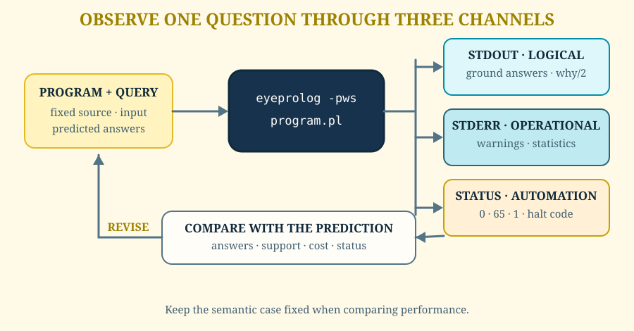
  <figcaption>The CLI exposes three independent channels. Compare each with the right prediction before revising the theory: answers and proofs on stdout, diagnostics on stderr, and status for the calling process.</figcaption>
</figure>

```text
eyeprolog
eyeprolog [options] [file-or-url.pl|- ...]
```

### Interactive queries

Run `eyeprolog` without arguments to enter the interactive top level. Queries
may span lines and end with a full stop, as in Scryer Prolog:

```text
?- use_module(library(lists)).
   true.
?- member(X, [prolog, logic]).
   X = prolog
;  X = logic.
?- halt.
```

When another answer exists in an interactive terminal, press `;`, Space, or
`n` to ask for it immediately; no Return is needed. Return or `.` stops
enumeration, `a` enumerates all remaining answers, and `f` advances to the
next five-answer boundary (5, 10, 15, ... displayed leaf answers), regardless
of how many answers were stepped through individually beforehand. `h` displays
the answer-control help. Enumeration of goal continuations is demand-driven:
after an answer is found, the top level does not execute a later program branch
or side effect merely to discover whether the current answer is the last one.
The solver's uniform choicepoint protocol uses explicit clause and control
frames, permits a one-answer buffer only for effect-free host relations, and
requires stateful or meta-control iterators to report their pending state
directly. Search that can perform an effect starts only after an answer-control
command asks to continue. Stopping enumeration closes any active
`call_cleanup/2` or
`setup_call_cleanup/3` protection exactly once; detecting that a choicepoint
remains does not execute that next branch. If an unresolved alternative
ultimately has no solution, asking for it may therefore finish with `false.`. In scripted non-TTY input, a new
query line implicitly stops the preceding answer enumeration without consuming
the new query; explicit `;`, `n`, Space, `a`, or `f` still requests more
answers. Once the top-level reader has accepted a complete query, the following
line begins with two spaces to mark active execution; a
third space appears when its result is ready for formatting. The answer prompt
is `;` with no trailing space while it waits for input; after an advance
command, one space marks active search and a second marks an answer ready for
formatting. While a query is actively computing, EyeProlog releases readline's
terminal signal handling: `Ctrl-C`
therefore terminates the current EyeProlog process immediately, and on POSIX
terminals `Ctrl-Z` suspends it in the usual shell-managed way. This remains a
host top-level convention rather than an ISO/IEC 13211-1 language feature. A
period-terminated query with no solutions prints `false.`. A solution without
visible variable bindings prints `true.` only when it also has no pending
residual goals. Residual constraints are part of the displayed answer even when
the attributed variable was created inside a called predicate and is not a
visible query variable; the top level assigns such variables generated names
like `_A`. For example, if `ffalse :- freeze(_, false).`, the query `ffalse.`
displays `freeze:freeze(_A, false).`, and
`call_residue_vars(ffalse, Vs).` displays
`Vs = [_A], freeze:freeze(_A, false).` rather than implying that the returned
variable is unconstrained. Answer substitutions are rendered as valid Prolog
syntax under the current operator table: when a bound value would
not be a valid right operand of the displayed `=/2`, EyeProlog adds parentheses,
for example `T = (a = b).` rather than the invalid `T = a = b.`. When an answer
ends in a graphic token, the top level inserts layout before its terminating
full stop so the two tokens cannot merge; for example `?- X = .* .` displays
`X = .* .`, not `X = .*.`. Use `[file].`, `['file.pl'].`, or
`consult(file).` to consult local source; `reconsult(file).` is accepted as a
compatibility alias. Use `halt.` or `halt(Status).` to leave the top level.
For an extensionless designation such as `[file].` or `consult(file).`, the
top level tries `file.pl` before the unsuffixed `file`. Both the shorthand and
`consult/1` have modern reconsult semantics: consulting the same resolved file
again replaces its previous source, so clauses removed from the file do not
remain active. The traditional `[user].` form consults source directly from the
top-level input until `end_of_file.` or input EOF, rather than resolving `user`
as a filesystem path; `consult(user).` and `reconsult(user).` use the same
interactive source.
When `read/1-2` or `read_term/2-3` actually reaches interactive
`user_input`, the top level requests the next full-stop-terminated Prolog term
with a `|: ` input prompt instead of treating the terminal stream as already
exhausted. The request is made at execution time, so multiple reads in one goal
and reads reached through user predicates work independently. For example:

```text
?- read(X), read(Y).
|: hello.
|: world.
   X = hello, Y = world.
```

Typing `Ctrl-D` at an empty `|: ` prompt makes that Prolog read return
`end_of_file`; it does not close the surrounding EyeProlog top-level loop, so a
new `?- ` query can still be entered afterwards. The top-level prompts and this
terminal EOF convention are host-interface behavior rather than part of
ISO/IEC 13211-1; terms supplied to the reads are parsed by the same ISO
term-input machinery as `read/1-2` and `read_term/2-3` on other text streams.
Up and Down recall queries from the current session. Explicit `eyeprolog -h`
displays command-line help.

### Selecting goals

A Prolog source file states facts, rules, and ISO directives; the command line
selects what to solve. Supply `-g` or `--goal` followed by a callable Prolog goal:

```sh
eyeprolog --goal 'ancestor(ada, Who)' examples/ancestor.pl
```

Repeat `-g` or `--goal` to request several result relations in one run. EyeProlog prints
their ground answers in the order the goals were supplied.
Use `--quiet` for command-style goals: Prolog output such as `write/1` remains
visible, while the resolved answer terms are suppressed.

For a self-running example, place the host goal in an ordinary comment:

```eyeprolog
%% goal: ancestor(ada, Who)
```

When no `-g` or `--goal` option is present, the CLI reads these comments from all
input sources and runs them in source order. An explicit goal option overrides them.
Because `%% goal:` is a comment rather than a Prolog directive, another ISO
processor may ignore it and the program remains portable Prolog text. External
goals are still preferable when a script, shell history, or API call should
make the observed question explicit.

| Option | Meaning |
| --- | --- |
| `-h`, `--help` | Show usage |
| `-p`, `--proof` | Print `why/2` explanations |
| `--proof-detail abstract|expanded` | Select library abstraction for proof output; implies `--proof` |
| `--verify-proof File` | Verify saved `why/2` proof certificates against the input program without proof search |
| `-q`, `--quads` | Run embedded quad tests and fail if any do not hold |
| `--quiet` | Suppress resolved answer terms while preserving Prolog output and diagnostics |
| `--iso-strict` | Restrict parsing and execution to ISO/IEC 13211-1:1995 + Corrigenda 1–3; reject EyeProlog language extensions (including `table` and `:+`) and disable bundled-library autoloading |
| `--portable` | Enforce the conservative EyeProlog/Trealla/Scryer interoperability profile |
| `--no-autoload` | Disable bundled-library predicate autoloading |
| `-s`, `--stats` | Print final solver and memory statistics to stderr after execution |
| `-v`, `--version` | Print the package version |
| `-w`, `--warnings` | Print non-fatal portability warnings |
| `-g`, `--goal Goal` | Solve a callable goal; may be repeated; overrides `%% goal:` comments |
| `--` | Treat following arguments as inputs |

Short flags may be combined, so `-pqw` is equivalent to `-p -q -w`.
`--iso-strict` cannot be combined with `--quads`, because quads and their
predefined infix `(?-)/2` form are an EyeProlog testing extension. Strict mode
retains the Part 1 prefix `(?-)/1` operator and treats `-->/2` as ordinary Part
1 operator syntax; it does not perform Part 3 grammar-rule expansion or expose
`phrase/2-3`. Part 2 module directives and EyeProlog libraries are rejected,
the implementation-specific `occurs_check` flag is absent, and the normal-profile
`table` declaration is unavailable. Normal mode continues to support Parts
2–3 and EyeProlog extensions, plus generated autoloading across the bundled
`src/lib/` library exports documented above.

Inputs may be local files, HTTP(S) URLs, or one `-` for stdin. The bare command
`eyeprolog` starts the normal REPL; `eyeprolog --iso-strict` starts the strict
core REPL. When options are present but no input is named, stdin is normally
used, but the strict-mode-only invocation is reserved for the REPL, so write
`eyeprolog --iso-strict -` explicitly when strict source should come from
stdin. Multiple sources are parsed as one program, so facts, rules, and
directives can be separated across files. A relative `include/1` inside a local
file resolves from that file's directory.

For example:

```sh
eyeprolog --iso-strict --goal 'p(X)' program.pl
eyeprolog --iso-strict
printf 'p(a).\n' | eyeprolog --iso-strict --goal 'p(X)' -
```

### A reproducible run

Work in a fixed sequence:

1. predict the ground answers before running the program;
2. run without observation flags and compare stdout with that prediction;
3. add `--proof` when the support for an answer is the question; save the
   output and use `--verify-proof` when the derivation itself must cross a
   process or review boundary;
4. add `--warnings` when portability or negative dependencies are the
   question; use `--portable` when non-profile dependencies must fail CI;
5. add `--stats` only when comparing two executions of the same semantic case.

For example:

```sh
eyeprolog --goal 'ancestor(X, Y)' examples/ancestor.pl
eyeprolog --proof --goal 'type(X, Y)' examples/socrates.pl
eyeprolog --proof examples/socrates.pl > socrates.why.pl
eyeprolog --verify-proof socrates.why.pl examples/socrates.pl
eyeprolog --warnings --goal 'answer(X)' test/conformance/warnings/negation/unstratified_mutual.pl
eyeprolog --portable --goal 'sudoku9_solution(S)' examples/clpz-sudoku-9x9.pl
eyeprolog --stats --goal 'path(a, X)' examples/path-discovery.pl > answers.pl 2> run.stats
```

Normal answers and `why/2` terms go to stdout, which makes them suitable for a
golden file or another EyeProlog input. Warnings and statistics go to stderr so
they do not corrupt that logical stream. A successful run normally exits with
status zero; loading, syntax, option, and other uncaught errors use status `1`. `halt/0-1` can deliberately choose the
process status from inside a program.

### Embedded quad tests

A quad places a query directly before a description of its expected top-level
answer. The answer is ordinary Prolog syntax rather than quoted text or a
comment, so a small test reads like the interaction it checks:

```eyeprolog
color(red).
color(green).

colors ?- color(X).
   X = red
;  X = green.

?- color(blue).
   false.
```

Run all quads in a file with `eyeprolog --quads file.pl` or `eyeprolog -q
file.pl`. A label such as `colors` is optional. A label is not a separate
mini-language: it is the ordinary first argument of `(?-)/2`, and therefore may
be any Prolog term admitted there by the normal term grammar. Quad execution
requires that argument to be ground; a non-ground label is reported as a quad
failure rather than aborting source parsing. Loading the file normally only
records its quads; it does not execute them or add their queries and answers as
program clauses. A quad run prints a summary and exits with status `1` when any
description fails. If no description fails but a bounded search cannot decide
an exact answer sequence, the case is reported separately as `UNDECIDED` and
the CLI exits with status `2`. Quad mode imports `library(prologue)` as a
compatibility prelude because the ISO Prolog working-example files use those
predicates as system predicates without an explicit module directive.

Unless the source explicitly selects another `unknown` flag, quad execution
uses `unknown=error`, so an undefined predicate is reported rather than being
accepted as a negative answer.

Answer descriptions support ordered answers separated by `;`, acceptable
alternatives separated by `|`, `true`, `false`, standard error descriptions,
and the `unexpected` annotation for an answer that must not occur (`inattendue`
is its synonym). In an ordered answer sequence, `unexpected` is a negative
assertion about the answer at that position: once the next observed answer does
not match the annotated leaf, that description succeeds and does not require the
query to have no further answers. Variables named in the query keep their
identity inside answer descriptions; variables introduced only by a description
are fresh. For example,
a query `throw(g(X))` is described by `throw(g(_X))`, while
`throw(g(X)), unexpected` verifies that ISO `throw/1` did not retain the query
variable in the renamed exception term. `...` and `ad_infinitum` accept further answers. The `maybe` annotation describes
a successful answer that still has at least one pending residual constraint. It
does not stand for an arbitrary answer and it does not weaken substitution
matching: `X = a, maybe` still requires the `X = a` substitution. Conversely, a
successful answer description without `maybe` requires that no residual
constraint remain. For example, a pending `dif/2` constraint can be checked as:

```eyeprolog
?- dif(X,Y), X = a.
   true, unexpected.
   X = a, unexpected.
   X = a, maybe.
   maybe, unexpected.
```

ISO arithmetic examples sometimes describe a floating result only as
"approximately equal" to a written decimal. Quad answer descriptions preserve
the precision of that spelling with `~~`: the right-hand side is a decimal atom,
so trailing zeroes remain significant. `V ~~ '14.2000'` accepts a **float** in
the closed decimal interval `14.19995` through `14.20005`; it does not accept an
integer term, even when that integer has the same mathematical value. Exponent
notation uses the last written mantissa digit in the same way, so `'1.42000e1'`
denotes the same interval. For example:

```eyeprolog
?- V is 0+(3.2+11).
   V ~~ '14.2000'.
```

`~~` is an EyeProlog normal-profile operator at priority 700 with specifier
`xfx`, matching the priority/specifier of ISO comparison operators such as `=`;
there is no built-in `~~/2` predicate. Quad answer descriptions interpret the
operator specially as approximate float matching.

An approximation is accepted as well-formed only when its exact decimal
interval contains at least three distinct, strictly ascending finite EyeProlog
floats: the minimum representable float in the interval, the float denoted by
the written midpoint, and the maximum representable float in the interval. This
prevents a decimal spelling from claiming precision finer than the
implementation can represent, including decimal spellings whose apparent
precision collapses to the same implementation float, and rejects ranges that
would require non-finite continuation values. Endpoint
selection is directed inward, so a binary rounding of a decimal bound cannot
admit a float that lies mathematically outside the closed decimal interval.

A numeric right-hand side such as `V ~~ 14.2000` is deliberately rejected
because parsing it as a float would discard the written decimal precision that
the check is intended to retain.

EyeProlog treats native variable constraints, attributed-variable residue, and
delayed goals as pending residue for this purpose. Multiple
indented descriptions after one query are independent checks: each re-runs the
query, each is counted in the `quads:` summary, and a failing description does
not suppress later descriptions for that query. `inputs/1` supplies and checks
exactly the characters consumed by the query. `peeks/1` may add one character
that is available for look-ahead but must remain unconsumed. The runner puts an
invalid-character sentinel immediately after the declared input boundary, so a
reader cannot accidentally use an artificial end-of-file to decide that a full
stop terminates the term. For example:

```eyeprolog
?- read(X).
   inputs("1."), X = 1, unexpected.
   inputs("1."), peeks(" "), X = 1.
   inputs("1. "), peeks(" "), X = 1, unexpected.
```

`outputs/1` checks characters emitted while reaching the described answer or
error, including output produced before a later exception. Its argument may be
an exact character list/string or a DCG body: terminal sequences,
conjunction/disjunction, `...`/`ad_infinitum` sequence wildcards, and
user-defined DCG nonterminals are matched against the captured characters.
Appending `| other_answer_sequence` accepts any permutation of the preceding
complete answer sequence. Substitutions, residual constraints, per-answer output,
and duplicate counts must still match; missing or extra answers are failures.
A final failure or exception stays at the end. Overlapping wildcard or approximate
answer descriptions are matched one-to-one rather than greedily. Search-budget
exhaustion remains undecided. Prefix (`...`), negative (`unexpected`), STO, and
input/wait annotations are not supported in a permuted sequence.

For `setof(1, (Y=2 ; Y=1), L)`, the description
`Y=2, L=[1] ; Y=1, L=[1] | other_answer_sequence` accepts either group order.

#### STO, loops, and undecided quad results

Following Trealla's quad convention, `sto` declares that a query is subject to
occurs-check. EyeProlog checks this conservatively rather than attempting a
complete STO/NSTO decision procedure. During the query's ordinary execution,
the finite-tree unifier records a concrete occurs-check event as positive STO
evidence; the query is not run a second time merely to probe STO-ness. A finite
execution that completes naturally without such an event disproves `sto`, while
a search or resource boundary leaves the declaration conservatively unchecked.
The answer portion of an `sto`-annotated leaf remains implementation-dependent
and is therefore not compared.

For example, the cyclic binding in the first query provides positive STO
evidence, whereas the second query is finite and cannot be STO:

```eyeprolog
?- X = s(X).
   X = ..., unexpected.
   false, unexpected.
   sto, false
|  sto, true.

?- true.
   sto.                  % fails: no STO evidence
```

When a quad declares STO and the execution observes an occurs-check event, an
unannotated `unexpected` leaf does not reject the implementation-dependent
finite-tree outcome. This is partial STO detection only: EyeProlog makes a
definite statement where execution provides definite evidence and otherwise
does not guess.

`loops` is kept distinct from merely exhausting the quad runner's resources.
EyeProlog accepts structural nontermination evidence such as an active-variant
recursion cycle, with the loop depth/inference bounds as a bounded fallback. A
structural cycle is also strong enough to refute a finite `false` description;
it is not reported as undecided merely because the same query was checked by a
different answer description:

```eyeprolog
inf :- inf, inf.

?- inf.
   loops.
```

Ordinary answer descriptions also have a finite inference budget (100000 by
default). Exhausting that budget does **not** establish `loops` and does not
turn an unfinished search into `false`; instead the description is reported as
`UNDECIDED`, for example:

```text
quads: UNDECIDED expensive_case, program.pl:12
   undecided: inference limit reached.
```

Thus quad execution has three useful outcomes: passed, failed, and undecided.
When there are no failures but at least one undecided description, the CLI exits
with status `2`. The JavaScript API may override the ordinary search budget with
`quadMaxInferences`; `loopMaxDepth` and `loopMaxInferences` control the explicit
`loops` probe.

The JavaScript API exposes the same operation without process I/O:

```js
import { Program, runQuads } from 'eyeprolog';

const program = Program.parse(source);
const report = runQuads(program);
console.log(report.passed, report.failed, report.undecided, report.stdout);
```

The syntax follows the “queries using answer descriptions” convention used by
Trealla and the ISO Prolog working examples. Because answer descriptions are
layout-sensitive, indent every description while keeping ordinary clause heads
and the next quad query at the left margin. A quad label may contain any number
of comma-separated metadata fields, including across layout before `?-`; for
example `9, "case", passes ?- Goal.` is one labelled query. Quad recognition
is structural after ordinary term parsing: functional, mixed, quoted-functor,
and parenthesized spellings of the same `?-/1` or `?-/2` term are semantically
equivalent. For example `?-(Label, Query).` and `(?-(Label, Query)).`, followed
by the same indented answer descriptions, create the same labelled quad as
`Label ?- Query.`.

Statistics are comparative evidence, not a score in isolation. Preserve the
program, input, runtime version, selected query, answers, and counters together.
An optimization is acceptable only when the intended answers remain unchanged
and the chosen resource measure improves on the relevant scale case.

### The corpus as executable documentation

The files under `examples/` pair readable programs with checked output under `examples/output/`. The conformance cases under `test/conformance/` focus on language behavior, including success, failure, errors, warnings, and file loading. Use an example to learn a modeling pattern and a conformance case to settle an exact processor question. Run `npm test` to execute the complete correctness corpus.

**Checkpoint.** Run one example with `--proof --stats`. Identify which bytes
belong to the reusable logical result, which describe this execution, and which
process status an automated caller observes. Then change one fact and predict
all three channels before rerunning it.

## 41. Study paths, review, and further examples

For a first week, run `socrates.pl` and `ancestor.pl`, rewrite them from memory,
inspect their proofs, learn `member/2`, `append/3`, and `select/3`, solve one
finite puzzle, and add one explicit integrity query.

### Course-length schedules

These schedules name a spine rather than a reading quota. Every meeting should
include prediction, execution, one changed input, and a short explanation.

| Meeting | Six-meeting introduction | Ten-meeting course | Fourteen-meeting course |
| --- | --- | --- | --- |
| 1 | Chapters 1–2; Socrates and family facts | Chapters 1–2; Laboratory 1 begins | Chapters 1–2; predicates, terms, and unification |
| 2 | Chapters 3–5; recursion and lists | Chapters 3–5; Laboratories 1–2 | Chapters 3–4; rules, semantics, and recursion |
| 3 | Chapters 6–10; one finite puzzle | Chapters 6–8; finite generation and absence | Chapters 5–6; lists and arithmetic |
| 4 | Chapters 11–14 and 17–20; proof, integrity, construction | Chapters 9–12; contexts, models, proofs, and integrity checks | Chapters 7–8; negation and aggregation |
| 5 | Choose Chapters 21–25 or 26–30 | Chapters 13–16; performance and boundaries | Chapters 9–10; structured data and finite models |
| 6 | Chapters 31–33; release matrix and reflection | Chapters 17–20; construction and improvement | Chapters 11–12; answers, proofs, and integrity |
| 7 | — | Chapters 21–25; one advanced case | Chapters 13–14; termination and knowledge engineering |
| 8 | — | Choose Chapters 26–30 | Choose Chapters 15–16 or an alternate domain route |
| 9 | — | Chapters 31–32; test and debug | Chapters 17–20; construction, correctness, improvement |
| 10 | — | Chapter 33; project review | Chapters 21–25; advanced relational design |
| 11 | — | — | Chapters 26–27; witnesses and induction |
| 12 | — | — | Chapters 28–30; representation, experiment, limits |
| 13 | — | — | Chapters 31–33; test, debug, patterns |
| 14 | — | — | Laboratory demonstrations and rubric review |

For a classroom, use checkpoints as exit questions and laboratories as
multi-meeting projects. A six-meeting introduction should prefer one small,
finished theory over hurried coverage of every feature.

### Domain routes

Modelers should study `access-control-policy.pl`,
`clinical-trial-screening.pl`, `gdpr-compliance.pl`, and
`trust-flow-provenance-threshold.pl`. Identify facts, derived concepts,
decisions, closed-world assumptions, and proof premises.

Algorithm students should study `graph-reachability.pl`,
`dijkstra-risk-path.pl`, `stable-marriage.pl`, `sat-solver-dpll.pl`, and
`type-inference.pl`. For each, identify the finite domain, branching relation,
pruning goals, witness, and termination argument.

Mathematics students should read Chapters 3, 19, and 26–30 together, then study
`peano-calculus.pl`, `fundamental-theorem-arithmetic.pl`,
`stirling-bell-numbers.pl`, `d3-group.pl`, and
`matrix-noncommutativity.pl`. For each program, distinguish definition from
theorem, computation from justification, finite evidence from universal proof,
and syntactic equality from the domain's mathematical equality.

### Review questions

Review questions:

1. What distinguishes an atom constant from an atomic formula?
2. Why can one append relation construct lists and split them?
3. When does goal order affect performance but not declarative meaning?
4. Why should variables usually be bound before `\+/1`?
5. What does explicit tabling solve, and when should a predicate remain depth-first?
6. Why is proof output useful when the answer is already known?
7. When should a host query an `invalid/1` relation before domain decisions?
8. Why should external data conversion remain outside the reasoning core?
9. In what sense is a ground query answer an existential witness?
10. Why are partial correctness, completeness, and termination three different
    claims?
11. When can exhaustive computation constitute a proof, and when is it only
    evidence?
12. Which parts of an answer's trust come from its proof, and which remain
    outside the formal theory?

### Further examples

<figure>
  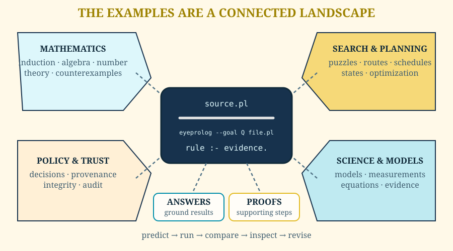
  <figcaption>The corpus is a connected landscape. Every path leads from a readable source program to checked answers and, for selected examples, checked proofs.</figcaption>
</figure>

The [examples directory](https://github.com/eyereasoner/eyeprolog/tree/main/examples/) is the book's executable companion. The
top-level directory contains **229 self-contained runnable programs**. Every
source program has an exact answer file under
[examples/output](https://github.com/eyereasoner/eyeprolog/tree/main/examples/output/), and **61 selected programs** have a checked
explanation under [examples/proof](https://github.com/eyereasoner/eyeprolog/tree/main/examples/proof/). The thematic lists link every top-level program and open the program
itself rather than merely naming it.

[`examples/book/`](https://github.com/eyereasoner/eyeprolog/tree/main/examples/book/) mirrors the inline EyeProlog displays chapter by chapter. Those files are checked for syntax, and displays containing queries are executed, but some teaching fragments deliberately depend on neighboring facts or helpers. Use the top-level examples when you want a self-contained program with a golden answer; use `examples/book/` when you want the exact display being discussed on a page.

For any named example, the three useful views are:

- **source:** the facts, rules, comments, and declared queries in
  the top-level examples directory;
- **answers:** the exact normal output in its `examples/output/` counterpart;
- **proof:** when present, the exact `--proof` output in
  the corresponding `examples/proof/` file.

Run one program directly:

```sh
node bin/eyeprolog.js examples/ancestor.pl
node bin/eyeprolog.js --proof examples/ancestor.pl
```

Then compare the result with its linked golden file. A productive reading
sequence is:

1. read the query declarations and predict their ground answers;
2. identify facts, base clauses, recursive clauses, and mode-sensitive
   built-ins;
3. state one intended mode and its finiteness argument;
4. run the program and compare with the answer golden;
5. inspect the proof, when supplied, and mark which source clauses support the
   conclusion;
6. change one fact or bound and predict the changed answer before rerunning.

#### Standard Prolog profile

These examples compose ISO facilities that isolated conformance cases test one
mode at a time.

| Program | Standard facility | Checked answer |
| --- | --- | --- |
| [CLP(B) Boolean circuit](https://github.com/eyereasoner/eyeprolog/blob/main/examples/clpb-boolean-circuit.pl) | A NOT/AND/OR XOR circuit is enumerated with `labeling/1`, then `taut/2` verifies equivalence to the XOR (`#`) specification. | [answers](https://github.com/eyereasoner/eyeprolog/blob/main/examples/output/clpb-boolean-circuit.pl) |
| [CLP(B) cardinality](https://github.com/eyereasoner/eyeprolog/blob/main/examples/clpb-cardinality.pl) | A two-of-four review quorum combines `card/2`, implication, exclusive-or, labeling, and model counting. | [answers](https://github.com/eyereasoner/eyeprolog/blob/main/examples/output/clpb-cardinality.pl) |
| [CLP(B) feature model](https://github.com/eyereasoner/eyeprolog/blob/main/examples/clpb-feature-model.pl) | Deployment-feature dependencies are expressed as Boolean constraints, enumerated with `labeling/1`, and counted directly with `sat_count/2`. | [answers](https://github.com/eyereasoner/eyeprolog/blob/main/examples/output/clpb-feature-model.pl) |
| [CLP(B) weighted planning](https://github.com/eyereasoner/eyeprolog/blob/main/examples/clpb-weighted-planning.pl) | A bounded release plan uses implications and cardinality constraints, then `weighted_maximum/3` selects the highest-value admissible feature set. | [answers](https://github.com/eyereasoner/eyeprolog/blob/main/examples/output/clpb-weighted-planning.pl) |
| [CLP(Z) factorial](https://github.com/eyereasoner/eyeprolog/blob/main/examples/clpz-factorial.pl) | Declarative predecessor and product constraints propagate a factorial without mode-sensitive `is/2`. | [answers](https://github.com/eyereasoner/eyeprolog/blob/main/examples/output/clpz-factorial.pl) |
| [CLP(Z) global constraints](https://github.com/eyereasoner/eyeprolog/blob/main/examples/clpz-global-constraints.pl) | Compatibility tables, lexicographic and serialized schedules, global cardinality with costs, circuits, value counting, and integer comparison. | [answers](https://github.com/eyereasoner/eyeprolog/blob/main/examples/output/clpz-global-constraints.pl) |
| [CLP(Z) N-queens](https://github.com/eyereasoner/eyeprolog/blob/main/examples/clpz-n-queens.pl) | A checked eight-queens witness using finite domains, delayed diagonal constraints, `all_distinct/1`, and first-fail labeling, plus a four-queens multi-solution search. | [answers](https://github.com/eyereasoner/eyeprolog/blob/main/examples/output/clpz-n-queens.pl) |
| [CLP(Z) resource allocation](https://github.com/eyereasoner/eyeprolog/blob/main/examples/clpz-resource-allocation.pl) | Resource assignment using `element/3`, `sum/3`, `scalar_product/4`, reification, labeling options, and domain reflection. | [answers](https://github.com/eyereasoner/eyeprolog/blob/main/examples/output/clpz-resource-allocation.pl) |
| [CLP(Z) Sudoku 9×9](https://github.com/eyereasoner/eyeprolog/blob/main/examples/clpz-sudoku-9x9.pl) | The AI Escargot 9×9 model with finite domains, 27 all-distinct constraints, and first-fail labeling; the default golden verifies its known solution while `sudoku9/1` remains the search relation. | [answers](https://github.com/eyereasoner/eyeprolog/blob/main/examples/output/clpz-sudoku-9x9.pl) |
| [Combinatorics Findall Sort](https://github.com/eyereasoner/eyeprolog/blob/main/examples/combinatorics-findall-sort.pl) | Eyelet-inspired combinations example using `findall/3` and ISO `sort/2`. | [answers](https://github.com/eyereasoner/eyeprolog/blob/main/examples/output/combinatorics-findall-sort.pl) |
| [Floating Point](https://github.com/eyereasoner/eyeprolog/blob/main/examples/floating-point.pl) | Floating-point arithmetic and comparisons. | [answers](https://github.com/eyereasoner/eyeprolog/blob/main/examples/output/floating-point.pl) · [proof](https://github.com/eyereasoner/eyeprolog/blob/main/examples/proof/floating-point.pl) |
| [Atomic conversion](https://github.com/eyereasoner/eyeprolog/blob/main/examples/iso-atomic-conversion.pl) | Atom splitting, character atoms, Unicode codes, and numeric parsing. | [answers](https://github.com/eyereasoner/eyeprolog/blob/main/examples/output/iso-atomic-conversion.pl) |
| [Control and errors](https://github.com/eyereasoner/eyeprolog/blob/main/examples/iso-control-and-errors.pl) | `call/1`, `once/1`, cut, if-then-else, `throw/1`, and `catch/3`. | [answers](https://github.com/eyereasoner/eyeprolog/blob/main/examples/output/iso-control-and-errors.pl) |
| [DCG command parser](https://github.com/eyereasoner/eyeprolog/blob/main/examples/dcg-command-parser.pl) | A Part 3 grammar parses token lists into application terms, generates tokens, preserves a remainder, and rejects malformed input. | [answers](https://github.com/eyereasoner/eyeprolog/blob/main/examples/output/dcg-command-parser.pl) |
| [DCG expression language](https://github.com/eyereasoner/eyeprolog/blob/main/examples/dcg-expression-language.pl) | A precedence-aware bidirectional grammar builds arithmetic ASTs, evaluates variable expressions, regenerates minimally parenthesized tokens, round-trips syntax, and preserves a remainder. | [answers](https://github.com/eyereasoner/eyeprolog/blob/main/examples/output/dcg-expression-language.pl) |
| [Dynamic database](https://github.com/eyereasoner/eyeprolog/blob/main/examples/iso-dynamic-database.pl) | Initialization and ordered updates to a declared dynamic procedure. | [answers](https://github.com/eyereasoner/eyeprolog/blob/main/examples/output/iso-dynamic-database.pl) · [proof](https://github.com/eyereasoner/eyeprolog/blob/main/examples/proof/iso-dynamic-database.pl) |
| [Grouped solutions](https://github.com/eyereasoner/eyeprolog/blob/main/examples/iso-grouped-solutions.pl) | `findall/3`, `bagof/3`, `setof/3`, existential qualification, and `clause/2`. | [answers](https://github.com/eyereasoner/eyeprolog/blob/main/examples/output/iso-grouped-solutions.pl) |
| [Integer arithmetic](https://github.com/eyereasoner/eyeprolog/blob/main/examples/iso-integer-arithmetic.pl) | Integer quotient/remainder choices plus bit operations. | [answers](https://github.com/eyereasoner/eyeprolog/blob/main/examples/output/iso-integer-arithmetic.pl) |
| [ISO extension pipeline audit](https://github.com/eyereasoner/eyeprolog/blob/main/examples/iso-extension-pipeline-audit.pl) | A bounded pipeline audit composing every `library(iso_ext)` relation: nested counting, universal validation, successor generation, difference-list collection, and schema comparison modulo variable names. | [answers](https://github.com/eyereasoner/eyeprolog/blob/main/examples/output/iso-extension-pipeline-audit.pl) |
| [ISO extensions](https://github.com/eyereasoner/eyeprolog/blob/main/examples/iso-extensions.pl) | Common control, collection, integer, and term-variant extensions from `library(iso_ext)`. | [answers](https://github.com/eyereasoner/eyeprolog/blob/main/examples/output/iso-extensions.pl) |
| [Operators](https://github.com/eyereasoner/eyeprolog/blob/main/examples/iso-operators.pl) | Custom syntax, standard term order, and operator-table inspection. | [answers](https://github.com/eyereasoner/eyeprolog/blob/main/examples/output/iso-operators.pl) · [proof](https://github.com/eyereasoner/eyeprolog/blob/main/examples/proof/iso-operators.pl) |
| [Portable library overlap](https://github.com/eyereasoner/eyeprolog/blob/main/examples/portable-library-overlap.pl) | Shared Scryer/Trealla interfaces for CLP(B), ordered sets, graphs, reification, delayed goals, generated names, character conversion, matrix transposition, and explicit table syntax. | [answers](https://github.com/eyereasoner/eyeprolog/blob/main/examples/output/portable-library-overlap.pl) |
| [Reflective terms](https://github.com/eyereasoner/eyeprolog/blob/main/examples/iso-reflective-terms.pl) | Term shape, construction, copying, variables, identity, and standard order. | [answers](https://github.com/eyereasoner/eyeprolog/blob/main/examples/output/iso-reflective-terms.pl) |
| [Term I/O](https://github.com/eyereasoner/eyeprolog/blob/main/examples/iso-term-io.pl) | Text-stream lifecycle, canonical writing, reading, metadata, and end state. | [answers](https://github.com/eyereasoner/eyeprolog/blob/main/examples/output/iso-term-io.pl) |
| [Term Tools](https://github.com/eyereasoner/eyeprolog/blob/main/examples/term-tools.pl) | Term-tool builtins for inspecting, constructing, rendering, and validating structured terms. | [answers](https://github.com/eyereasoner/eyeprolog/blob/main/examples/output/term-tools.pl) · [proof](https://github.com/eyereasoner/eyeprolog/blob/main/examples/proof/term-tools.pl) |

Read these beside Part VIII. Then use the ISO conformance cases when a program
depends on the exact failure or error behavior of a particular mode.

#### First encounters

These programs isolate one idea at a time. Read them before the larger case
studies.

| Program | What to notice | Checked companions |
| --- | --- | --- |
| [Age](https://github.com/eyereasoner/eyeprolog/blob/main/examples/age.pl) | Arithmetic comparison acts as a filter after a fact supplies the age. | [answers](https://github.com/eyereasoner/eyeprolog/blob/main/examples/output/age.pl) · [proof](https://github.com/eyereasoner/eyeprolog/blob/main/examples/proof/age.pl) |
| [Ancestor](https://github.com/eyereasoner/eyeprolog/blob/main/examples/ancestor.pl) | The canonical base-plus-recursive definition computes a transitive family relation. | [answers](https://github.com/eyereasoner/eyeprolog/blob/main/examples/output/ancestor.pl) · [proof](https://github.com/eyereasoner/eyeprolog/blob/main/examples/proof/ancestor.pl) |
| [Animal](https://github.com/eyereasoner/eyeprolog/blob/main/examples/animal.pl) | Several clauses form a small classification theory with inspectable reasons. | [answers](https://github.com/eyereasoner/eyeprolog/blob/main/examples/output/animal.pl) · [proof](https://github.com/eyereasoner/eyeprolog/blob/main/examples/proof/animal.pl) |
| [Annotation](https://github.com/eyereasoner/eyeprolog/blob/main/examples/annotation.pl) | Terms attach descriptive data while the logical relation remains ordinary. | [answers](https://github.com/eyereasoner/eyeprolog/blob/main/examples/output/annotation.pl) · [proof](https://github.com/eyereasoner/eyeprolog/blob/main/examples/proof/annotation.pl) |
| [Backward](https://github.com/eyereasoner/eyeprolog/blob/main/examples/backward.pl) | A tiny derived fact justified by a numeric comparison in an ordinary Horn rule. | [answers](https://github.com/eyereasoner/eyeprolog/blob/main/examples/output/backward.pl) · [proof](https://github.com/eyereasoner/eyeprolog/blob/main/examples/proof/backward.pl) |
| [Cat Koko](https://github.com/eyereasoner/eyeprolog/blob/main/examples/cat-koko.pl) | Named Skolem-style witnesses standing in for the existential witnesses of the original N3 example. | [answers](https://github.com/eyereasoner/eyeprolog/blob/main/examples/output/cat-koko.pl) · [proof](https://github.com/eyereasoner/eyeprolog/blob/main/examples/proof/cat-koko.pl) |
| [Derived rule](https://github.com/eyereasoner/eyeprolog/blob/main/examples/derived-rule.pl) | A conclusion depends on another derived predicate rather than directly on a source fact. | [answers](https://github.com/eyereasoner/eyeprolog/blob/main/examples/output/derived-rule.pl) · [proof](https://github.com/eyereasoner/eyeprolog/blob/main/examples/proof/derived-rule.pl) |
| [Dog](https://github.com/eyereasoner/eyeprolog/blob/main/examples/dog.pl) | A compact inheritance chain shows how intermediate concepts appear in a proof. | [answers](https://github.com/eyereasoner/eyeprolog/blob/main/examples/output/dog.pl) · [proof](https://github.com/eyereasoner/eyeprolog/blob/main/examples/proof/dog.pl) |
| [Existential rule](https://github.com/eyereasoner/eyeprolog/blob/main/examples/existential-rule.pl) | Structured Herbrand terms carry explicit generated witnesses. | [answers](https://github.com/eyereasoner/eyeprolog/blob/main/examples/output/existential-rule.pl) · [proof](https://github.com/eyereasoner/eyeprolog/blob/main/examples/proof/existential-rule.pl) |
| [Good cobbler](https://github.com/eyereasoner/eyeprolog/blob/main/examples/good-cobbler.pl) | Multiple premises combine into a conclusion without hidden mutation or control state. | [answers](https://github.com/eyereasoner/eyeprolog/blob/main/examples/output/good-cobbler.pl) · [proof](https://github.com/eyereasoner/eyeprolog/blob/main/examples/proof/good-cobbler.pl) |
| [Herbrand Semantics](https://github.com/eyereasoner/eyeprolog/blob/main/examples/herbrand-semantics.pl) | Herbrand terms denote themselves: distinct names and constructor applications remain distinct without extra unique-name or free-constructor axioms. | [answers](https://github.com/eyereasoner/eyeprolog/blob/main/examples/output/herbrand-semantics.pl) · [proof](https://github.com/eyereasoner/eyeprolog/blob/main/examples/proof/herbrand-semantics.pl) |
| [Herbrand witnesses](https://github.com/eyereasoner/eyeprolog/blob/main/examples/herbrand-witnesses.pl) | Functional witness terms make existential structure and syntactic identity visible in both answers and derivations. | [answers](https://github.com/eyereasoner/eyeprolog/blob/main/examples/output/herbrand-witnesses.pl) · [proof](https://github.com/eyereasoner/eyeprolog/blob/main/examples/proof/herbrand-witnesses.pl) |
| [Reusable built-ins](https://github.com/eyereasoner/eyeprolog/blob/main/examples/reusable-builtins.pl) | Arithmetic, strings, lists, and term inspection compose through ordinary variables. | [answers](https://github.com/eyereasoner/eyeprolog/blob/main/examples/output/reusable-builtins.pl) · [proof](https://github.com/eyereasoner/eyeprolog/blob/main/examples/proof/reusable-builtins.pl) |
| [Skolem Functions](https://github.com/eyereasoner/eyeprolog/blob/main/examples/skolem-functions.pl) | Skolem functional terms in rule heads. | [answers](https://github.com/eyereasoner/eyeprolog/blob/main/examples/output/skolem-functions.pl) |
| [SNAF](https://github.com/eyereasoner/eyeprolog/blob/main/examples/snaf.pl) | Negation as failure establishes that Alice does not hate Bob before deriving that she hates Nobody. | [answers](https://github.com/eyereasoner/eyeprolog/blob/main/examples/output/snaf.pl) · [proof](https://github.com/eyereasoner/eyeprolog/blob/main/examples/proof/snaf.pl) |
| [Socrates](https://github.com/eyereasoner/eyeprolog/blob/main/examples/socrates.pl) | A fact and one rule turn the classical syllogism into a ground derivation. | [answers](https://github.com/eyereasoner/eyeprolog/blob/main/examples/output/socrates.pl) · [proof](https://github.com/eyereasoner/eyeprolog/blob/main/examples/proof/socrates.pl) |
| [UUID](https://github.com/eyereasoner/eyeprolog/blob/main/examples/uuid.pl) | `uuid/3` reproducibly creates one version 4 UUID atom from explicit random state; the example validates its canonical shape. | [answers](https://github.com/eyereasoner/eyeprolog/blob/main/examples/output/uuid.pl) |
| [Witch](https://github.com/eyereasoner/eyeprolog/blob/main/examples/witch.pl) | Burn the witch, adapted from Eyeling's examples/witch.n3. | [answers](https://github.com/eyereasoner/eyeprolog/blob/main/examples/output/witch.pl) · [proof](https://github.com/eyereasoner/eyeprolog/blob/main/examples/proof/witch.pl) |

Suggested path: Socrates → Age → Ancestor → Derived rule → Reusable built-ins.
At each step, say aloud what one ground instance of every predicate means.

#### Recursion, lists, and graph closure

These examples make termination arguments visible. Compare structural descent,
visited-state search, and fixed-point tabling rather than treating all
recursion as one technique.

| Program | What to notice | Checked companions |
| --- | --- | --- |
| [Chart parser](https://github.com/eyereasoner/eyeprolog/blob/main/examples/chart-parser.pl) | A finite chart represents shared parsing subproblems and recursive grammatical structure. | [answers](https://github.com/eyereasoner/eyeprolog/blob/main/examples/output/chart-parser.pl) · [proof](https://github.com/eyereasoner/eyeprolog/blob/main/examples/proof/chart-parser.pl) |
| [Cyclic path](https://github.com/eyereasoner/eyeprolog/blob/main/examples/cyclic-path.pl) | A deliberately cyclic graph exposes repeated calls and the need for disciplined recursion. | [answers](https://github.com/eyereasoner/eyeprolog/blob/main/examples/output/cyclic-path.pl) |
| [Deep taxonomy: 10](https://github.com/eyereasoner/eyeprolog/blob/main/examples/deep-taxonomy-10.pl) | A small generated hierarchy is readable by hand and establishes the benchmark shape. | [answers](https://github.com/eyereasoner/eyeprolog/blob/main/examples/output/deep-taxonomy-10.pl) |
| [Deep Taxonomy 100](https://github.com/eyereasoner/eyeprolog/blob/main/examples/deep-taxonomy-100.pl) | A 100-step taxonomy chain that exercises deep recursive closure and side-label derivation. | [answers](https://github.com/eyereasoner/eyeprolog/blob/main/examples/output/deep-taxonomy-100.pl) |
| [Deep taxonomy: 1,000](https://github.com/eyereasoner/eyeprolog/blob/main/examples/deep-taxonomy-1000.pl) | The same logical theory tests indexing and recursive closure at a realistic depth. | [answers](https://github.com/eyereasoner/eyeprolog/blob/main/examples/output/deep-taxonomy-1000.pl) |
| [Deep Taxonomy 10000](https://github.com/eyereasoner/eyeprolog/blob/main/examples/deep-taxonomy-10000.pl) | A 10,000-step taxonomy chain used as a large-depth ordinary-recursion and closure stress test. | [answers](https://github.com/eyereasoner/eyeprolog/blob/main/examples/output/deep-taxonomy-10000.pl) |
| [Deep taxonomy: 100,000](https://github.com/eyereasoner/eyeprolog/blob/main/examples/deep-taxonomy-100000.pl) | A stress case separates semantic simplicity from implementation scale. | [answers](https://github.com/eyereasoner/eyeprolog/blob/main/examples/output/deep-taxonomy-100000.pl) |
| [Family cousins](https://github.com/eyereasoner/eyeprolog/blob/main/examples/family-cousins.pl) | Several relational joins derive kinship beyond a simple transitive closure. | [answers](https://github.com/eyereasoner/eyeprolog/blob/main/examples/output/family-cousins.pl) |
| [Graph reachability](https://github.com/eyereasoner/eyeprolog/blob/main/examples/graph-reachability.pl) | A visited list bounds cyclic traversal and makes explicit negative test cases finite. | [answers](https://github.com/eyereasoner/eyeprolog/blob/main/examples/output/graph-reachability.pl) · [proof](https://github.com/eyereasoner/eyeprolog/blob/main/examples/proof/graph-reachability.pl) |
| [Graph](https://github.com/eyereasoner/eyeprolog/blob/main/examples/graph.pl) | Productive right-recursive transitive closure over a directed map, contrasted with an under-generating left-recursive formulation. | [answers](https://github.com/eyereasoner/eyeprolog/blob/main/examples/output/graph.pl) |
| [List collection](https://github.com/eyereasoner/eyeprolog/blob/main/examples/list-collection.pl) | `findall/3`, list construction, and aggregation turn a solution stream into data. | [answers](https://github.com/eyereasoner/eyeprolog/blob/main/examples/output/list-collection.pl) · [proof](https://github.com/eyereasoner/eyeprolog/blob/main/examples/proof/list-collection.pl) |
| [Path discovery](https://github.com/eyereasoner/eyeprolog/blob/main/examples/path-discovery.pl) | Witness paths, not only endpoint pairs, are constructed during a larger graph search. | [answers](https://github.com/eyereasoner/eyeprolog/blob/main/examples/output/path-discovery.pl) |
| [Service Impact](https://github.com/eyereasoner/eyeprolog/blob/main/examples/service-impact.pl) | Practical cyclic recursion: incident impact analysis for a service dependency graph. | [answers](https://github.com/eyereasoner/eyeprolog/blob/main/examples/output/service-impact.pl) |

Read the three taxonomy programs as one experiment: the mathematical relation
does not change as the data scale changes. Any difference in runtime belongs
to control, indexing, memory, and table management.

#### Finite search, puzzles, and optimization

The central question for every program in this group is: what exactly is the
finite search space, and which constraint removes which branches?

| Program | Search design | Checked answer |
| --- | --- | --- |
| [Dijkstra Findall Sort](https://github.com/eyereasoner/eyeprolog/blob/main/examples/dijkstra-findall-sort.pl) | Eyelet-inspired Dijkstra example using `findall/3` and ISO `sort/2`. | [answers](https://github.com/eyereasoner/eyeprolog/blob/main/examples/output/dijkstra-findall-sort.pl) |
| [Dijkstra](https://github.com/eyereasoner/eyeprolog/blob/main/examples/dijkstra.pl) | Weighted path enumeration adapted from Eyeling dijkstra.n3. | [answers](https://github.com/eyereasoner/eyeprolog/blob/main/examples/output/dijkstra.pl) |
| [DONALD + GERALD = ROBERT](https://github.com/eyereasoner/eyeprolog/blob/main/examples/donald-gerald-robert.pl) | All ten decimal digits are assigned to ten distinct letters. Right-to-left carry propagation cuts a naive 10! search space to one solution. | [answers](https://github.com/eyereasoner/eyeprolog/blob/main/examples/output/donald-gerald-robert.pl) |
| [Enigma1225](https://github.com/eyereasoner/eyeprolog/blob/main/examples/enigma1225.pl) | New Scientist Enigma 1225, retaining the best board in one pass with `aggregate_max/5`. | [answers](https://github.com/eyereasoner/eyeprolog/blob/main/examples/output/enigma1225.pl) |
| [Eulerian path](https://github.com/eyereasoner/eyeprolog/blob/main/examples/eulerian-path.pl) | The state tracks remaining edges rather than merely visited vertices. | [answers](https://github.com/eyereasoner/eyeprolog/blob/main/examples/output/eulerian-path.pl) |
| [Four-color map](https://github.com/eyereasoner/eyeprolog/blob/main/examples/four-color-map.pl) | A finite color assignment is filtered by adjacency constraints. | [answers](https://github.com/eyereasoner/eyeprolog/blob/main/examples/output/four-color-map.pl) |
| [Hamiltonian path](https://github.com/eyereasoner/eyeprolog/blob/main/examples/hamiltonian-path.pl) | A witness must visit every vertex exactly once; path construction and global coverage meet. | [answers](https://github.com/eyereasoner/eyeprolog/blob/main/examples/output/hamiltonian-path.pl) |
| [Job-shop scheduling](https://github.com/eyereasoner/eyeprolog/blob/main/examples/job-shop-scheduling.pl) | Resource and precedence constraints interact in a larger finite schedule space. | [answers](https://github.com/eyereasoner/eyeprolog/blob/main/examples/output/job-shop-scheduling.pl) |
| [Knapsack optimization](https://github.com/eyereasoner/eyeprolog/blob/main/examples/knapsack-optimization.pl) | Candidate subsets become feasible solutions, then aggregation selects a best value. | [answers](https://github.com/eyereasoner/eyeprolog/blob/main/examples/output/knapsack-optimization.pl) |
| [Map Four Color Search](https://github.com/eyereasoner/eyeprolog/blob/main/examples/map-four-color-search.pl) | Four-colour search for the European Union neighbour graph. | [answers](https://github.com/eyereasoner/eyeprolog/blob/main/examples/output/map-four-color-search.pl) |
| [Markov Logic Network](https://github.com/eyereasoner/eyeprolog/blob/main/examples/markov-logic-network.pl) | Markov Logic Network style scoring over a tiny finite domain. | [answers](https://github.com/eyereasoner/eyeprolog/blob/main/examples/output/markov-logic-network.pl) |
| [Matrix Chain Order](https://github.com/eyereasoner/eyeprolog/blob/main/examples/matrix-chain-order.pl) | Matrix-chain multiplication order by explicitly tabled interval dynamic programming. | [answers](https://github.com/eyereasoner/eyeprolog/blob/main/examples/output/matrix-chain-order.pl) |
| [Register allocation](https://github.com/eyereasoner/eyeprolog/blob/main/examples/register-allocation.pl) | Interference constraints turn compiler allocation into graph coloring. | [answers](https://github.com/eyereasoner/eyeprolog/blob/main/examples/output/register-allocation.pl) |
| [SEND + MORE = MONEY](https://github.com/eyereasoner/eyeprolog/blob/main/examples/send-more-money.pl) | Digit assignments are generated under distinctness, leading-zero, and column constraints. | [answers](https://github.com/eyereasoner/eyeprolog/blob/main/examples/output/send-more-money.pl) |
| [Stable marriage](https://github.com/eyereasoner/eyeprolog/blob/main/examples/stable-marriage.pl) | Preference data, matching generation, and the absence of blocking pairs define stability. | [answers](https://github.com/eyereasoner/eyeprolog/blob/main/examples/output/stable-marriage.pl) |
| [Weighted interval scheduling](https://github.com/eyereasoner/eyeprolog/blob/main/examples/weighted-interval-scheduling.pl) | Compatibility constraints and an ordered objective select a maximum-value schedule. | [answers](https://github.com/eyereasoner/eyeprolog/blob/main/examples/output/weighted-interval-scheduling.pl) · [proof](https://github.com/eyereasoner/eyeprolog/blob/main/examples/proof/weighted-interval-scheduling.pl) |
| [Zebra puzzle](https://github.com/eyereasoner/eyeprolog/blob/main/examples/zebra.pl) | House records, adjacency relations, and clue constraints jointly determine the famous solution. | [answers](https://github.com/eyereasoner/eyeprolog/blob/main/examples/output/zebra.pl) |

A useful comparative exercise is to draw the first three levels of the search
tree for N-Queens, SEND + MORE = MONEY, DONALD + GERALD = ROBERT, and
Knapsack. Mark whether each branching decision chooses a permutation element,
assigns a digit, derives a carry-constrained digit, or includes an item. The
syntax is similar; the combinatorial objects and pruning strength are different.

#### Planning and state transition

Planning programs represent a world state as a term, define legal transitions,
and search for a sequence whose final state satisfies a goal.

| Program | State-space idea | Checked answer |
| --- | --- | --- |
| [Allen Interval Calculus](https://github.com/eyereasoner/eyeprolog/blob/main/examples/allen-interval-calculus.pl) | Allen interval relations over integer time offsets, with interval records kept as scoped data. | [answers](https://github.com/eyereasoner/eyeprolog/blob/main/examples/output/allen-interval-calculus.pl) |
| [Blocks world](https://github.com/eyereasoner/eyeprolog/blob/main/examples/blocks-world-planning.pl) | Symbolic actions transform a compact arrangement of blocks. | [answers](https://github.com/eyereasoner/eyeprolog/blob/main/examples/output/blocks-world-planning.pl) |
| [Critical-path schedule](https://github.com/eyereasoner/eyeprolog/blob/main/examples/critical-path-schedule.pl) | Dependency closure and duration arithmetic derive project timing. | [answers](https://github.com/eyereasoner/eyeprolog/blob/main/examples/output/critical-path-schedule.pl) |
| [Dijkstra Risk Path](https://github.com/eyereasoner/eyeprolog/blob/main/examples/dijkstra-risk-path.pl) | Risk-adjusted route selection that combines delivery cost, accumulated risk, path length, and a trust gate. | [answers](https://github.com/eyereasoner/eyeprolog/blob/main/examples/output/dijkstra-risk-path.pl) |
| [Dining Philosophers](https://github.com/eyereasoner/eyeprolog/blob/main/examples/dining-philosophers.pl) | Chandy-Misra dining philosophers trace adapted from Eyeling dining-philosophers.n3. | [answers](https://github.com/eyereasoner/eyeprolog/blob/main/examples/output/dining-philosophers.pl) |
| [Drone corridor planner](https://github.com/eyereasoner/eyeprolog/blob/main/examples/drone-corridor-planner.pl) | Route feasibility combines graph structure with domain restrictions. | [answers](https://github.com/eyereasoner/eyeprolog/blob/main/examples/output/drone-corridor-planner.pl) |
| [GPS](https://github.com/eyereasoner/eyeprolog/blob/main/examples/gps.pl) | Route planning over scoped map data, accumulating actions, duration, cost, belief, and comfort. | [answers](https://github.com/eyereasoner/eyeprolog/blob/main/examples/output/gps.pl) |
| [Gray Code Counter](https://github.com/eyereasoner/eyeprolog/blob/main/examples/gray-code-counter.pl) | Gray-code counter adapted from Eyeling gray-code-counter.n3. | [answers](https://github.com/eyereasoner/eyeprolog/blob/main/examples/output/gray-code-counter.pl) |
| [Hanoi](https://github.com/eyereasoner/eyeprolog/blob/main/examples/hanoi.pl) | A recursive plan mirrors the inductive structure of moving a tower. | [answers](https://github.com/eyereasoner/eyeprolog/blob/main/examples/output/hanoi.pl) · [proof](https://github.com/eyereasoner/eyeprolog/blob/main/examples/proof/hanoi.pl) |
| [Lee routing](https://github.com/eyereasoner/eyeprolog/blob/main/examples/lee.pl) | Breadth-first wave expansion reaches a destination on a grid, then reconstructs a path around rectangular obstacles using the standard list relations. | [answers](https://github.com/eyereasoner/eyeprolog/blob/main/examples/output/lee.pl) |
| [Microgrid dispatch](https://github.com/eyereasoner/eyeprolog/blob/main/examples/microgrid-dispatch.pl) | Candidate operating decisions are checked against supply, demand, and engineering limits. | [answers](https://github.com/eyereasoner/eyeprolog/blob/main/examples/output/microgrid-dispatch.pl) |
| [Missionaries and cannibals](https://github.com/eyereasoner/eyeprolog/blob/main/examples/missionaries-cannibals.pl) | Numeric state constraints must hold on both banks after every crossing. | [answers](https://github.com/eyereasoner/eyeprolog/blob/main/examples/output/missionaries-cannibals.pl) |
| [Monkey and bananas](https://github.com/eyereasoner/eyeprolog/blob/main/examples/monkey-bananas.pl) | Actions change location, support, and possession facts until the goal becomes true. | [answers](https://github.com/eyereasoner/eyeprolog/blob/main/examples/output/monkey-bananas.pl) |
| [Route planning](https://github.com/eyereasoner/eyeprolog/blob/main/examples/route-planning.pl) | Weighted edges construct candidate routes and expose the chosen path as a witness. | [answers](https://github.com/eyereasoner/eyeprolog/blob/main/examples/output/route-planning.pl) |
| [Wolf, goat, and cabbage](https://github.com/eyereasoner/eyeprolog/blob/main/examples/wolf-goat-cabbage.pl) | Safety invariants reject river-bank states before they enter a valid plan. | [answers](https://github.com/eyereasoner/eyeprolog/blob/main/examples/output/wolf-goat-cabbage.pl) |

Compare the witness shape: Hanoi returns an inductively constructed move list;
route planning returns a graph path; Lee routing reconstructs a path from
breadth-first wave layers; Blocks world and the river puzzles expose a sequence
of whole states. Representation determines which plan properties are easy to
check.

#### Mathematics as relations

These examples accompany Part VI. They range from executable definitions to
finite counterexample searches. Do not call every computed result a theorem:
state which domain was exhausted and which general property was proved only by
the clauses.

| Program | Mathematical content | Checked answer |
| --- | --- | --- |
| [Ackermann](https://github.com/eyereasoner/eyeprolog/blob/main/examples/ackermann.pl) | Ackermann-style fast-growing recursion benchmark adapted from Eyeling `ackermann.n3`. | [answers](https://github.com/eyereasoner/eyeprolog/blob/main/examples/output/ackermann.pl) |
| [Binomial Vandermonde](https://github.com/eyereasoner/eyeprolog/blob/main/examples/binomial-vandermonde.pl) | Two finite sums compute the sides of Vandermonde's identity. | [answers](https://github.com/eyereasoner/eyeprolog/blob/main/examples/output/binomial-vandermonde.pl) |
| [Catalan convolution](https://github.com/eyereasoner/eyeprolog/blob/main/examples/catalan-convolution.pl) | A classic convolution identity is evaluated over a bounded range. | [answers](https://github.com/eyereasoner/eyeprolog/blob/main/examples/output/catalan-convolution.pl) |
| [Collatz 1000](https://github.com/eyereasoner/eyeprolog/blob/main/examples/collatz-1000.pl) | Collatz conjecture suite translated from Eyeling's examples/collatz-1000.n3. | [answers](https://github.com/eyereasoner/eyeprolog/blob/main/examples/output/collatz-1000.pl) |
| [Complex](https://github.com/eyereasoner/eyeprolog/blob/main/examples/complex.pl) | Complex numbers, adapted from Eyeling complex.n3. | [answers](https://github.com/eyereasoner/eyeprolog/blob/main/examples/output/complex.pl) |
| [Composition Of Injective Functions Is Injective](https://github.com/eyereasoner/eyeprolog/blob/main/examples/composition-of-injective-functions-is-injective.pl) | Composition of injective functions is injective, adapted from Eyeling's examples/composition-of-injective-functions-is-injective.n3. | [answers](https://github.com/eyereasoner/eyeprolog/blob/main/examples/output/composition-of-injective-functions-is-injective.pl) · [proof](https://github.com/eyereasoner/eyeprolog/blob/main/examples/proof/composition-of-injective-functions-is-injective.pl) |
| [Continued Fraction Sqrt2](https://github.com/eyereasoner/eyeprolog/blob/main/examples/continued-fraction-sqrt2.pl) | Convergents of sqrt(2) by explicitly tabled recurrence. | [answers](https://github.com/eyereasoner/eyeprolog/blob/main/examples/output/continued-fraction-sqrt2.pl) |
| [D3 group](https://github.com/eyereasoner/eyeprolog/blob/main/examples/d3-group.pl) | A finite Cayley table, inverses, and subgroup closure make group laws executable. | [answers](https://github.com/eyereasoner/eyeprolog/blob/main/examples/output/d3-group.pl) · [proof](https://github.com/eyereasoner/eyeprolog/blob/main/examples/proof/d3-group.pl) |
| [Diamond Property](https://github.com/eyereasoner/eyeprolog/blob/main/examples/diamond-property.pl) | Diamond property, adapted from Eyelet's input/diamond-property.pl. | [answers](https://github.com/eyereasoner/eyeprolog/blob/main/examples/output/diamond-property.pl) · [proof](https://github.com/eyereasoner/eyeprolog/blob/main/examples/proof/diamond-property.pl) |
| [Easter Computus](https://github.com/eyereasoner/eyeprolog/blob/main/examples/easter-computus.pl) | Gregorian Easter computus adapted from Eyeling's easter.n3. | [answers](https://github.com/eyereasoner/eyeprolog/blob/main/examples/output/easter-computus.pl) |
| [Equivalence Classes Overlap Implies Same Class](https://github.com/eyereasoner/eyeprolog/blob/main/examples/equivalence-classes-overlap-implies-same-class.pl) | Equivalence-class overlap example adapted from Eyeling. | [answers](https://github.com/eyereasoner/eyeprolog/blob/main/examples/output/equivalence-classes-overlap-implies-same-class.pl) · [proof](https://github.com/eyereasoner/eyeprolog/blob/main/examples/proof/equivalence-classes-overlap-implies-same-class.pl) |
| [Fast exponentiation](https://github.com/eyereasoner/eyeprolog/blob/main/examples/fastpow.pl) | Algebraic decomposition by parity changes a linear recurrence into logarithmic-depth recursion. | [answers](https://github.com/eyereasoner/eyeprolog/blob/main/examples/output/fastpow.pl) |
| [Fibonacci](https://github.com/eyereasoner/eyeprolog/blob/main/examples/fibonacci.pl) | A recurrence becomes an executable relation with a visibly decreasing argument. | [answers](https://github.com/eyereasoner/eyeprolog/blob/main/examples/output/fibonacci.pl) |
| [Fundamental theorem of arithmetic](https://github.com/eyereasoner/eyeprolog/blob/main/examples/fundamental-theorem-arithmetic.pl) | Two factorization strategies construct normalized prime-factor witnesses and check reconstruction. | [answers](https://github.com/eyereasoner/eyeprolog/blob/main/examples/output/fundamental-theorem-arithmetic.pl) |
| [Goldbach](https://github.com/eyereasoner/eyeprolog/blob/main/examples/goldbach.pl) | Bounded search checks Goldbach decompositions for powers of two using the portable Prolog primality relation. | [answers](https://github.com/eyereasoner/eyeprolog/blob/main/examples/output/goldbach.pl) |
| [Greatest lower bound uniqueness](https://github.com/eyereasoner/eyeprolog/blob/main/examples/greatest-lower-bound-uniqueness.pl) | Order-theoretic definitions support a uniqueness argument. | [answers](https://github.com/eyereasoner/eyeprolog/blob/main/examples/output/greatest-lower-bound-uniqueness.pl) · [proof](https://github.com/eyereasoner/eyeprolog/blob/main/examples/proof/greatest-lower-bound-uniqueness.pl) |
| [Group inverse uniqueness](https://github.com/eyereasoner/eyeprolog/blob/main/examples/group-inverse-uniqueness.pl) | A short derivation exposes the algebraic premises needed for uniqueness. | [answers](https://github.com/eyereasoner/eyeprolog/blob/main/examples/output/group-inverse-uniqueness.pl) · [proof](https://github.com/eyereasoner/eyeprolog/blob/main/examples/proof/group-inverse-uniqueness.pl) |
| [Heron Theorem](https://github.com/eyereasoner/eyeprolog/blob/main/examples/heron-theorem.pl) | Heron's theorem: area = sqrt(s(s-a)(s-b)(s-c)). | [answers](https://github.com/eyereasoner/eyeprolog/blob/main/examples/output/heron-theorem.pl) |
| [Integer partitions](https://github.com/eyereasoner/eyeprolog/blob/main/examples/integer-partitions.pl) | Recursive generation constructs unordered additive decompositions without permutation duplicates. | [answers](https://github.com/eyereasoner/eyeprolog/blob/main/examples/output/integer-partitions.pl) |
| [Law Of Cosines](https://github.com/eyereasoner/eyeprolog/blob/main/examples/law-of-cosines.pl) | Law of cosines: c^2 = a^2 + b^2 - 2ab cos(C). | [answers](https://github.com/eyereasoner/eyeprolog/blob/main/examples/output/law-of-cosines.pl) |
| [Matrix noncommutativity](https://github.com/eyereasoner/eyeprolog/blob/main/examples/matrix-noncommutativity.pl) | Two concrete products provide a counterexample to universal commutativity. | [answers](https://github.com/eyereasoner/eyeprolog/blob/main/examples/output/matrix-noncommutativity.pl) |
| [Modular exponentiation](https://github.com/eyereasoner/eyeprolog/blob/main/examples/modular-exponentiation.pl) | Intermediate reduction preserves the residue while controlling numeric growth. | [answers](https://github.com/eyereasoner/eyeprolog/blob/main/examples/output/modular-exponentiation.pl) |
| [Newton Raphson](https://github.com/eyereasoner/eyeprolog/blob/main/examples/newton-raphson.pl) | Newton-Raphson root finding, adapted from Eyelet input/newton-raphson.pl. | [answers](https://github.com/eyereasoner/eyeprolog/blob/main/examples/output/newton-raphson.pl) |
| [Peano arithmetic](https://github.com/eyereasoner/eyeprolog/blob/main/examples/peano-arithmetic.pl) | Explicit natural-number terms support arithmetic relations and structural recursion. | [answers](https://github.com/eyereasoner/eyeprolog/blob/main/examples/output/peano-arithmetic.pl) |
| [Peano calculus](https://github.com/eyereasoner/eyeprolog/blob/main/examples/peano-calculus.pl) | Addition, multiplication, and factorial follow the constructors `z` and `s/1`. | [answers](https://github.com/eyereasoner/eyeprolog/blob/main/examples/output/peano-calculus.pl) |
| [Peasant](https://github.com/eyereasoner/eyeprolog/blob/main/examples/peasant.pl) | Peasant multiplication and exponentiation cases, adapted from Eyelet. | [answers](https://github.com/eyereasoner/eyeprolog/blob/main/examples/output/peasant.pl) |
| [Pell equation](https://github.com/eyereasoner/eyeprolog/blob/main/examples/pell-equation.pl) | Bounded generation searches for integer witnesses to a Diophantine equation. | [answers](https://github.com/eyereasoner/eyeprolog/blob/main/examples/output/pell-equation.pl) |
| [Pi](https://github.com/eyereasoner/eyeprolog/blob/main/examples/pi.pl) | The Nilakantha series is a deterministic numeric recurrence; EyeProlog recognizes its accumulator shape and executes 10,000 terms without tabling or heap growth. | [answers](https://github.com/eyereasoner/eyeprolog/blob/main/examples/output/pi.pl) |
| [Prime range](https://github.com/eyereasoner/eyeprolog/blob/main/examples/prime-range.pl) | Bounded integer generation and divisor tests enumerate primes over an explicit finite interval. | [answers](https://github.com/eyereasoner/eyeprolog/blob/main/examples/output/prime-range.pl) · [proof](https://github.com/eyereasoner/eyeprolog/blob/main/examples/proof/prime-range.pl) |
| [Quadratic Formula](https://github.com/eyereasoner/eyeprolog/blob/main/examples/quadratic-formula.pl) | Quadratic formula over sample equations. | [answers](https://github.com/eyereasoner/eyeprolog/blob/main/examples/output/quadratic-formula.pl) |
| [Riemann Hypothesis](https://github.com/eyereasoner/eyeprolog/blob/main/examples/riemann-hypothesis.pl) | A deliberately finite audit of catalogued non-trivial zeros, illustrating the boundary between evidence and universal proof. | [answers](https://github.com/eyereasoner/eyeprolog/blob/main/examples/output/riemann-hypothesis.pl) |
| [Shoelace Polygon Area](https://github.com/eyereasoner/eyeprolog/blob/main/examples/shoelace-polygon-area.pl) | Polygon area by the shoelace formula. | [answers](https://github.com/eyereasoner/eyeprolog/blob/main/examples/output/shoelace-polygon-area.pl) |
| [Sieve](https://github.com/eyereasoner/eyeprolog/blob/main/examples/sieve.pl) | List filtering presents a different operational route to finite prime generation. | [answers](https://github.com/eyereasoner/eyeprolog/blob/main/examples/output/sieve.pl) |
| [Stirling and Bell numbers](https://github.com/eyereasoner/eyeprolog/blob/main/examples/stirling-bell-numbers.pl) | Inclusion–exclusion and recurrence count set partitions in two related ways. | [answers](https://github.com/eyereasoner/eyeprolog/blob/main/examples/output/stirling-bell-numbers.pl) |
| [Takeuchi](https://github.com/eyereasoner/eyeprolog/blob/main/examples/takeuchi.pl) | The Takeuchi function as a demanding nested-recursion benchmark. | [answers](https://github.com/eyereasoner/eyeprolog/blob/main/examples/output/takeuchi.pl) |
| [Totient summatory function](https://github.com/eyereasoner/eyeprolog/blob/main/examples/totient-summatory.pl) | Divisibility, coprimality, counting, and summation compose over finite domains. | [answers](https://github.com/eyereasoner/eyeprolog/blob/main/examples/output/totient-summatory.pl) |

For a focused seminar, read Peano calculus, Fast exponentiation, D3 group,
Matrix noncommutativity, and Fundamental theorem of arithmetic. They exhibit,
respectively, structural induction, program improvement by algebra, finite
model checking, refutation by one witness, and witness-producing number theory.

#### Symbolic mathematics, languages, and metaprogramming

Here terms denote syntax, formulas, expressions, or programs. The crucial
discipline is to keep object language and EyeProlog metalanguage distinct.

| Program | What the terms represent | Checked answer |
| --- | --- | --- |
| [SAT solver: CDCL](https://github.com/eyereasoner/eyeprolog/blob/main/examples/cdcl-sat-solver.pl) | The example extends the SAT vocabulary toward conflicts and learned information. | [answers](https://github.com/eyereasoner/eyeprolog/blob/main/examples/output/cdcl-sat-solver.pl) |
| [Chart parser](https://github.com/eyereasoner/eyeprolog/blob/main/examples/chart-parser.pl) | Shared chart items prevent grammatical subproblems from being rediscovered independently. | [answers](https://github.com/eyereasoner/eyeprolog/blob/main/examples/output/chart-parser.pl) · [proof](https://github.com/eyereasoner/eyeprolog/blob/main/examples/proof/chart-parser.pl) |
| [Context Schema Audit](https://github.com/eyereasoner/eyeprolog/blob/main/examples/context-schema-audit.pl) | Schema auditing for heterogeneous context terms by decomposing members with `=../2` and checking predicate arity. | [answers](https://github.com/eyereasoner/eyeprolog/blob/main/examples/output/context-schema-audit.pl) |
| [Derived Backward Rule](https://github.com/eyereasoner/eyeprolog/blob/main/examples/derived-backward-rule.pl) | Derived backward rule example adapted from Eyeling derived-backward-rule.n3. | [answers](https://github.com/eyereasoner/eyeprolog/blob/main/examples/output/derived-backward-rule.pl) · [proof](https://github.com/eyereasoner/eyeprolog/blob/main/examples/proof/derived-backward-rule.pl) |
| [Equality saturation](https://github.com/eyereasoner/eyeprolog/blob/main/examples/equality-saturation.pl) | Repeated rewrite closure explores equivalent symbolic forms to a fixed point. | [answers](https://github.com/eyereasoner/eyeprolog/blob/main/examples/output/equality-saturation.pl) |
| [Expression evaluator](https://github.com/eyereasoner/eyeprolog/blob/main/examples/expression-eval.pl) | Arithmetic expression trees are interpreted under an explicit environment. | [answers](https://github.com/eyereasoner/eyeprolog/blob/main/examples/output/expression-eval.pl) · [proof](https://github.com/eyereasoner/eyeprolog/blob/main/examples/proof/expression-eval.pl) |
| [Fast Fourier Transform](https://github.com/eyereasoner/eyeprolog/blob/main/examples/fast-fourier-transform.pl) | Recursive evaluation builds a shared expression tree and treats graphic operators such as `+` and `*` as data atoms. | [answers](https://github.com/eyereasoner/eyeprolog/blob/main/examples/output/fast-fourier-transform.pl) |
| [Intuitionistic Logic Kripke](https://github.com/eyereasoner/eyeprolog/blob/main/examples/intuitionistic-logic-kripke.pl) | Intuitionistic logic emulation with a finite Kripke model. | [answers](https://github.com/eyereasoner/eyeprolog/blob/main/examples/output/intuitionistic-logic-kripke.pl) · [proof](https://github.com/eyereasoner/eyeprolog/blob/main/examples/proof/intuitionistic-logic-kripke.pl) |
| [Knuth–Bendix completion](https://github.com/eyereasoner/eyeprolog/blob/main/examples/knuth-bendix-completion.pl) | Oriented equations and critical interactions seek a more canonical rewrite system. | [answers](https://github.com/eyereasoner/eyeprolog/blob/main/examples/output/knuth-bendix-completion.pl) |
| [Language](https://github.com/eyereasoner/eyeprolog/blob/main/examples/language.pl) | A small grammar recognizes a finite relational language. | [answers](https://github.com/eyereasoner/eyeprolog/blob/main/examples/output/language.pl) |
| [Linear Logic Resources](https://github.com/eyereasoner/eyeprolog/blob/main/examples/linear-logic-resources.pl) | Linear logic emulation with explicit consumable resources. | [answers](https://github.com/eyereasoner/eyeprolog/blob/main/examples/output/linear-logic-resources.pl) · [proof](https://github.com/eyereasoner/eyeprolog/blob/main/examples/proof/linear-logic-resources.pl) |
| [Modal Logic Kripke](https://github.com/eyereasoner/eyeprolog/blob/main/examples/modal-logic-kripke.pl) | Modal logic emulation with a finite Kripke frame. | [answers](https://github.com/eyereasoner/eyeprolog/blob/main/examples/output/modal-logic-kripke.pl) · [proof](https://github.com/eyereasoner/eyeprolog/blob/main/examples/proof/modal-logic-kripke.pl) |
| [Partial evaluator](https://github.com/eyereasoner/eyeprolog/blob/main/examples/partial-evaluator.pl) | Known inputs specialize an expression or program while unknown parts remain symbolic. | [answers](https://github.com/eyereasoner/eyeprolog/blob/main/examples/output/partial-evaluator.pl) · [proof](https://github.com/eyereasoner/eyeprolog/blob/main/examples/proof/partial-evaluator.pl) |
| [Polynomial](https://github.com/eyereasoner/eyeprolog/blob/main/examples/polynomial.pl) | Structured coefficients and powers support symbolic polynomial operations. | [answers](https://github.com/eyereasoner/eyeprolog/blob/main/examples/output/polynomial.pl) |
| [Proof Contrapositive](https://github.com/eyereasoner/eyeprolog/blob/main/examples/proof-contrapositive.pl) | Proof by contrapositive example adapted from Eyelet input/proof-by-contrapositive.pl. | [answers](https://github.com/eyereasoner/eyeprolog/blob/main/examples/output/proof-contrapositive.pl) · [proof](https://github.com/eyereasoner/eyeprolog/blob/main/examples/proof/proof-contrapositive.pl) |
| [Quine–McCluskey](https://github.com/eyereasoner/eyeprolog/blob/main/examples/quine-mccluskey.pl) | Boolean minimization with the Quine–McCluskey method, including essential implicants and deterministic cover selection. | [answers](https://github.com/eyereasoner/eyeprolog/blob/main/examples/output/quine-mccluskey.pl) |
| [SAT solver: DPLL](https://github.com/eyereasoner/eyeprolog/blob/main/examples/sat-solver-dpll.pl) | Formula representation, assignment, simplification, and branching form a compact solver. | [answers](https://github.com/eyereasoner/eyeprolog/blob/main/examples/output/sat-solver-dpll.pl) |
| [Symbolic derivative](https://github.com/eyereasoner/eyeprolog/blob/main/examples/symbolic-derivative.pl) | Differentiation rules transform expression trees without evaluating them numerically; the proof golden exposes the recursive construction. | [answers](https://github.com/eyereasoner/eyeprolog/blob/main/examples/output/symbolic-derivative.pl) · [proof](https://github.com/eyereasoner/eyeprolog/blob/main/examples/proof/symbolic-derivative.pl) |
| [Turing machine](https://github.com/eyereasoner/eyeprolog/blob/main/examples/turing.pl) | Machine configuration terms and transition rules expose a classical computation model. | [answers](https://github.com/eyereasoner/eyeprolog/blob/main/examples/output/turing.pl) |

Inspect the outermost functor of every data term. In the derivative example it
names an expression constructor; in the SAT examples it names logical syntax;
in the Turing example it helps describe a machine configuration. None of those
nested terms is automatically asserted as an EyeProlog goal.

#### Program analysis and verification

These programs make programs or system configurations the subject of
reasoning.

| Program | Analysis idea | Checked answer |
| --- | --- | --- |
| [Abstract interpretation](https://github.com/eyereasoner/eyeprolog/blob/main/examples/abstract-interpretation.pl) | A finite sign domain conservatively approximates many concrete executions. | [answers](https://github.com/eyereasoner/eyeprolog/blob/main/examples/output/abstract-interpretation.pl) |
| [Cache performance](https://github.com/eyereasoner/eyeprolog/blob/main/examples/cache-performance.pl) | Configuration and workload facts derive performance classifications and reasons. | [answers](https://github.com/eyereasoner/eyeprolog/blob/main/examples/output/cache-performance.pl) · [proof](https://github.com/eyereasoner/eyeprolog/blob/main/examples/proof/cache-performance.pl) |
| [Canary release](https://github.com/eyereasoner/eyeprolog/blob/main/examples/canary-release.pl) | Observations and thresholds support a deployment decision with auditable evidence. | [answers](https://github.com/eyereasoner/eyeprolog/blob/main/examples/output/canary-release.pl) · [proof](https://github.com/eyereasoner/eyeprolog/blob/main/examples/proof/canary-release.pl) |
| [Network SLA](https://github.com/eyereasoner/eyeprolog/blob/main/examples/network-sla.pl) | Technology example: network path SLA check. | [answers](https://github.com/eyereasoner/eyeprolog/blob/main/examples/output/network-sla.pl) |
| [Observability log correlation](https://github.com/eyereasoner/eyeprolog/blob/main/examples/observability-log-correlation.pl) | Structured log events join across identifiers and time-related facts. | [answers](https://github.com/eyereasoner/eyeprolog/blob/main/examples/output/observability-log-correlation.pl) |
| [Pointer analysis](https://github.com/eyereasoner/eyeprolog/blob/main/examples/pointer-analysis.pl) | Allocation and assignment constraints derive a points-to relation by closure. | [answers](https://github.com/eyereasoner/eyeprolog/blob/main/examples/output/pointer-analysis.pl) |
| [Register allocation](https://github.com/eyereasoner/eyeprolog/blob/main/examples/register-allocation.pl) | Liveness interference becomes a finite coloring problem. | [answers](https://github.com/eyereasoner/eyeprolog/blob/main/examples/output/register-allocation.pl) |
| [Relational Cube Lookup](https://github.com/eyereasoner/eyeprolog/blob/main/examples/relational-cube-lookup.pl) | Performance example: repeated multi-key relational lookups. | [answers](https://github.com/eyereasoner/eyeprolog/blob/main/examples/output/relational-cube-lookup.pl) |
| [Security incident correlation](https://github.com/eyereasoner/eyeprolog/blob/main/examples/security-incident-correlation.pl) | Distributed observations combine into incident conclusions. | [answers](https://github.com/eyereasoner/eyeprolog/blob/main/examples/output/security-incident-correlation.pl) · [proof](https://github.com/eyereasoner/eyeprolog/blob/main/examples/proof/security-incident-correlation.pl) |
| [Truth-maintenance system](https://github.com/eyereasoner/eyeprolog/blob/main/examples/truth-maintenance-system.pl) | Justifications remain explicit when conclusions depend on defeasible information. | [answers](https://github.com/eyereasoner/eyeprolog/blob/main/examples/output/truth-maintenance-system.pl) |
| [Type inference](https://github.com/eyereasoner/eyeprolog/blob/main/examples/type-inference.pl) | Structural unification solves type constraints for a tiny expression language. | [answers](https://github.com/eyereasoner/eyeprolog/blob/main/examples/output/type-inference.pl) |
| [Vulnerability Impact](https://github.com/eyereasoner/eyeprolog/blob/main/examples/vulnerability-impact.pl) | Vulnerability impact analysis over a transitive dependency graph. | [answers](https://github.com/eyereasoner/eyeprolog/blob/main/examples/output/vulnerability-impact.pl) |

Abstract interpretation deserves special care: an abstract warning is not the
claim that every concrete execution fails. It says the abstraction cannot rule
the failure out. The direction of approximation is part of the theorem.

#### Policies, provenance, and auditable decisions

These examples are best read in layers: source facts, normalized concepts,
decisions, reasons, integrity conditions, and proof.

| Program | Decision domain | Checked companions |
| --- | --- | --- |
| [Access control policy](https://github.com/eyereasoner/eyeprolog/blob/main/examples/access-control-policy.pl) | Attribute and policy facts derive permit status and reasons. | [answers](https://github.com/eyereasoner/eyeprolog/blob/main/examples/output/access-control-policy.pl) · [proof](https://github.com/eyereasoner/eyeprolog/blob/main/examples/proof/access-control-policy.pl) |
| [Clinical-trial screening](https://github.com/eyereasoner/eyeprolog/blob/main/examples/clinical-trial-screening.pl) | Inclusion and exclusion criteria produce an evidence-backed eligibility result. | [answers](https://github.com/eyereasoner/eyeprolog/blob/main/examples/output/clinical-trial-screening.pl) · [proof](https://github.com/eyereasoner/eyeprolog/blob/main/examples/proof/clinical-trial-screening.pl) |
| [Data negotiation](https://github.com/eyereasoner/eyeprolog/blob/main/examples/data-negotiation.pl) | Offered and required data conditions derive an agreement or mismatch. | [answers](https://github.com/eyereasoner/eyeprolog/blob/main/examples/output/data-negotiation.pl) · [proof](https://github.com/eyereasoner/eyeprolog/blob/main/examples/proof/data-negotiation.pl) |
| [Defeasible reasoning](https://github.com/eyereasoner/eyeprolog/blob/main/examples/defeasible-reasoning.pl) | A reimbursement policy overrides defaults by specificity, then compares three ways to handle one unresolved conflict between two independent defaults: an unstratified `\+/1` cycle, `tnot/1` with WFS's `undefined`, and this codebase's usual explicit conflict predicate. | [answers](https://github.com/eyereasoner/eyeprolog/blob/main/examples/output/defeasible-reasoning.pl) |
| [Deontic Logic](https://github.com/eyereasoner/eyeprolog/blob/main/examples/deontic-logic.pl) | Deontic logic: obligations, prohibitions, compensations, and violations. | [answers](https://github.com/eyereasoner/eyeprolog/blob/main/examples/output/deontic-logic.pl) · [proof](https://github.com/eyereasoner/eyeprolog/blob/main/examples/proof/deontic-logic.pl) |
| [GDPR compliance](https://github.com/eyereasoner/eyeprolog/blob/main/examples/gdpr-compliance.pl) | Purpose, basis, and processing facts support compliance conclusions. | [answers](https://github.com/eyereasoner/eyeprolog/blob/main/examples/output/gdpr-compliance.pl) · [proof](https://github.com/eyereasoner/eyeprolog/blob/main/examples/proof/gdpr-compliance.pl) |
| [Illegitimate Reasoning](https://github.com/eyereasoner/eyeprolog/blob/main/examples/illegitimate-reasoning.pl) | Illegitimate reasoning detector. | [answers](https://github.com/eyereasoner/eyeprolog/blob/main/examples/output/illegitimate-reasoning.pl) |
| [Integrity check](https://github.com/eyereasoner/eyeprolog/blob/main/examples/integrity-check.pl) | An explicit invalid-state relation reports contradictory input and a diagnostic status. | [answers](https://github.com/eyereasoner/eyeprolog/blob/main/examples/output/integrity-check.pl) · [proof](https://github.com/eyereasoner/eyeprolog/blob/main/examples/proof/integrity-check.pl) |
| [Nixon Diamond](https://github.com/eyereasoner/eyeprolog/blob/main/examples/nixon-diamond.pl) | Nixon diamond: two independent defaults support incompatible conclusions. | [answers](https://github.com/eyereasoner/eyeprolog/blob/main/examples/output/nixon-diamond.pl) · [proof](https://github.com/eyereasoner/eyeprolog/blob/main/examples/proof/nixon-diamond.pl) |
| [Trust-flow provenance threshold](https://github.com/eyereasoner/eyeprolog/blob/main/examples/trust-flow-provenance-threshold.pl) | Provenance and trust values remain premises of the derived threshold decision, including its arithmetic and comparison steps. | [answers](https://github.com/eyereasoner/eyeprolog/blob/main/examples/output/trust-flow-provenance-threshold.pl) · [proof](https://github.com/eyereasoner/eyeprolog/blob/main/examples/proof/trust-flow-provenance-threshold.pl) |
| [Workplace compliance](https://github.com/eyereasoner/eyeprolog/blob/main/examples/workplace-compliance.pl) | Training, role, and workplace conditions feed a compact compliance theory. | [answers](https://github.com/eyereasoner/eyeprolog/blob/main/examples/output/workplace-compliance.pl) |

When studying a policy proof, circle every premise imported from outside the
theory. The derivation validates the transition from those premises to the
decision; it does not authenticate the source by itself.

This explicit separation between premises, rules, questions, alternatives, and proofs is also why Prolog is a natural human-facing layer. It is not a model of the whole brain, but its computational vocabulary is unusually close to the way people communicate deliberate reasoning: assert something, state a generalization, ask a question, consider another answer, reject an alternative, and explain why. The symbiotic KG example uses that closeness as an interface between machine proposals and human judgment rather than treating the model's latent state as the shared source of truth.

#### RDF 1.2 and policy roundtrips

These programs combine generated `rdf/4` source facts with ISO Prolog rules
adapted from the `rdf-prolog-interchange` example corpus. Each query materializes
ground RDF-shaped results that can be serialized back to RDF.

The [Symbiotic Knowledge Graphs](https://github.com/eyereasoner/eyeprolog/blob/main/examples/deck/symbiotic-knowledge-graphs.md) example extends the same boundary into a human/AI feedback loop. Named graphs preserve source and governance context, RDF 1.2 triple terms carry AI-proposed statements without asserting them, EyeProlog decides which claims become operational knowledge, and `result_rdf/4` materializes accepted knowledge and derived decisions for conversion back to RDF.

| Program | Roundtrip idea | Checked answer |
| --- | --- | --- |
| [Cross-organization data sharing](https://github.com/eyereasoner/eyeprolog/blob/main/examples/cross-organization-data-sharing.pl) | Combine ODRL/DPV policy, recipient properties, safeguards, jurisdiction, and retention into permit, deny, or review decisions with obligations. | [answers](https://github.com/eyereasoner/eyeprolog/blob/main/examples/output/cross-organization-data-sharing.pl) · [deck](https://github.com/eyereasoner/eyeprolog/blob/main/examples/deck/cross-organization-data-sharing.md) |
| [Explainable EV-depot configuration](https://github.com/eyereasoner/eyeprolog/blob/main/examples/explainable-ev-depot-configuration.pl) | Select a compatible charger while deriving blockers and reversible required changes from the same relational rules. | [answers](https://github.com/eyereasoner/eyeprolog/blob/main/examples/output/explainable-ev-depot-configuration.pl) · [deck](https://github.com/eyereasoner/eyeprolog/blob/main/examples/deck/explainable-ev-depot-configuration.md) |
| [DPV–ODRL purpose mapping](https://github.com/eyereasoner/eyeprolog/blob/main/examples/dpv-odrl-purpose-mapping.pl) | Verify six correspondences between a DPV process and an ODRL policy. | [answers](https://github.com/eyereasoner/eyeprolog/blob/main/examples/output/dpv-odrl-purpose-mapping.pl) |
| [ODRL–DPV–FPV trust flow](https://github.com/eyereasoner/eyeprolog/blob/main/examples/odrl-dpv-fpv-trust-flow.pl) | Combine policy rules and trust scores into permit, review, and deny decisions. | [answers](https://github.com/eyereasoner/eyeprolog/blob/main/examples/output/odrl-dpv-fpv-trust-flow.pl) |
| [ODRL–DPV healthcare risk ranking](https://github.com/eyereasoner/eyeprolog/blob/main/examples/odrl-dpv-healthcare-risk-ranked.pl) | Detect and rank healthcare-policy risks with clauses and mitigations. | [answers](https://github.com/eyereasoner/eyeprolog/blob/main/examples/output/odrl-dpv-healthcare-risk-ranked.pl) |
| [ODRL–DPV consumer risk ranking](https://github.com/eyereasoner/eyeprolog/blob/main/examples/odrl-dpv-risk-ranked.pl) | Score consumer-policy conflicts and return a deterministic risk ranking. | [answers](https://github.com/eyereasoner/eyeprolog/blob/main/examples/output/odrl-dpv-risk-ranked.pl) |
| [ODRL policy](https://github.com/eyereasoner/eyeprolog/blob/main/examples/odrl-policy.pl) | Read one purpose-constrained permission from an ODRL policy graph. | [answers](https://github.com/eyereasoner/eyeprolog/blob/main/examples/output/odrl-policy.pl) |
| [Advanced ODRL policy](https://github.com/eyereasoner/eyeprolog/blob/main/examples/odrl-policy-advanced.pl) | Evaluate permission, duty, constraint failure, and prohibition outcomes. | [answers](https://github.com/eyereasoner/eyeprolog/blob/main/examples/output/odrl-policy-advanced.pl) |
| [ODRL policy reasoning](https://github.com/eyereasoner/eyeprolog/blob/main/examples/odrl-policy-reasoning.pl) | Query action relationships, rule and enforcement outcomes, conflict strategies and kinds, action/rule/policy subsumption, and three-valued WFS defaults. | [answers](https://github.com/eyereasoner/eyeprolog/blob/main/examples/output/odrl-policy-reasoning.pl) |
| [RDF 1.2 annotated claims](https://github.com/eyereasoner/eyeprolog/blob/main/examples/rdf12-annotated-claims.pl) | Rank conflicting annotated claims by confidence and source trust. | [answers](https://github.com/eyereasoner/eyeprolog/blob/main/examples/output/rdf12-annotated-claims.pl) |
| [RDF 1.2 annotation](https://github.com/eyereasoner/eyeprolog/blob/main/examples/rdf12-annotation.pl) | Recover an asserted triple together with its reifier and annotations. | [answers](https://github.com/eyereasoner/eyeprolog/blob/main/examples/output/rdf12-annotation.pl) |
| [RDF 1.2 directional language](https://github.com/eyereasoner/eyeprolog/blob/main/examples/rdf12-directional-language.pl) | Preserve language and base-direction metadata in derived labels. | [answers](https://github.com/eyereasoner/eyeprolog/blob/main/examples/output/rdf12-directional-language.pl) |
| [RDF 1.2 nested triple term](https://github.com/eyereasoner/eyeprolog/blob/main/examples/rdf12-nested-triple-term.pl) | Match nested triple terms and derive the innermost relationship. | [answers](https://github.com/eyereasoner/eyeprolog/blob/main/examples/output/rdf12-nested-triple-term.pl) |
| [RDF 1.2 TriG graph join](https://github.com/eyereasoner/eyeprolog/blob/main/examples/rdf12-trig-graph-join.pl) | Join default-graph metadata with measurements from a named graph. | [answers](https://github.com/eyereasoner/eyeprolog/blob/main/examples/output/rdf12-trig-graph-join.pl) |
| [RDF 1.2 TriG named graph](https://github.com/eyereasoner/eyeprolog/blob/main/examples/rdf12-trig-named-graph.pl) | Derive ancestor relationships inside the source named graph. | [answers](https://github.com/eyereasoner/eyeprolog/blob/main/examples/output/rdf12-trig-named-graph.pl) |
| [RDF 1.2 TriG triple term](https://github.com/eyereasoner/eyeprolog/blob/main/examples/rdf12-trig-triple-term.pl) | Project a triple term while retaining its named-graph context. | [answers](https://github.com/eyereasoner/eyeprolog/blob/main/examples/output/rdf12-trig-triple-term.pl) |
| [RDF 1.2 triple term](https://github.com/eyereasoner/eyeprolog/blob/main/examples/rdf12-triple-term.pl) | Project a triple term into an ordinary asserted relationship. | [answers](https://github.com/eyereasoner/eyeprolog/blob/main/examples/output/rdf12-triple-term.pl) |
| [Operational incident response](https://github.com/eyereasoner/eyeprolog/blob/main/examples/operational-incident-response.pl) | Correlate symptoms and telemetry through a service dependency graph to derive root cause, transitive impact, evidence, and a guarded failover action. | [answers](https://github.com/eyereasoner/eyeprolog/blob/main/examples/output/operational-incident-response.pl) · [deck](https://github.com/eyereasoner/eyeprolog/blob/main/examples/deck/operational-incident-response.md) |
| [SBOM vulnerability response](https://github.com/eyereasoner/eyeprolog/blob/main/examples/sbom-vulnerability-response.pl) | Traverse transitive dependencies, apply severity and waiver policy, expose the exact vulnerable path, and derive an upgrade action. | [answers](https://github.com/eyereasoner/eyeprolog/blob/main/examples/output/sbom-vulnerability-response.pl) · [deck](https://github.com/eyereasoner/eyeprolog/blob/main/examples/deck/sbom-vulnerability-response.md) |
| [Scientific evidence graph](https://github.com/eyereasoner/eyeprolog/blob/main/examples/scientific-evidence-graph.pl) | Use RDF 1.2 triple terms plus study metadata to distinguish supported claims, lower-quality counterevidence, and genuinely contested conclusions. | [answers](https://github.com/eyereasoner/eyeprolog/blob/main/examples/output/scientific-evidence-graph.pl) · [deck](https://github.com/eyereasoner/eyeprolog/blob/main/examples/deck/scientific-evidence-graph.md) |
| [Symbiotic Knowledge Graphs](https://github.com/eyereasoner/eyeprolog/blob/main/examples/symbiotic-knowledge-graph.pl) | Roundtrip a city heatwave KG through RDF 1.2 triple-term proposals, human review, explicit Prolog governance, and materialized decisions. | [answers](https://github.com/eyereasoner/eyeprolog/blob/main/examples/output/symbiotic-knowledge-graph.pl) · [deck](https://github.com/eyereasoner/eyeprolog/blob/main/examples/deck/symbiotic-knowledge-graphs.md) |

#### Science, engineering, and numerical models

These examples make mathematical assumptions operational. Their values are
illustrative models, not professional engineering or medical advice.

| Program | Model | Checked companions |
| --- | --- | --- |
| [Bayes Diagnosis](https://github.com/eyereasoner/eyeprolog/blob/main/examples/bayes-diagnosis.pl) | Bayesian diagnosis adapted from Eyeling bayes-diagnosis.n3. | [answers](https://github.com/eyereasoner/eyeprolog/blob/main/examples/output/bayes-diagnosis.pl) · [proof](https://github.com/eyereasoner/eyeprolog/blob/main/examples/proof/bayes-diagnosis.pl) |
| [Bayes Therapy](https://github.com/eyereasoner/eyeprolog/blob/main/examples/bayes-therapy.pl) | Memoize shared inference layers: the score vector, disease likelihood tails, and expected therapy success are reused by several report relations. | [answers](https://github.com/eyereasoner/eyeprolog/blob/main/examples/output/bayes-therapy.pl) |
| [Beam deflection](https://github.com/eyereasoner/eyeprolog/blob/main/examples/beam-deflection.pl) | A mechanics equation combines load, geometry, and material parameters. | [answers](https://github.com/eyereasoner/eyeprolog/blob/main/examples/output/beam-deflection.pl) · [proof](https://github.com/eyereasoner/eyeprolog/blob/main/examples/proof/beam-deflection.pl) |
| [BMI](https://github.com/eyereasoner/eyeprolog/blob/main/examples/bmi.pl) | Metric and US-unit normalization, BMI classification, healthy-weight bands, and audit checks. | [answers](https://github.com/eyereasoner/eyeprolog/blob/main/examples/output/bmi.pl) |
| [Braking Safety Worlds](https://github.com/eyereasoner/eyeprolog/blob/main/examples/braking-safety-worlds.pl) | EYE reasoning-inspired example: braking safety in alternative worlds. | [answers](https://github.com/eyereasoner/eyeprolog/blob/main/examples/output/braking-safety-worlds.pl) |
| [Buck converter design](https://github.com/eyereasoner/eyeprolog/blob/main/examples/buck-converter-design.pl) | Electrical design candidates are checked against component and performance constraints. | [answers](https://github.com/eyereasoner/eyeprolog/blob/main/examples/output/buck-converter-design.pl) |
| [Competitive enzyme kinetics](https://github.com/eyereasoner/eyeprolog/blob/main/examples/competitive-enzyme-kinetics.pl) | A biochemical rate law becomes a numeric relational model. | [answers](https://github.com/eyereasoner/eyeprolog/blob/main/examples/output/competitive-enzyme-kinetics.pl) |
| [Control system](https://github.com/eyereasoner/eyeprolog/blob/main/examples/control-system.pl) | System parameters derive stability- and response-related quantities. | [answers](https://github.com/eyereasoner/eyeprolog/blob/main/examples/output/control-system.pl) |
| [Dairy energy balance](https://github.com/eyereasoner/eyeprolog/blob/main/examples/dairy-energy-balance.pl) | Intake and expenditure quantities are combined in an agricultural model. | [answers](https://github.com/eyereasoner/eyeprolog/blob/main/examples/output/dairy-energy-balance.pl) |
| [Electrical RC filter](https://github.com/eyereasoner/eyeprolog/blob/main/examples/electrical-rc-filter.pl) | Component values derive circuit behavior under an explicit formula. | [answers](https://github.com/eyereasoner/eyeprolog/blob/main/examples/output/electrical-rc-filter.pl) · [proof](https://github.com/eyereasoner/eyeprolog/blob/main/examples/proof/electrical-rc-filter.pl) |
| [Epidemic policy](https://github.com/eyereasoner/eyeprolog/blob/main/examples/epidemic-policy.pl) | Observations and thresholds connect a simple epidemic model to policy conclusions. | [answers](https://github.com/eyereasoner/eyeprolog/blob/main/examples/output/epidemic-policy.pl) · [proof](https://github.com/eyereasoner/eyeprolog/blob/main/examples/proof/epidemic-policy.pl) |
| [EV Range Worlds](https://github.com/eyereasoner/eyeprolog/blob/main/examples/ev-range-worlds.pl) | EYE-inspired electric-vehicle range worlds. | [answers](https://github.com/eyereasoner/eyeprolog/blob/main/examples/output/ev-range-worlds.pl) |
| [Exoplanet Validation Worlds](https://github.com/eyereasoner/eyeprolog/blob/main/examples/exoplanet-validation-worlds.pl) | EYE reasoning-inspired example: exoplanet candidate validation worlds. | [answers](https://github.com/eyereasoner/eyeprolog/blob/main/examples/output/exoplanet-validation-worlds.pl) |
| [FFT-8 Numeric](https://github.com/eyereasoner/eyeprolog/blob/main/examples/fft8-numeric.pl) | An eight-point radix-2 FFT over explicit complex pairs, showing butterflies, twiddle factors, and selected bins. | [answers](https://github.com/eyereasoner/eyeprolog/blob/main/examples/output/fft8-numeric.pl) |
| [Field nitrogen balance](https://github.com/eyereasoner/eyeprolog/blob/main/examples/field-nitrogen-balance.pl) | Inputs, removal, and losses form a conservation-style accounting relation. | [answers](https://github.com/eyereasoner/eyeprolog/blob/main/examples/output/field-nitrogen-balance.pl) |
| [GD Step Certified](https://github.com/eyereasoner/eyeprolog/blob/main/examples/gd-step-certified.pl) | A proof-friendly certified gradient-descent step with memoized interval bounds and explicit acceptance evidence. | [answers](https://github.com/eyereasoner/eyeprolog/blob/main/examples/output/gd-step-certified.pl) |
| [Hamming Code](https://github.com/eyereasoner/eyeprolog/blob/main/examples/hamming-code.pl) | Technology example: Hamming(7,4) single-bit error correction. | [answers](https://github.com/eyereasoner/eyeprolog/blob/main/examples/output/hamming-code.pl) |
| [Heat Loss](https://github.com/eyereasoner/eyeprolog/blob/main/examples/heat-loss.pl) | Engineering example: one-dimensional conductive heat loss through a wall. | [answers](https://github.com/eyereasoner/eyeprolog/blob/main/examples/output/heat-loss.pl) · [proof](https://github.com/eyereasoner/eyeprolog/blob/main/examples/proof/heat-loss.pl) |
| [Ideal Gas Law](https://github.com/eyereasoner/eyeprolog/blob/main/examples/ideal-gas-law.pl) | Science example: ideal gas law. | [answers](https://github.com/eyereasoner/eyeprolog/blob/main/examples/output/ideal-gas-law.pl) · [proof](https://github.com/eyereasoner/eyeprolog/blob/main/examples/proof/ideal-gas-law.pl) |
| [Least-squares regression](https://github.com/eyereasoner/eyeprolog/blob/main/examples/least-squares-regression.pl) | Finite observations are summarized into a fitted linear model. | [answers](https://github.com/eyereasoner/eyeprolog/blob/main/examples/output/least-squares-regression.pl) |
| [Orbital transfer design](https://github.com/eyereasoner/eyeprolog/blob/main/examples/orbital-transfer-design.pl) | Candidate orbital parameters are evaluated against transfer equations. | [answers](https://github.com/eyereasoner/eyeprolog/blob/main/examples/output/orbital-transfer-design.pl) |
| [Pendulum Period](https://github.com/eyereasoner/eyeprolog/blob/main/examples/pendulum-period.pl) | Science example: simple pendulum period. | [answers](https://github.com/eyereasoner/eyeprolog/blob/main/examples/output/pendulum-period.pl) |
| [Radioactive Decay](https://github.com/eyereasoner/eyeprolog/blob/main/examples/radioactive-decay.pl) | Science example: radioactive decay. | [answers](https://github.com/eyereasoner/eyeprolog/blob/main/examples/output/radioactive-decay.pl) |
| [Spacecraft battery diagnosis](https://github.com/eyereasoner/eyeprolog/blob/main/examples/spacecraft-battery-diagnosis.pl) | Telemetry, `P = I²R`, limits, and redundant sensing support diagnosis and action. | [answers](https://github.com/eyereasoner/eyeprolog/blob/main/examples/output/spacecraft-battery-diagnosis.pl) · [proof](https://github.com/eyereasoner/eyeprolog/blob/main/examples/proof/spacecraft-battery-diagnosis.pl) |
| [Statistics summary](https://github.com/eyereasoner/eyeprolog/blob/main/examples/statistics-summary.pl) | Aggregates compute descriptive statistics over a finite list. | [answers](https://github.com/eyereasoner/eyeprolog/blob/main/examples/output/statistics-summary.pl) |
| [Superdense Coding](https://github.com/eyereasoner/eyeprolog/blob/main/examples/superdense-coding.pl) | Superdense coding using discrete quantum computing, adapted from Eyelet's input/superdense-coding.pl. | [answers](https://github.com/eyereasoner/eyeprolog/blob/main/examples/output/superdense-coding.pl) |
| [Vector Similarity](https://github.com/eyereasoner/eyeprolog/blob/main/examples/vector-similarity.pl) | Vector dot product, Euclidean norm, and cosine similarity. | [answers](https://github.com/eyereasoner/eyeprolog/blob/main/examples/output/vector-similarity.pl) |

For each scientific example, write a five-column audit: quantity, unit, source,
equation, and approximation. A machine-checked derivation is only as
interpretable as that modeling boundary.


#### Large integrated cases

After the focused examples, these programs are useful for whole-program
reading. Begin by drawing their predicate dependency layers.

| Program | Why it is a capstone | Checked answer |
| --- | --- | --- |
| [AuroraCare](https://github.com/eyereasoner/eyeprolog/blob/main/examples/auroracare.pl) | A large healthcare-oriented knowledge theory combines many domain concepts and decisions. | [answers](https://github.com/eyereasoner/eyeprolog/blob/main/examples/output/auroracare.pl) |
| [Basic monadic](https://github.com/eyereasoner/eyeprolog/blob/main/examples/basic-monadic.pl) | A large generated symbolic theory stresses parsing, terms, and relational execution. | [answers](https://github.com/eyereasoner/eyeprolog/blob/main/examples/output/basic-monadic.pl) |
| [Delfour](https://github.com/eyereasoner/eyeprolog/blob/main/examples/delfour.pl) | Delfour insight-economy case adapted from Eyeling delfour.n3. | [answers](https://github.com/eyereasoner/eyeprolog/blob/main/examples/output/delfour.pl) |
| [Flandor](https://github.com/eyereasoner/eyeprolog/blob/main/examples/flandor.pl) | A broad rule set provides practice navigating a less tutorial-shaped theory. | [answers](https://github.com/eyereasoner/eyeprolog/blob/main/examples/output/flandor.pl) |
| [Knowledge-engineering alignment flow](https://github.com/eyereasoner/eyeprolog/blob/main/examples/knowledge-engineering-alignment-flow.pl) | Source concepts, mappings, validation, and derived alignment are kept in explicit layers. | [answers](https://github.com/eyereasoner/eyeprolog/blob/main/examples/output/knowledge-engineering-alignment-flow.pl) |
| [LLDM](https://github.com/eyereasoner/eyeprolog/blob/main/examples/lldm.pl) | A larger logical model demonstrates layered derivation over substantial source data. | [answers](https://github.com/eyereasoner/eyeprolog/blob/main/examples/output/lldm.pl) |
| [Manufacturing quality control](https://github.com/eyereasoner/eyeprolog/blob/main/examples/manufacturing-quality-control.pl) | Measurements, limits, classifications, and actions form an auditable industrial decision. | [answers](https://github.com/eyereasoner/eyeprolog/blob/main/examples/output/manufacturing-quality-control.pl) |

Do not read a capstone from the first line to the last as if it were prose.
Start at the supplied goal, find its predicate heads, follow their dependencies
downward, and only then inspect the source facts. This is backward slicing by
hand.

#### Running and extending the corpus

Run all 229 normal answer goldens and the 61 selected proof goldens with:

```sh
node test/run-examples.mjs
```

Run the complete conformance, regression, example, and proof corpus
with:

```sh
npm test
```

Performance is checked separately so ordinary correctness tests stay deterministic
and fast:

```sh
npm run benchmark
npm run benchmark -- --save .benchmarks/baseline.json
node test/lips-benchmark.mjs
```

The benchmark suite contains 21 representative workloads and stores their
semantic output digests in the repository, while wall-clock baselines remain
machine-local under `.benchmarks/` because absolute timings are machine-specific.
Each benchmark runs in its own fresh Node worker. Inside that worker, one untimed
execution primes parser, module, and JIT state; short workloads are then repeated
with independent `run()` calls until a batch is roughly 400 ms long. After one
warm-up batch, five measured batches are reported as milliseconds per workload
execution. Naturally long workloads keep a batch size of one.

The classic `examples/bench.pl` workload also has a dedicated LIPS harness.
`node test/lips-benchmark.mjs` follows the 1984 Quintus method more closely than the
generic runner: `dobench/1` and `dodummy/1` execute failure-driven loops inside
Prolog, the dummy CPU time is subtracted, and the remaining time is converted
using 496 procedure calls for one reversal of the 30-element list. Node's
process CPU clock is used for the primary figure, with wall-clock LIPS printed
as a cross-check. Because LIPS measures a deliberately small recursive kernel,
it is useful for engine tuning but is not a complete application benchmark.

The report shows the median, per-operation range, chosen batch size, saved
baseline median, and the percentage change between the current median and baseline
median. The range remains visible as context, but it does not suppress or reinterpret
the median-to-median comparison. Older unbatched baseline files are ignored with a
request to regenerate them. This keeps the rule simple: unchanged answers first,
sufficiently long wall-clock samples second, and direct median-versus-median change.

When adding an example:

1. choose a filename that names the mathematical or domain idea;
2. begin with comments stating the intended lesson and model boundary;
3. keep queries finite and outputs small enough to inspect;
4. add the exact normal output under `examples/output/`;
5. add a proof golden under `examples/proof/` when explanation is central;
6. include both a positive case and a meaningful boundary or failure case;
7. run the full corpus before treating the example as documentation.

Every top-level program under `examples/` appears in the thematic lists above. Apply the same reading discipline to every example—sentence, mode, finite domain, answer, proof, and revision.

## 42. Standards, limits, and implementation boundaries

This book is the single reference for the EyeProlog implementation. Chapters 38–40
describe its supported ISO Prolog syntax, directives, execution model,
built-in predicates, and command-line interface. The earlier chapters explain the reasoner, explicit tabling,
proof terms, warnings, answer formatting, embedding, and explicit host data
boundaries.

The executable corpus under `test/conformance/` tests the JavaScript
implementation. Positive programs and exact output cover arithmetic, text relations,
lists, terms, atoms, variables, negation, queries, rules, and
syntax. Separate corpora cover expected errors, warnings, and proofs:

```sh
node test/run-conformance-all.mjs
node test/run-iso-strict.mjs
node test/run-conformance-report.mjs
```

`test/conformance/ISO-COMPLIANCE.md` is the processor-requirement ledger for the
Part 1 conformance review. It records explicit dispositions for the tracked processor, syntax, semantic, built-in, and arithmetic requirements, and maps language families to representative executable cases.
`test/conformance/ISO-IMPLEMENTATION-DEFINED.md` is the ISO 5.4 decision
index: it enumerates the Part 1 implementation-defined decisions and the
implementation-specific extension families without turning draft WG17/STC
proposals into the licensed baseline. `ISO-TERM-SEMANTICS-MATRIX.md` closes the 7.1-7.3 type/order/unification
rows, `ISO-PROLOG-TEXT-EXECUTION-MATRIX.md` closes 7.4-7.8 preparation,
database, conversion, execution, and control, and
`ISO-EVALUABLE-FUNCTOR-MATRIX.md` closes 7.9/Clause 9 expression and arithmetic
rows. The exit checklist in `ISO-COMPLIANCE.md` records the closure criteria and their evidence. WG17 syntax cases
are discovered live and executed as part of the Neumerkel conformity gate
rather than a vendored, periodically refreshed snapshot; a small offline
corpus (`test/conformance/wg17-syntax-cases.json`) additionally pins exact
reviewed strict-reader outcomes for most cases, cross-referenced by id against
the live-discovered ones. Every case, live or reviewed, is checked directly
against the upstream Codex expectation.

The syntax review also cross-checks extension safety: each WG17 case
accepted by the strict Part 1 reader is executed through the normal profile and
must preserve the same observable outcome. Additional normal-mode syntax may
accept texts outside the strict grammar, but it may not reinterpret an accepted
standard case.

The file-based conformance corpus contains 812 cases, including 395 focused ISO cases derived from the success, failure, mode, and error behavior in ISO/IEC 13211-1 clauses 7 and 8, Part 2 modules, and Part 3 grammar rules.
Separate exact-output suites check 229 normal examples and 61 proof examples; all executable chapter programs are parsed and their declared goals are executed. The nine-case
playground contract suite imports the production worker, sends real reasoning
requests through its message protocol, and crawls the served module graph for
missing assets, bad MIME types, and static Node-only imports. `conformance-report.md` inventories the file-based conformance corpus and links to the live Neumerkel evidence, which includes the current WG17 syntax result.

### Conformance artifacts

The repository exposes several forms of executable evidence:

- `conformance-report.md` inventories the file-based conformance corpus and links to `NEUMERKEL-LATEST.md`, which records the current WG17 syntax result among the other live TU Wien sources;
- `examples/book/` contains the executable code displays associated with the chapters;
- `examples/output/` and `examples/proof/` contain reviewed exact-output goldens that make behavior changes visible in version control.

Run the browser contract independently with:

```sh
node test/run-playground.mjs
```

### Supported ISO Prolog implementation

EyeProlog executes a documented and tested ISO-oriented Prolog profile. Its
strict-core target is ISO/IEC 13211-1:1995 with Technical Corrigenda 1-3. Normal
mode additionally provides the documented module compatibility surface and a
Part 3-oriented definite-clause-grammar implementation. The exact supported predicate indicators are
listed in Chapter 39. The normal profile includes control and exceptions, term
operations, arithmetic, grouped solutions, dynamic clauses, operators,
atomic-term processing, flags, character conversion, streams, character/byte
and term I/O, initialization, source inclusion, module compatibility forms,
definite-clause grammar rules, and EyeProlog extensions.

For a Part 1 conformance boundary, `--iso-strict` (or API option
`isoStrict: true`) limits the processor to ISO/IEC 13211-1:1995 plus Technical
Corrigenda 1–3. Corrigendum 2 additions—including `subsumes_term/2`,
`acyclic_term/1`, `sort/2`, `keysort/2`, `term_variables/2`, `retractall/1`,
and `call/2-8`—remain part of that strict baseline. Part 2 modules, Part 3 DCG
expansion/`phrase/2-3`, quads, EyeProlog libraries, the `occurs_check` flag,
the normal-profile `table` declaration, `call_cleanup/2`, and `setup_call_cleanup/3` are outside
that Part 1 strict surface.

The strict-core review has explicit dispositions for the Clause 5 processor
obligations, Clause 6 syntax and rejection families, Clause 7 term/execution/I/O
and error semantics, the 8.2-8.17 built-in families, and Clause 9 evaluable
functors. The complete, live-discovered WG17 syntax matrix is checked together with normal-mode safety: each strict-success WG17 observation must keep the same result when normal-mode extensions are enabled. Implementation-defined
choices—including the Unicode-scalar processor character set, stream details,
flag defaults, floating behavior, and signed bitwise/shift semantics—are indexed
in `test/conformance/ISO-IMPLEMENTATION-DEFINED.md`. The conformance closure ledger is `test/conformance/ISO-COMPLIANCE.md`.

Notable implementation boundaries are:

- zero-arity compound syntax such as `ready()` is represented by the atom
  `ready`;
- module and ISO/IEC TS 13211-3-oriented DCG compatibility profiles are supported in normal mode, without a complete Part 2/Part 3 certification claim;
- variables cannot occupy functor or predicate position;
- double-quoted text follows `double_quotes` exactly; the default `chars` value
  matches Trealla and Scryer and may be changed to `codes` or `atom`; normal
  mode additionally accepts Trealla-compatible `"text"||Tail` right-splicing
  for the `chars` and `codes` values, while strict mode rejects that syntax;
- `write_term/2-3` implements the Part 1 plus Corrigendum 3 `quoted/1`,
  `ignore_ops/1`, `numbervars/1`, and `variable_names/1` option surface,
  including option validation and traversal rules; normal mode also offers
  `double_quotes(true|false)` and `spacing(true|false)` as explicitly
  implementation-specific extensions, which strict mode rejects;
- unification consistently performs an occurs check, rejecting rational-tree
  bindings accepted as extensions by some systems.

Write terms explicitly, keep variables uppercase or underscore-prefixed, and
quote atom names that are neither lowercase plain names nor graphic tokens.
The conformance ledger provides executable evidence for this documented strict-core boundary; it is not independent ISO certification.

### Security and resource use

EyeProlog has no general host-call primitive, yet an untrusted theory is still
executable input. It can request enormous finite searches or construct
unbounded terms. URL inputs also cross a network and trust boundary.
Applications should restrict accepted sources and impose suitable input-size,
time, depth, memory, and solution limits. Proof output can be larger than
answer output and needs its own budget.

## 43. Glossary and notes for continued study

### Notes and references

The book is self-contained as an EyeProlog guide. These sources provide historical
and technical background for the ideas that EyeProlog adapts. They describe larger
languages and theories, so they should not be read as additional EyeProlog
specifications.

- ISO/IEC,
  [*ISO/IEC 13211-1:1995 — Programming languages — Prolog — Part 1:
  General core*](https://www.iso.org/standard/21413.html), with
  [Technical Corrigendum 1:2007](https://www.iso.org/standard/50405.html),
  [Technical Corrigendum 2:2012](https://www.iso.org/standard/58033.html),
  and
  [Technical Corrigendum 3:2017](https://www.iso.org/standard/73194.html).
  Chapter 38 defines the precise EyeProlog compatibility profile against this
  standards baseline; Chapter 39 lists the implemented predicate indicators.

- Michael Genesereth,
  [*Introduction to Logic*](http://intrologic.stanford.edu/public/chapters.php),
  Stanford University. This free online text provides a broader introduction
  to logical syntax and semantics, proof systems, and resolution, complementing
  the focused treatment of executable Horn clauses in this book.

- David Hilbert,
  [“Mathematical Problems”](https://www.gutenberg.org/ebooks/71655), address
  to the International Congress of Mathematicians, Paris, 1900; English
  translation published in 1902. The address exemplifies the axiomatic,
  problem-directed mathematical culture from which the later formal study of
  proof grew. Part VI places logic programming within that longer development
  without reducing the history of mathematics to formalism.

- Kurt Gödel,
  [“Über formal unentscheidbare Sätze der *Principia Mathematica* und
  verwandter Systeme I”](https://doi.org/10.1007/BF01700692),
  *Monatshefte für Mathematik und Physik* 38, 1931, pp. 173–198. The
  incompleteness theorems establish intrinsic limits for sufficiently
  expressive effectively axiomatized formal systems. Chapter 30 treats such
  limits as part of mathematical rigor, not as a failure of it.

- Alonzo Church,
  [“An Unsolvable Problem of Elementary Number
  Theory”](https://www.cis.upenn.edu/~cis5110/Church-UnsolvableProblemElementary-1936.pdf),
  *American Journal of Mathematics* 58(2), 1936, pp. 345–363. Church's
  lambda-definability account of effective calculability and his negative
  solution concerning general decision procedures helped make the boundary of
  algorithmic method mathematically exact.

- Alan M. Turing,
  [“On Computable Numbers, with an Application to the
  Entscheidungsproblem”](https://doi.org/10.1112/plms/s2-42.1.230),
  *Proceedings of the London Mathematical Society* 42, 1936–1937,
  pp. 230–265. Turing's machine model gave an independent analysis of
  effective computation and another route to the undecidability of the general
  decision problem. It supplies historical context for the distinction in
  Part VI between a mathematical relation and a procedure guaranteed to decide
  it.

- Jacques Herbrand,
  [*Recherches sur la théorie de la
  démonstration*](https://www.numdam.org/item/THESE_1930__110__1_0/),
  doctoral thesis, University of Paris, 1930. Herbrand's fundamental theorem
  and treatment of ground instances form a major proof-theoretic foundation
  for automated deduction. Chapter 3 explains how the later Herbrand universe,
  base, interpretations, and least-model vocabulary connect that foundation to
  logic programming.

- J. A. Robinson, [“A Machine-Oriented Logic Based on the Resolution
  Principle”](https://doi.org/10.1145/321250.321253), *Journal of the ACM*
  12(1), 1965, pp. 23–41. The foundational account of resolution and
  machine-oriented unification behind later logic-programming proof
  procedures.

- Alain Colmerauer and Philippe Roussel,
  [“The Birth of Prolog”](https://softwarepreservation.computerhistory.org/prolog/index.html#history),
  in *History
  of Programming Languages II*, 1996, pp. 331–367. A first-person history of
  how theorem proving, natural-language processing, and programming-language
  design converged in early Prolog.

- Maarten H. van Emden and Robert A. Kowalski,
  [“The Semantics of Predicate Logic as a Programming
  Language”](https://doi.org/10.1145/321978.321991), *Journal of the ACM*
  23(4), 1976, pp. 733–742. The classic fixed-point and model-theoretic
  account behind the least-Herbrand-model discussion in Chapter 3.

- Robert A. Kowalski,
  [“Algorithm = Logic + Control”](https://doi.org/10.1145/359131.359136),
  *Communications of the ACM* 22(7), 1979, pp. 424–436. The source of the
  distinction developed throughout Chapters 3 and 17–20.

- Keith L. Clark,
  [“Negation as
  Failure”](https://www.doc.ic.ac.uk/~klc/neg.html), in *Logic and Data
  Bases*, 1978, pp. 293–322. Clark relates finite failure in a logic database
  to a completed-database reading. The historical note after Part II uses this
  work to distinguish operational negation from unrestricted classical
  negation.

- Yoshihiko Futamura,
  [“Partial Evaluation of Computation Process—An Approach to a
  Compiler-Compiler”](https://www.jstage.jst.go.jp/article/jssst/21/5/21_5_343/_article/-char/en),
  originally published in 1971 and republished in English translation.
  Futamura showed how specializing an interpreter with respect to a source
  program connects partial evaluation with compilation. Part V invokes this
  as historical context for specialization, not as an EyeProlog implementation
  claim.

- Krzysztof R. Apt, Howard A. Blair, and Adrian Walker,
  [“Towards a Theory of Declarative
  Knowledge”](https://ir.cwi.nl/pub/10404), in *Foundations of Deductive
  Databases and Logic Programming*, 1988, pp. 89–148. Background for
  stratified negation and for treating negative dependencies as layers rather
  than unrestricted cycles.

- Weidong Chen and David S. Warren,
  [“Tabled Evaluation with Delaying for General Logic
  Programs”](https://doi.org/10.1145/227595.227597), *Journal of the ACM*
  43(1), 1996, pp. 20–74. A foundational treatment of tabled logic-program
  evaluation. EyeProlog's explicit positive tabling is smaller in scope, but the
  shared-call and fixed-point intuitions are closely related.

- Dörthe Arndt and Stephan Mennicke,
  [“Notation3 as an Existential Rule
  Language”](https://arxiv.org/abs/2308.07332), 2023. Context for Notation3 and for the relationship between Semantic Web rule
  languages and existential-rule reasoning. EyeProlog deliberately implements a
  different, compact Horn-clause language.

- Leon Sterling and Ehud Shapiro,
  [*The Art of Prolog*, second
  edition](https://mitpress.ublish.com/book/art-prolog),
  MIT Press, 1994. Its sustained treatment of computation, program
  construction, nondeterminism, transformation, interpreters, grammars,
  search, and applications is an important pedagogical benchmark for Part V.
  EyeProlog differs substantially from full Prolog, so the material here develops
  those themes only through EyeProlog's explicit, supported relations.

The aim of EyeProlog is not to make every difficult problem easy. It is to keep the
theory visible while the machine searches it: facts you can inspect, rules you
can discuss, answers you can test, and proofs you can carry forward as data.

### Glossary

The glossary uses the following EyeProlog-specific meanings unless a broader mathematical meaning is explicitly stated.

**Aggregate.** A relation that evaluates a finite nested solution space and
combines its solutions, as `findall/3`, `countall/2`, `sumall/3`,
`aggregate_min/5`, or `aggregate_max/5` does.

**Answer.** A ground instance of a declared query goal produced by successful
search. EyeProlog suppresses duplicate printed answers and source facts already
identical to queried conclusions.

**Answer set.** The distinct ground answers for a query, considered without
their discovery order or number of proofs.

**Arity.** The number of arguments of a predicate or compound term. Predicate
identity includes arity: `edge/2` and `edge/3` are different.

**Atom constant.** A symbolic scalar such as `alice`, `ready`, or
`'a quoted atom'`. An atom constant is data; an atomic formula uses a predicate
name, possibly with arguments, as a proposition.

**Atomic formula.** A callable proposition such as `ready` or
`parent(ada, byron)`.

**Base case.** A nonrecursive clause that gives recursion a directly solvable
case.

**Binding.** An association between a variable and a term accumulated during
unification and search.

**Binding pattern.** Which arguments of a call are known, unknown, or partly
structured at call time. See also *mode*.

**Body.** The comma-separated goals to the right of `:-` in a rule. Every body
goal must succeed for that rule use to succeed.

**Built-in.** A predicate whose relation is supplied by the host implementation
rather than by source clauses. Built-ins may have restricted operational modes.

**Call.** A goal selected for solving, together with its current bindings.

**Canonical form.** A chosen representative for all values considered
equivalent in a domain. Canonicalization can make some domain equality
decidable by structural equality.

**Clause.** A fact or rule terminated by a period.

**Choicepoint.** A remaining search alternative that may produce another
answer if the caller asks the solver to continue. Every resumable engine
iterator follows the same pending-alternative protocol. A suspended iterator
is conservatively a choicepoint unless it reports that no search position
remains; the engine never executes an unrequested effect or program branch to
look for a later successful answer.

**Cleanup.** A protected finalization goal installed by normal-mode
`call_cleanup/2` or `setup_call_cleanup/3`. It runs exactly once when the
protected search ends, is pruned or abandoned, or unwinds through an exception.

**Closed-world assumption.** The decision to treat failure to derive a
sufficiently scoped claim as evidence for its absence. EyeProlog's `\+/1` performs
negation as failure; the modeler is responsible for justifying the scope.

**Compound term.** Structured data with a functor and one or more arguments,
such as `point(3, 4)` or `reason(limit, exceeded)`.

**Conformance corpus.** The executable cases defining the supported ISO Prolog
profile and implementation extensions under `test/conformance/`.

**Conjunction.** Several goals joined by commas. Operationally they normally
run left to right while carrying bindings forward.

**Constraint.** In this book, a goal that rejects candidates not satisfying a
property. EyeProlog does not provide a general persistent constraint store.

**Declarative reading.** What ground instances of clauses mean independently
of the particular order in which a solver searches.

**Definite clause.** A clause with exactly one positive head and a conjunction
of positive body goals. The pure definite fragment has a least-Herbrand-model
semantics.

**Dependency graph.** A graph whose vertices are predicate indicators and
whose edges record calls between predicates. Recursive components are cycles
in this graph.

**Environment.** The current collection of variable bindings during a branch
of search.

**Fact.** A clause with no body, such as `parent(ada, byron).`

**Failure.** The absence of a solution for the selected goal along the current
branch. Failure causes search to reconsider alternatives; it is not an
exception and not automatically an explicit negative fact.

**Finite domain.** An explicitly bounded set of candidates a search can
exhaust. Finiteness is a property of a call and its generators, not merely of
a predicate name.

**Fixed point.** A stage of repeated consequence generation at which no new
answers are added.

**Functor.** The name at the root of a compound term. In `point(3,4)`, the
functor is `point` and the arity is two.

**Generator.** A goal that produces candidate bindings, usually from facts,
finite lists, or bounded numeric ranges.

**Goal.** An atomic formula the solver is asked to establish.

**Golden file.** Checked expected output stored in the repository. Normal
example goldens record answers; proof goldens record explanations.

**Ground.** Containing no variables. EyeProlog prints only ground query answers.

**Head.** The atomic formula to the left of `:-`, or the entire formula in a
fact. A successful rule use derives an instance of its head.

**Herbrand base.** The set of all ground atomic formulas constructible from a
language's predicate symbols and Herbrand universe.

**Herbrand interpretation.** A selection of ground atomic formulas treated as
true over the Herbrand universe.

**Herbrand universe.** The set of ground terms constructible from the constants
and function symbols of a program.

**Indexing.** Implementation machinery that narrows candidate clauses using
bound arguments without changing the intended answer set.

**Integrity check.** An ordinary predicate whose answers identify invalid input.
The host decides whether to reject, report, or inspect those answers.

**Least Herbrand model.** The smallest Herbrand interpretation satisfying a
definite program; equivalently, the fixed point obtained by repeatedly adding
supported ground consequences.

**List.** Either `[]` or `[Head | Tail]` where `Tail` is a list. A list
ends in `[]`. A partial list ends in a variable, for example `[X,Y|Xs]`;
a variable alone is also a partial list. `[X,Y|non_list]` is an instance
of a partial list that is not a list.

**Mode.** An intended direction of use described by which arguments are
supplied and which are produced.

**Negation as failure.** The operational meaning of `\+ Goal`: succeed when a
terminating nested search finds no solution for `Goal`.

**Operational reading.** How a clause directs computation: which subgoal is
selected, which bindings it needs and produces, and which alternatives it
creates.

**Occurs check.** A unification check that prevents binding a variable to a
term containing that variable. EyeProlog performs it consistently for ordinary
unification as well as `unify_with_occurs_check/2`.

**Predicate indicator.** A predicate name paired with its arity, conventionally
written `name/arity`.

**Proof.** A successful derivation showing which clauses, facts, and built-ins
support a ground answer. A proof records success, not every failed search
branch.

**Proof tree.** The tree of successful subgoals supporting one derivation.
Unlike a search tree, it omits failed alternatives.

**Proper list.** A finite list whose final tail is `[]`.

**Host goal.** A callable Prolog goal supplied by the CLI or embedding API to
select the relation whose answers are observed.

**Readiness.** The binding condition under which a mode-sensitive built-in can
run safely and productively.

**Recursion.** A predicate depending on itself directly or through other
predicates.

**Relation.** A set of tuples described by the ground instances for which a
predicate holds.

**Resolution.** The proof-search step that matches a goal with a clause head
and replaces it with the instantiated clause body.

**Rule.** A clause with a head and body, written `Head :- Body.`

**Search branch.** One sequence of clause and solution choices considered by
the solver.

**Search tree.** The tree of successful, failed, and repeated alternatives
explored while seeking answers.

**Source fact.** A fact explicitly present in loaded input, as opposed to a
derived conclusion.

**Stratified negation.** Negative dependencies arranged in layers so no
predicate depends negatively on itself through a dependency cycle.

**Substitution.** A mapping from variables to terms. Applying a substitution
replaces those variables consistently throughout a term or clause.

**Tabling.** Evaluation that shares recursive calls and accumulates their
answers toward a fixed point.

**Term.** An atom constant, number, variable, compound term, list, or
parenthesized comma term. Double-quoted notation denotes a list or atom as
selected by the ISO `double_quotes` flag.

**Termination measure.** A value in a well-founded order that strictly
decreases along every recursive branch in a stated mode.

**Theory.** The collection of source facts and rules loaded together and
interpreted as claims about a domain.

**Unification.** Structural equation solving that finds a substitution making
two terms identical, when one exists.

**Variable.** A clause-local placeholder beginning with uppercase or
underscore. Bare `_` is fresh at every occurrence.

**Variant call.** A call identical to another up to consistent renaming of
variables. Variant recognition is important for tabling and cycle analysis.

**Witness.** A constructed ground term demonstrating an existential result,
such as a path, assignment, factorization, schedule, or proof-relevant object.

### Historical note: manuals become specifications

Early Prolog programmers learned from implementation manuals, examples, and
books whose descriptions were often inseparable from one particular system. As
the language spread, reference writing acquired a second task: distinguish the
portable language from implementation convention. Predicate indexes, precise
mode and error descriptions, and standards documents became tools for comparing
systems rather than merely operating one of them.

ISO standardization made that distinction explicit, while conformance tests and
cross-processor corpora made many disagreements executable. A mature reference
therefore joins several forms of evidence: normative prose, named predicates
and flags, examples, implementation boundaries, and reproducible tests. The
result is not a substitute for programming practice; it is a map from a
concrete question to the exact contract that governs it.

# Part X — Laboratories

## 44. Twelve laboratories

These laboratories turn the preceding material into hands-on work. Each has a deliverable, an acceptance test, and a reflection question. Complete them in order or choose a route suited to a study group.

<figure>
  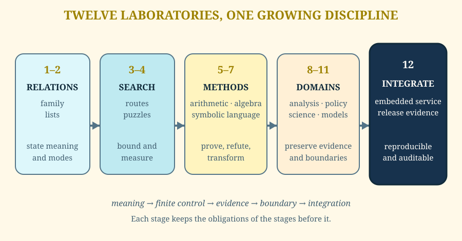
  <figcaption>The laboratories enlarge one construction discipline rather than form twelve unrelated projects: state meaning, control a finite computation, preserve evidence, name the boundary, and finally integrate all four.</figcaption>
</figure>

The estimates below assume familiarity with the listed chapters and include
design, implementation, tests, and reflection. They are planning ranges, not
deadlines.

| Laboratories | Preparation | Typical scope |
| --- | --- | --- |
| Laboratories 1–2 | Chapters 1–5 | 2–4 hours each |
| Laboratories 3–4 | Chapters 6–10 and 13 | 4–8 hours each |
| Laboratories 5–7 | Chapters 19 and 26–29 | 4–8 hours each |
| Laboratories 8–10 | Chapters 14, 25, and 31–33 | 6–12 hours each |
| Laboratory 11 | Chapters 15–16 | 4–8 hours |
| Laboratory 12 | Chapters 16, 25, and 31–33 | multi-session capstone |

### Laboratory 1. A family theory

**Build:** facts for at least six people and relations for parent, sibling,
grandparent, and cousin.

**Requirements:**

- state the ground reading and principal modes of every predicate;
- expose a person being their own parent through an integrity relation;
- include one family branch that produces multiple cousins;
- query both forward and inverse modes.

**Acceptance:** normal output contains the predicted ground relations; one
proof for a cousin conclusion passes through named intermediate concepts.

**Reflect:** which conclusions depend on absence, and are those closed-world
assumptions justified?

### Laboratory 2. A relational list toolkit

**Build:** user-defined relations for membership, concatenation, reversal, and
prefix.

**Requirements:**

- use only facts, rules, unification, and list syntax for the core relations;
- document every finite mode;
- test empty, singleton, proper, and improper lists;
- compare one relation with its built-in counterpart over a finite corpus.

**Acceptance:** bounded differential queries find no disagreement in either
direction.

**Reflect:** which logically meaningful modes are operationally infinite?

### Laboratory 3. A cyclic transport network

**Build:** a network with at least ten stations, cycles, weighted edges, and
two disconnected components.

**Requirements:**

- derive reachability;
- construct simple path witnesses;
- choose a least-cost path with deterministic tie-breaking;
- test a cycle, absence, and equal-cost routes;
- compare `--stats` before and after one justified control improvement.

**Acceptance:** every returned witness begins and ends at the queried stations,
uses known edges, and contains no repeated station.

**Reflect:** why can endpoint reachability table finitely while the set of
arbitrary walks is infinite?

### Laboratory 4. A finite puzzle

**Build:** encode a small Latin square, scheduling puzzle, or house puzzle.

**Requirements:**

- write the complete finite-domain calculation;
- separate generation from constraints;
- identify and remove at least one symmetry;
- retain a structured witness;
- predict the naive and symmetry-reduced search spaces.

**Acceptance:** the solver returns every intended solution and no permutation
duplicate representing the same mathematical object.

**Reflect:** which source line contributes the greatest pruning power?

### Laboratory 5. Arithmetic by construction

**Build:** Peano addition and multiplication, then one relation of your choice:
exponentiation, comparison, division with remainder, or factorial.

**Requirements:**

- state a termination measure for each intended mode;
- prove one property by structural induction on paper;
- add a bounded executable property test;
- distinguish the inductive proof from the bounded test.

**Acceptance:** the proof and program share a clearly identified base and
recursive structure.

**Reflect:** did the representation make the induction easier or merely the
computation slower?

### Laboratory 6. Counterexample laboratory

**Build:** finite operation tables over carriers of two or three elements.

**Requirements:**

- test closure, identity, commutativity, and associativity;
- search for a counterexample before testing the full universal property;
- return the offending tuple as a witness;
- explain which checks exhaust the model and which claims remain external.

**Acceptance:** one deliberately nonassociative table is rejected with a
specific triple; one valid group table passes every finite law.

**Reflect:** why does one counterexample settle the negative question while a
thousand random confirmations do not settle the positive one?

### Laboratory 7. A symbolic language

**Build:** a small expression language with literals, variables, addition,
conditionals, and local bindings.

**Requirements:**

- represent syntax as explicit terms;
- evaluate under an explicit environment;
- define a structural size relation;
- transform constant subexpressions;
- show that evaluation agrees before and after transformation on a finite set
  of environments.

**Acceptance:** the transformation is idempotent over the chosen corpus and
does not change evaluated results.

**Reflect:** where is the boundary between Prolog syntax and the object language
represented by Prolog terms?

### Laboratory 8. A static analyzer

**Build:** a sign, nullness, taint, or permission analysis for a tiny statement
language.

**Requirements:**

- define a finite abstract domain and join;
- propagate facts to a fixed point;
- emit both safe conclusions and conservative warnings;
- include a concrete execution illustrating one abstract result;
- explain the approximation direction.

**Acceptance:** every tested concrete behavior is covered by its abstract
result; the analyzer may overapproximate but must not miss the chosen unsafe
case.

**Reflect:** why is a warning not necessarily evidence that a concrete failure
occurs?

### Laboratory 9. An auditable policy

**Build:** an access, consent, eligibility, or compliance theory.

**Requirements:**

- separate source, normalized concept, decision, and reason layers;
- state every closed-world assumption;
- add at least three explicit integrity relations;
- retain source and theory version facts;
- produce proof goldens for one permit and one denial-like conclusion.

**Acceptance:** changing one source fact changes exactly the predicted decision
and its supporting proof.

**Reflect:** which trust claims are established by derivation, and which require
authentication outside the theory?

### Laboratory 10. A scientific model

**Build:** encode a compact model from mechanics, circuits, chemistry,
epidemiology, or statistics.

**Requirements:**

- document every quantity and unit;
- expose derived intermediate quantities;
- include valid, boundary, and invalid scenarios;
- use an integrity relation for an impossible input state;
- state floating-point and approximation assumptions.

**Acceptance:** a proof for the final classification includes measurements,
equations represented by built-ins, and thresholds in an intelligible order.

**Reflect:** what has been proved conditionally, and what empirical claim
remains outside formal logic?

### Laboratory 11. An input boundary

**Build:** start with a small external record, validate it in JavaScript,
convert it to ordinary Prolog facts, and derive one new relation.

**Requirements:**

- define the accepted external fields and value domains;
- keep conversion code separate from domain rules;
- query the generated Prolog program with EyeProlog directly;
- compare the final answer with a checked golden;
- document what the host authenticates.

**Acceptance:** invalid records are rejected before solving, valid records map
to explicit finite terms, and the checked answer has an inspectable proof.

**Reflect:** which claims belong to host validation and which are established
by the Prolog derivation?

### Laboratory 12. A release-quality reasoning service

**Build:** combine the preceding techniques into a small embedded service.

**Requirements:**

- define a JavaScript boundary that supplies or loads facts;
- validate inputs before constructing the theory;
- test the principal modes and expected solution counts of public predicates;
- include semantic cases, bounded properties, metamorphic tests, integrity queries,
  warnings, proof goldens, and one scale case;
- retain source snapshot, theory version, and proof with every audited result;
- state time, memory, solution, and proof-size budgets;
- write a one-page trust contract and a one-page known-limitations statement.

**Acceptance:** another person can clone the repository, run one command, and
reproduce answers and proofs from the preserved inputs without oral
instructions.

**Reflect:** if the service gives a wrong real-world decision, which of the four
trust layers—source, model, engine, or derivation—would reveal the fault?

### Laboratory review rubric

Evaluate each project on five independent axes:

| Axis | Excellent work demonstrates |
| --- | --- |
| Meaning | every public ground relation has one stable domain sentence |
| Logic | clauses derive the intended answers and reject counterexamples |
| Control | supported modes terminate for a stated mathematical reason |
| Evidence | tests, witnesses, and proofs expose why results hold |
| Boundary | sources, assumptions, versions, limits, and host duties are named |

A beautiful program is not merely short. It makes the reason for its
correctness, the shape of its search, and the boundary of its trust available
to the next reader.

### Historical note: logic programming grows through exercises

Logic programming has long been taught by construction. Lists, family
relations, puzzles, grammars, interpreters, search problems, and small expert
systems became recurring exercises because each exposes both a logical relation
and the control needed to compute with it. Texts such as *The Art of Prolog*
made this dual reading central: an exercise was not finished when a clause
parsed, but when its meaning, modes, and behavior could be explained.

Laboratory practice later absorbed regression testing, property-oriented
checking, benchmark corpora, and reproducible command-line runs. These tools
fit logic programming unusually well because a small change can be examined at
several levels at once: answers, failures, witnesses, proofs, and search. The
laboratory is where a declarative claim becomes an executable experiment.

# Part XI — Review

## 45. Checkpoint notes and selected answers

Checkpoints are for retrieval and diagnosis, not grading by hidden wording.
Attempt one before reading these notes. When a checkpoint asks about a program
of your own, compare the structure of your argument rather than expecting one
canonical implementation.

<figure>
  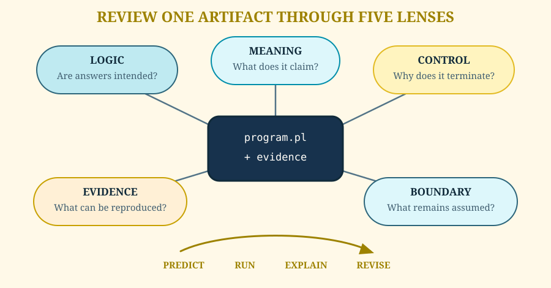
  <figcaption>Review the same artifact through five independent lenses. A failure under one lens should lead to a specific revision, not to the vague conclusion that logic programming itself is mysterious.</figcaption>
</figure>

### Foundations: Chapters 1–10

**Chapter 1.** `parent(ada, byron)` says that Ada is a parent of Byron.
`eyeprolog --goal 'child(X, Y)' program.pl` asks for every ground child–parent pair derivable by the
program. Adding `parent(diego, elena).` adds `child(elena, diego).`; it does not
change the earlier three child answers.

**Chapter 2.** `point(X, X)` unifies with `point(red, red)` by binding `X` to
`red`. It does not unify with `point(red, blue)` because one variable cannot
be both distinct atoms. `[Head | Tail]` unifies with `[a, b, c]` using
`Head = a` and `Tail = [b, c]`.

**Chapter 3.** In
`adult(Person) :- age(Person, Years), Years >= 18.`, a ground reading is:
every person with a recorded age of at least 18 is an adult. Operationally,
`age/2` supplies `Person` and `Years` before `>=/2` checks the numeric bound.
Reversing those goals asks `>=/2` to inspect unbound terms.

**Chapter 4.** With `ada → byron → clara → diego`, direct ancestor answers are
the three edges. Recursive answers additionally include
`ancestor(ada, clara)`, `ancestor(byron, diego)`, and
`ancestor(ada, diego)`. A successful derivation advances along a known parent
edge until a direct parent clause closes the proof.

**Chapter 5.** `joins([a], [b, c], Whole)` yields `[a, b, c]`. With the whole
list bound, the prefix/suffix splits are:

```text
[]          and [a, b, c]
[a]         and [b, c]
[a, b]      and [c]
[a, b, c]   and []
```

`[a | Tail]` is not yet known to be proper because `Tail` might never resolve
to a finite chain ending in `[]`.

**Chapter 6.** `is/2`, numeric comparisons, and the recursive
arithmetic steps require their documented numeric inputs. In
`between(1, 10, N)`, an unbound `N` is generated from a finite interval; a
bound `N` is checked for membership in that interval.

**Chapter 7.** `user(User), \+ blocked(User)` first selects each known user,
then asks a ground absence question for that user.
`\+ blocked(User), user(User)` first asks whether the database contains no
blocked user at all. Calling either result “allowed” requires a justified,
complete user and blocked-status boundary.

**Chapter 8.** Over an empty nested search, `findall/3` produces `[]`,
`countall/2` produces `0`, and `sumall/3` produces numeric zero.
`aggregate_min/5` and `aggregate_max/5` fail because no candidate can supply a
best key. The goal passed into the aggregate, not the aggregate's punctuation,
must establish finiteness.

**Chapter 9.** `message/2` is asserted as an atomic formula. Its context
argument is structured data. The program-defined `context_member/2` relation
examines members inside that term; it does not add those members as globally
callable source facts.

**Chapter 10.** The complete coloring has six answers. Removing `A \= C`
leaves the requirements `A ≠ B` and `B ≠ C`, producing twelve answers. The six
new answers are those with equal first and third colors:
`red–green–red`, `red–blue–red`, `green–red–green`,
`green–blue–green`, `blue–red–blue`, and `blue–green–blue`.

### Trust and construction: Chapters 11–20

Use this table to check that the checkpoint response separates concepts that
are often collapsed:

| Chapter | A sound response distinguishes |
| --- | --- |
| 11 | ground answer, successful proof, failed search branches, and source trust |
| 12 | ordinary absence, invalid theory, process exit, and resource failure |
| 13 | structural descent, finite table growth, and unbounded term construction |
| 14 | source evidence, derived concepts, policy decisions, and integrity |
| 15 | host validation, explicit term conversion, and logical derivation |
| 16 | host validation, solver derivation, proof retention, and operational ceilings |
| 17 | ground meaning, intended mode, answer set, first answer, and proof shape |
| 18 | examples, near misses, finite generators, invariants, and presentation |
| 19 | partial correctness, completeness in a mode, and termination in that mode |
| 20 | semantic regression, observable control change, and measured improvement |

A response that says only “the program works” is incomplete. It should name
the claim, the mode, the evidence inspected, and the boundary that remains
outside that evidence.

### Advanced work: Chapters 21–33

Later checkpoints often admit several good programs. Evaluate them with five
questions:

1. **Meaning:** is the disputed or transformed ground relation stated clearly?
2. **Scope:** are modes, finite domains, equivalence notions, and trust
   assumptions explicit?
3. **Observation:** were answers, failures, proofs, and statistics used for
   the different questions they can actually answer?
4. **Preservation:** if a program changed, which semantic and observable
   properties were expected to remain invariant?
5. **Evidence:** is the result reproducible as a query, test, golden output,
   counterexample, proof, or preserved source snapshot?

For mathematical checkpoints, add a sixth question: does the conclusion claim
only what the computation warrants? One witness proves existence; one
counterexample refutes a universal claim; an exhausted finite carrier proves a
property only for that model; repeated bounded confirmations do not become an
unbounded theorem.

For laboratory checkpoints, leave an artifact. A useful completion is not merely a paragraph: it is a small source file, predicted output, actual output, and one sentence explaining any difference.

### Historical note: review becomes explanation

The declarative reading of logic programs encouraged debugging methods that ask
what a relation was intended to mean, not only which machine step came next. In
the early 1980s, Ehud Shapiro's work on algorithmic debugging used computation
trees together with a programmer's judgments about intended results to narrow a
fault to the clause responsible for it. Declarative debugging developed this
idea alongside, rather than instead of, ordinary tracing.

That tradition gives review a distinctive role in logic programming. A worked
answer is useful when it can be reconstructed from the relation, the calling
mode, and the evidence, and when a disagreement can be turned into a smaller
question about meaning or control. Review then becomes another pass through the
same discipline as programming: predict, execute, explain, and revise.
